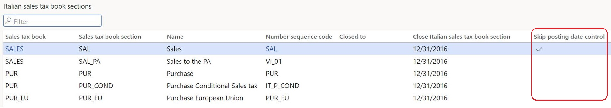

# Configure and report Italian sales tax books

[!include [banner](../../includes/banner.md)]

This article explains how to configure and generate Italian sales tax books.

According to Italian legislation, every value-added tax (VAT) transaction must be recorded in a tax book (*Libro IVA*) that will be used for tax reporting. To meet these legislative requirements, Microsoft Dynamics 365 Finance implements Italian sales tax books functionality.

- Sales tax books can be of the **Purchase** or **Sales** type.
- You can keep as many sales tax books as you require.
- Every tax book is divided into multiple tax book sections (*Sezionale IVA*).
- All sales tax transactions must be sequentially numbered, without gaps, and ordered by posting date within each sales tax book section.
- A tax transaction voucher in Dynamics 365 Finance is equivalent to the Italian *Protocollo IVA* that must always be applied during posting to help guarantee chronological order by posting date.

As of Finance version 10.0.39, the Italian sales tax books functionality supports reporting of Italian sales tax books in the [Electronic reporting (ER) tool](/dynamics365/fin-ops-core/dev-itpro/analytics/general-electronic-reporting). It also accommodates reporting for [multiple VAT registrations](../global/emea-multiple-vat-registration-numbers.md).

## Prerequisites

Before you begin, you must [configure system parameters to report sales tax books for Italy](emea-ita-vat-statements-details.md).

## Configure sales tax books

To set up Italian sales tax books, go to **Tax** \> **Setup** \> **Sales tax** \> **Italian sales tax books**.

The following table describes the fields that are available on the **Italian sales tax books** page.

| Field | Description |
|-------|-------------|
| Sales tax book | Enter the ID of the sales tax book. |
| Name | Enter a description of the sales tax book. |
| Sales tax book type | 
Select one of the following values to specify the nature of the operations that are performed through the sales tax book sections that you'll attach to the current sales tax book:<ul><li><strong>Purchase</strong> – Select this value for purchase invoices and credit notes.</li><li><strong>Sales</strong> – Select this value for sales invoices and credit notes.</li><li><strong>Not included</strong> – Select this value for invoices and credit notes that come from countries/regions that are outside the European community. This type is used only for statistical purposes and won't be included on the final fiscal tax book reports.</li></ul> |
| Settlement period | Select an existing sales tax settlement period. When a sales tax book is printed, if the **Update** checkbox is selected on the **Sales tax payment** page, the date in the **From date** field is compared to the selected settlement period. The settlement period is also used to identify which sales tax books and sales tax book sections must be closed when a sales tax settlement is updated for a settlement period. |
| Closed to | The latest closing date from the related sales tax book sections that belong to the current sales tax book. |
| EU sales | Select a sales tax book of the **Sales** type, and attach it to the current sales tax book of the **Purchase** type. This field is used if the selected sales tax book must include European Union (EU) purchase transactions from the current book on sales tax reports. This field is unavailable for sales tax books of the **Sales** and **Not included** types. |
| ATECOFIN Code | Select the tax code for reporting. |
| Include reverse transactions | Select this option to include reverse documents on the sales tax books report for the current sales tax book. |
| Include zero lines | Select this option to include documents that have a zero amount on the sales tax books report for the current sales tax book. |
| Print summary and payment | Select this option to print the summary and payment report. This field is available only for sales tax books of the **Sales** type. |

## Configure sales tax book sections

Sales tax book sections are a repository where ledger transactions are posted according to their nature. Voucher numbering is driven by the sales tax book sections. To set up Italian sales tax book sections, go to **Tax** \> **Setup** \> **Sales tax** \> **Italian sales tax book sections**.

The following table describes the fields that are available on the **Italian sales tax book sections** page.

| Field | Description |
|-------|-------------|
| Sales tax book | Select an existing sales tax book that the sales tax book section is attached to. |
| Sales tax book section | Enter the ID of sales tax book section. |
| Name | Enter a description of the sales tax book section. |
| Number sequence code | 
Select the number sequence code for the sales tax book section. You must must set up the number sequence code in advance. For more information, see <a href="emea-ita-vat-statements-details.md#number-sequences">Number sequences and number sequence groups</a>.

The number sequence code that you select depends on the type of sales tax book that the sales tax book section is attached to:
<ul><li>For a sales tax book of the <strong>Purchase</strong> type: Select number sequence codes that are defined for purchase invoice vouchers or purchase credit note vouchers on the <strong>Accounts payable parameters</strong> page, or number sequence codes that are used on the <strong>Journal names</strong> page for vouchers where the <strong>Italian sales tax book</strong> field is set to <strong>Purchase</strong>.</li><li>For a sales tax book of the <strong>Sales</strong> type: Select number sequence codes that are defined for sales invoice vouchers, sales credit note vouchers, free text invoice vouchers, or free text credit note vouchers on the <strong>Accounts receivable parameters</strong> page, or number sequence codes that are used on the <strong>Journal names</strong> page for vouchers where the <strong>Italian sales tax book</strong> field is set to <strong>Sales</strong>.</li><li>For a sales tax book of the <strong>Not included</strong> type: Select any suitable number sequence code.</li></ul> |
| Closed to | Enter the end date of the last closed sales tax settlement period. This field is used to filter data on the sales tax report. If it's set to a date that's earlier than the reporting period, and there are no transactions for this sales tax book section in the reporting period, the section isn't included on the report. |
| Close Italian sales tax book section | The closing date of the Italian sales tax book for a tax period. You can't post or reverse an invoice that has a date that's earlier than the closing date of the tax period. This field is updated with the closing date of the tax period. The **Update** checkbox must also be selected on the **Sales tax payment** page. | 

The **Create** button on the Action Pane of the **Italian sales tax book sections** page automatically creates all the required sales tax book sections for existing sales tax books of the **Sales** and **Purchase** types.

Sales tax book sections are created for every number sequence that's defined for purchase invoice vouchers, purchase credit note vouchers, sales invoice vouchers, sales credit note vouchers, free text invoice vouchers, or free text credit note vouchers on the **Accounts payable parameters**, **Accounts receivable parameters**, or **Project management and accounting parameters** page. They're also created for every number sequence that's used on the **Journal names** page for vouchers where the **Italian sales tax book** field is set to **Purchase** or **Sales**.

Every sales tax book section that's created is automatically attached to the default sales tax book. (The sales tax book must be created before the sales tax book sections.) If several sales tax books of the same sales tax book type (**Sales** or **Purchase**) exist, the first sales tax book is used by default. However, you can manually change this attachment. If no sales tax book exists, no sales tax book sections are automatically created.

### Unified posting date control

You can configure chronology control of invoice posting dates in a specific sales tax book section.

1. In the **Feature management** workspace, turn on the **(Italy) Unified posting date control** feature. For more information, see [Feature management overview](../../../fin-ops-core/fin-ops/get-started/feature-management/feature-management-overview.md).
2. After the feature is enabled, a **Skip posting date control** column appears on the **Italian sales tax book sections** page. Use the checkbox in this column to specify whether posting date control is required for a selected sales tax book section.

    - If the checkbox is cleared (the default setting), the system prevents new invoices from being posted if their date is earlier than the date of the latest posted invoice.
    - If the checkbox is selected, the system allows posting of invoices that have any date.

    

## Sales tax book status

When a new sales tax settlement period is created, **Sales tax book status** records are automatically created for every sales tax book that exists in your legal entity. If an additional sales tax book is created, lines can be manually created for existing periods that haven't been closed.

Go to **Tax** \> **Indirect taxes** \> **Sales tax** \> **Sales tax settlement periods**, and then, on the Action Pane, select **Sales tax book status**.

The following table describes the fields that are available on **Sales tax book status** page.

| Field | Description |
|-------|-------------|
| Sales tax book | Select the sales tax book ID that you set up on the **Italian sales tax books** page. |
| Name | The name of the selected sales tax book. |
| First page number | The first page number to use on the Italian sales tax books report. |
| Changed to | If you update the **First page number** value by selecting **Change first page number** on the Action Pane, this field represents the first page number after the update. |
| Last page number | The last page number to use on the final page of the Italian sales tax report for this period. |
| Settlement period | The settlement period that's used in the sales tax book. |
| From date | The start date of the settlement period. |
| To date | The end date of the settlement period. |
| Print blank page with no transactions | If the Italian sales tax books electronic report was generated for the selected period interval, this field shows the state of the **Print blank page with no transactions** option of the related [sales tax authority](emea-ita-vat-statements-details.md#sales-tax-authority). |
| Include zero lines | If the Italian sales tax books electronic report was generated for the selected period interval, this field shows the state of the **Include zero lines** option of the related [Italian sales tax book](#configure-sales-tax-books). |
| Include reverse transactions | If the Italian sales tax books electronic report was generated for the selected period interval, this field shows the state of the **Include reverse transactions** option of the related [Italian sales tax book](#configure-sales-tax-books). |
| Printout status | 
The status of generation of the Italian sales tax books electronic report in PDF format. The following values are available:
<ul><li><strong>Not generated</strong> – The Italian sales tax books electronic report in PDF format wasn't generated for the selected period interval with the <strong>Update number of pages</strong> checkbox selected.</li><li><strong>Generated</strong> – The Italian sales tax books electronic report in PDF format was generated for the selected period interval with the <strong>Update number of pages</strong> checkbox selected. You can review the generated report as an attachment for each <strong>Sales tax book status</strong> line if the <strong>Attach report to Sales tax book status</strong> checkbox was selected for the sales tax settlement period. |

To change the first page number that's used for the current open settlement period, use the **Change first page number** button on the Action Pane to open the **Change first page number** dialog box. The page number then appears in the **Changed to** column on the **Sales tax book status** page and is used as the first page number of the final sales tax report that's printed for the current tax period.

If the **Attach report to Sales tax book status** checkbox is selected for the selected sales tax settlement period, use the **Attachments** button in the upper-right corner of **Sales tax book status** page to review previously created Italian sales tax books electronic reports.

## Set up the Italian sales tax books electronic report

As of Finance version 10.0.39, you can use the Italian sales tax books electronic report in PDF format. To prepare Finance to generate the Italian sales tax books electronic report in PDF format, follow these steps.

1. Import the following ER configurations.

    | ER configuration name | Type | Description |
    |-----------------------|------|-------------|
    | Tax declaration model | Model | A generic model for different tax declarations. |
    | Tax declaration model mapping (IT) | Model mapping | The model mapping for Italian sales tax books. |
    | VAT Declaration PDF (IT) | Format (exporting) | The PDF format for Italian sales tax books. |

    Import the latest versions of these configurations. The version description usually includes the number of the Microsoft Knowledge Base (KB) article that explains the changes that were introduced in the configuration version. Use the Issue search tool in [Microsoft Dynamics Lifecycle Services](https://lcs.dynamics.com/v2) to find the KB article by number.

    For more information about how to download ER configurations from the Microsoft global repository, see [Download ER configurations from the Global repository](../../../fin-ops-core/dev-itpro/analytics/er-download-configurations-global-repo.md).

    > [!NOTE]
    > After all the ER configurations from the preceding table are imported, set the **Default for model mapping** option to **Yes** for the **Tax declaration model mapping (IT)** configuration on the **Configurations** page.

1. In the **Feature management** workspace, find and select the **VAT statement format reports** feature in the list, and then select **Enable now**.
1. To define the **VAT Declaration PDF (IT)** format, go to **Tax** \> **Setup** \> **General ledger parameters**. On the **Sales tax** tab, in the **Tax options** section, in the **VAT statement format mapping** field, enter the format information.

    > [!IMPORTANT]
    > The **VAT Declaration PDF (IT)** ER format is generated by using data that's prepared specifically for Italian sales tax books. It's important that you set up the parameters of the sales tax authority and sales tax settlement periods according to the guidance in [Configure system parameters to report sales tax books for Italy](emea-ita-vat-statements-details.md).

## Generate the Italian sales tax books electronic report

To generate the Italian sales tax books electronic report, follow these steps.

1. Go to **Tax** \> **Declarations** \> **Sales tax** \> **Report sales tax for settlement period**. The **Report sales tax for settlement period** dialog box appears.
1. In the **Settlement period** field, select the sales tax settlement period to generate the report for.
1. In the **From date** field, specify a date in the interval of the settlement period that you want to generate the report for.
1. In the **Sales tax payment version** field, select **Original**. If the sales tax settlement period is associated with a sales tax authority that's connected to a vendor account that has an address in Italy, **Original** is the only value that can be selected.
1. Select **OK**. The **Sales tax (Italy)** dialog box appears. The **Settlement period** field shows the previously selected settlement period, for reference.
1. To generate the Italian sales tax books electronic report for a period that differs from the interval of the sales tax settlement period, use the **Variative period** checkbox. If you clear this checkbox, the **From date** and **To date** fields show the start and end dates of the period interval that the **From date** that you specified selected in the previous dialog box belongs to. If you select this checkbox, the **Last page number** value in the related **Sales tax book status** record can't be updated.
1. In the **Sales tax book type** field, select the type of sales tax book to generate the report for. If this field is blank, the report is generated for all types.
1. In the **From sales tax book** and **To sales tax book** fields, specify the sales tax books to generate the report for. If these fields are blank, the report is generated for all sales tax books.
1. In the **Printout** section, select the **Sales tax books** checkbox to generate a report that includes the details of the taxable documents in the sales tax books.
1. Select the **Sales tax summary** checkbox to generate a report that includes a summary section for the sales tax books.
1. Select the **Sales tax payment** checkbox to generate a report that includes the **Sales tax payment** page of the report.
1. Select the **Plafond** checkbox to generate a report that includes the **Tax plafond** section of the sales tax payment report. For more information, see [Tax plafond](emea-ita-exil-tax-plafond.md).
1. In the **Language** field, select the language that you want to generate the report in.
1. In the **Update** section, select the **Update number of pages** checkbox to update the **Last page number** value in the related **Sales tax book status** record for the sales tax settlement period.

    > [!IMPORTANT]
    > To ensure correct numbering of pages, be sure to generate the Italian sales tax books electronic report with the **Update number of pages** checkbox selected at least once for each interval of the sales tax settlement period. If the **Update number of pages** checkbox is selected, and the **Attach report to Sales tax book status** checkbox is selected in the parameters of the sales tax settlement period, you can find the generated Italian sales tax books electronic report attached to the **Sales tax book status** records.

1. If you selected the **Sales tax payment** checkbox, the **Sales tax payment** FastTab is available. Set or review the following fields that are required for the sales tax payment report:

    - **Sales tax balance in period** – The sales tax balance in the period.
    - **Previous sales tax credit (-)** – Enter the amount of the previous sales tax credit.
    - **Sales tax credit for compensation (-)** – Enter the amount of the sales tax credit for compensation.
    - **Previous sales tax debit (+)** – Enter the amount of the previous sales tax debit.
    - **Sales tax paid in advance (-)** – Enter the amount of sales tax that was paid in advance.
    - **Sales tax balance** – The calculated sales tax balance for the selected period.
    - **Amount of payment** – Enter the amount of the payment.
    - **Date of payment** – Enter the date of the payment.
    - **Bank account** – Enter the bank account.
    - **Bank reference ABI** – Enter the bank reference Italian Banking Association (ABI) code.
    - **Bank reference CAB** – Enter the bank reference bank branch code (CAB).

1. On the **Run in the background** FastTab, set up batch parameters if you want to generate the report in batch mode. When an electronic report is generated in batch mode, you can find related batch information and the generated output file as an attachment by going to **Organization administration** \> **Electronic reporting** \> **Electronic reporting jobs**. For more information about how to configure a destination for each ER format configuration and its output component, see [Electronic reporting (ER) destinations](../../../fin-ops-core/dev-itpro/analytics/electronic-reporting-destinations.md).
1. Select **OK** to generate the report. If the **Update number of pages** checkbox is selected, and the **Attach report to Sales tax book status** checkbox is selected in the parameters of the sales tax settlement period, you can find the generated Italian sales tax books electronic report attached to the **Sales tax book status** records. In addition, the **Last page number** value in the related **Sales tax book status** record for the sales tax settlement period is updated.

[!INCLUDE[footer-include](../../../includes/footer-banner.md)]
