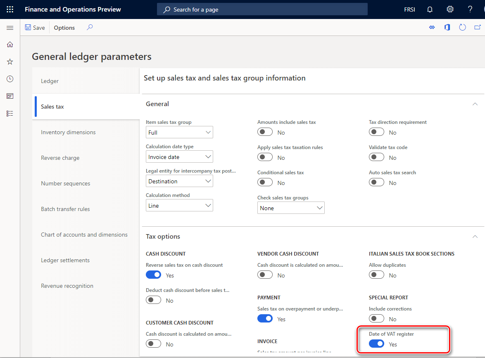

# VAT management and reporting by tax point date (Date of VAT register)

[!include [banner](../../includes/banner.md)]

On October 23, 2018, Law Decree 119 (L.D.119/2018) in Italy introduced a change in Italian value-added tax (VAT) management. This change went into effect on July 1, 2019. Here is a summary of the change:

- VAT payers can recover input VAT in the monthly VAT settlement when the VAT point is triggered. This recovery can occur even if the purchase invoice is received and recorded in the input VAT ledger before the fifteenth day of the next month. This rule doesn't apply to transactions where the VAT point is triggered in a fiscal year that differs from the fiscal year when the purchase invoice is received.
- For the supply of goods and services, the invoice can be issued by the fifteenth day of the month after the month when the VAT point was triggered. Invoices that are issued and booked before the fifteenth day of the month after the month when the VAT point was triggered must be included in the VAT settlement of the previous month.
- As of July 1, 2019, the invoice can be issued within 10 days of the VAT point. If the invoice isn't issued at the VAT point, it should include a reference to the VAT point date in addition to the invoice date.
- Invoices that are booked before the fifteenth day of the next month but have a reference to the previous VAT settlement should not interrupt the sequential posting. If invoices have a VAT point date in the previous month but an invoice date in the current month, they should be booked in chronological order with the invoices in the current month that have a reference that indicates that these invoices are related to the previous VAT settlement.
- Companies that issue the sales invoice on the same day, without applying the change that is introduced by L.D.119/2018, remain compliant.

The Date of VAT register feature supports the changes that were introduced by L.D.119/2018. It's delivered in Microsoft Dynamics 365 Finance version 10.0.6 (November 2019) and later.

Before you can use the Date of VAT register feature, you must turn it on in the **Feature management** workspace. This feature introduces a new date-type field, **Date of VAT register**, for VAT transactions. The additional date will be used as a VAT point determination criterion for the inclusion of VAT transactions in the scope of the sales tax settlement period and, effectively, in reporting for VAT returns.

> [!NOTE]
> The system doesn't allow an invoice to be posted if the value of the **Date of VAT register** field for the invoice is in a closed interval of the sales tax settlement period.
>
> Additionally, the system doesn't allow the **Date of VAT register** field to be updated with a value that is in a closed interval of the sales tax settlement period.

For more information about the Date of VAT register feature, see [Tax point date (Date of VAT register)](../united-kingdom/emea-tax-point-date.md).

## Effect of the Date of VAT register feature on VAT settlement and reporting

When the Date of VAT register feature is turned on, users in legal entities that have their primary address in Italy will be able to set the **Date of VAT register** option on **General ledger parameters** page to **Yes**.

When this option is set to **Yes**, the **Settle and post sales tax** process and the **Italian sales tax payment** report will consider sales tax transactions based on the date when the VAT was registered instead of the date when the transaction was posted.

> [!NOTE]
> The system won't allow you to perform these actions: 
> 
> - Set the **Date of VAT register** option on the **General ledger parameters** page to **Yes** if any tax transactions were posted in an open interval of the sales tax settlement period, but the value of the **Date of VAT register** field is in a closed interval of the sales tax settlement period.
> - Set the **Date of VAT register** option on the **General ledger parameters** page to **No** if the value of the **Date of VAT register** field for any tax transactions is in a closed interval of the sales tax settlement period, but the transactions were posted in an open interval of the sales tax settlement period.
> - Turn off the Date of VAT register feature in the **Feature management** workspace if the **Date of VAT register** option on the **General ledger parameters** page is set to **Yes** in at least one legal entity.

## Changes in the Italian sales tax payment report

You can run the **Italian sales tax payment** report by using any of the following methods:

- Go to **Tax** \> **Declarations** \> **Sales tax** \> **Sales tax (Italy)**.
- Go to **Tax** \> **Declarations** \> **Sales tax** \> **Report sales tax for settlement period**.
- Go to **Tax** \> **Inquires and reports** \> **Sales tax payments**, and then select **Sales tax (Italy)**.
- Go to **Tax** \> **Inquires and reports** \> **Sales tax payments**, and then select **Print report**. You can use this method only if an Italian report layout is defined for the sales tax authority that is specified for the sales tax settlement period of the selected sales tax payment line.

The setting of the **Date of VAT register** option on the **General ledger parameters** page doesn't affect the list of invoices on the **Sales tax book sections** pages. The report will include all the invoices that were posted in the related sales tax book sections during the selected period.

However, the setting of the **Date of VAT register** option on the **General ledger parameters** page does affect the calculation of the resulting VAT amounts:

- If the **Date of VAT register** option is set to **Yes**, the VAT amounts are calculated based on the information in the **Date of VAT register** field for tax transactions in the period.
- If the **Date of VAT register** option is set to **No**, the VAT amounts are calculated based on the posting date of tax transactions in the period.

When the **Date of VAT register** option on the **General ledger parameters** page is set to **Yes**, the **Italian sales tax payment** report provides the following information:

- Pages for the sales tax books sections include a new **Date of VAT point (Date of VAT register)** column (**Momento di effettuazione dell'operazione** in Italian). This column represents the value of the **Date of VAT register** field for the tax transaction.
- The totals for each sales tax book section are represented in three groups:

    - Operations in the actual period that have a competence date in the actual period
    - Operations in the actual period that have a competence date in the previous period
    - Operations in the next period that have a competence date in the actual period

- The totals by sales and purchase books are represented on three lines: 

    - Total operations in the actual period that have a competence date in the actual period
    - Total operations in the actual period that have a competence date in the previous period
    - Total operations in the next period that have a competence date in the actual period

- A summary section represents the total VAT amounts by sales tax books sections. These amounts are grouped by sales tax book sections. This information is represented separately in three parts:

    - Operations in the actual period that have a competence date in the actual period
    - Operations in the actual period that have a competence date in the previous period
    - Operations in the next period that have a competence date in the actual period

- The totals in the summary section represent total VAT amounts by sales tax books sections. These amounts are grouped by sales tax book sections. This information is represented separately on three lines:

    - Total operations in the actual period that have a competence date in the actual period
    - Total operations in the actual period that have a competence date in the previous period
    - Total operations in the next period that have a competence date in the actual period

- The **Total calculated considering competence date** amount is provided on a separate line.

[!INCLUDE[footer-include](../../../includes/footer-banner.md)]

