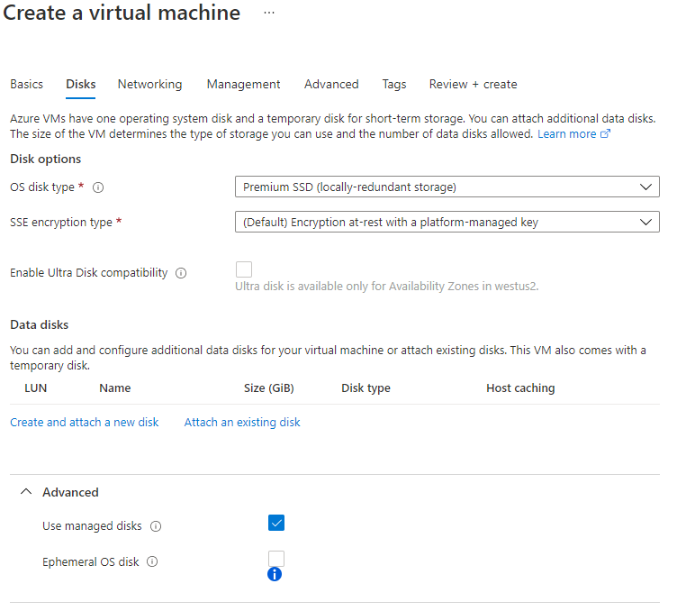
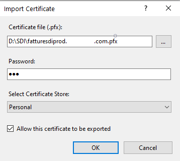
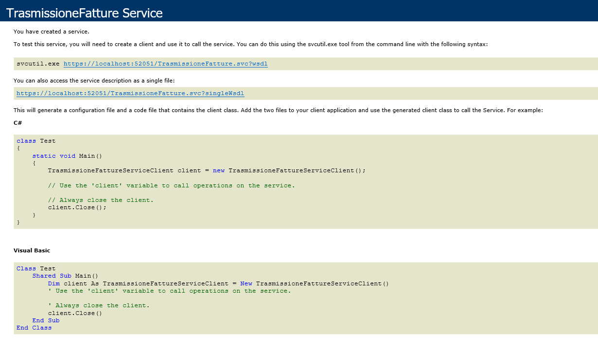
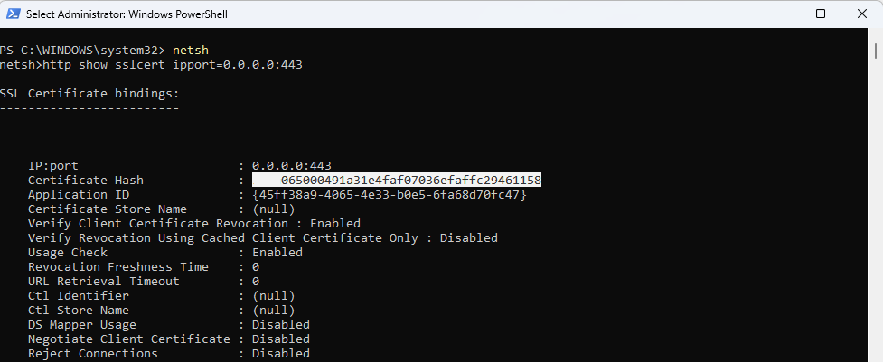
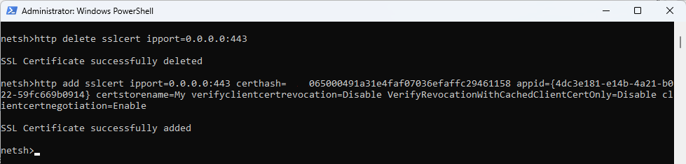
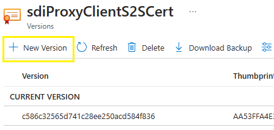

# Get started with Electronic invoicing for Italy

[!include [banner](../../includes/banner.md)]

> [!IMPORTANT]
> Electronic invoicing for Italy might not currently support all the functions that are available for electronic invoices in Microsoft Dynamics 365 Finance and Dynamics 365 Supply Chain Management.

This article provides information to help you get started with Electronic invoicing for Italy in Finance and Supply Chain Management. It guides you through the configuration steps that you must complete to enable the generation of electronic invoices in the Italy-specific format, **FatturaPA**, and to exchange electronic invoices with the Italian Revenue Agency's e-invoicing exchange system, SDI (Sistema di Interscambio). 

> [!NOTE]
> The solution for direct integration with SDI supports digital signing of documents only through separately stored certificate files that can be uploaded to the key vault. The solution doesn't support the use of qualified digital signatures, which require additional hardware involvement or an online connection to certification service providers.

## Prerequisites

Before you complete the steps in this article, the following prerequisites must be met:

- Obtain SDICoop service channel accreditation in the Exchange system (SDI) government portal.
- Complete the steps in [Electronic invoicing configuration](../global/gs-e-invoicing-set-up-overview.md).
- Import the **Italian FatturaPA (IT)** Electronic invoicing feature (version 5 or later) from the repository. Learn more in [Import features from the repository](../global/gs-e-invoicing-import-feature-global-repository.md).
- Configure Azure resources to store required certificates, including the Certificate authority (CA) certificate and Clients certificate. Learn more in [Create a Key Vault reference](../global/gs-e-invoicing-set-up-parameters.md#create-a-key-vault-reference).
- Optional: You can use the Digital signature certificate only for non-qualified signatures.

## Country/region-specific configuration for the Italian FatturaPA (IT) Electronic invoicing feature

Complete the following procedures before you deploy the feature to Finance.

This section complements the common part of Electronic Invoicing service configuration that is described in [Electronic invoicing configuration](../global/gs-e-invoicing-set-up-overview.md).

### <a name="ProgressivoInvio"></a>Create a new number sequence for ProgressivoInvio

To create a new number sequence for ProgressivoInvio, follow these steps.

1. Go to **Organization administration** \> **Setup** \> **Electronic document parameters**.
1. On the **Electronic invoicing** tab, on the **Number sequences** FastTab, select **New** to add a record.
1. Enter a name for the new sequence (for example, **ProgressivoInvio**), and then select **Save**.

### Create a new chain of certificates

To create a new chain of certificates, follow these steps.

1. Go to **Organization administration** \> **Setup** \> **Electronic document parameters**.
1. On the **Electronic invoicing** tab, on the **Key Vault settings** FastTab, select **Key Vault parameters**.
1. In the **Certificates** section, select **Add** to add the following certificates:

    - **CAentrate.cer** (and **CAEntratetest.cer** in the case of a test environment)
    - **CAActalisOV.cer** (in the case of a production environment)
    - Client identity certificate

        > [!NOTE]
        > - Usually, the client identity certificate is generated while the user registers the SDICoop service channel. It's named **SDI-\<*VatNumber*\>**, where \<*VatNumber*\> is a company's 11-digit value-added tax (VAT) number.
        > - The client identity certificate has an expiration date. Review this date, and arrange to obtain a new certificate when the current one is about to expire. Learn how to establish proper rotation of the certificates that are used for this integration in the [Rotate certificates](#rotate-certificates) section of this article.

    - Certificate for digital signature (optional)

1. On the Action Pane, select **Chain of certificates**.
1. Select **New**, and enter a name (for example, **SDIChainProd** or **SDIChainTest**).
1. In the **Certificates** section, add the following certificates in the order that they are listed in here:

    1. **CAentrate.cer** (and **CAEntratetest.cer** in the case of a test environment)
    1. **CAActalisOV.cer** (in the case of a production environment)
    1. Client identity certificate

1. Save your changes, and close the page.

### <a name="CreateFeature"></a>Create a new feature

To create a new feature, follow these steps.

1. In the **Globalization Studio** workspace, select the **Electronic reporting** tile.
1. In the **Configuration providers** section, mark your company's configuration provider as active.
1. In the **Globalization Studio** workspace, select the **Electronic invoicing** tile.
1. On the **Electronic invoicing features** page, select **Add** \> **Based on existing feature**.
1. Under the **Microsoft** configuration provider, select **Italian FatturaPA (IT)** as a base feature, enter a name, and then select **Create feature**.

### Align Electronic reporting configurations

The following procedures must be completed for both Electronic reporting (ER) format configurations that are used in the feature: **Sales invoice (IT)** and **Project invoice (IT)**.

#### Set up payment method substitution

To set up payment method substitution, follow these steps.

1. In the **Globalization Studio** workspace, select the **Electronic reporting** tile, and then select the **Reporting configurations** tile.
1. On the **Configurations** page, select the **Sales invoice (IT)** format configuration.
1. In the **Versions** section, verify that the **Draft** version is selected.
1. On the Action Pane, select **Designer**.
1. On the **Mapping** tab, select **$PaymentMethodSubstitution**, and then select **Edit** \> **Edit formula**.
1. Align the formula with the payment methods that are configured in Finance.
1. Save your changes, close the formula designer, and then select **OK**.
1. Save the whole **Sales invoice (IT)** format configuration, and then close the **Designer** page.
1. In the **Versions** section, select **Change status** \> **Complete** to complete the **Sales invoice (IT)** format configuration.
1. Repeat steps 2 through 9 for the **Project invoice (IT)** format configuration, as required.

#### Set up application-specific parameters

To set up application-specific parameters, follow these steps.

1. In the **Globalization Studio** workspace, select the **Electronic reporting** tile, and then select the **Reporting configurations** tile.
1. On the **Configurations** page, select the **Sales invoice (IT)** format configuration.
1. On the menu, select **Configurations** \> **Application specific parameters** \> **Setup**.
1. In the **Lookups** section, make sure that the **List of Natura reverse charge subcategories** lookup is selected.
1. In the **Conditions** section, select **Add**.
1. Add specific conditions for each subcategory that is defined in the system.
1. Change the **State** value to **Completed**, save your changes, and then close the page.
1. Repeat steps 2 through 7 for the **Project invoice (IT)** format configuration, as required.

    > [!NOTE]
    > In the **Name** column, you can select the **\*Blank\*** or **\*Not blank\*** placeholder value instead of a specific value.

### Configure a processing pipeline for export

To configure a processing pipeline for export, follow these steps.

1. In the **Globalization Studio** workspace, select the **Electronic invoicing** tile.
1. On the **Electronic invoicing features** page, select the feature that you [created](#CreateFeature) based on the **Italian FatturaPA (IT)** feature.
1. On the **Setups** tab, select **Sales invoice**, and then select **Edit**.
1. In the **Processing pipeline** section, go through the actions, and set the required fields:

    - **Get next number sequence value** – In the **Parameters** section, select the **Number sequence** parameter. Then, in the **Value** field, select the number sequence that you previously defined for [ProgressivoInvio](#ProgressivoInvio).
    - **Submit** – In the **Parameters** section, in the **URL address** field, enter or select a value. In the **Certificates** field, enter or select a chain of certificates that you added earlier in this article (**SDIChainProd** or **SDIChainTest**).
    - **Sign document** – In the **Certificate name** field, specify the Digital signature certificate (optional).

1. In the **Applicability rules** section, go through the clauses, and review or set the required fields. As part of this step, review the **LegalEntityID** clause, and update it with the correct value from your legal entity.
1. Select **Validate** to ensure that all required fields are set.
1. Save your changes, and close the page.
1. On the **Setups** tab, select **Project invoices**, and then select **Edit**.
1. Repeat steps 3 through 7 for **Project invoice**, **Sales invoice PA**, and **Project invoice PA** setups, if required.

### Configure a processing pipeline for import

To configure a processing pipeline for import, follow these steps.

1. In the **Globalization Studio** workspace, select the **Electronic invoicing** tile.
1. On the **Electronic invoicing features** page, select the feature that you [created](#CreateFeature) based on the **Italian FatturaPA (IT)** feature.
1. On the **Setups** tab, select **Import invoices**, and then select **Edit**.
1. On the **Import channel** tab, in the **Data channel** section, on the **Parameters** tab, in the **Data channel** field, enter a string value.
1. On the **Applicability rules** tab, set the fields for the setup. To use the default **Channel** clause, pass the value that you set for the **Data channel** field in the previous step to the **Value** field.

    

1. Select **Validate** to ensure that all required fields are set.
1. Save your changes, and close the page.

### Deploy the feature

Complete and deploy the feature as described in [Complete and deploy a Globalization feature](../global/gs-e-invoicing-complete-publish-deploy-globalization-feature.md).

### Configure Electronic document parameters

To configure Electronic document parameters, follow these steps.

1. Import the **Customer invoice context model** (version 54 or later) and **Vendor invoice import (IT)** ER configurations from the repository. Learn more in [Import Electronic reporting (ER) configurations from Dataverse](../global/workspace/gsw-import-er-config-dataverse.md).
1. Go to **Organization administration** \> **Setup** \> **Electronic document parameters**.
1. On the **Features** tab, find and select the **Italian electronic invoice** feature, and then select **Enable**.
1. On the **Electronic document** tab, make sure that the fields for **Customer invoice journal** and **Project invoice** are set according to the information in [Set up Electronic document parameters](../global/gs-e-invoicing-set-up-parameters.md#set-up-electronic-document-parameters).

    

### Set up vendor invoice import 

To set up vendor invoice import, follow these steps.

1. In the **Globalization Studio** workspace, select the **Electronic reporting** tile, and then select the **Reporting configurations** tile.
1. Select **Customer invoice context model**, and then select **Create configuration**.
1. Select **Derive from Name: Customer invoice context, Microsoft** to create a derived configuration.
1. Select the derived configuration, and then select **Designer** to open it for editing.
1. Select **Map model to datasource**.
1. In the **Definitions** tree, select **DataChannel**, and then select **Designer**.
1. In the **Data sources** tree, expand the **\$Context\_Channel** container.
1. In the **Value** field, select **Edit**. 
1. Enter the name of the data channel. The name should have a maximum of 10 characters. It should match the value of the **Data channel** parameter of the data channel for the Electronic invoicing feature.
1. Save your changes, and close the form.
1. In the **Versions** section, select **Change status** \> **Complete** to complete the derived context configuration.
1. Go to **Organization administration** \> **Setup** \> **Electronic document parameters**.
1. On the **Integration channels** tab, in the **Channels** section, select **Add**.
1. In the **Channel** field, enter the **\$Context Channel** value.
1. Enter values in the **Description** and **Company** fields.
1. In the **Document context** field, select the new configuration that you derived from **Customer invoice context model**. The mapping name should be **Data channel context**.
1. On the **Import sources** tab, select **Add**, and set the following values:

    - **Name:** OutputFile
    - **Data entity name:** Vendor invoice header (**Data entity:** VendorInvoiceHeaderEntity)
    - **Model mapping:** Vendor invoice import (IT)

    

> [!NOTE]
> If you have import vendor invoices from different sources, you can create several channels and several derived configurations that have different **\$Context Channel** values. For example, you might want to import vendor invoices for different legal entities.

## Finance business data configuration

Follow the configuration steps in [Customer electronic invoices](../italy/emea-ita-e-invoices.md). Start from the [Electronic invoice currency](../italy/emea-ita-e-invoices.md#electronicinvoicecurrency) section.

## Proxy server setup

This section provides information to help you set up and configure the proxy service for communication between the Exchange system (SDI) and the Electronic Invoicing service.

### Create an app registration

To create an app registration, follow these steps.

1. Use the following Windows PowerShell script to create a self-signed certificate for service-to-service (S2S) authentication.

    > [!NOTE]
    > The certificate is set to expire in 12 months. You can extend this period by modifying the value of the **NotAfter** parameter. Learn how to establish proper rotation of the certificates that are used for this integration in the [Rotate certificates](#rotate-certificates) section of this article.

    ```powershell
    $certOutputLocation = "C:\certs\proxytest"
    $certName = "sdiProxyClientS2SCert"
    $certPassword = "123"
    
    $certCerFile = Join-Path $certOutputLocation "$certName.cer"
    $certPfxFile = Join-Path $certOutputLocation "$certName.pfx"
    
    $securePassword = ConvertTo-SecureString $certPassword -AsPlainText -Force
    
    $cert = New-SelfSignedCertificate -KeyLength 2048 -KeyExportPolicy Exportable -FriendlyName "CN=$certName" -CertStoreLocation Cert:\CurrentUser\My -Subject $certName 
    -Provider "Microsoft Enhanced RSA and AES Cryptographic Provider" -NotAfter (Get-Date).AddMonths(12)
    
    Export-Certificate -Cert $cert -FilePath $certCerFile -type CERT | Out-Null
    Export-PfxCertificate -Cert $cert -FilePath $certPfxFile -Password $securePassword | Out-Null
    ```

1. Save the .pfx certificate file to the key vault. This certificate is referred to later as the *App Registration Certificate*.
1. Sign in to the [Azure portal](https://portal.azure.com) as an administrator.
1. Create an app registration for the SDI Proxy service:

    1. Go to **App registrations**, create a registration, and set the following values for it:

        - **Name:** SDI Proxy Client
        - **Supported account types:** Accounts in this organizational directory only (Single tenant)

    1. Select **Register**, and then select the app registration that you just created.
    1. Go to **API permissions**, and select **Grant admin consent**.
    1. Go to **Certificates & secrets**, select **Upload certificate**, and upload the App Registration Certificate .cer file for S2S authentication.
    1. Go to **Enterprise applications**, and select the app that you created.
    1. Save the **Application ID** (client ID) and **Object ID** values for the app.
    1. The Invoicing Service team must grant the app access to the service. Open a support ticket that has the theme **Electronic invoicing service integration with SDI. Application allow-listing**. Provide the following information:

        - Microsoft Entra tenant ID
        - Microsoft Dynamics Lifecycle Services environment ID
        - Application ID
        - Object ID

        > [!NOTE]
        > The object ID for an application differs on the **App registrations** and **Enterprise applications** pages. Use the **Object ID** value from the **Enterprise applications** page.

### Create an Azure virtual machine

To create an Azure virtual machine (VM), follow these steps.

1. In the [Azure portal](https://portal.azure.com), go to **Virtual machines**, and select **Create new**.
1. On the **Basics** tab, select the subscription and resource group. The values should be the subscription and resource group where your key vault and Blob storage are located.
1. Select the region. The value should be the region where your Finance environment is deployed.
1. Add the administrator's user name and password, and save them to the key vault.
1. In the **Select inbound ports** field, select **HTTPS (443)** and **RPD (3389)**.

    > [!NOTE]
    > We recommend that you disable the **RDP (3389)** port when the system goes to production. You can reenable it if you must connect to the VM for troubleshooting purposes.
    >
    > We also recommend that you use the Windows Server 2019 Datacenter operating system (OS). The proxy application sample might have issues if it runs on another type of OS.

    

1. On the **Disks** tab, on the **Advanced** FastTab, select the **Use managed disks** checkbox. Leave the **Ephemeral OS disk** checkbox cleared.

    

1. On the **Networking** tab, under the **Public IP** field, select **Create new**.

    

1. In the **Create public IP address** dialog box, in the **SKU** field group, select the **Standard** option. In the **Assignment** field group, select the **Static** option.

    

1. On the **Management** tab, clear the **Auto-shutdown** checkbox to disable automatic shutdown.
1. Set the **Guest OS updates** field to **Manual**, and set any other policies.
1. Review and create the VM.
1. In the new VM, go to **Identity** \> **System assigned**, and set the **Status** option to **On**.
1. Grant the VM access to the key vault:

    1. In the key vault, go to **Access control (IAM)** \> **Role assignments**.
    1. Select **Add role assignment**, and follow these steps:

        1. In the **Role** field, specify **Key Vault Secrets User**.
        1. In the **Assign access to** field, specify **Virtual machine**.
        1. In the **Subscription** field, specify your subscription.
        1. In the **Select** field, specify your VM.

    1. Go to **Access policies**.
    1. Select **Add Access Policy**, and follow these steps:

        1. In the **Selected principal** field, select your VM.
        1. In the **Certificate** section, select **List** and **Get** permissions.
        1. In the **Secret** section, select **List** and **Get** permissions.

1. In the [Azure portal](https://portal.azure.com), go to **Public IP addresses**, and select the IP address that was created in the VM.
1. Go to **Configuration**, and set the Domain Name System (DNS) name.

### Prepare the proxy service environment

To prepare the proxy service environment, follow these steps on the machine where the proxy service is hosted.

1. Connect to the VM by using Remote Desktop Connection.
1. Open the Local Machine Certificate snap-in. Learn more in [How to: View certificates with the MMC snap-in](/dotnet/framework/wcf/feature-details/how-to-view-certificates-with-the-mmc-snap-in).
1. Import the **caentrate.cer** certificate into the [Trusted Root Certification Authorities store](/dotnet/framework/wcf/feature-details/working-with-certificates#certificate-stores).
1. Import the **CAEntratetest.cer** certificate into the Trusted Root Certification Authorities store (only for a test environment).
1. Import the **SistemaInterscambioFatturaPA.cer** certificate for production and the **SistemaInterscambioFatturaPATest.cer** certificate for testing into the Trusted People store.
1. In Control Panel, open **Turn Windows features on or off**, or go to **Server Manager** \> **Add Roles and Features** for the server OS, and turn on the following Internet Information Services (IIS) features:

    - Web Management Tools

        - IIS Management Console

    - World Wide Web Services

        - Application Development Features

            - .NET Extensibility 4.7 (or 4.8)
            - ASP
            - ASP.NET 4.7 (or 4.8)
            - CGI
            - ISAPI Extensions
            - ISAPI Filters

        - Common HTTP Features

            - Default Document
            - Directory Browsing
            - HTTP Errors
            - Static Content

        - Health and Diagnostics

            - HTTP Logging
            - Tracing

        - Performance Features

            - Static Content Compression

        - Security

            - Request Filtering

    - .NET Framework 4.7 Features

        - WCF Services

            - HTTP Activation

    

### Set up the SDI Proxy service in IIS

To set up the SDI Proxy service in IIS, follow these steps.

1. In Lifecycle Services, go to the Shared asset library, and select **Data package** as the asset type.
1. Find **Electronic Invoicing Service Sdi Proxy v1.1**, and download it to the VM.
1. Configure the service:

    1. Unzip the **Electronic Invoicing Service Sdi Proxy** archive folder that you downloaded.
    1. In the **src\\FattureService** folder, open the **appsettings.json** file, and set the following parameters:

        - **KeyVaultUri** – Specify the address of the key vault that stores the client certificate for the invoicing service.
        - **TenantId** – Specify the globally unique identifier (GUID) of the customer's tenant.
        - **EnvironmentId** – Specify the ID of the Lifecycle Services environment.
        - **ClientId** – Specify the app ID of the intermediate services app registration in the customer's tenant.
        - **ClientCertificateName** – Specify the name of the App Registration Certificate in the key vault.
        - **SecurityServiceClientOptions.Endpoint** – Specify the URL of the security service.
        - **SecurityServiceClientOptions.Resource** – Specify the scope to obtain the token for.
        - **InvoicingServiceClientOptions.Endpoint** – Specify the endpoint of the invoicing service. (You can obtain this value from the **Endpoint URL** field in the **Service parameters** section on the **Electronic Invoicing** tab of the **Electronic document parameters** page in Finance.) Append **/api/environments/\<*environmentId*\>** to the end.
        - **InvoicingServiceClientOptions.ServiceEnvironmentId** – You can leave the default value, **ServiceEnvironment**, because Microsoft plans to deprecate this field in future releases.
        - **NotificationsFolder** – Specify the folder to save incoming notification files in (for example, **C:\\\\Files\\\\**).

        > [!TIP]
        > You can copy the **InvoicingServiceClientOptions.Endpoint** and **InvoicingServiceClientOptions.ServiceEnvironmentId** values from the **Electronic Invoicing** tab of the **Electronic document parameters** page in finance and operations apps (**Organization Administration** \> **Setup** \> **Electronic document parameters**).

    1. In the **src\\Clients** folder, open the **Constants.cs** file, and set the following parameters:

        - **ApiVersion** – Update the value to **2.0**.
        - **InvoicingServiceResumePath** – Update the value to **/businessdocumentsubmission/resume**.
        - **InvoicingServiceCreateIncomingPath** – Update the value to **/incomingdocuments/\{0\}**.

    1. In the **web.config** file, find the following line, and add the thumbprint of the proxy server certificate.

        `<serviceCertificate findValue="[certificate thumbprint]" storeLocation="LocalMachine" storeName="My" x509FindType="FindByThumbprint">`

        > [!TIP]
        > When the system goes to production, you can change some values in the web.config file to help reduce the amount of log information that is collected and help save disk space. In the **\<system.diagnostics\>\<source\>** node, change the value of **switchValue** to **Critical,Error**. Learn more in [Service Trace Viewer Tool (SvcTraceViewer.exe)](/dotnet/framework/wcf/service-trace-viewer-tool-svctraceviewer-exe).

    1. Build the solution.

1. Open IIS Manager. In the tree on the left, remain in the root node. On the right, select **Server Certificates**.

    

1. Open the menu, and select **Import**.
1. In the **Import Certificate** dialog box, in the **Certificate file (.pfx)** field, specify the path of the .pfx file for the proxy server certificate. Usually, this file is generated while you register the SDICoop service channel. It's named **sdiproxy.com.pfx**, where **sdiproxy.com** is a DNS that is assigned to the proxy VM.

    

    > [!NOTE]
    > The server certificate has an expiration date. Review this date, and arrange to obtain a new certificate when the current one is about to expire. Learn how to establish proper rotation of the certificates that are used for this integration in the [Rotate certificates](#rotate-certificates) section of this article.

1. Select and hold (or right-click) **Sites**, and then select **Add website**.
1. In the **Add Website** dialog box, in the **Site name** field, enter a name for the site.
1. In the **Physical path** field, point to the **src\\FattureService** folder.
1. In the **Binding** section, in the **Type** field, select **https**.
1. In the **Host name** field, specify the host name.
1. Leave the **IP address** and **Port** fields set to the default values.
1. Make sure that the **Require Server Name Indication** checkbox is cleared, because SDI doesn't support that technology.
1. In the **SSL certificate** field, select the proxy server certificate that you imported.
1. In the **Application pool** field, specify a pool for the site, and make a note of its name (for example, **SdiAppPool**).

    

1. After you finish creating the website, open the menu for **SSL Settings**.

    

1. Select the **Require SSL** checkbox.
1. In the **Client certificates** field group, select the **Require** option.

    

1. Open **Directory Browsing**, and select **Enable**.
1. Open the Configuration Editor, and select **system.webServer** \> **serverRuntime**.
1. Modify the **uploadReadAheadSize** and **maxRequestEntityAllowed** values to at least 10 megabits.
1. In any web browser, go to **serverDNS/TrasmissioneFatture.svc**. A standard page about the service must appear, or you might receive a server error, such as "403 - Forbidden." This step is required to ensure that **serverDNS** is accessible, and that it isn't hidden by a firewall or something else.

    

1. Create the following folders to store logs and files:

    - **C:\\Logs\\** – Store log files here. These files can be viewed by using [Service Trace Viewer Tool](/dotnet/framework/wcf/service-trace-viewer-tool-svctraceviewer-exe).
    - **C:\\Files\\** – Store all the response files here.

1. In File Explorer, grant **NETWORK SERVICE** and **IIS AppPool\\SdiAppPool** (or **IIS AppPool\\DefaultAppPool** if you're using the default pool) access to the **Logs** and **Files** folders:

    1. Select and hold (or right-click) one of the folders, and then select **Properties**.
    1. In the **Properties** dialog box, on the **Security** tab, select **Edit**.
    1. Add the users if they aren't listed.
    1. Repeat steps 1 through 3 for the other folder.

    

1. <a name="certrenog"></a>Enable client certificate renegotiation:

    1. Run Windows PowerShell as an administrator.
    1. Run the following command to open Network Shell (netsh).

        ```powershell
        netsh
        ```

    1. Run the following command to view the current binding parameters.

        ```powershell
        http show sslcert ipport=0.0.0.0:443
        ```

    1. Copy the **Certificate hash** value from the output, and ensure that it equals the server certificate thumbprint.

        

    1. Run the following command to remove the current binding.

        ```powershell
        http delete sslcert ipport=0.0.0.0:443
        ```

    1. Run the following command to add a new binding that has the same certificate but different parameters. Substitute the **CertificateThumbprint** placeholder in the command with the **Certificate hash** value from previous commands, but remove any spaces or other symbols.

        ```powershell
        http add sslcert ipport=0.0.0.0:443 certhash=CertificateThumbprint appid={4dc3e181-e14b-4a21-b022-59fc669b0914} certstorename=My verifyclientcertrevocation=Disable VerifyRevocationWithCachedClientCertOnly=Disable clientcertnegotiation=Enable
        ```

        

    1. Run the following command to restart IIS.

        ```powershell
        exit
        iisreset
        ```

        

## Rotate certificates

To rotate certificates, follow these steps.

1. Rotate the app registration S2S authentication certificate:

    1. Generate a new certificate by running the PowerShell script from the [Create an app registration](#create-an-app-registration) section of this article.
    1. In the [Azure portal](https://portal.azure.com), go to **App registrations**, and find the app that was created for S2S.
    1. Go to **Certificates & secrets**, select **Upload certificate**, and upload the .cer file for S2S authentication.
    1. Go to Azure Key Vault, and select the certificate that you previously uploaded, and that was referred to as the *App Registration Certificate*. Select **New Version**.

        

    1. Select **Method of certificate creation** = **Import**, specify the path of the .pfx file and the password, and then select **Create**.

1. Rotate the proxy server certificate:

    1. Request a new server certificate from the tax authority portal.
    1. Install the .pfx certificate file into **Local Machine\\Personal storage**.
    1. Open IIS Manager. In the tree on the left, select the proxy website. On the right, select **Bindings**.
    1. Select the existing binding, and then select **Edit**.
    1. In the **SSL certificate** field, select the newly added certificate. Then select **OK**.
    1. In the **web.config** file, find the following line, and add the thumbprint of the proxy server certificate.

        `<serviceCertificate findValue="[certificate thumbprint]" storeLocation="LocalMachine" storeName="My" x509FindType="FindByThumbprint">`

    1. Complete the [Enable client certificate renegotiation](#certrenog) step in the [Set up the SDI Proxy service in IIS](#set-up-the-sdi-proxy-service-in-iis) section of this article.

1. Rotate the client identity certificate:

    1. Request a new client certificate from the tax authority portal.
    1. In the [Azure portal](https://portal.azure.com), go to **Key Vaults**, and find the key vault that is linked to the service.
    1. In the **Certificates** section, find and select the client identity certificate. Then select **New Version**.
    1. Select **Method of certificate creation** = **Import**, specify the path of the .pfx file and the password, and then select **Create**.

## Privacy notice 

Enabling the **Italian electronic invoice** feature might require that limited data is sent. This data includes the organization's tax registration ID. An administrator can enable and disable the **Italian electronic invoice** feature. To disable the feature, follow these steps.

1. Go to **Organization administration** \> **Setup** \> **Electronic document parameters**.
1. On the **Features** tab, select the rows that contain the **Italian electronic invoice** feature, and then select **Disable now**.

Data that is imported from these external systems into this Dynamics 365 online service are subject to our [privacy statement](https://go.microsoft.com/fwlink/?LinkId=512132). For more information, go to the "Privacy notice" section in country/region-specific feature documentation.

## Additional resources

- [Electronic Invoicing service overview](../global/gs-e-invoicing-service-overview.md)
- [Electronic invoicing components](../global/gs-e-invoicing-administration-integration-components.md)
- [Electronic invoicing configuration](../global/gs-e-invoicing-set-up-overview.md)
- [Customer electronic invoices](../italy/emea-ita-e-invoices.md)
- [Vendor electronic invoices](../italy/emea-ita-vend-e-invoices.md)

[!INCLUDE[footer-include](../../../includes/footer-banner.md)]
