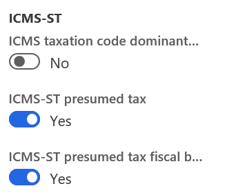
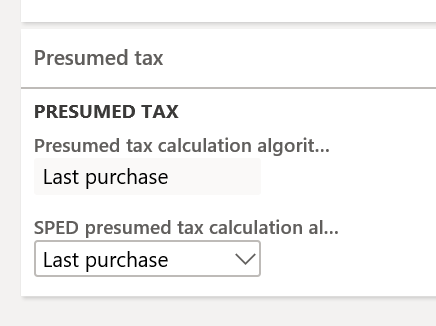
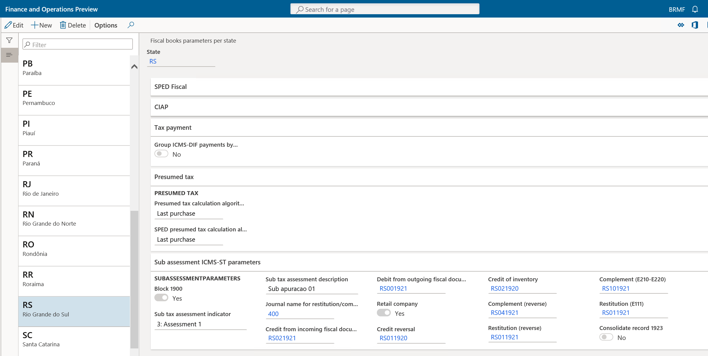
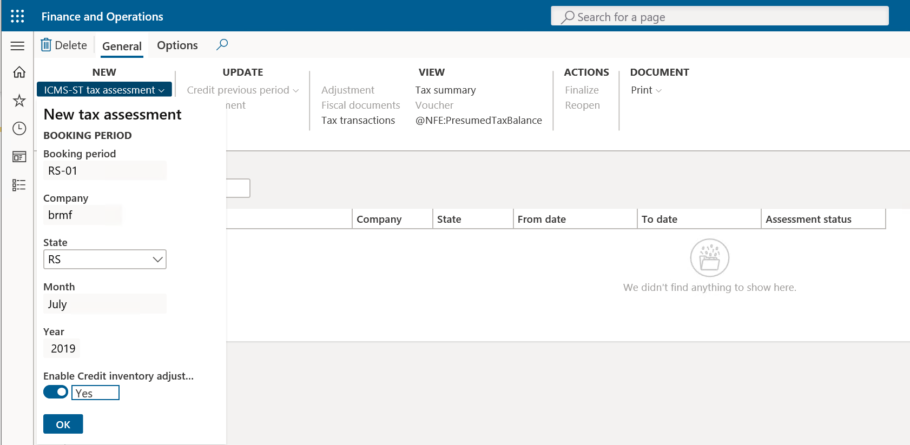
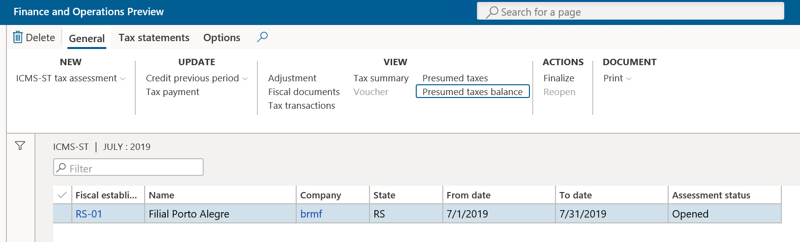
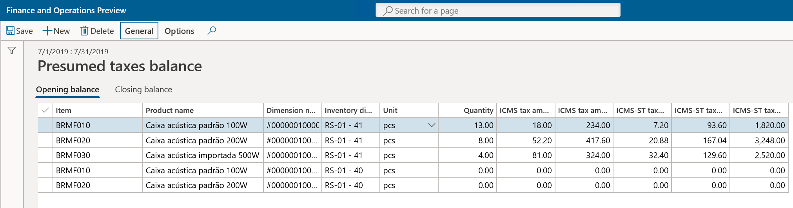
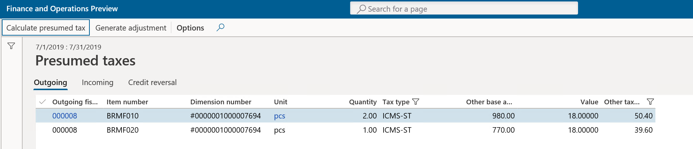
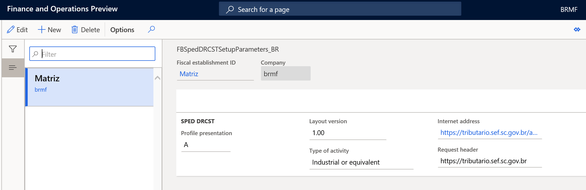

---
# required metadata

title: ICMS-ST complement and restitution process and declaration for RS, SC, and SP states
description: This topic provides information about the process for calculating and reporting the compensation and restitution of ICMS-ST tax amounts in internal operations to final consumers when goods are acquired under the Tax substitution regime (ICMS-ST). .
author: sndray
ms.date: 08/30/2019
ms.topic: article
ms.prod: 
ms.technology: 

# optional metadata

ms.search.form:
# ROBOTS: 
audience: Application User
# ms.devlang: 
ms.reviewer: kfend
# ms.tgt_pltfrm: 
ms.custom: 270254
ms.assetid: 92223189-69a8-4a40-b867-ef9b4f14c23d
ms.search.region: Brazil
# ms.search.industry: 
ms.author: sndray
ms.search.validFrom: 2019-07-31
ms.dyn365.ops.version: 10.0.5

---

# ICMS-ST complement and restitution process and declaration for RS, SC, and SP states

[!include [banner](../includes/banner.md)]

The Brazilian states of Rio Grande do Sul (RS), São Paulo (SP), and Santa Catarina (SC) have defined and implemented a new process for calculating and reporting the compensation and restitution of ICMS-ST tax amounts in internal operations to final consumers when goods are acquired under the Tax substitution regime (ICMS-ST). This process applies to retail and non-retail companies.

On a monthly basis, the taxpayer should, as a general rule, determine the difference between the ICMS-ST amount that is calculated in incoming fiscal documents and the ICMS-ST amount that is calculated in outgoing fiscal documents to the final consumer. Exceptions and specific rules might apply, depending on the state definition.

This difference between the incoming and outgoing amounts is known as the *ICMS-ST adjustment*, because the correction can be either positive (+) or negative (-), and it must be reported in SPED Fiscal or other related tax statements.

- Taxpayers need to determine the ICMS-ST tax amount to collect of the products subject to ICMS-ST
- The ICMS-ST calculated amount must be compared with the purchase ICMS-ST tax amount
- Depending on the result, taxpayers need to register the adjustment positive or negative
- Determine the ICMS-ST to complement or to restore

## High-level example

Purchase – Incoming fiscal document Base amount of ICMS-ST = 80.00

ICMS-ST calculated =\> 80.00 × 18 percent = R\$ 14.00

Sales – Outgoing fiscal document base amount = 90.00

ICMS-ST effective = 90.00 × 18 percent = R\$ 16.20

**ICMS-ST amount to complement** = R\$ 16.20 (ICMS-ST effective) – R\$ 14.00 (ICMS-ST from purchase) = **R\$ 2.20** (\> 0.00)

–or–

Purchase – Incoming fiscal document BC ST = 80.00

ICMS-ST calculated =\> 80.00 × 18 percent = R\$ 14.00

Sales – Outgoing fiscal document Base amount = 70.00

ICMS-ST effective = 70.00 × 18 percent = R\$ 12.60

**ICMS-ST amount for restitution** = R\$ 12.60 (ICMS-ST effective) – R\$ 14.00 (ICMS-ST from purchase) = **R\$ -1.40** (\< 0.00)

## São Paulo state implementation

A new tax statement, CAT 1219, was introduced by SP state. This tax statement requires that companies submit an ICMS-ST tax declaration monthly for tax complement and restitution of ICMS-ST amounts.

The statement file is generated based on version 1.1.0 of the guidance layout document.

### Scope

The following tables provide information about the records that are generated by using the CAT 1218 statement.

#### Record 0000 – Statement opening and Taxpayer Identification and Participant Identification

| Number | Field | Description                                                                                                                    |
|------------|-----------|------------------------------------------------------------------------------------------------------------------------------------|
| 01         | REG       | Fixed text that is set to **0000**                                                                                                 |
| 02         | PERIODO   | The reporting period                                                                                                               |
| 03         | NOME      | The business name of the entity                                                                                                    |
| 04         | CNPJ      | The registration number of the entity in the National Registry of Legal Entities (CNPJ)                                            |
| 05         | IE        | The State Registration (IE) number of the entity                                                                                   |
| 06         | COD_NUM   | The Brazilian Institute for Geography and Statistics (IBGE) code                                                                   |
| 07         | COD_VER   | The code for the version of the layout. This field is manually filled in when the reports is run.                                  |
| 08         | COD_FIN   | The code for the purpose of the file. This field is manually filled in when the report is run. The following values are available: |

-  **00** – Regular file delivery
-  **01** – File delivery that is required by the tax authority
-  **02** – File delivery for replacement of a previously uploaded file

#### Record 0150 – Participant table

Only users who have transactions in the reported booking period are included in this record. There is one record per user.

| Number | Field | Description                                                                  |
|------------|-----------|----------------------------------------------------------------------------------|
| 01         | REG       | Fixed text that is set to **0150**                                               |
| 02         | COD_PART  | The identification code of the participant                                       |
| 03         | NOME      | The personal or business name of the participant                                 |
| 04         | COD_PAIS  | The country/region code of the participant                                       |
| 05         | CNPJ      | The registration number of the participant in the CNPJ                           |
| 06         | CPF       | The registration number of the participant in the Natural Persons Register (CPF) |
| 07         | IE        | The State Registration number of the participant                                 |
| 08         | COD_MUN   | The IBGE code                                                                    |

#### Record 0200 – Item identification table

Only items that have transactions in the reported booking period are included in this record. There is one record per item.

| Number | Field  | Description                                               |
|------------|------------|---------------------------------------------------------------|
| 01         | REG        | Fixed text that is set to **0200**                            |
| 02         | COD_ITEM   | The item code                                                 |
| 03         | DESCR_ITEM | The description of the item                                   |
| 04         | COD_BARRA  | The product bar code                                          |
| 05         | UNID_INV   | The inventory unit of measure                                 |
| 06         | COD_NCM    | The fiscal classification code                                |
| 07         | ALIQ_ICMS  | The ICMS rate that applies to the item in internal operations |
| 08         | CEST       | The Tax Substitution Specifier Code (CEST)                    |

#### Record 1050 – Balance

This record reports the total amount (initial inventory position and final inventory position) of record 1100 records. There is one record per item. The information is collected from the **Presumed taxed balances** functionality in the ICMS-ST tax assessment.

| Number | Field    | Description                                                                                                                              |
|------------|--------------|----------------------------------------------------------------------------------------------------------------------------------------------|
| 01         | REG          | Fixed text that is set to **1050**                                                                                                           |
| 02         | COD_ITEM     | The item code according to record 0200                                                                                                       |
| 03         | QTD_INI      | The initial item quantity at the beginning of the period                                                                                     |
| 04         | ICMS_TOT_INI | The accumulated initial value of the total ICMS that is supported by the taxpayer and calculated for the item at the beginning of the period |
| 05         | QTD_FIM      | The final item quantity at the end the period                                                                                                |
| 06         | ICSM_TOT_FIM | The accumulated final value of the total ICMS that is supported by the taxpayer and calculated for the item at the end of the period         |

#### Record 1100 – Balance details record

This record reports details of electronic fiscal documents. This information is collected from the information that is stored on the **Outgoing** and **Incoming** tabs of the **Presumed taxes** page.

| Number | Field | Description                                                                                                                                     |
|------------|-----------|-----------------------------------------------------------------------------------------------------------------------------------------------------|
| 01         | REG       | Fixed text that is set to **1100**                                                                                                                  |
| 02         | CHV_DOC   | The electronic fiscal document's **ACCESSKEY** value                                                                                                |
| 03         | DATA      | The fiscal document date                                                                                                                            |
| 04         | NUM_ITEM  | The sequential number of the item in the electronic fiscal document                                                                                 |
| 05         | IND_OPER  | A value that indicates the operation type:                                                                                                          |
| 06         | COD_ITEM  | The item code according to record 0200                                                                                                              |
| 07         | CFOP      | The Fiscal Code of Operation and Provision (CFOP)                                                                                                   |
| 08         | QTD.      | The item quantity. No negative values are used for returns. The values are always positive.                                                         |
| 09         | ICMS_TOT  | The total value of ICMS that is supported by the taxpayer in incoming fiscal documents                                                              |
| 10         | VL_CONFR  | The ICMS and ICMS-ST values for outgoing fiscal documents                                                                                           |
| 11         | COD_LEGAL | The legal framework code for the hypothesis of the restitution or complement of ICMS-ST. For descriptions of the codes, see the table that follows. |

-   **0** – Input

-   **1** – Output

The following table describes the codes for the hypothesis of restitution or complement of ICMS-ST.

| Code | Hypothesis of restitution or complement of ICMS-ST                                                                         | Observation                                                                                             |
|----------|--------------------------------------------------------------------------------------------------------------------------------|-------------------------------------------------------------------------------------------------------------|
| 1        | Operation where the restitution or complement of ICMS-ST is applicable in the hypothesis of Item I of Article 269 of the RICMS | Outgoing fiscal document to final consumers with ICMS-ST tax type and taxation code = 60                    |
| 2        | Operation where the restitution of ICMS-ST is applicable in the hypothesis of Item II of Article 269 of the RICMS              | Outgoing fiscal document for inventory decrease CFOP 5.927/others with ICMS tax type and taxation code = 90 |
| 3        | Operation where the restitution of ICMS-ST is applicable in the hypothesis of Item III of Article 269 of the RICMS             | Outgoing fiscal document – ICMS-CST [30] (Exempt or not taxed)                                              |
| 4        | Operation where the restitution of ICMS-ST is applicable in the hypothesis of Item IV of Article 269 of the RICMS              | Outgoing fiscal document to other state – ICMS-ST [60] (Interstate)                                         |
| 0        | Operation where the restitution or complement of ICMS-ST isn't applicable                                                      | Other outgoing fiscal documents with ICMS-ST tax type and taxation code \<\> 60                             |

## Rio Grande do Sul state implementation

Through Decree 54308/2018, RS state established the procedure for calculating and reporting the complement or restitution of ICMS-ST tax amounts for contributors (retailers and non-retailers) that perform activities that involve goods that are subject to the tax substitution regime (ICMS-ST).

The state has defined two processes, one for retail companies and the other for non-retail companies.

### Scope

The ICMS-ST amount that is calculated for complement and restitution is reported in SPED Fiscal ICMS-ST in record 1900 and related adjustment records, such as records 1921 and 1923, because the state considers this process a sub-assessment of ICMS-ST.

#### Non-retailer companies

| Record | Level | Description                         | Comment                                                                                                                                                                                                                                                                                                                            | Parameters from RS state                                                                            |
|------------|-----------|-----------------------------------------|-----------------------------------------------------------------------------------------------------------------------------------------------------------------------------------------------------------------------------------------------------------------------------------------------------------------------------------------|---------------------------------------------------------------------------------------------------------|
| 1001       | 1         | Opening Block 1                         |                                                                                                                                                                                                                                                                                                                                         | The **Block 1900** option is set to **Yes**.                                                            |
| 1900       | 2         | Indicator of ICMS-ST sub-tax assessment |                                                                                                                                                                                                                                                                                                                                         | The **Sub tax assessment indicator** and **Sub tax assessment description** fields                      |
| 1910       | 3         | Booking period                          |                                                                                                                                                                                                                                                                                                                                         |                                                                                                         |
| 1920       | 4         | TOTALS amounts                          | Summarization from record 1921 records                                                                                                                                                                                                                                                                                                  |                                                                                                         |
| 1921       | 5         | RS001920                                | The adjustment transaction that summarizes all ICMS effective amounts from: outgoing fiscal documents for final consumers (CFOP 5\*), where CST = 60 and tax type = ICMS and/or ICMS-ST                                                                                                                                                 | The adjustment code that is selected in the **Debit from outgoing fiscal documents** field              |
| 1923       | 6         | 1:N records                             | Details of outgoing fiscal documents by item, or consolidated by fiscal document                                                                                                                                                                                                                                                        | The **Consolidate record 1923** option                                                                  |
| 1921       | 5         | RS021922                                | The adjustment transaction that summarizes the ICMS-ST amount or, when ICMS-ST doesn't exist, ICMS presumed amount from incoming fiscal documents where ICMS-ST = 60, and that are related to the previously mentioned outgoing fiscal document **Note:** Incoming fiscal documents of items are reported only in record 1921-RS001920. | The adjustment code that is selected in the **Credit from incoming fiscal documents** field             |
| 1923       | 6         | 1:N records                             | Details of incoming fiscal documents by item, or consolidated by fiscal document                                                                                                                                                                                                                                                        | The **Consolidate record 1923** option                                                                  |
| 1921       | 4         | RS041921 or RS011921                    | The adjustment transaction of complement or restitution                                                                                                                                                                                                                                                                                 | The adjustment code that is selected in the **Complement (reverse)** or **Restitution (reverse)** field |
| E220       |           | RS101921                                | The adjustment transaction that is created to report in record E220                                                                                                                                                                                                                                                                     | The adjustment code that is selected in the **Complement (E210-E220)** field                            |
| E111       |           | RS011021                                | The adjustment transaction that is created to report in record E111                                                                                                                                                                                                                                                                     | The adjustment code that is selected in the **Restitution (E111)** field                                |

#### Retail companies

| Record | Level | Description                         | Comments                                                                                                                                                                                                                                                                                                                                                                                                                                                                                 | Parameters from RS state                                                                            |
|------------|-----------|-----------------------------------------|------------------------------------------------------------------------------------------------------------------------------------------------------------------------------------------------------------------------------------------------------------------------------------------------------------------------------------------------------------------------------------------------------------------------------------------------------------------------------------------|---------------------------------------------------------------------------------------------------------|
| 1001       | 1         | Opening Block 1                         |                                                                                                                                                                                                                                                                                                                                                                                                                                                                                          | The **Block 1900** option is set to **Yes**.                                                            |
| 1900       | 2         | Indicator of ICMS-ST sub-tax assessment |                                                                                                                                                                                                                                                                                                                                                                                                                                                                                          | The **Sub tax assessment indicator** and **Sub tax assessment description** fields                      |
| 1910       | 3         | Booking period                          |                                                                                                                                                                                                                                                                                                                                                                                                                                                                                          |                                                                                                         |
| 1920       | 4         | TOTALS amounts                          | Summarization from record 1921 records                                                                                                                                                                                                                                                                                                                                                                                                                                                   |                                                                                                         |
| 1921       | 5         | RS021921                                | **Credit:** The adjustment transaction that summarizes the ICMS-ST amount or, when ICMS-ST doesn't exist, ICMS amount presumed tax from all approved and booked incoming fiscal documents that are received during the period. If the incoming fiscal document doesn’t have a related outgoing fiscal document in the period, these transactions will not be considered in summarization                                                                                                 | The adjustment code that is selected in the **Credit from incoming fiscal documents** field             |
| 1923       | 6         | 1:N records                             | Details of incoming fiscal documents by item, or consolidated by fiscal document                                                                                                                                                                                                                                                                                                                                                                                                         | The **Consolidate record 1923** option                                                                  |
| 1921       | 5         | RS021920                                | **Credit from inventory:** The adjustment transaction that is used to register the inventory credit. This amount is calculated on the **Presumed tax balance option** available in **ICMS-ST tax assessment,** form in relation to the inventory opening balance. Because this adjustment must be reported in three installments, the **DESCR_COMPL_AJ** field in record 1921 contains the following text: "Valor adjudicado nos termos do RICMS, Livro III, art. 25-A, I, nota 05, 1/3" | The adjustment code that is selected in the **Credit of inventory** field                               |
| 1921       | 5         | RS011920                                | **Credit reversal:** The adjustment transaction that summarizes the ICMS tax from an outgoing fiscal document to a non-final consumer, where taxation code = 60, and/or to a final consumer, where ICMS = exempt or non-taxable taxation code \<\> 60                                                                                                                                                                                                                                    | The adjustment code that is selected in the **Credit reversal** field                                   |
| 1921       | 5         | RS001920                                | **Debit:** The adjustment transaction that summarizes the outgoing fiscal documents of ICMS effective (CFOP 5\*) to a final consumer, where taxation code = 60                                                                                                                                                                                                                                                                                                                           | The adjustment code that is selected in the **Debit from outgoing fiscal documents** field              |
| 1923       | 6         | 1:N records                             | Details of outgoing fiscal documents by item, or consolidated by fiscal document                                                                                                                                                                                                                                                                                                                                                                                                         | The **Consolidate record 1923** option                                                                  |
| 1921       | 5         | RS041921                                | The adjustment transaction of complement or restitution                                                                                                                                                                                                                                                                                                                                                                                                                                  | The adjustment code that is selected in the **Complement (reverse)** or **Restitution (reverse)** field |
| 1926       | 5         | Payment ICMS-ST                         | Equal to E250. This record is generated when there is an amount to collect, and a payment exists in the ICMS-ST tax assessment (compensation).                                                                                                                                                                                                                                                                                                                                           |                                                                                                         |
| E220       |           | RS101921                                | The adjustment transaction that is created to report in record E220                                                                                                                                                                                                                                                                                                                                                                                                                      | The adjustment code that is selected in the **Complement (E210-E220)** field                            |
| E111       |           | RS011021                                | The adjustment transaction that is created to report in record E111                                                                                                                                                                                                                                                                                                                                                                                                                      | The adjustment code that is selected in the **Restitution (E111)** field                                |

## Santa Catarina state implementation

Through SEF Portaria No. 396/2018, SC state established the procedure for calculating and reporting the complement or restitution of ICMS-ST tax amounts for contributors (retailers and non-retailers) that perform activities that involve goods that are subject to the Tax substitution regime (ICMS-ST).

### Scope

| Block | Level | Records | Description                                                                                                              |
|-----------|-----------|-------------|-------------------------------------------------------------------------------------------------------------------------------|
| 0         | 0         | 0000        | Opening file                                                                                                                  |
|           | 1         | 0001        | Opening block 0                                                                                                               |
|           | 2         | 0005        | Complementary information of legal entity                                                                                     |
|           | 2         | 0100        | Accountant information                                                                                                        |
|           | 2         | 0190        | Unit of measure identification                                                                                                |
|           | 2         | 0200        | Goods and services identification                                                                                             |
|           | 2         | 0220        | Unit of measure conversion                                                                                                    |
|           | 2         | 0990        | Closing block 0                                                                                                               |
| H         | 1         | H001        | Opening block H                                                                                                               |
|           | 2         | H005        | Inventory totals                                                                                                              |
|           | 2         | H010        | Inventory position                                                                                                            |
|           | 1         | H990        | Closing block H                                                                                                               |
| 2         | 2         | 2001        | Opening block 2                                                                                                               |
|           | 2         | 2100        | Monthly assessment - Totals of complement and restitution of goods subject to ICMS-ST tax type                                |
|           | 3         | 2110        | Monthly assessment - Totals of complement and restitution detailed by goods                                                   |
|           | 4         | 2113        | Fiscal document model 55 of sales/return of goods identified in record 2110                                                   |
|           | 5         | 2114        | Complement of fiscal document referenced in sales return                                                                      |
|           | 5         | 2115        | Sales complementary fiscal document                                                                                           |
|           | 4         | 2120        | Unitary monthly weighted average of ICMS-ST tax calculation base in relation to own operation and ICMS-ST of receipt of goods |
|           | 5         | 2130        | Fiscal document model 55 of receipt goods with ICMS-ST tax type identified in record 2110 and related returns                 |
|           | 6         | 2132        | Complement of fiscal document referenced in purchase returns                                                                  |
|           | 6         | 2136        | Purchase complementary fiscal documents                                                                                       |
|           | 1         | 2990        | Closing block 2                                                                                                               |
| 9         | 1         | 9001        | Opening block 9                                                                                                               |
|           | 2         | 9900        | File records                                                                                                                  |
|           | 1         | 9990        | Closing block 9                                                                                                               |
|           | 0         | 9999        | Closing file                                                                                                                  |

The following records are out of scope: 2112 (outgoing fiscal documents that are generated by Fiscal printer ECF) and 2131.

### Setup

1. Go to **Organization administration** \> **Setup** \> **Brazilian parameters**.
2. On the **Fiscal document** tab, in the **ICMS-ST** section, set the following options to **Yes**:

	-  **ICMS-ST presumed tax** – Enable this process to generate related tags in XML format when an NF-e is issued to tax authorities.
	-  **ICMS-ST presumed tax fiscal books** – Enable this process to calculate ICMS-ST restitution and compensation amounts, and generate related reports, depending on the state where the fiscal establishment has the ICMS-ST registration (SC, SP or RS).

	

3. Go to **Fiscal books** \> **Setup** \> **Fiscal books parameters per state**, and then select the appropriated state (**SP**, **SC**, or **RS**).

### Presumed tax

On the **Presumed tax** FastTab of the **Fiscal books parameters per state** page, set the following parameters:

-  **Presumed tax calculation algorithm** – Select the method that is used to calculate the presumed ICMS-ST tax when outgoing fiscal documents to final and non-final consumers are generated and posted in Dynamics 365 Finance. This parameter is used to fill in the related tags when the NF-e fiscal document model.

    -  **Last purchase** – Use information from the latest incoming fiscal documents that were posted during the period.

-  **SPED Presumed tax calculation algorithm** – Select the method that is used to calculate the presumed ICMS-ST from ICMS-ST tax assessments that are created in the **Fiscal books** module:

    -  **Average** – Calculate the average amount from incoming fiscal documents. This method must be selected for SP or SC state.
    -  **Last purchase** – Use information from the latest incoming fiscal documents that were posted during the period. This method must be selected for RS state.

  

### ICMS-ST sub-tax assessment in RS state

For RS state, because the amounts and details about the calculation of ICMS-ST compensations and restitution are reported in SPED Fiscal in record 1900 and other related records, additional setup is required to automatically create the adjustment transactions that are established by Decree 54308/2018.

Go to **Fiscal books** \> **Setup** \> **Fiscal books parameters per state**, select **RS** state and then, on the **Sub assessment ICMS-ST parameters** FastTab, set the following parameters:

-  **Block 1900** – Set this option to **Yes** to generate ICMS-ST sub-tax assessment records that are detailed in the scope session.
-  **Sub tax assessment indicator** – Select the type of indicator that is used to identify the sub-tax assessment.
-  **Sub tax assessment description** – Enter a description of the sub-tax assessment that is reported in in the **03 DESCR_COMPL_OUT_APUR** field in record 1900.
-  **Journal name for restitution/complement adjustment** – Select the journal that is used to create and post the compensation and restitution tax assessment.
-  **Credit from incoming fiscal documents** – Select the related adjustment code for this type of adjustment.
-  **Debit from outgoing fiscal documents** – Select the related adjustment code for this type of adjustment.
-  **Retail company** – Set this option to **Yes** if the main business activity in this state is retail. Otherwise, set the option to **No**.
-  **Credit reversal** – Select the related adjustment code for this type of adjustment.
-  **Credit of inventory** – Select the related adjustment code for this type of adjustment.
-  **Complement (reverse)** – Select the related adjustment code for this type of adjustment.
-  **Restitution (reverse)** – Select the related adjustment code for this type of adjustment.
-  **Complement (E210-E220)** – Select the related adjustment code for this type of adjustment. When this adjustment is created, the ICMS-ST tax assessment will be updated.
-  **Restitution (E111)** – Select the related adjustment code for this type of adjustment. When this adjustment is created, the ICMS tax assessment will be updated because only credits are allowed in the ICMS tax assessment.
-  **Consolidate record 1923** – Set this option to **Yes** to consolidate or report on record 1923 per fiscal document (no items will be detailed). The **08 COD_ITEM** field will remain blank.

  

## Repro steps

### ICMS-ST tax assessment

Before you generate a statement for each state, you must create a fiscal booking period for the month, create the ICMS-ST tax assessment for the state, and then calculate any balances that are applicable in that state. If you want to create a credit adjustment related to inventory position, then mark as **Yes**, the **Credit inventory adjustment** checkbox in ICMS-ST tax assessment form before to confirm.

> [!NOTE]
> The credit adjustment related to inventory position is only applicable for RS and SC states.

1. Go to **Fiscal books** \> **Common** \> **Tax assessment** \> **ICMS-ST**.
2. On the **ICMS-ST** page, on the Action Pane, on the **General** tab, in the **View** group, select **Presumed taxes balance**.

	

The **Presumed taxes balance** page includes fields that are required for reporting purposes. Here are some examples of these fields:

  - Item code
  - Product name
  - Dimension ID
  - Inventory dimension values
  - Inventory unit of measure
  - Quantities
  - ICMS tax rate and ICMS-ST base amounts
  - Amount per inventory unit and totals

  

On the Action Pane, on the **General** tab, in the **Calculations** group, select **Calculate inventory balances**. The system calculates the initial opening balance and the closing balance, and shows the values per item number.

Here is how the function for the opening balance calculation works:

1. Validate whether a presumed tax balance for the previous period exists. If no balance is found, the calculation is started. If a balance is found, the procedure considers the values from the previous period.
2. Select all items in on-hand inventory that have any transactions before the current period.
3. Calculate the quantity for every selected item on the first day of the period.
4. Find the last purchase for every item that has a ICMS-ST tax transaction.
5. By using the tax amounts from the last purchase and converting the purchase unit to the inventory unit, calculate ICMS and ICMS-ST amounts for the on-hand inventory quantity.

Here is how the function for the closing balance calculation works. This function is applicable only to SP state.

1. Delete old presumed tax balances for the period except those that are used for the next period. These amounts will be updated, and all other amounts will be recalculated.
2. Select all items in on-hand inventory that have any transactions during theperiod.
3. Search for the presumed tax for every item.
4. Calculate the balance in the previous periods to get the opening balance quantity. If there is no balance in previous periods, the opening balance quantity is 0 (zero).
5. Select all incoming fiscal documents in the period, summarize ICMS and ICMS-ST tax amounts, and summarize item quantities.
6. Calculate the average amount per unit by summarizing the totals of ICMS and ICMS-ST amounts in all incoming documents and dividing them by the summarized quantity in those documents.
7. Select all outgoing fiscal documents, and summarize their quantities. Then calculate ICMS and ICMS-ST tax amounts by using the average amount that was calculated in step 6.
8. Calculate closing balance amounts and quantities by using the values from the previous periods, and the sums of incoming and outgoing documents from the current period. These sums were calculated in steps 5 and 7, respectively.

#### Presumed tax calculation

After the balances are calculated for the first time, open the **Presumed taxes** page, and select **Calculate presumed tax**.

The page includes fields that are required for reporting purposes. Each tab shows the related fiscal documents that are applicable for compensation and restitution according to the criteria that have been established by state law.

> [!NOTE]
> The **Credit reversal** tab is applicable only to RS state and this tab shows Outgoing fiscal documents to non-final consumers, where taxation code = 60, and/or to final consumers, where ICMS = exempt or non-taxable taxation code \<\> 60.

The lower part of the page shows the total amounts.

Here is how the average algorithm for presumed tax calculation works:

1. Select all lines of all outgoing fiscal documents in the current period.
2. For every item from these lines, select all lines of all incoming fiscal documents that have the same item code in the current period. Then calculate the average ICMS and ICMS-ST tax amounts.
3. If no incoming documents exist in the period, consider the corresponding record in the presumed tax balances.

> [!NOTE]
> For SP state, the average values for sales complementary fiscal documents and purchase orders aren't calculated. Only the values from the original fiscal documents are considered.

#### Generate adjustments

For RS state, use the **Generate adjustments** button to generate the related tax adjustment that must be reported in SPED Fiscal.

Depending on the type of company business (retail or non-retail), Finance generates the related adjustments:

  - Debit for outgoing fiscal documents.
  - Credit for incoming fiscal documents.
  - Credit from the inventory position (opening balance). This tax adjustment is created one time and split into three installments.
  - Credit reversal.
  - Compensation and restitution (reversal).
  - Compensation in record E220.
  - Restitution in record E111.

> [!NOTE]
> After you select **Generate adjustments**, there is no way to revert to the initial state. To report record E220 or E111, you must manually reverse the adjustment transaction that is created during execution of the Generate adjustments function. The other adjustments that are related to debit, credit, credit for inventory, and credit reversal are created only for SPED Fiscal purposes. You won't able to see these transactions, because they are saved in a temporary table.

### Generate a statement

#### SP state

1. Go to **Fiscal books** \> **Common** \> **Booking period**, and then, on the **Tax statements** tab, select **CAT 4218 SP**. This statement is also available in the ICMS-ST tax assessment for SP state.
2. In the **File name** field, enter the full path where the text file should be saved. Include the name of the file.
3. In the **Layout version** field, select the version.
4. In the **File type** field, select the type of file:

	- Regular
	- Specific intimation
	- Substitute

The text file that is generated should first be validated by using the tax authority application. After the file is approved, you can send the information to the tax authorities.

#### RS state

1. Go to **Fiscal books** \> **Common** \> **Booking period**, and then, on the **Tax statements** tab, select **SPED fiscal**. This statement is also available in the ICMS-ST tax assessment for RS state.
2. Set the parameters that are usually set to generate the SPED Fiscal statement. To generate record 1900 and other related records, you must set the parameters that are required to generate the SPED Fiscal statement. To set up those parameters, follow these steps:
3. Create and sync the related booking period.
4. Sync inventory. If applicable, take the credit from the inventory opening balance.
5. Create or update the ICMS-ST tax assessment for RS state.
6. Calculate presumed tax balances (if applicable).
7. Calculate presumed tax.
8. Generate adjustments.
9. Complete the remaining steps that are related to the ICMS-ST tax assessment.
10. Generate the SPED Fiscal statement in the usual way.

#### SC state

1. Go to **Fiscal books \> Setup \> Tax statements parameters**, and then select **SPED DRCST**.
2. On the **Setup parameters** FastTab, add the internet address and the request header address, so that the related XML file can be submitted to the government tax authorities.

	

3. Go to **Organization administration \> Setup \> Brazilian parameters**.
4.  On the **Fiscal document** tab, in the **ICMS-ST** section, set the following options to **Yes** to enable the functionality for calculating presumed tax in the NF-e issuing process, and in the SPED Fiscal ICMS-ST tax assessment:

	- ICMS-ST presumed tax
	- ICMS-ST presumed tax fiscal books

5. Go to **Fiscal books** \> **Common** \> **Booking period**, and then, on the **Tax statements** tab, select **SPED DRCST**. This statement is also available in the ICMS-ST tax assessment for SC state.
6.  In the **File name** field, enter the full path where the text file should be saved. Includehe name of the file.
7.  In the **File type** field, select type of the file.

The file is submitted by using web services. A certificate is required. After the return message is received together with the result of government validation, the response is saved in the same location where the file was generated.

[!INCLUDE[footer-include](../../includes/footer-banner.md)]