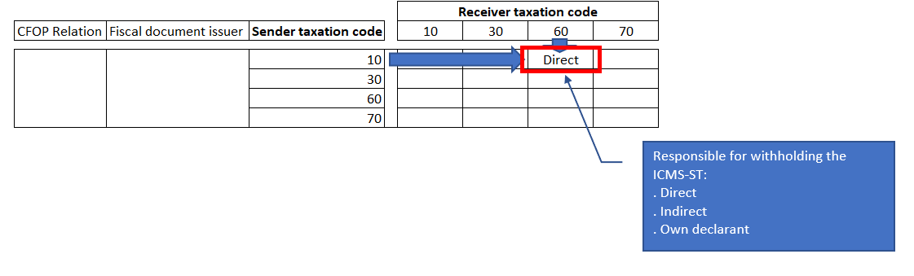

---
# required metadata

title: SPED fiscal 2020: Complementary information of the ICMS-ST for Sped fiscal 2020 layout 014
description: This topic provides information about .
author: v-gonode
manager: AnnBe
ms.date: 12/09/2019
ms.topic: article
ms.prod: 
ms.service: dynamics-ax-applications
ms.technology: 

# optional metadata

ms.search.form:   
audience: Application User
# ms.devlang: 
ms.reviewer: kfend
ms.search.scope: Core, Operations
# ms.tgt_pltfrm: 
# ms.custom: 
ms.search.region: Brazil 
# ms.search.industry: 
ms.author: 
ms.search.validFrom: 
ms.dyn365.ops.version: Version 1611

---

# SPED fiscal 2020: Complementary information of the ICMS-ST for Sped fiscal 2020 layout 014

[!include [banner](../includes/banner.md)]

For the Companies who want to utilize the complement &amp; compensation of ICMS-ST for calendar year 2020, they need to start registering the complementary information of ICMS-ST during receiving of electronic fiscal documents model 55 from Jan 1st 2020 onwards.

Only for Microsoft Dynamics 365 Finance, this feature must be previously enabled throughout Feature Management. In order to enable it:

1. Go to Home.
2. Click on Feature Management on the dashboard.
3. Search feature Complementary information of ICMS-ST and select it.
4. Click on button Enable Now.

Whenever the vendor fiscal document, or transfer fiscal document have on some of its lines a product subject to ICMS-ST taxation on the UF (state) of the destination address, if the receiving fiscal establishment utilizes the complement &amp; compensation of ICMS-ST, then the following attributes of the fiscal document must be entered.

- Who was the responsible for withholding the ICMS-ST:
		
	- Direct: when the third party or the fiscal establishment issuer of the fiscal document was the direct responsible for withholding the ICMS-ST for the product present in the fiscal document.
	- Indirect: when the third party or the fiscal establishment issuer of the fiscal document already received the product with withheld ICMS-ST from its supply chain.
	- Own declarant: when the receiving fiscal establishment becomes responsible for withholding the ICMS-ST that should have been withheld by the third party issuer, but for some reason, was not.
	
- The ICMS-ST collection payment mode:
		
	- State document of collection: when the due ICMS-ST is withheld through the regular ICMS-ST tax assessment and payment after the end of the transaction period.
	- GNRE: when the receiving fiscal document is accompanied by a GNRE demonstrating the due ICMS-ST was already withheld and paid at the origin, by the fiscal document issuer.
	
- The ICMS-ST collection payment number: the number of GNRE used to settle the ICMS-ST payment amount by the fiscal document issuer.

For a given fiscal document line with a product subject to ICMS-ST on the receiving destination, the responsible for withholding the ICMS-ST will be determined by looking at the taxation code of the ICMS-ST in the receiving fiscal document and comparing towards the equivalent ICMS-ST line in present in the NF-e XML issued by the sender of the fiscal document, as shown in figure 1 and 2.

Nevertheless, a default value for the Responsible for withholding the ICMS-ST can be set up at:

1. Go to Tax &gt; Set up &gt; Sales tax &gt; Responsible for withholding the ICMS-ST.
2. On CFOP Code field, select Table, Group or All.
3. On CFOP Relation field, enter the relation defined by CFOP Code.
4. On Fiscal document issuer field, select Fiscal establishment or Third party to define the origin of the fiscal document.
5. On Receiver taxation code field, enter the taxation code of the ICMS-ST configured for the receiving fiscal document line, where the product is subject to ICMS tax substitution.
6. On Sender taxation code field, enter the taxation code of the ICMS-ST present in the issuer's fiscal document line, where the product is subject to ICMS tax substitution.
7. For a given CFOP relation and Fiscal document issuer, and based on the relation between the Receiver taxation code vs the Sender taxation code, Enter on Responsible for withholding the ICMS-ST field, one of the options Direct, Indirect or Own declarant.

The Responsible for withholding the ICMS-ST, the ICMS-ST collection payment mode and ICMS-ST collection payment number are new fields at:

- Vendor invoices form, at Fiscal information tab.
- Transfer order form, at Fiscal information of receiving tab.
- Customer invoice form, at Fiscal information tab only for customer returns.

> [!NOTE]
> Operations where the ICMS-ST is taxable during receiving (taxation code = 10), although can be captured by the new field Responsible for withholding ICMS-ST, the further treatment of accounting, financial and costing remains out of scope of localization.
