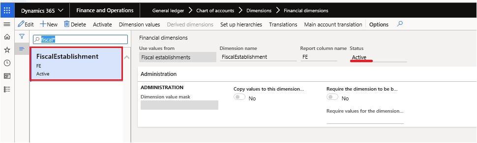
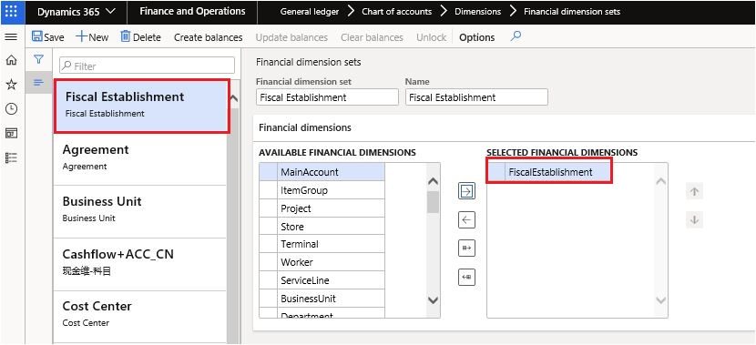
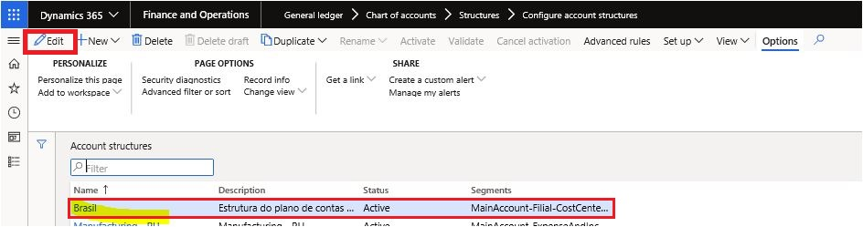
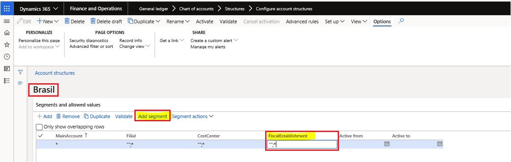
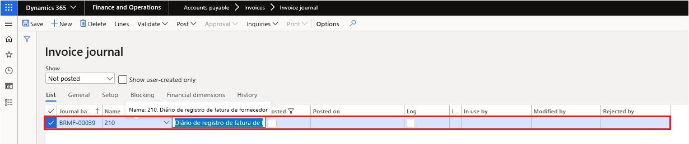
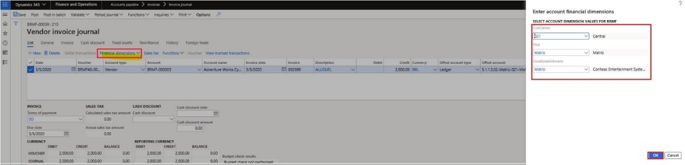

# Enable the Fiscal establishment dimension

[!include [banner](../includes/banner.md)]
  
It's necessary to have the dimension "Fiscal establishment", for non-fiscal operations when generated General Journal to meet the events: R-4010, R-4020 and R-4040.

1. Go to **General Ledger** \> **Chart of accounts** \> **Dimensions** \> **Financial dimensions** then configure it as following.  
    

2. General Ledger \> Chart of accounts \> Dimensions \> Financial dimension sets then configure it as following.  
    

3. General Ledger \> Chart of accounts \> Structures \> Configure account structures \> select "Brasil" \> click "Edit" button.  
    

4. Add segment button \> Add "FiscalEstablishment" \> click "Activate" then configure it a following.  
    

5. Accounts payable \> Invoices \> Invoice journal \> click "Lines" button.  
    

6. On the Journal Lines Pane \> List tab \> click= "New" then configure it as following.

7. Financial dimensions option \> Accounts \> then configure it as following \> click "OK" button.  
    

[!INCLUDE[footer-include](../../includes/footer-banner.md)]
