# Set up electronic messages for SPED-Reinf events

Electronic message functionality is new in Microsoft Dynamics 365 Finance. It lets you maintain and track various processes for electronic messages when there is an exchange of information between Finance and tax authority web services.

Before you issue SPED-Reinf events to the government website, use the predefined configuration that Microsoft has prepared to meet SPED-Reinf requirements. This configuration is delivered as a data entity. After it's imported into Finance, users will be able to generate, validate, and deliver all events that are described in the SPED-Reinf scope.

## Import the configuration from the data entity

To set up electronic message functionality for communication of SPED-Reinf events, use the predefined configuration that is available in Microsoft Dynamics Lifecycle Services (LCS).

1. Sign in to [LCS](https://lcs.dynamics.com).
2. Select the **Shared asset library** tile.
3.  Select **Data package** as the asset type, and then select the package for the SPED-REINF event communication data entities. (The file name is **SPEDREINF\_EMSettings Layout 2.1.2.zip**.)
4. Save the file in the location where data entities should be stored.
5. Sign in to Finance, and go to **Workspaces** \> **Data management**.
6. Select the **Import** tile.
7. Enter a description and a name to identify the job, such as **SpedReinf**.
8. In the **Source data format** field, select **Package**.
9. Select **Upload**, and then select the file that you saved from LCS (**SPEDReinf_EMSettings Layout 2.1.2.zip**).
10. Select **Save**, and wait until all data entities are shown on the page.
11. Select **Import**.

    You will receive a notification about the import process. You can also manually refresh the page to view the progress of the import process. When the process is completed, you can view the **Execution summary** page.

    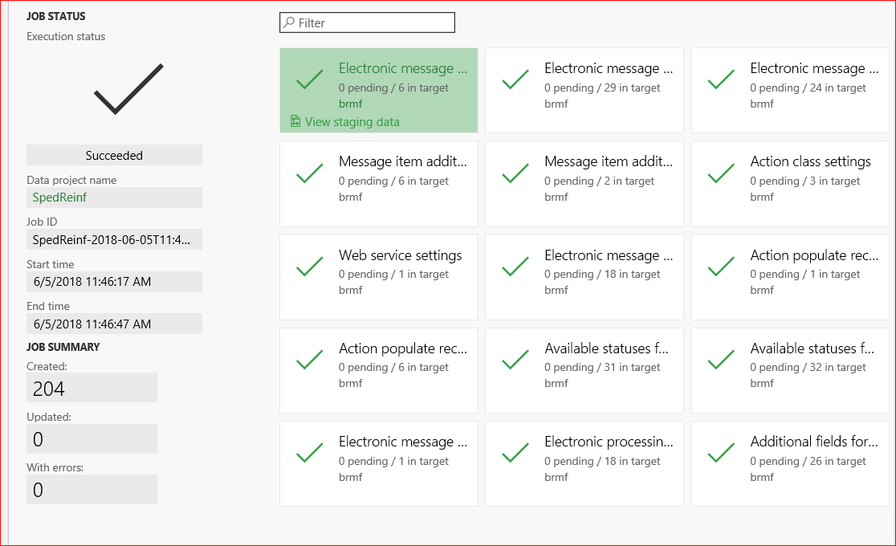

## Structure of electronic messages

Every event that is created, delivered, and received is represented by a message and a message item.

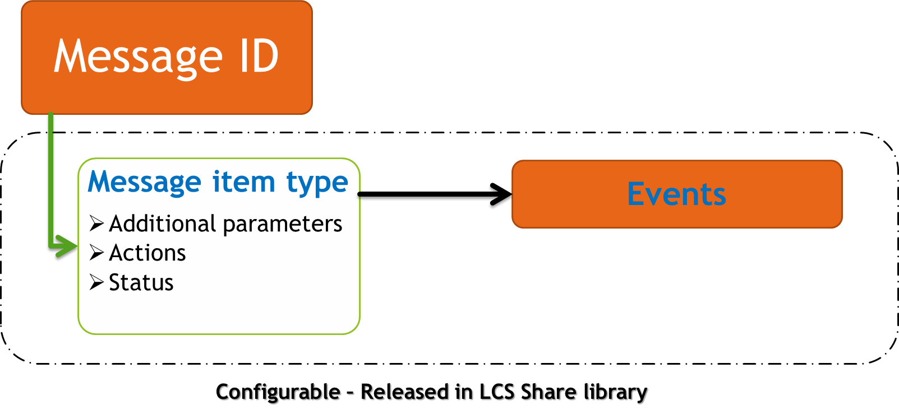

The message item is represented by the XML event message. It includes the following information that is stored in the message or updated in Finance:

- The full National Registry of Legal Entities (CNPJ) number of the fiscal establishment
- The root CNPJ
- The booking period
- The start date of the period that the message is valid for
- The receipt protocol number
- A value that indicates whether the message is registered in Dynamics 365

You can find this configuration on the **Additional fields** page (**Tax** \> **Setup** \> **Electronic messages** \> **Additional fields**).

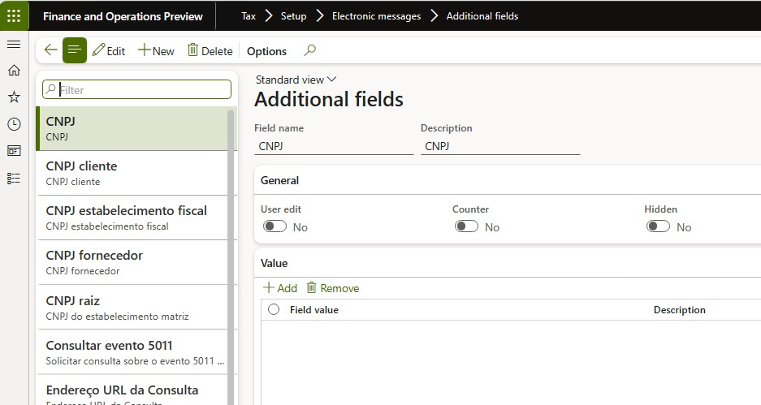

> [!NOTE]
> Don't remove this configuration. This configuration is included in the package.

The message item types are classified by the type of event on the **Message item types** page (**Tax** \> **Setup** \> **Electronic messages** \> **Message item types**).

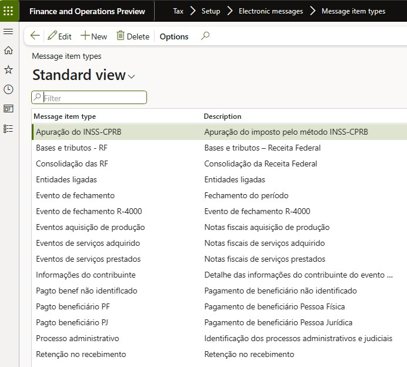

> [!NOTE]
> Don't remove this configuration. This configuration is included in the package.

- To set up the number sequence for message items, go to **Tax \> Setup \> Parameters \> General ledger parameters**, and then, on the **Number sequences** tab, select a number sequence for the **Message** and **Message item** references.

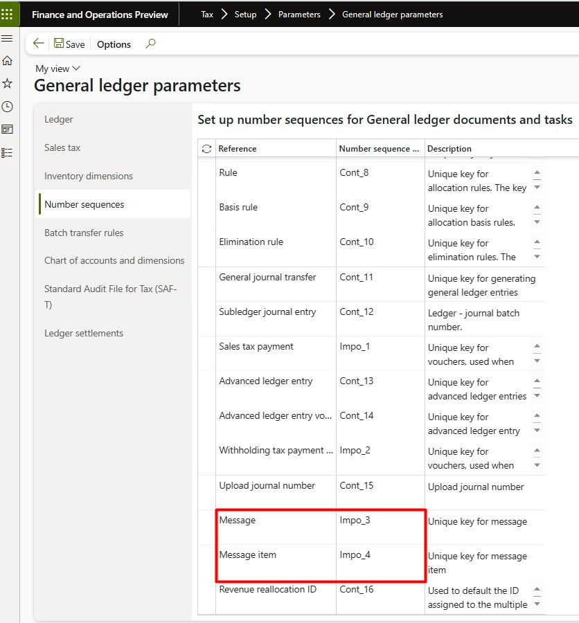

> [!NOTE]
> The number sequence must be defined as non-continuous.

## Certificates

Trusted certificates must be configured and used in Finance, because the SPED-Reinf should always be signed by an e-CNPJ certificate that is authorized by the Brazilian Public Key Infrastructure (ICP-Brasil), regardless of any other signatures. This e-CNPJ certificate should match the first eight digits of the root fiscal establishment's CNPJ number, because the report is issued by the root fiscal establishment and the related fiscal establishments.

In Finance, you must register the Key Vault certificate in Azure.

For information about how to set up a Key Vault client, see [Setting up Azure Key Vault Client](https://support.microsoft.com/help/4040305).

1. Go to **System administration** \> **Setup** \> **Key Vault parameters**.
2. Enter the following information:

    - Key Vault URL
    - Key Vault client
    - Key Vault secret key
    - Key Vault secret ID

After registration, associate the certificate in the setup parameters for the **Report generation** action, as described in the next section.

## Set up parameters 

Every time that a message is created, prepared, validated, delivered, or received, the related action must be identified through an X++ class on the **Executable class settings** page (**Tax** \> **Setup** \> **Electronic messages** \> **Executable class settings**).

- **Preparation items (Preparacao dos eventos)** – This action is used to create and prepare the XML message. The action requests more parameters, such as **Booking date**, **CNPJ**, and **CNPJ root**, because the events are generated based on this information.

    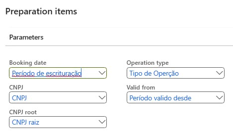

- **Process response (Processo de reposta)** – This action is used to update the delivered message when the government approves it by using a protocol number. Additionally, the message is updated as registered on the government website.

    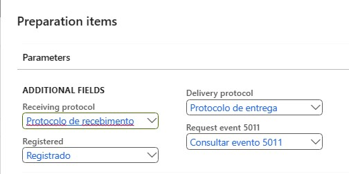

- **Report generation (Geracao de relatório)** – This action is used to send and receive the message item.

    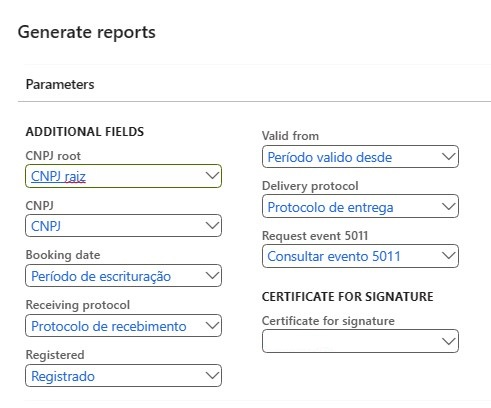

> [!NOTE]
> Don't remove this configuration. This configuration is included in the package.

## Specific actions

Before a message is delivered, set up XML schema validation to help prevent rejections from the government website.

1. Go to **Organization administration** \> **Document management** \> **Document management parameters**, and enable .xsd files by adding **XSD** as a new file type.

    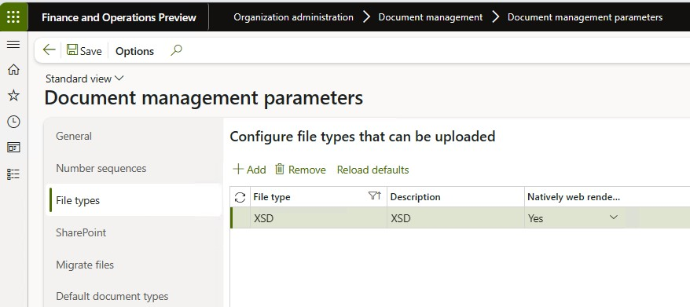

2. Go to **Tax** \> **Setup** \> **Electronic messages** \> **Message processing actions**, and select **New** \> **File** to attach the schemas (.xsd files) to the following actions:

    - Verify (Validar)
    - Re-Verify (Re-Validar)
    - Cancel-Verify (Exclusão-Validar)

3.  Click **on** the (Clips) icon to attach the SCHEMAS of the events (XSD) made available by the SPED-REINF.  
    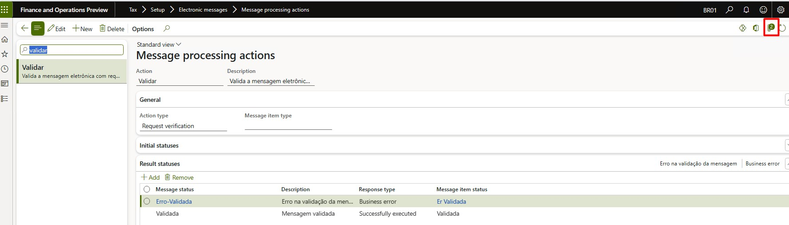

4.  New &gt; File &gt; Add all schemas.  
    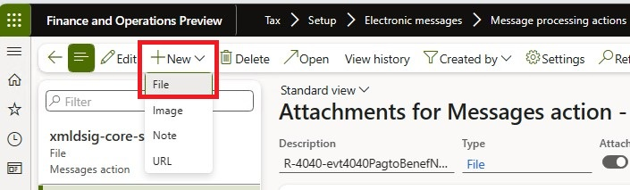

5. Go to **Tax** \> **Setup** \> **Electronic messages** \> **Message processing actions**, select the **Populate** (**Incluir**) action, and then, in the **Populate records action** field, select **Registrar transacões**.

    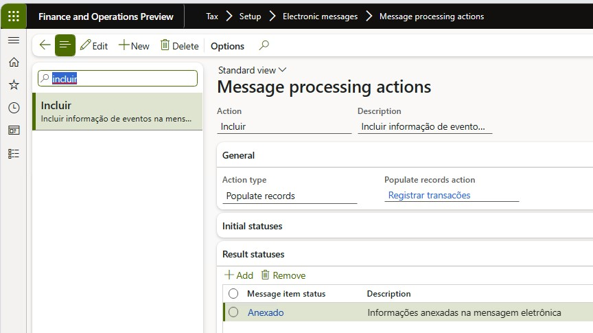

6. Go to **Tax** \> **Setup** \> **Electronic messages** \> **Web service settings**, and set up a web services connection and certificates for issuing and inquiring about events.

    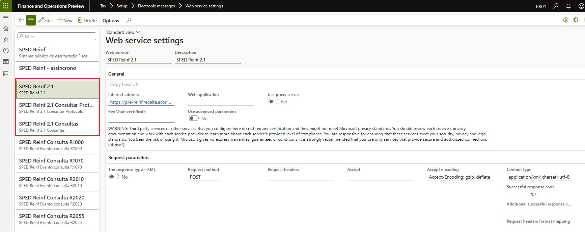
