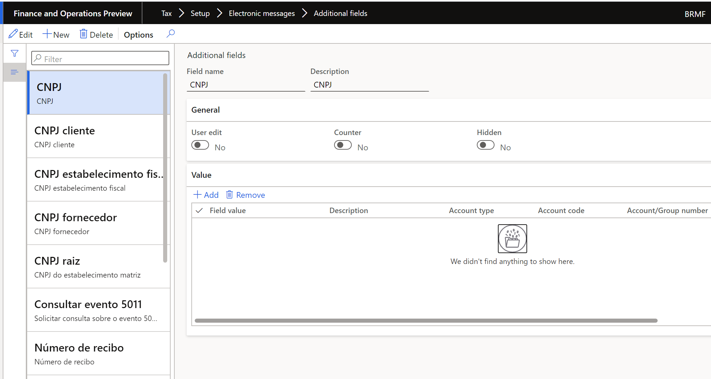
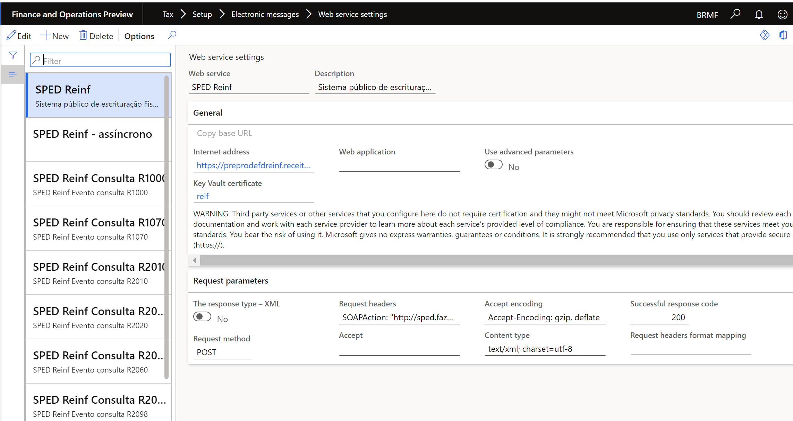

---
# required metadata

title: Set up electronic messages for SPED-Reinf events
description: This topic provides information about setting up electronic messages for SPED-Reinf events for Brazil.
author: sndray
manager: AnnBe
ms.date: 04/08/2021
ms.topic: article
ms.prod: 
ms.technology: 

# optional metadata

ms.search.form: 
# ROBOTS: 
audience: Application User
# ms.devlang: 
ms.reviewer: kfend
# ms.tgt_pltfrm: 
# ms.custom: 
# ms.assetid: 
ms.search.region: Brazil
# ms.search.industry: 
ms.author: sndray
ms.search.validFrom: 2016-11-30
ms.dyn365.ops.version: 8.1

---

# Set up electronic messages

Electronic messages functionality is new in Dynamics 365 Finance. It lets you maintain and track various processes for electronic messages when there is an exchange of information between Finance and tax authority web services.

Before you issue SPED-Reinf events to government website, use the predefined configuration that Microsoft has prepared to meet SPED-Reinf requirements. This configuration is delivered as a data entity. After it's imported into Dynamics 365 Finance, users will able to generate, validate, and deliver all events that are described in the SPED-Reinf scope.

## Import the configuration from the data entity

To set up Electronic messages functionality for SPED-Reinf event communications, use the predefined configuration that is available in LCS.

1.  Sign in to [Lifecycle Services](https://lcs.dynamics.com).
2.  Select **Shared asset library**, and on the **Data package** tab, select the SPED Reinf events communications data entities.
3.  Save the file in the location where data entities should be stored.
4.  Sign in to Finance and go to **Workspaces** > **Data management**, and select the **Import** tile.
5.  Enter a description and a name to identify the job, such as **SpedReinf**.
6.  In the **Source data format** field, select **Package**.
7.  Select **Upload**, and then select the file that you saved from LCS (**SPEDReinf_EMSettings.zip**).
8. Select **Save** and wait until all data entities are shown on the page.
9. Select **Import**.

	You will receive a notification about the import process. You can also manually refresh the page to see the progress of the import process. When the process is completed, you can view the **Execution summary** page.

	

## Structure of electronic messages

Every event that is created, delivered, and received is represented by a message and a message item.

   

The message item is represented by the XML event message, and includes the following information that is stored in the message or updated in Finance:

   - The CNPJ of the fiscal establishment (full number)
   - The root CNPJ
   - The booking period
   - The start date of the period that the message is valid for
   - The receipt protocol number
   - A value that indicates whether the message is registered in Microsoft Dynamics

You can find this configuration by going to **Tax** > **Setup** > **Electronic messages** > **Additional fields**.

   

> [!NOTE]
> Don't remove this configuration. This configuration is included in the package.

The message item types are classified by the type of event at **Tax** > **Setup** > **Electronic messages** > **Message item types**.

   

> [!NOTE]
> Don't remove this configuration. These types configuration are included in the package.

- Go to **Tax \> Setup \> Parameters \> General ledger parameters**, and on the **Number sequences** tab, select **Message** and **Message item** to set up the sequence number for message items.

   

> [!NOTE]
> The number sequence must be defined as non-continuous.

## Certificates

Trusted certificates must be configured and used by in Finance, because the SPED-Reinf should always be signed by an e-CNPJ certificate that is authorized by the ICP-Brazil entity, regardless of any other signatures. This e-CNPJ certificate should match the first eight digits of the root fiscal establishment's CNPJ, because the report is issued by the root fiscal establishment and the related fiscal establishments.

In Finance, register the Key Vault certificate in Microsoft Azure.

For information about how to set up a Key Vault client, see [Setting up Azure Key Vault Client](https://support.microsoft.com/help/4040305).

1. Go to **System administration** > **Setup** > **Key Vault parameters**.
2. Enter the following information:

	- Key Vault URL
	- Key Vault client
	- Key Vault secret key
	- Key vault secret ID

After registration, associate the certificate in the setup parameters for the **Report generation** action, as described in the next section.

## Set up parameters 

Every time a message is created, prepared, validated, delivered, or received, the related action must be identified through a X++ class at **Tax** > **Setup** > **Electronic messages** > **Executable class settings**.

- **Preparation items (Preparacao dos eventos)**: This action is used to create and prepare the XML message. The action requests additional parameters, such as **Booking date**, **CNPJ**, and **CNPJ root**, because the events are generated based on this information.

	

- **Process response (Processo de reposta)**: This action is used to update the delivered message when it's approved by the government by using a protocol number. Additionally, the message is updated as registered on the government website.

	

- **Report generation (Geracao de relatório)**: This action is used to send and receive the message item.

	

> [!NOTE]
> Don't remove this configuration. This configuration is included in the package.

## Specific actions

Before a message is delivered, set up XML schema validation to prevent rejections from the government website.

1. Go to **Organization administration** > **Document management** > **Document management parameters**, and enable XSD files by adding **XSD** as a new file
type.

   

2. Go to **Tax** > **Setup** > **Electronic messages** > **Message processing actions**, and select **New** > **File** to attach the schemas (.xsd files) to the following
actions:

   - Verify (Validar)
   - Re-Verify (Re-Validar)
   - Cancel-Verify (Exclusão-Validar)

3. Go to **Tax** > **Setup** > **Electronic messages** > **Message processing actions**, select the **Populate** (**Incluir**) action, and then, in the **Populate records action** field, select **Registrar transacões**.

   

4. Go to **Tax** > **Setup** > **Electronic messages** > **Web service settings**, and set up a web services connection and certificates for issuing and inquiring about events.

   

> [!NOTE]
> In the settings for **SPED Reinf asynchronous (SPED Reinf – assíncrono)**, include the web service address for inquire event R-5011.
