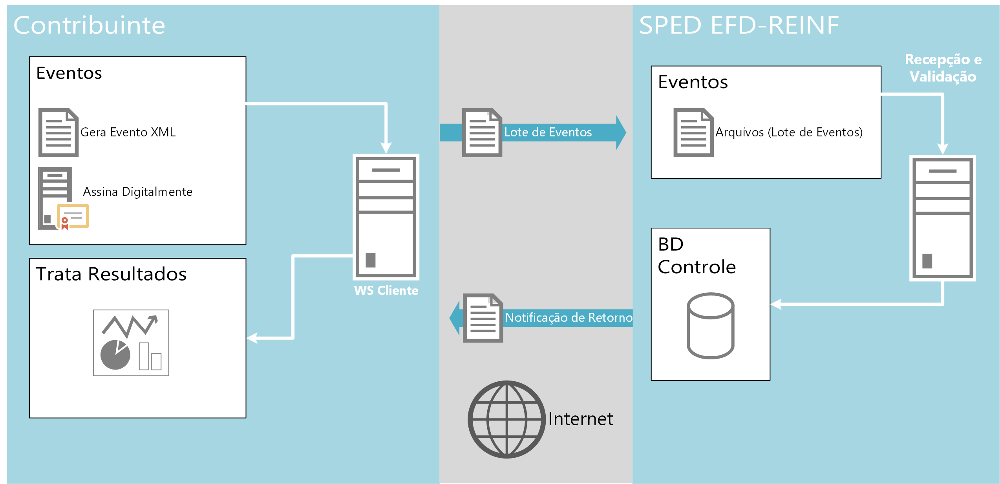
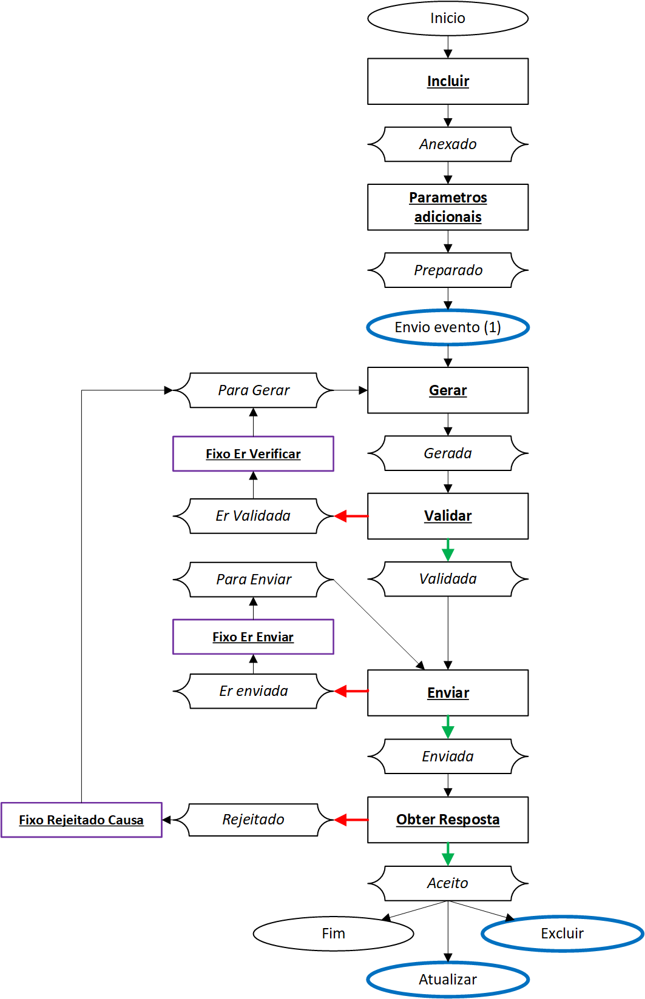
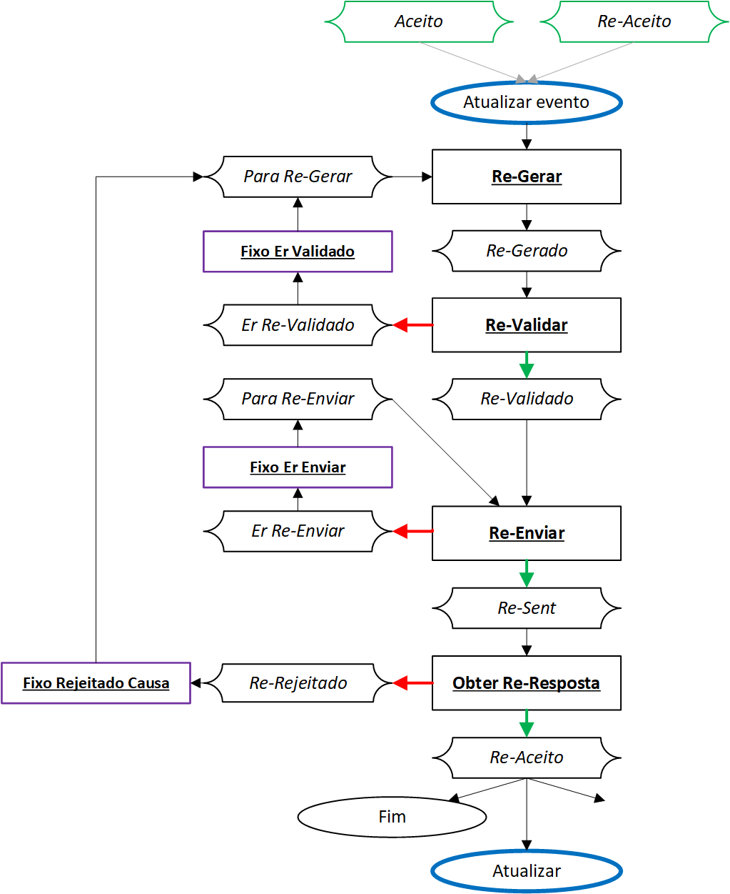
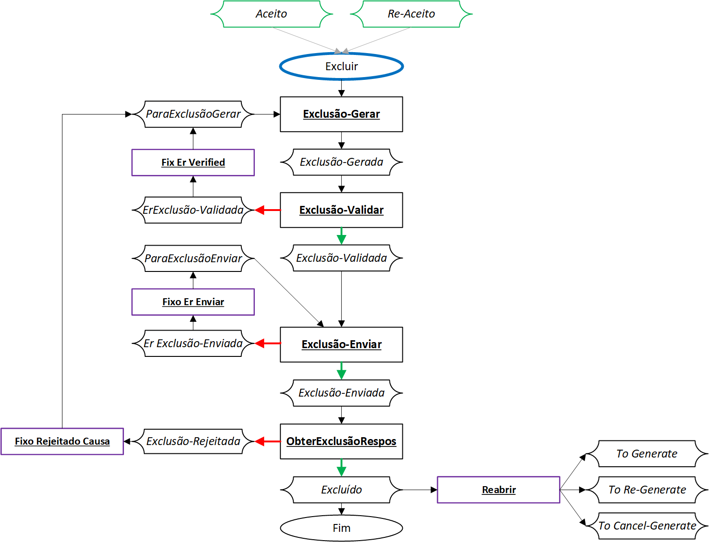
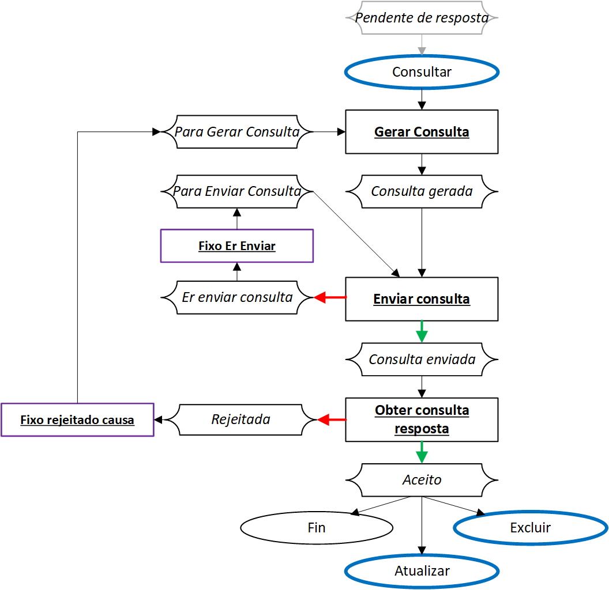
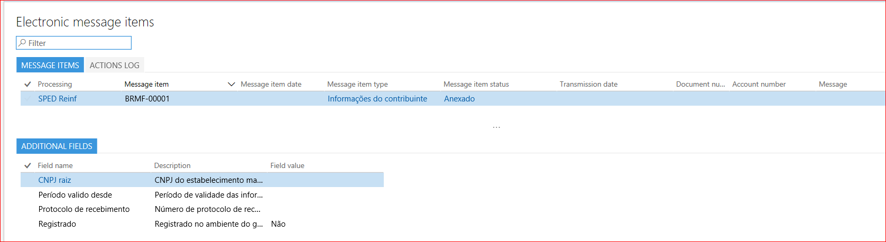
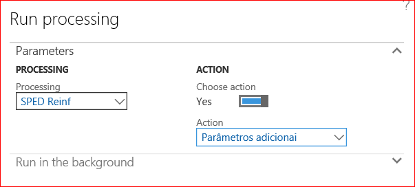
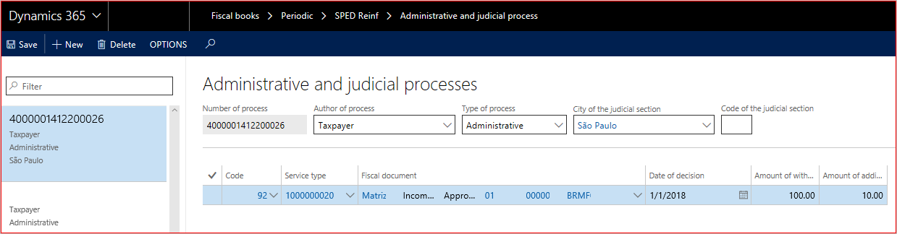
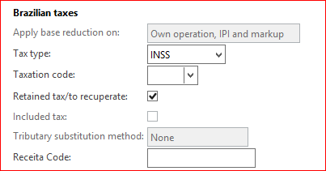

# SPED Reinf events process

Essentially, this process includes the following steps:

1.  Use an electronic message to create, validate, and deliver the event or batch of events through electronic message items.

2.  The tax authority web service receives the batch and validates its contents.

3.  The web service returns the result of processing. If the events or batch of events is successfully received, a receiving protocol is returned. Otherwise, an error message is returned. In that case, the taxpayer can resolve the errors and resubmit the event through a new batch.

The events are transmitted to tax authorities by using Electronic messages functionality to establish a two-way, automated, and instantaneous relationship between the government web services and the taxpayer.

The following illustrations show the actions that are performed and the status of message items that causes each event to be approved or rejected when it's delivered for the first time (Insertion), updated (Amendment/Update), or canceled or deleted (Cancel/Delete).

## Actions

### Insertion

This flow is used to deliver any event for the first time.

### Amendment/Update

### Cancel/Delete

### Inquire event 5011 (from event R-2099)

## Manage electronic messages 

All events are managed and controlled at **Tax \> Inquiries and reports \> Electronic messages \> Electronic message items**.

| Field name      | Field description                                                                                                                                         |
|---------------------|---------------------------------------------------------------------------------------------------------------------------------------------------------------|
| Message item type   | The type of event:                                                                                                                                            |
| Message item status | The current status of the event. This field is automatically filled in and updated, based on the exchange of messages between the tax authority and taxpayer. |

-   Administrative and judicial process (R-1070)

-   Acquired services (R-2010)

-   INSS-CPRB assessment (R-2060)

-   Provided services (R-2020)

-   Taxpayer information (R-1000

-   Closing (R-2099)

-   **Created** – The event was added to the register but hasn't yet been sent to the web services.

-   **Rejected** – The event was sent to the web services, but it was rejected by the tax authority system. A specific tag group in the XML file that is returned by the government specifies the error code and provides a description.

-   **Accepted** – The event was sent to the web services and was accepted by the tax authority system.

-   **Accepted with errors** – The event was sent to the web services and was accepted by the tax authority system, even though there were errors.

## Event R-1000, "Taxpayer information"

Event R-1000 is used to delivery information about the company. This event must be delivered only one time to register the information on the government site. However, after this initial registration of information, it can be delivered as many times as required for maintenance actions such as updates and deletions of data.

Therefore, whenever any taxpayer attribute or the valid date of information that was provided earlier must be changed, event R-1000 must be delivered again. When it's redelivered, the correct group of tags for the desired action must be specified.

Because communications can fail for technical reasons, such as a time-out or an internet shortage, the tax accountant must be able to resubmit the event. Additionally, because validation of the file by the web service can fail, the tax accountant must be able to view the details and fix the related errors. After the file is validated, the receiving protocol that is returned by the web service must be saved, and the tax accountant must be able to view its details, such as the number and time stamp.

### Repro step – Insertion

1.  Go to **Tax \> Inquiries and reports \> Electronic messages \> Electronic message items**.

2.  On the Action Pane, select **Run processing**. Then, in the **Run processing** dialog box, in the **Processing** field select **SPED Reinf**.

3.  Set the **Choose action** option to **Yes**, and then, in the **Action** field, select **Incluir**.

    

4.  Select **OK** to confirm the settings.

	A message item of **Informações do contribuinte** type is created, and the status of the message item is set to **Anexado**.

	

5.  Select **Run processing** again, and then, in the dialog box, in the **Processing** field, select **SPED Reinf**.

6.  Set the **Choose action** option to **Yes**, and then, in the **Action** field, select **Parâmetros adicionais** to update the related information in additional fields.

	

	

7.  Select **OK** to confirm the settings. The message item of **Informações do contribuinte** type is updated, and the status of the message item is changed to **Preparado**.

	

8.  Select **Run processing** again, and then, in the dialog box, in the **Processing** field, select **SPED Reinf**.

9.  Set the **Choose action** option to **Yes**, and then, in the **Action** field, select **Gerar** to generate the XML.

10.  Select **OK** to confirm the settings. The **Generate reports** dialog box automatically appears. On the **Records to include** FastTab, in the filter options, the ID of the message item type that is requesting generation of an XML file is selected in the **Message item** field.

	 

11.  Select **OK** to confirm the settings. The message item of the **Informações do contribuinte** type is updated, and the status of the message item is changed to **Gerado**.

12.  Repeat these steps until you've complete all the actions in the [Insertion](#insertion) flow.

### Repro step – Amendment 

If any data of the fiscal organization has been changed, or if the event must be excluded for some reason, event R-1010 must be transmitted again, but the status must be different.

Use the same process that is described in the "Repro step – Insertion" section, and complete all the actions in the [Amendment/Update](#amendmentupdate) flow.

Microsoft Dynamics AX will detect any differences between the information in the last event and the current information.

> [!NOTE]
> If changes don't affect the related R-1010 event, you will receive the following message: "0 records have been added."

### Repro step – Cancel

If for some many reason, the taxpayer wants to cancel/exclude an event that has accepted, select **Cancel**, and confirm the operation. The status of the event will be updated to **Excluded**. Complete all the actions in the [Cancel/Delete](#canceldelete) flow.

## Event R-1070, "Administrative and judicial process"

Event R-1070 is used to report information about the administrative and lawsuits process to tax authority system.

The administrative and lawsuits process can be started by either the taxpayer or by the worker when the amounts in the social security are disputed. The proceedings (either judicial or administrative) are carried out by the court. After the judge reaches a final decision, they have the power to suspend (or not) the amounts that were retained.

The purpose of this event is to communicate the existence of proceedings of this type to the SPED-Reinf database. After the proceedings have a final court decision that suspends the eligibility of withholding amounts, the event refers to that decision to explain why the amounts have been reported as suspended in the periodic events.

Besides the typical information that identifies the taxpayer and the event, event R-1070 contains the following groups:

-   Identifier of the process or proceedings

-   Suspension information

-   Complementary information about the proceedings

Before event R-1070 can be delivered, you must create the related process and
include all related information.

### Repro step – Create process

1.  Go to **Fiscal books \> Periodic \> SPED Reinf \> Administrative and judicial process**.

	

1.  Select **New**, and set the following fields.

	| **Field**                    | **Description**        |
	|------------------------------|-----------------------|
	| Number of the process        | Enter the process number that was assigned by the competent authorities. The tax authority system validates the format, because there is a specific rule to consider. |
	| Author of process            | Select the source that the process originated from:                                                                                                                   |
	| Type of process              | Select the type of process:                                                                                                                                           |
	| City of the judicial section | Select the related city where the process originated.                                                                                                                 |
	| Code of the judicial section | Enter the code for the judicial section.                                                                                                                              |

	-   Taxpayer

	-   Other third party

	-   Administrative

	-   Judicial

1.  In the **Details** section, enter details of the fiscal documents that are registered in Microsoft Dynamics, and that are affected by the registered process, because some of them might have exceptions in withholding taxes. You can add fiscal documents or remove fiscal documents that were previously added.

	| **Field**                        | **Description**                                                                                           |
	|----------------------------------|-----------------------------------------------------------------------------------------------------------|
	| Reference                        | The unique identifier of the relation between the process number and the fiscal document.                 |
	| Code                             | Select the explanation suspension code.                                                                   |
	| Service type                     | Select the related service type that is applicable for the fiscal document.                               |
	| Fiscal document                  | Select the fiscal document.                                                                               |
	| Date of decision                 | The date of the decision, sentence, or administrative dispatch.                                           |
	| Amount of withholding            | The amount of withholding that was suspended because of an administrative or lawsuits process.            |
	| Amount of additional withholding | The additional amount of withholding that was suspended because of an administrative or lawsuits process. |

	> [!NOTE]
	> Follow the steps that are described for event R-1000 to insert, update, or cancel the related event.

## Event R-2010, "Acquired services"

Periodic event R-2010 is used to report, to the tax authority system, information about the withholding amounts for social security that are present in service fiscal documents that were received by the fiscal establishment. This event has no other purpose but to report those fiscal documents to the government.

This event must be sent until the fifteenth day of the next month. Because it's a periodic event, we don't recommend that you send the event just one time, near the due date. Instead, you should send it regularly and frequently during the period.

Additionally, generation of this event requires the adoption of new semantics for handling events in fiscal books. The new semantics are decoupled from a tax assessment but are still in the context of the booking period. After every fiscal document in the **Fiscal books** module is in the context of a booking period, event R-2010 must also be generated by booking period.

Only service and retained INSS tax type must be selected to generate this event in the booking period.

**Main criteria**

-   The fiscal documents are booked and synced in the related period and fiscal establishment.

-   The fiscal documents have a status of **Approved** or **Canceled**.

-   The fiscal document model is **SE**.

-   The tax type is **INSS**, and it's retained (the **Retained tax/to recuperate** check box is selected).

> [!NOTE]
> Never use the **INSS-CPRB** tax type.

The report is grouped by a **Type of service code** value (table 06 from the SPED-Reinf documentation). Therefore, you must modify the posting of service fiscal documents to enable the capture of this information. Otherwise, the event can't be generated.

The event sends four types of amounts to the government database:

-   **Withholding** – The calculated retained INSS tax type that is linked to the fiscal document line.

-   **Additional withholding** – A variation of the INSS tax type that is linked to the fiscal document line.

-   **Suspended withholding** – The amount of the suspended retained INSS tax type.

-   **Suspended additional withholding** – The suspended amount on the variation of the INSS tax type that is linked to the fiscal document line.

Whenever a suspension of amounts occurs, the associated administrative or lawsuits process must be specified in the event to support (or explain) the reasons for the suspension. This information must be manually entered in the **Amount of withholding** and **Additional amount of withholding** fields on the **Administration and judicial process** page that is described in the previous section.

Event R-2010 uses the concept of closing. After this event is closed, the web service will refuse any new entries or modifications for it, unless it's manually reopened.

> [!NOTE]
> Follow the steps that are described for event R-1000 to insert, update, or cancel the related event.

## Event R-2020, "Provided services"

Periodic event R-2020 is used to report, to the tax authority system, information about the withholdings amounts for social security that are present in service fiscal documents that were issued by the fiscal establishments of a fiscal organization.

This event works like event R-2010, but you must consider customer accounts and fiscal document model SE (outgoing) that is issued by the fiscal establishment.

> [!NOTE]
> Follow the steps that are described for event R-1000 to insert, update, or cancel the related event.

## Event R-2055, "Acquisition from agriculture vendor"

Periodic event R-2055 is used to report, to the tax authority system, information about the withholding amounts for social security, SENAR and GILRAT that are present in fiscal documents that were received by the fiscal establishment in relation of agriculture products. This event has no other purpose but to report those fiscal documents to the government.

This event must be sent until the fifteenth day of the next month. Because it's a periodic event, we don't recommend that you send the event just one time, near the due date. Instead, you should send it regularly and frequently during the period.

Additionally, generation of this event requires the adoption of new semantics for handling events in fiscal books. The new semantics are decoupled from a tax assessment but are still in the context of the booking period. After every fiscal document in the Fiscal books module is in the context of a booking period, event R-2055 must also be generated by booking period in **Fiscal books > Booking period > SPED Reinf > R-2055**

**Main criteria**

The fiscal documents are booked and synced in the related period and fiscal establishment.

The fiscal documents have a status of Approved or Canceled.

The fiscal document model 04 or 55 (Series number between 920 to 969) 

The tax type is INSS, and it's retained (the Retained tax/to recuperate check box is selected) and tax type is Other

## Event R-2060, "INSS CPRB"

Periodic event R-2060 is used to send information about the tax assessment of the withholding for social security to the SPED-Reinf when the fiscal organization has chosen to calculate the social security based on the gross revenue instead of the payroll.

Therefore, before you generate the event, you must do the tax assessment by fiscal organization in the **Fiscal books** module. When this option is established in the SPED-Reinf parameters, users can create the tax assessment for INSS-CPRB, and taxes are automatically calculated based on the criteria that are defined in the Fiscal books parameters.

Microsoft Dynamics will pick up all fiscal documents that are booked in the related period and that represents revenue, and it will apply the tax rate to the base amount. The tax rate that is applied can vary, depending on the product or service that generated the revenue. The result will be the amount of CPRB.

For this purpose, a new Brazilian tax type, **INSS-CPRB**, was created. This tax type is used only in the generation of the INSS-CPRB tax assessment.

> [!NOTE]
> Don't use the **INSS-CPRB** tax type for other purposes.

Because the INSS-CPRB tax assessment is a type of tax assessment, adjustments might become necessary. These adjustments must be manually entered as either additions or reductions.

Finally, the tax assessment and the adjustments determine the amount of CPRB that must be paid. However, generation of the payment journal and registration on this payment isn't in the scope of this feature.

Periods for this new tax assessment must be managed in the same way as other tax assessments. In other words, the tax assessment can be created or updated only while it's open. After it's finalized, it can no longer be touched unless it's reopened.

After the tax assessment is created and any required adjustments are made, periodic event R-2060 can be generated.

Event R-2060 includes the totals of the tax assessment and details of the tax calculations by economic activity code, adjustments (additions and reductions, when applicable), and references to administrative and lawsuits processes.

### Repro step – Setup

1.  Go to **Fiscal books \> Setup \> Fiscal organization**.

2.  Set the **CPRB** option to **Yes** to enable creation of the INSS-CPRB assessment and transmission of event R-2060.

3.  Go to **Fiscal books \> Setup \> Sped Reinf \> Economic activity codes**. Economic activity codes must be configured to enable automatic calculation of INSS-CPRB tax amounts, because the fiscal document has no related information about this tax. This approach was implemented to facilitate the configuration of the tax matrix.

4.  Select **New** to create an economic activity code, and enter a description. You must check the Sped REINF Table 09 on the tax authority website.

5.  Select the tax code that contains the tax rate to apply for the product or service. You must create a Retained INSS tax type.

6.  On the **Line** tab, enter the products or services that are related by the economic activity. Products are identified by the fiscal classification code and services are identified by the service code (federal).

### Repro step – Create tax assessment (option 1)

1.  Go to **Fiscal books \> Common \> Booking period**.

2.  Select a booking period.

3.  On the Action Pane, select **INSS-CPRN**, and then select **New** to create a tax assessment. Microsoft Dynamics automatically creates the tax assessment for the selected booking period.

### Repro step – Create tax assessment (option 2)

1.  Go to **Fiscal books \> Common \> Tax assessment \> INSS-CPRB**, and then select **INSS-CPRB tax assessment**.

2.  Select the booking period, and then select **OK**.

> [!NOTE]
> You might receive the following warning: "Line XXXX: unable to identify the economic activity code." This warning indicates that Microsoft Dynamics didn't find the economic activity code for the related fiscal document and line. In this case, you must complete the setup that is described in the previous repro step.

**Delete**

You can delete an existing INSS-CPRB tax assessment if the status is **Opened**.

**Fiscal documents and Non-fiscal operations**

When INSS-CPRB taxes are assessed, the taxable amount of the fiscal document is considered and classified during the assessment process. You can view the related fiscal documents and non-fiscal operations that are part of the tax calculation.

**Tax transactions**

When INSS-CPRB taxes are assessed, you can view the tax transactions details that are generated by the process.

**Adjustment**

You can enter additional adjustment transactions to adjust (increase or decrease) the amount of INSS-CPRB that is calculated. You configure the adjustment codes at **Fiscal books \> Setup \> Tax adjustment codes \> INSS-CPRB adjustments codes table**.

1.  Select **Adjustment** to add an adjustment transaction that will decrease or increase the tax amount (debit) that is calculated.

2.  Select the adjustment code.

3.  Enter a description of the related transaction.

4.  Specify the adjustment amount and the economic activity.

5.  Specify the adjustment date.

	> [!NOTE]
	> Adjustments for INSS-CPRB are available only through this procedure. This type of adjustment isn't available at **Fiscal books \> Journals \> General tax adjustment/benefit/incentive**.

**Finalize and Reopen**

You can finalize or reopen the related INSS-CPRB tax assessment.

When an INSS-CPRB tax assessment is finalized, no modifications to the tax assessment are allowed for that period, unless the tax assessment is reopened. A voucher is created to post the INSS-CPRB tax to collect, and the ledger accounts are defined in the ledger posting for INSS tax at **Tax \> Setup \> Sales tax \> Ledger posting groups**.

> [!NOTE]
> In the current SPED-Reinf architecture that is defined by the government, the process for payment and settlement of the liability that is created by the tax assessment will be reported to another system that is named DCTF web. This system consumes the output from not only the SPED-Reinf but also the other systems, such as eSocial and PER/DCOMP. Therefore, the payment process is currently out of scope and is delivered through another Microsoft Dynamics feature.

The reopen action is available if event R-2060 has already been closed for the root fiscal establishment, and if the tax assessment is already finalized. The reopen action reverses the previous voucher that was generated by the closing action.

> [!NOTE]
> Follow the steps that are described for event R-1000 to insert, update, or cancel the related event.

## Events R-2090, "Closing," and R-2098, "Reopen"

**Closing**

Periodic events R-2010, R-2010, and R-2060 must be closed at the end of a period, when there are no more transactions to report in that period.

### Repro step

1.  Finalize the INSS-CPRB tax assessment, even if you don't assess INSS-CPRB tax.

2.  Follow the steps that are described for event R-1000 to insert, update, or cancel the related event.

**Reopen**

After periodic events R-2010, R-2010, and R-2060 are closed through an event R-2099, they can be reopened through an event R-2098. You can then report new transactions or modify existing transactions for the period.

### Repro step

1.  Reopen the INSS-CPRB tax assessment, even if you don't assess INSS-CPRB tax.

2.  Follow the steps that are described for event R-1000 to insert, update, or cancel the related event.

**Inquire event 5011**

1.  After R-2090 is delivered to the government and its status is updated to **Pending Response** (**Pendente resposta**), select **Run processing**, and then select **SPED Reinf**.

2.  Set the **Choose action** option to be **Enable** and select the action **Gerar** to generate the XML message.

3.  Select **OK** to confirm the action.

4.  After the message item is created, the **Evento de fechamento** message item type is updated, and the status of the message item is updated to **Consulta Gerada**.

5.  Select **Run processing**, and then select **SPED Reinf** again.

6.  Set the **Choose action** option to be **Enable** and select the action **Enviar consulta** to deliver the related inquiry to the tax authorities.

7.  Select **OK** to confirm the action.

8.  The **Evento de fechamento** message item type is updated, and the status of the message item is updated to **Consulta Enviada**.

9.  Select **Run processing**, and then select **SPED Reinf** again.

10. Set the **Choose action** option to be **Enable** and select the action **Obter consulta resposta** to get the approval from the tax authority and the final protocol number, so that you can close the SPED-Reinf period.

11. Select **OK** to confirm the action.

12. The **Evento de fechamento** message item type is updated, and the status of the message item is updated to **Aceito**.

[!INCLUDE[footer-include](../../includes/footer-banner.md)]
