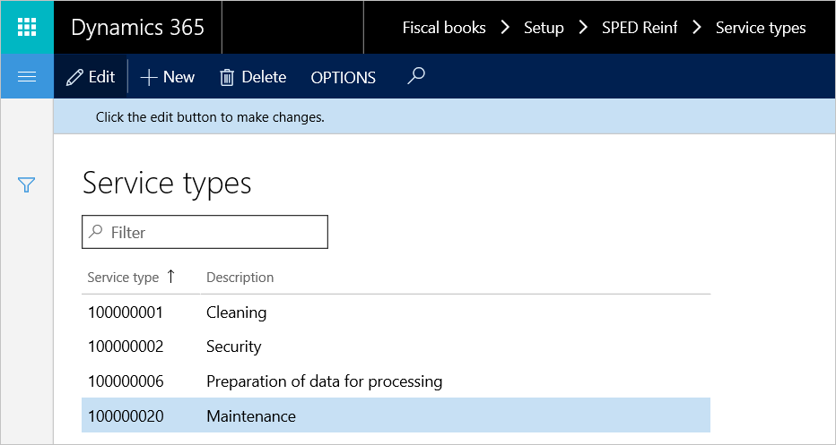
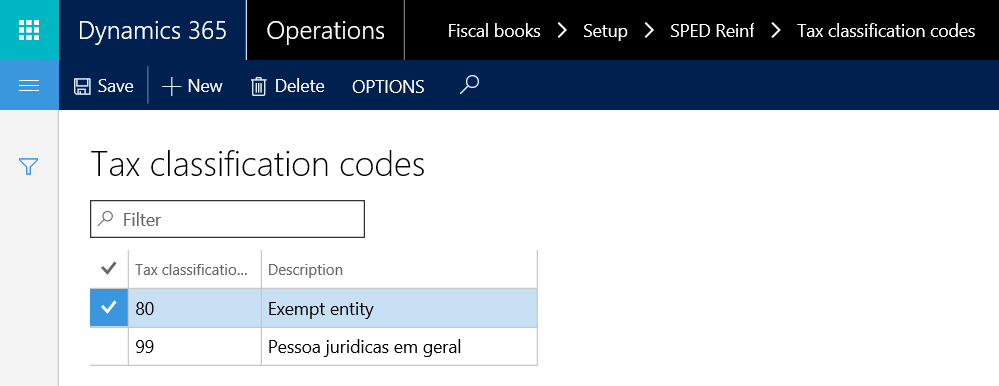
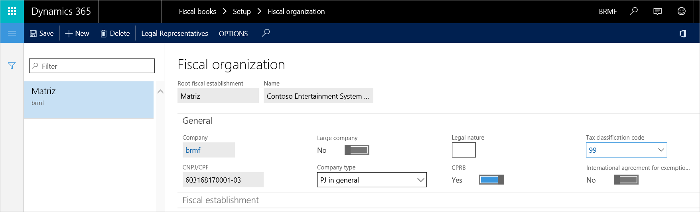
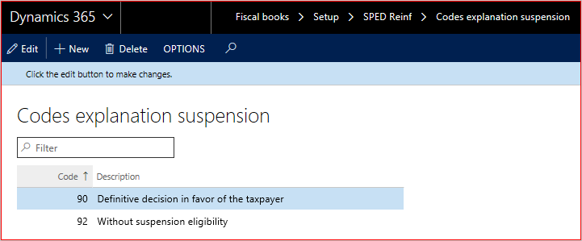

---
# required metadata

title: Set up fiscal books
description: This topic explains how to set up SPED-Reinf events using Fiscal books in Microsoft Dynamics 365 Finance for Brazil.
author: sndray
manager: AnnBe
ms.date: 04/09/2021
ms.topic: article
ms.prod: 
ms.technology: 

# optional metadata

ms.search.form: 
# ROBOTS: 
audience: Application User
# ms.devlang: 
ms.reviewer: kfend
# ms.tgt_pltfrm: 
# ms.custom: 
# ms.assetid: 
ms.search.region: Brazil
# ms.search.industry: 
ms.author: sndray
ms.search.validFrom: 2016-11-30
ms.dyn365.ops.version: 8.1

---

# Set up fiscal books

This topic describes how to set up the **Fiscal books** module to generate and issue events to the tax authorities. 

## Set up service types

The service type table represents table 06 that the tax authorities have established to classify the services that are provided, based on assignment of labor. A detailed list of available values is available on the SPED website.

1. Go to **Fiscal books** > **Setup** > **SPED Reinf** > **Service types**.
2. Select **New**, enter a classification code that has been established by the tax authorities, and enter a description.

	

3. After the list of service types is created, the service types must be assigned to service codes. Go to **Inventory management** > **Setup** > **Fiscal information** > **Service code**, and then, for each service, assign the related service type.

## Set up tax classification codes

- Go to **Fiscal books** > **Setup** > **SPED Reinf** > **Tax classification codes** and enter the available classification types.

     

This information is assigned to the fiscal organization on the **Fiscal organization** page on the **General** FastTab (**Fiscal books \> Setup \> Fiscal organization**).

   

## Set up codes explanation suspension

1. Go to **Fiscal books** > **Setup** > **SPED Reinf** > **Codes explanation suspension**.
2. Set up the codes that are used in event R-1070 when suspension of withholding applies. These codes are assigned on the **Administrative and judicial process** page (**Fiscal books** > **Periodic** > **SPED Reinf** > **Administrative and judicial process**).

	

## Set up acquisition type determination

This setup is used to determine the agriculture acquisition type of incoming fiscal documents that are reported in the **indAquis** tag for the event R-2055. 

- Go to **Fiscal books** > **Setup** > **SPED Reinf** > **Acquisition of rural production** to determine the classification of fiscal documents based on the following criteria:

	- **Vendor account**: All, group, or table
	- **CFOP** : All, group, or table
	- **Fiscal classification**

## GILRAT and SENAR taxes

Go to **Fiscal books** > **Setup** > **SPED Reinf** > **GILRAT tax codes** or **SENAR tax codes** to identify which sales tax codes are used to represent these taxes. The sales tax code should be defined as tax type = **Other**. The amount of these taxes are used in the event R-2055 in the tags, **vlrRatDescPR** and **vlrSenarDesc**.

## Vendor setup

- Go to **Accounts payable** > **Vendors** > **All vendors** > **Fiscal information** > **SPED Reinf** > **Reinf taxation over payroll**. This new attribute is included to determine the type of taxation because this information is required in event R-2055 in tag **indOpcCP**.

## Set up fiscal books parameters

- Go to **Fiscal books** > **Setup** > **Fiscal books parameters**, and set up the number sequence for events R-2010 and R-2020.

	

> [!NOTE]
> If the number sequences weren't initialized during the setup checklist for KB installation, you can generate them by using a wizard. To start the wizard, go to **Organization administration** > **Number sequences** > **Number sequences**, and select **Generate**. You will then be able to configure the related number sequence.

-   **Area:** Fiscal books
-   **Reference:** SPED-Reinf event ID

