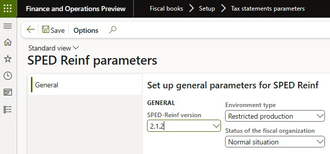

# Set up fiscal books

This article explains how to set up the **Fiscal books** module to generate and issue events to the tax authorities. 

## Set up service types

The service type table represents table 06. The tax authorities have established this table to classify the services that are provided, based on the assignment of labor. A detailed list of available values is available on the public digital bookkeeping system (SPED) website.

1. Go to **Fiscal books** \> **Setup** \> **SPED Reinf** \> **Service types**.
2. Select **New**.
3. Enter a classification code that has been established by the tax authorities, and then enter a description.

    

4. After the list of service types is created, the service types must be assigned to service codes. Go to **Inventory management** \> **Setup** \> **Fiscal information** \> **Service code**, and then, for each service, assign the related service type.

## Income classification setup

After you create the list of service types, assign them to service codes and includ the yield Income code provided in the SPED REINF manual released by the Tax Authority.

1. Go to **Inventory management** \> **Setup** \> **Fiscal information** \> **Service code**
2. For each service, assign the related service type and income code.
 
     

## Set up tax classification codes

1. Go to **Fiscal books** \> **Setup** \> **SPED Reinf** \> **Tax classification codes**.
2. Enter the available classification types.

This information is assigned to the fiscal organization and can be found on the **General** FastTab of the **Fiscal organization** page (**Fiscal books \> Setup \> Fiscal organization**).

## Set up codes explanation suspension

1. Go to **Fiscal books** \> **Setup** \> **SPED Reinf** \> **Codes explanation suspension**.
2. Set up the codes that are used in event R-1070 when suspension of withholding applies. These codes are assigned on the **Administrative and judicial process** page (**Fiscal books** \> **Periodic** \> **SPED Reinf** \> **Administrative and judicial process**).

## Set up acquisition type determination

This setup is used to determine the agriculture acquisition type of incoming fiscal documents that are reported in the **indAquis** tag for event R-2055. 

1. Go to **Fiscal books** \> **Setup** \> **SPED Reinf** \> **Acquisition of rural production**.
2. Define the classification of fiscal documents, based on the following criteria:

    - **Vendor account:** All, group, or table
    - **CFOP:** All, group, or table
    - **Fiscal classification**

## Set up GILRAT and SENAR taxes

**GILRAT**: The tax contribution of the degree of incidence of Labor disability resulting from occupational environmental risks.
**SENAR**: The tax contribution related to rural production.

1. Go to **Fiscal books** \> **Setup** \> **SPED Reinf** \> **GILRAT tax codes** or **SENAR tax codes**.
2. Identify the sales tax codes that are used to represent GILRAT and SENAR taxes. In the definition of the sales tax codes, the tax type should be set to **Other**. The amount of these taxes is used in the **vlrRatDescPR** and **vlrSenarDesc** tags for event R-2055.

## Fiscal books parameters Setup

1.  Go to **Fiscal books** \> **Tax statements parameters** \> **SPED REINF** \> **SPED REINF parameters**.
2.  On the **General** tab, select **SPED REINF version**

    

3.  Select the environment type and the status of the fiscal organization.
4.  Go to **Fiscal books** \> **Setup** \> **Fiscal books parameters**.
5.  On the **Number sequences** tab, set up the number sequence for events.  

    

> [!NOTE] 
> If the number sequences weren't initialized during the setup checklist for KB installation, you can generate them by using a wizard. To open the wizard, go to **Organization administration** \> **Number sequences** \> **Number sequences**, and select **Generate**. Then configure the related number sequence:
>    - **Area**: Fiscal books
>    - **Reference**: SPED-REINF event ID

## Vendor Setup – Events R-2055,R-4010, R-4020 and R-4040

1. Go to **Accounts payable** \> **Vendors** \> **All vendors** and select a vendor.
2. On the **Fiscal information** tab, set up **REINF taxation over payroll**. This new attribute determines the type of taxation because this information is required in the **indOpcCP** tag for event R-2055.

## Event R-4010 Person Vendor Setup  

1.  Go to **Accounts payable** \> **Vendors** \> **All vendors**.
2.  In the **Type** field, select **Person**.  

    

## Event R-4020 Legal Entity Vendor Setup  

1.  Go to **Accounts payable** \> **Vendors** \> **All vendors**.
2.  In the **Type** field, select **Organization**.  

    

## Event R-4040 Unidentified Beneficiary Vendor

1.  Go to **Accounts payable** \> **Vendors** \> **All vendors**.
2.  In the **Type** field, select **Organization** or **Person**.
3.  Set the **Unidentified beneficiary** slider to **Yes**.  

    

## Event R-4080 Withholding tax on receipt (auto-withholding) Customer

In the customer registration, the **Withholding tax** field must be filled in with the provided information. After this information is configured, new invoices should be issued, and new events generated.

1.  Go to **Accounts receivable** \> **Customers** \> **All customers** \> **Select the Customer**.
2.  On the **Fiscal Information** tab, select **Withholding tax** \> **Customer contribution type** and then select one of the following options:

    - Federal government foundation or agency
    - Federal government administration
    - Legal entity
    - Cooperative
    - Machine or vehicle manufacturer
    - OTHER - This option isn't considered in the event

3. In the **Withholding tax** field, select a value.

    

## Vendor setup

- Go to **Accounts payable** \> **Vendors** \> **All vendors**.
- Select a vendor.
- On the **Fiscal information** tab, set up  **Reinf taxation over payroll**. This new attribute determines the type of taxation, because this information is required in the **indOpcCP** tag for event R-2055.

## Set up Fiscal books parameters

1. Go to **Fiscal books** > **Tax statements parameters** > **SPED Reinf** > **SPED Reinf parameters**.
2. On the **General** tab, select **SPED Reinf version**.
3. Select the environment type and the status of the fiscal organization.
4. Go to **Fiscal books** > **Setup** > **Fiscal books parameters**.
5. On the **Number sequences** tab, set up the number sequence for events R-2010, R-2020, and R-2055.

> [!NOTE]
> If the number sequences weren't initialized during the setup checklist for KB installation, you can generate them by using a wizard. To open the wizard, go to **Organization administration** \> **Number sequences** \> **Number sequences**, and select **Generate**. You can then configure the related number sequence:
>
> - **Area:** Fiscal books
> - **Reference:** SPED-Reinf event ID
