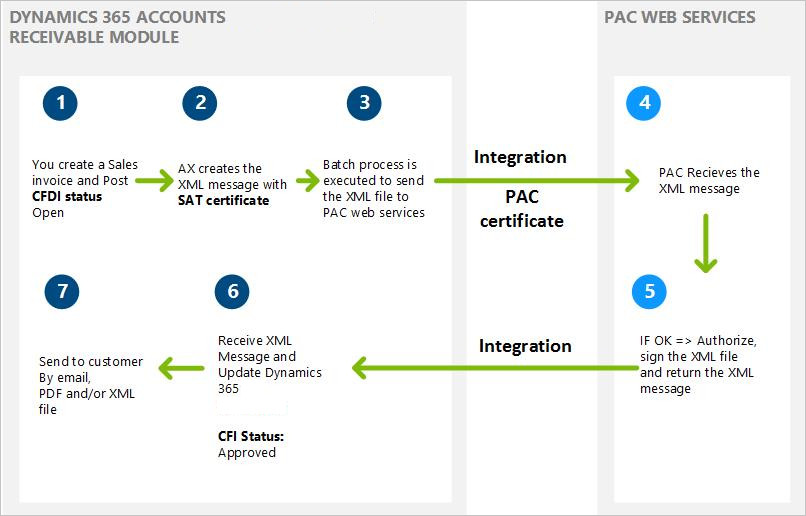

# Electronic invoices (CFDI)

[!include [banner](../includes/banner.md)]

Electronic billing in Mexico requires the Comprobantes fiscales digitales por internet (CFDI) format. 

This article provides information about the electronic invoices that your organization can submit to the Mexican tax authority (SAT). It describes the currently approved method for submitting electronic invoices (CFDI), the requirements for using them, and the information that they include.

An electronic invoice is a legally accepted digital tax receipt that your organization submits to the Mexican tax authority (Servicio de Administración Tributaria \[SAT\]). Dynamics 365 Finance helps guarantee that the electronic invoices that your organization generates are secure, confidential, authentic, and legally acceptable. You can also make sure that international standards are applied to your electronic invoices. You can generate an electronic invoice for the following documents when a transaction is posted:

-   Sales order
-   Free text invoice
-   Credit note
-   Return order
-   Project invoice
-   Project sales order

## Methods for generating electronic invoices
There are two methods for generating electronic invoices:

-   **Comprobantes fiscales digitales (CFD)** – Electronic invoices are generated by using Finance. The invoices are then verified and certified by using a government website. Finally, your organization submits the invoices to SAT. Although this method is now obsolete because of changes in the legislation, you can inquire about CFD transactions that were previously generated in Finance.
-   **Comprobantes fiscales digitales por internet (CFDI)** – This is the current method for generating electronic invoices in the format that SAT requires. In this method, the invoices are verified and certified by a digital signature service provider (PAC). Before you can use the CFDI method to generate electronic invoices, your organization must set up a web service connection to an authorized PAC. For the CFDI method, you send an XML message from Finance to the PAC. The PAC validates each invoice, assigns a folio number, and then incorporates the digital stamp that the service tax authorities provide. After the PAC completes the approval process, your organization receives the approved XML message, and can then submit the invoice to the customer in XML or PDF format.

> [!NOTE]
>  Integration with the PAC web service is not part of the Mexican localization. For information about how to customize a web service connection with a PAC, see “Customizing the integration with PAC web services” later in this article. 

The following illustration shows the process for generating an electronic invoice by using the CFDI method. 

    

### Requirements for using electronic invoices

To use electronic invoices, your organization must complete the following tasks:

-   Obtain authorization from SAT to use the CFDI method, and acquire the related SAT certificate to issue electronic invoices.
-   Obtain a Registro Federal de Contribuyentes (RFC) number, a Clave Única de Registro de Población (CURP) number, and a state inscription number from SAT.
-   Contract a PAC web service. You can find the authorized PAC services on the SAT website. Some PACs require that you install an additional certificate to enable the connection between your instance of Finance and the PAC web service.
-   Make sure that PDF and XML files meet SAT requirements. These files are sent to customers as email attachments. The XML file that is generated must be based on the XML schema definition (XSD) that SAT provides. You must archive the XML file of each electronic invoice.
-   An RFC or CURP tax registration ID is required for your organization and your customers. Be sure to complete this information in the related configuration.
-   Install the SAT certificate and PAC service certificate on the server, and make sure that the NETWORK SERVICE user has the appropriate permissions for private keys.
-   Identify the PAC web service that is used. (Click **Accounts receivable** &gt; **Invoices** &gt; **E-invoice** &gt; **PAC accounts**.) You can use test and production environments if your PAC services allow for these types of environments.
-   Enable the configuration to send email, and define the email template that is used to transmit XML and PDF files. (Click **Organization administration** &gt; **Setup** &gt; **E-mail parameters**.)
-   Enable the configuration to issue CFDI electronic invoices. (Click **Accounts receivable** &gt; **Invoices** &gt; **E-invoice** &gt; **Electronic invoice parameters**.)
-   Prepare the integration with your PAC web service.

### Information that is included in electronic invoices

An electronic invoice includes the following details:

-   The name, address, and tax registration numbers of your organization and the customer.
-   The invoice number, the date, and the name of the city where the invoice was generated.
-   The serial number of the digital certificate, the authorization number, and the year when the certificate was authorized.
-   The description and quantity of each item that is included in the invoice.
-   The unit price of each item.
-   The amount that was withheld for income tax (Impuesto sobre la renta \[ISR\]) and value-added tax (VAT). To obtain this information, you must set up the tax type (VAT or ISR) on the **Sales tax code configuration** page (click **Tax** &gt; **Indirect taxes, Sales tax** &gt; **Sales tax code** &gt; **General** &gt; **Tax type**).
-   The total amount of the invoice transaction.
-   The name, number, and date of the customs document that is generated for imported items. This information is available in each invoice transaction form that is mentioned earlier.
-   The registration number of the property if the invoice transaction includes leasing services. This information is available in each invoice transaction form that is mentioned earlier.
-   The digital stamp of the organization.
-   For a printed CFDI version, the bidimensional bar code.

## Customizing the integration PAC web services
As is explained in detail in the Mexican localization scope document, integration with PAC web services requires customization. This customization varies, depending on the PAC web services that are contracted.

## Additional resources

- [E-invoicing CFDI](./tasks/mx-00010-e-invoicing-cfdi.md)
- [Inquire and print an electronic invoice](./tasks/mx-00010-inquire-print-electronic-invoice.md)
- [Cancel an electronic invoice](./tasks/mx-00010-cancel-electronic-invoice.md)
- [CFDI layout Version 3.3](latam-mex-cfdi-3-3.md)
- [Waybill (Carta de Porte) complement (version 1.0)](latam-mex-carta-de-porte.md)

[!INCLUDE[footer-include](../../includes/footer-banner.md)]
