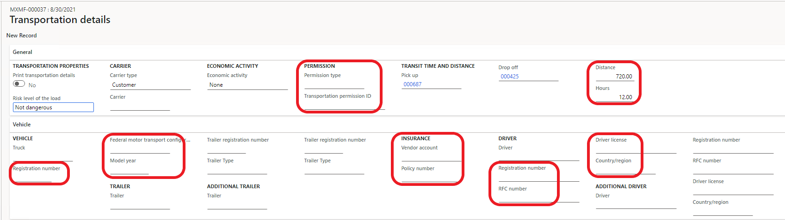
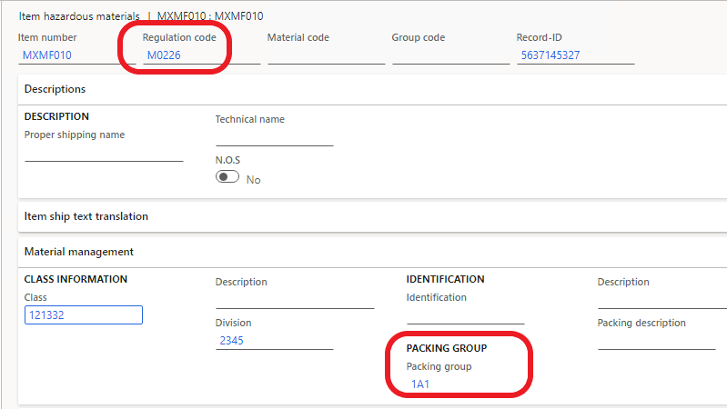

# Waybill (Carta de Porte) complement

[!include [banner](../includes/banner.md)]

This article provides information about how to set up and submit packing slips and transfer orders that include the Waybill (Carta de Porte) complement. As of October 1, 2021, the Waybill (Carta de Porte) complement is mandatory for taxpayers who transport goods and merchandise in the national/regional territory.

To generate the Waybill (Carta de Porte) complement in electronic invoice (CFDI) documents, enter transportation information on the **Transportation details** page. You can open this page from any of the following business documents:

- **A sales order record:** These sales orders include sales orders for the project. Go to **Accounts receivable** \> **Orders** \> **All sales orders**. On the Action Pane, select **Pick and Pack**.
- **A transfer order:** Go to **Inventory management** \> **Outbound orders** \> **Transfer orders**. On the Action Pane, select **Ship**.
- **A shipment:** Go to **Inventory management** \> **Outbound orders** \> **Shipments**.
- **Project requirements:** Go to **Project management and accounting** \> **Item tasks** \> **Project requirements**. On the Action Pane, select **Manage**.

> [!NOTE]
> You can view transportation information on the **CFDI - Packing Slip Electronic Invoices** and **CFDI - Invent Transfer Electronic Invoices** list pages.

## Transportation details page

This section provides information about the fields that are required on the **Transportation details** page. In the following illustration, the required fields have been highlighted.

> [!NOTE]
> As of version 10.0.23 (build 10.0.1037.160), the following functionality is available:
>
> - On the **Loading** FastTab of the **Transportation details** page, enter a value in the **Loading date and time** and **Name** (shipment address) fields. If you leave the **Loading date and time** field blank, the system selects the value from the transaction. If you leave the **Name** (shipment address) field blank, the system selects the value from the warehouse or site address.
> - Select a value in the **Weight unit** field. Before version 10.0.23, the **XAG** weight unit was a fixed value in an XML file. If you leave this field blank, the corresponding attribute in the XML file is filled in with **XAG**.
> - In addition to the data for two drivers, you can fill in transportation actors by selecting **Transportation actors** on the Action Pane. However, you should first fill in the actors catalog by going to **Organization administration** \> **Setup** \> **SAT clarification** \> **Transportation**.

### General FastTab

The following fields are required:

- **Permission type**
- **Transportation permission ID**
- **Distance**
- **Hours**

### Vehicle FastTab

In the **Vehicle** section, the following fields are required:

- **Registration number**
- **Federal motor transport configuration**
- **Model year**

In the **Insurance** section, the following fields are required:

- **Vendor account**
- **Policy number**

In the **Driver** section, the following fields are required:

- **Registration number** or **RFC number**
- **Driver license**
- **Country/region**

In the **Trailer** section, set the following fields if a trailer is used in the transportation of goods:

- **Trailer registration number**
- **Trailer type**

> [!NOTE]
> If there is an additional trailer, set the fields in the **Additional trailer** section. If there is an additional driver, set the fields in the **Additional driver** section.

All the fields for a truck, trailer, and driver, except the **Federal motor transport configuration** field, can be filled in either manually or by using information from fixed asset and worker records.

## Posting packing slips and shipping transfer orders that include the Waybill (Carta de Porte) complement

If you select **Enable CFDI packing slip** on the **Packing slip posting** or **Shipment** page, the **Generate transportation note** parameter is automatically selected. However, you can clear this parameter as you require. If **Generate transportation note** is selected, the Waybill (Carta de Porte) complement will be included in the XML file.

## Setup

### Catalogs

Follow these steps to set up the Mexican tax authorities (SAT) catalogs to add information to the **Permission type**, **Trailer type**, and **Federal motor transport configuration** fields.

1. Go to **Organization administration** \> **Setup** \> **EInvoice** \> **SAT classification** \> **Transportation**.
2. On the **Transportation** page, create the following SAT catalogs:

    - For the **Trailer type** field, the SAT catalog is **c\_SubTipoRem**.
    - For the **Permission type** field, the SAT catalog is **c\_TipoPermiso**.
    - For the **Federal motor transport configuration** field, the SAT catalog is **c\_ConfigAutotransporte**.

### Permission number

1. Go to **Organization administration** \> **Organizations** \> **Legal entities**.
2. On the **Transportation permissions** FastTab, in the **Transportation permission ID** field, enter the permission number that is provided by the Mexican Secretariat for Communications and Transport (SCT).

### Items

1. Go to **Product information management** \> **Products** \> **All released products**.
2. Select and open the item record that you want to work with.
3. On the **Manage inventory** FastTab, set the **Net weight** and **Tare weight** fields if they are required. The **Gross weight** field is automatically set.

### Distance and time

You can define information about the distance and transportation time between shipment delivery locations in advance. Then, when users enter distance and transportation time on the **Transportation details** page, they can save time by selecting existing values instead of having to calculate new values. Follow these steps to set up information about the distance and transportation time between transportation spots.

1. Go to **Organization administration** \> **Setup** \> **EInvoice**.
2. On the **EInvoice** page, enter or select transportation spots.
3. Enter the time and distance between the two spots. Transportation spots are all shipment and delivery points. Spots can have different types. Here are some examples:

    - Customer
    - Warehouse
    - Border (if goods are delivered to border)
    - Other

> [!NOTE] 
> You can skip this procedure. However, in that case, you must manually enter the distance and transportation time on the **Transportation details** page.

### Fixed assets

If your company has implemented the **Fixed assets** module, enter information in the fixed asset record for vehicles or trailers. This information can then be used on the **Transportation details** page. This information is required for the Waybill (Carta de Porte) complement.

1. Go to **Fixed assets** \> **Fixed assets** \> **Fixed assets**.
2. On the **Technical information** FastTab, set the following fields:

    - In the **SAT classification** section:

        - **Vehicle type**
        - **Federal motor transport configuration** (for trucks only)
        - **Trailer type**

    - In the **Model** section:

        - **Model year**
        - **Serial number**

### Workers

Follow these steps to enter tax ID (RFC) numbers, registration numbers, and license information for drivers. Before you start, make sure that identification types have been set up at **Human resources** \> **Setup** \> **Identification types**.

1. Go to **Human resources** \> **Workers** \> **Employees/Contractors/Workers**.
2. On the Action Pane, select **Personal information** \> **Identification numbers**.
3. In the **Identification type** field, select the corresponding type. For example, for a driver license identification type, select **Driver license**.

## Hazardous materials

If the company transports hazardous materials, enable the **Hazardous materials product information and shipping documentation** feature in the **Feature management** workspace. For more information, see [Feature management overview](../../fin-ops-core/fin-ops/get-started/feature-management/feature-management-overview.md).

After you enable the feature, follow these steps to enter additional hazardous material information.

1. Go to **Product information management** \> **Products** \> **All released products**.
2. Open the item record, and then, on the **Manage inventory** FastTab, set the **Hazardous materials** option to **Yes**.
3. On the Action Pane, select **Manage inventory** \> **Compliance**.
4. On the **Item hazardous materials** page, on the header, set the **Regulation code** field.
5. On the **Material management** FastTab, in the **Packing group** section, set the **Packing group** field.

> [!NOTE]
> To select values for the **Regulation code** and **Packing group** fields, first fill in the **Hazardous material regulation** and **Hazardous material packing groups** tables in accordance with the **c\_MaterialPeligroso** and **c\_TipoEmbalaje** SAT catalogs that are located at **Product information management** \> **Setup** \> **Hazardous material shipping documentation**.
>
> As of version 10.0.23 (build 10.0.1037.149), you can work with the **Display hazardous status** option to send the **matrialPeligrosso** attribute as output in an XML file. If the **Display hazardous status** option is set to **Yes**, you can set the **Hazardous materials** option to **Yes**.

[!INCLUDE[footer-include](../../includes/footer-banner.md)]
