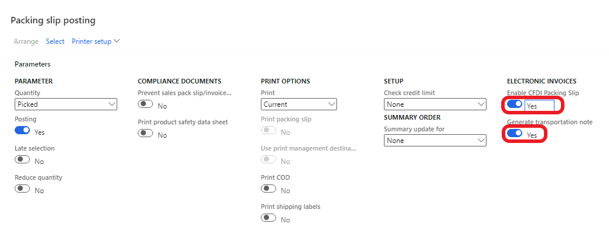
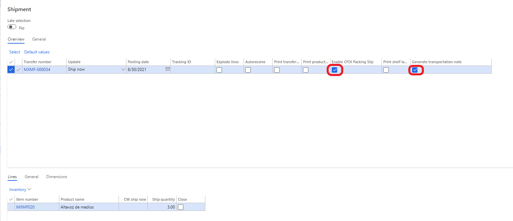
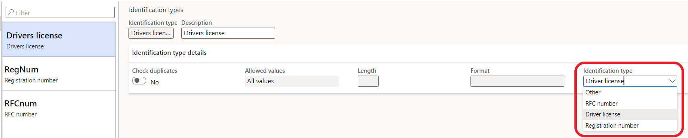

---
# required metadata

title: Waybill (Carta de Porte) complement
description: This topic explains how to setup and submit parking slips and transfer orders with Waybill (Carta de Porte) complement.
author: v-oloski
ms.date: 08/31/2021
ms.topic: article
ms.prod: 
ms.technology: 

# optional metadata

ms.search.form: 
audience: Application User
# ms.devlang: 
ms.reviewer: 
# ms.tgt_pltfrm: 
# ms.custom: 
ms.search.region: Mexico
# ms.search.industry: 
ms.author: v-oloski
ms.search.validFrom: 2021-08-31
ms.dyn365.ops.version: 10.0.23

---
# Waybill (Carta de Porte) complement (version 1.0)
This topic provides information about how to setup and submit parking slips and transfer orders with Waybill (Carta de Porte) complement. Waybill (Carta de Porte) complement is mandatory for taxpayers who transport goods and merchandise in the national territory from October 1st, 2021.

A user can fill in transportation information in **Transportation details** form from:

-   A sales order record including sales orders for the project (Accounts receivable \> Orders \> All sales orders, Action pane \> Pick and Pack).

-   A transfer order (Inventory management \> Outbound orders \> Transfer orders, Action pane  \> Ship.

-   A shipment (Inventory management \> Outbound orders \> Shipments).

-   Project requirements (Project management and accounting \> Item tasks \> Project requirements, Action pane \> Manage)

>[!NOTE] A user can overview transportation information in **CFDI - Packing Slip Electronic Invoices** and **CFDI - Invent Transfer Electronic Invoices** page lists

## Filling Transportation details form 

Mandatory fields for filling (highlighted by red color):

**General** FastTab

-   Permission type
-   Transportation permission ID
-   Distance and Hours

**Vehicle** FastTab

Truck

-   Registration number
-   Federal motor transport configuration
-   Model year

Insurance

- Vendor account
- Vendor number

Driver

-   RFC number or Registration number and the country for foreigners
-   Driver license

Fill in trailer information, if a trailer is used in transportation of goods:

Trailer

-   Trailer registration number
-   Trailer type

> [!NOTE]. If there is additional trailer and/ or an additional driver, fill in the similar information too.

Fields for a truck, a trailer, and a driver (except Federal motor transport configuration) can be filled in manually or using information from fixed asset records and from worker records (see Fixed assets, Workers).

## Posting packing slips and shipping transfer order with Waybill (Carta de Porte) complement

If a user selects **Enable CFDI packing slip** in the **Packing slip posting** or in the **Shipment** form, the **Generate transportation note** is selected automatically but the user can unselect this parameter. When **Generate transportation note** is selected it means that Waybill (Carta de Porte) complement will be included in xml file.

## Setup

### Catalogs

Set up the following catalogs for fillings the **Permission type**, **Trailer type** and **Federal motor transport configuration** fields:

Organization administration \> Setup \> EInvoice \> SAT classification \> Transportation

-   Trailer type (SAT catalog is c_SubTipoRem).

-   Permission type (SAT catalog is c_TipoPermiso).

-   Federal motor transport configuration (SAT catalog is c_ConfigAutotransporte).

### Permission number

Set up **Transportation permission ID** for filling the same field in the **Transportation detail** form:

Organization administration \> Organizations \> Legal entities, **Transportation permissions** FastTab

-   Fill in the permission number (provided by the SCT) for transportation permission types.

### Items

Fill in **Net weight** and **Tare weight** (if any). **Gross weight** is filled in automatically (Product information management \> Products \> All released products, open Item record, **Manage inventory** FastTab). **Gross weight** value is output in xml file and should be filled.

### Distance and time

To speed up filling distance and transportation time in the **Transportation details** form, a user can set up distance and time between the shipment and delivery spots:

Organization administration \> Setup \> EInvoice

-   Transportation spots.

-   Transit time and distance (between pick up and drop off spots).

Transportation spots are all shipment and delivery points. Spots can have different types:

-   Customer.

-   Warehouse.

-   Border, if goods are delivered to border.

-   Other

> [!NOTE] This step can be skipped and in this case a user should fill in the distance and the transportation time manually in the **Transportation details** form. If this setting is executed a user can select pick up and drop off spots in the **Transportation details** form and the distance and the time are filling automatically.

### Fixed assets

If the company implemented the **Fixed assets** module, a user can fill in information in the fixed asset record for vehicles and/or trailer which can be used when filling transportation information in **Transportation details** form. This information is needed for the Waybill (Carta de Porte) complement.

Open Fixed assets \> Fixed assets \> Fixed assets, **Technical information** FastTab and fill in the following fields

**SAT classification** field group:

-   Vehicle type: Truck or Trailer.

-   Federal motor transport configuration (for trucks only).

-   Trailer type.

**Model** field group:

-   Model year.

-   Serial number.

### Workers

For filling Driver FRC number/ Registration number, license open Human resources \> Workers \> Employees/ Contractors/ Workers, Action pane \> Personal information \> Identification numbers.

Identification type should have corresponding type in the field Identification type. For example, for driver license identification type should have value **Driver license**.

A user can fist set up Identification types (Human resources \> Setup \> Identification types) for RFC number, Registration number and Driver’s license:

## Hazardous materials

If the company transports hazardous materials the feature **Hazardous materials product information and shipping documentation** should be enabled.

How to enabling a feature see [Feature management overview - Finance & Operations \| Dynamics 365 \| Microsoft Docs](https://docs.microsoft.com/en-us/dynamics365/fin-ops-core/fin-ops/get-started/feature-management/feature-management-overview).

After enabling this feature, set **Hazardous materials** option to **Yes** (Product information management \> Products \> All released products, open Item record, **Manage  inventory** FastTab). Then fill in hazardous material information: Registration code and Packing group (Action pane **Manage inventory** \> **Compliance** group).

