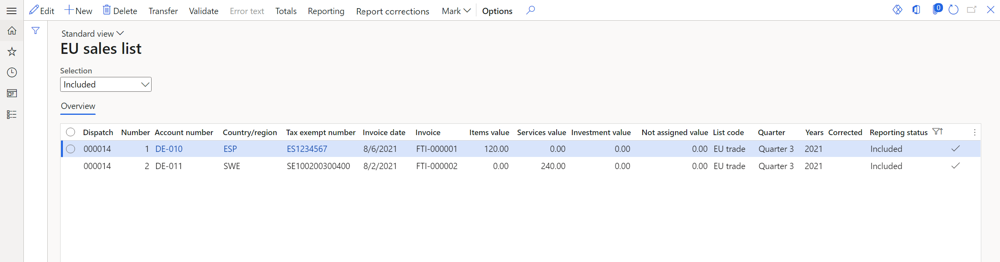

# EU Sales list for Latvia

This article provides information about the European Union (EU) sales list report for Latvia. The Latvian EU sales list report contains information about the sale of goods and services for reporting in XML format. The following fields are included on the Latvian EU sales list report:

- **EU sales list lines:**
    - Customer VAT ID
    - Sum of all item invoices by customer
    - Sum of all service invoices by customer
    - Sum of triangular trade by customer
    - Line type

The following fields are included on the Latvian EU sales list corrective report:

- **EU sales list header:**
    - Company routing number
    - Company name
    - Responsible person title
    - Company's primary phone
    - Date and time of the report creation
    - Name of the responsible person

- **EU sales list lines:**
    - New transaction year and month
    - Customer country/region code
    - Customer VAT ID without country/region code
    - New line amount
    - Customer VAT ID
    - The total amount of a line

## Setup

For general setup information, see [EU Sales list reporting](../europe/emea-eu-sales-list.md#prerequisites).

### Set up information about the company

1. In Microsoft Dynamics 365 Finance, go to **Organization administration** > **Organizations** > **Legal entities**.
2. In the grid, select your company.
3. On the **Bank account information** FastTab, in the **Routing number** field, enter the value that should be shown in the .xml file for the EU sales list corrective report.

### Import Electronic reporting configurations

In [Microsoft Dynamics Lifecycle Services (LCS)](https://lcs.dynamics.com/Logon/Index), import the latest versions of the following Electronic reporting (ER) configurations for the EU sales list:

- EU Sales list model
- EU Sales list by columns report
- EU Sales list by rows report
- EU Sales list (LV)
- EU Sales list corrections (LV)

For more information, see [Download Electronic reporting configurations from Lifecycle Services](../../../fin-ops-core/dev-itpro/analytics/download-electronic-reporting-configuration-lcs.md)

### Set up foreign trade parameters

1. In Finance, go to **Tax** > **Setup** > **Foreign trade** > **Foreign trade parameters**.
2. On the **EU sales list** tab, set the **Report cash discount** option to **Yes** if a cash discount should be included in the value when a transaction is included in the EU sales list.
3. On the **Electronic reporting** FastTab, in the **File format mapping** field, select **EU Sales list (LV)**.
4. In the **Report format mapping** field, select **EU Sales list by rows report** or **EU Sales list by columns report**.
5. In the **Corrections file format mapping** field, select **EU Sales list corrections (LV)**.
6. On the **Country/region properties** tab, select **New**, and specify the following information:
    
    - In the **Country/region** column, select **LVA**.
    - In the **Country/region type** column, select **Domestic**.
    
7. List all the countries or regions that your company does business with. For each country that is part of the EU, in the **Country/region type** field, select **EU**.

## Work with the EU sales list

For general information about which types of transactions are included in the EU sales list, how to generate the EU sales list report, and how to close the EU sales list reporting period, see [EU Sales list reporting](../europe/emea-eu-sales-list.md#working-with-the-esl).

### Generate the EU sales list report

1. Go to **Tax** > **Declarations** > **Foreign trade** > **EU sales list**.
2. Transfer transactions. In addition to the main codes in the **List code** field, you can use the **Purchased on behalf** code for the trade of items.
3. On the Action Pane, select **Reporting**.
4. In the **EU sales list reporting** dialog box, on the **Parameters** FastTab, set the following fields.

    | Field            | Description                                                                        |
    |------------------|------------------------------------------------------------------------------------|
    | Reporting period | Select **Monthly**.                                                                |
    | From date        | Select the start date for the report.                                              |
    | Generate report  | Set this option to **Yes** to generate an .xml file for your EU sales list report. |
    | Report file name | Enter the name of the .xml file.                                                   |

5. Select **OK**, and review the generated reports.

**Generate a corrective EU sales list report**

1. Go to **Tax** > **Declarations** > **Foreign trade** > **EU sales list**.
2. Transfer transactions.
3. For each corrected line, select **Copy lines** > **To lines with status Included** on the Action Pane to create corrective lines. The reporting status of corrected lines can be set to **Included**, **Reported**, or **Closed**.
4. For each corrective line, apply the changes, and select the **Corrected** checkbox.
5. On the Action Pane, select **Reporting corrections**.
6. In the **EU sales list reporting** dialog box, on the **Parameters** FastTab, set the following fields.

    | Field                            | Description                                          |
    |----------------------------------|------------------------------------------------------|
    | File name                        | Enter the name of the .xml corrective file.          |
    | Person responsible for reporting | Select the person who is responsible for the report. |

## Example

For information about how to create a general setup, create postings, and transfer transactions by using the **DEMF** legal entity for Latvia, see Example for generic EU Sales list. Additionally, for this example, create **000000009** as the company's routing number.

**Create an EU sales list report**

1. Go to **Tax** > **Declarations** > **Foreign trade** > **EU sales list**.
2. On the Action Pane, select **Reporting**.
3. In the **EU sales list reporting** dialog box, on the **Parameters** FastTab, set the following fields:
    
    - In the **Reporting period** field, select **Monthly**.
    - In the **From date** field, select **8/1/2021** (August 1, 2021).
    
4. Select **OK**, and review the report in XML format that is generated. The following tables show the values on the example report.

    **EU sales list lines**

    | Field    | Line 1 value | Line 2 value | Comment  |
    |----------|--------------|--------------|----------|
    | Valsts Value     | ES    | SE    | The customer's country/region code.  |
    | PVN Numurs Value | 12345678      | 100200300400 | The customer's value-added tax (VAT) ID without the country/region code. |
    | Summa Value      | 120           | 240          | The sum of all item, service, or triangular invoices by customer.  |
    | Pazime Value     | G             | P            | The line type. The value is **G** for an item record, **P** for a service record, **S** for a triangular trade record, and **C** for a record where the **List code** field is set to **Purchased on behalf**. |

**Create a corrective EU sales list report**

1. Go to **Tax** > **Declarations** > **Foreign trade** > **EU sales list**.
2. Verify that there are one service line and one item line in the grid.

    

3. Select a service line, and then, on the Action Pane, select **Copy lines** > **To lines with status Included**.
4. For the corrective line, set the following fields:

    - In the **Country/region** field, select **ESP**.
    - In the **Tax exempt number** field, select **ES1234567**.
    - In the **Invoice date** field, select **9/8/2021** (September 8, 2021).
    - In the **Items value** field, enter **20**.
    - In the **Services value** field, enter **0**.
    - Select the **Corrected** checkbox.

5. On the Action Pane, select **Reporting corrections**.
6. In the **EU sales list reporting** dialog box, on the **Parameters** FastTab, in the **Person responsible for reporting** field, select **Jodi Christiansen**.
7. Select **OK**, and review the report in XML format that is generated. The following tables show the values on the example report.

    **EU sales list header**

    | Field        | Value                               |   Comment                                      |
    |--------------|-------------------------------------|------------------------------------------------|
    | Nmr Kods     | 000000009                           | The company's routing number.                  |
    | Nm Nosaukums | Contoso Entertainment System Latvia | The company's name.                            |
    | Amats        | Compensation & Benefits Cons.       | The title of the person who is responsible.    |
    | Talrunis     | +99999999                           | The company's primary telephone number.        |
    | Sast Dat     | 2021-09-20T15:07:44+03:00           | The date and time when the report was created. |
    | Atb Pers     | Jodi Christiansen                   | The name of the person who is responsible.     |

    **EU sales list lines**

    | Field   | Line 1 value | Comment  |
    |---------|--------------|----------|
    | Vec Taks Per  | 2108    | The old transaction year and month. |
    | Vec Valsts    | SE    | The old country/region code of the customer.  |
    | Vec PVN Numurs  | 100200300400 | The old VAT ID of the customer, without the country/region code.  |
    | Vec Summa       | 240          | The old line amount.  |
    | Vec Pazime      | P            | The old line type. The value is **G** for an item record, **P** for a service record, **S** for a triangular trade record, and **C** for a record where the **List code** field is set to **Purchased on behalf**. |
    | Jaun Valsts     | ES           | The new country/region code of the customer.      |
    | Jaun PVN Numurs | 1234567      | The new VAT ID of the customer, without the country/region code.    |
    | Jaun Taks Per   | 2109         | The new transaction year and month.     |
    | Jaun Valsts     | ES           | The new country/region code of the customer.    |
    | Jaun PVN Numurs | 1234567      | The new VAT ID of the customer, without the country/region code.   |
    | Jaun Summa      | 20           | The new line amount.         |
    | Jaun Pazime     | G            | The new line type. The value is **G** for an item record, **P** for a service record, **S** for a triangular trade record, and **C** for a record where the **List code** field is set to **Purchased on behalf**. |
