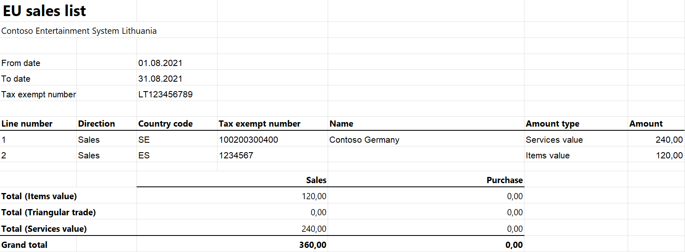

# EU Sales list for Lithuania

This article provides information about the European Union (EU) sales list report for Lithuania. The Lithuanian EU sales list report contains information about the sale of goods and services for reporting in XML format. The following fields are included on the Lithuanian EU sales list report:

- **EU sales list header:**

    - Information about application
    - Date of the report creation
    - Number of pages
    - Number of the current page
    - Company's name
    - Company's routing number
    - Company's VAT ID
    - Filing date
    - Reporting year
    - Reporting month
    - Contact information

- **EU sales list lines:**
    
    - Identifier for corrective line
    - Line number
    - Customer VAT ID
    - Sum of all item invoices by customer
    - Sum of triangular trade by customer
    - Sum of all service invoices by customer

- **EU sales list footer:**
    
    - Information about correction in the report
    - Total number of pages
    - Total amount of items on the current page / on all pages

## Setup

For general setup information, see [EU Sales list reporting](../europe/emea-eu-sales-list.md#prerequisites).

### Set up information about the company

Create a registration type, and assign it to the **VAT ID** registration category for Lithuania and all the countries or regions that your company does business with, as described in [Registration IDs](../europe/emea-registration-ids.md).

1. In Microsoft Dynamics 365 Finance, go to **Organization administration** > **Organizations** > **Legal entities**.
2. In the grid, select your company.
3. On the **Bank account information** FastTab, in the **Routing number** field, enter the value that should be shown in the .xml file for the EU sales list report.
4. On the Action Pane, select **Registration IDs**.
5. On the **Registration ID** FastTab, select **Add**.
6. On the **Overview** tab, in the **Registration type** field, select the registration type that you created earlier.
7. Enter your company's value-added tax (VAT) ID.
8. Optional: On the **General** tab, in the **General** section, change the period that the VAT ID is used for.
9. Close the page.
10. On the **Foreign trade and logistics** FastTab, in the **Intrastat** section, in the **VAT exempt number export** field, select the VAT ID that you created in step 7. This value will be shown in the .xlsx file for the EU sales list report.

### Import Electronic reporting configurations

In [Microsoft Dynamics Lifecycle Services (LCS)](https://lcs.dynamics.com/Logon/Index), import the latest versions of the following Electronic reporting (ER) configurations for the EU sales list:

- EU Sales list model
- EU Sales list by columns report
- EU Sales list by rows report
- EU Sales list (LT)

For more information, see [Download Electronic reporting configurations from Lifecycle Services](../../../fin-ops-core/dev-itpro/analytics/download-electronic-reporting-configuration-lcs.md).

### Set up foreign trade parameters

1. In Finance, go to **Tax** > **Setup** > **Foreign trade** > **Foreign trade parameters**.
2. On the **EU sales list** tab, set the **Report cash discount** option to **Yes** if a cash discount should be included in the value when a transaction is included in the EU sales list.
3. On the **Electronic reporting** FastTab, in the **File format mapping** field, select **EU Sales list (LT)**.
4. In the **Report format mapping** field, select **EU Sales list by rows report** or **EU Sales list by columns report**.
5. On the **Country/region properties** tab, select **New**, and specify the following information:
    
    - In the **Country/region** column, select **LTU**.
    - In the **Country/region type** column, select **Domestic**.

6. List all the countries or regions that your company does business with. For each country that is part of the EU, in the **Country/region type** field, select **EU**.

## Work with the EU sales list

For general information about which types of transactions are included in the EU sales list, how to generate the EU sales list report, and how to close the EU sales list reporting period, see [EU Sales list reporting](../europe/emea-eu-sales-list.md#working-with-the-esl).

### Generate the EU sales list report

1. Go to **Tax** > **Declarations** > **Foreign trade** > **EU sales list**.
2. Transfer transactions.
3. Optional: To create correction files, select the **Corrected** checkbox for each corrective line.

> [!NOTE] 
> To ensure the correct display of information on a report that includes correction lines, don't report both lines that have corrections and lines that don’t have corrections at the same time for one customer.

4. On the Action Pane, select **Reporting**.
5. In the **EU sales list reporting** dialog box, on the **Parameters** FastTab, set the following fields.

    | Field               | Description     |
    |---------------------|-----------------|
    | Reporting period    | Select **Monthly**.   |
    | From date           | Select the start date for the report.  |
    | Generate file       | Set this option to **Yes** to generate an .xml file for your EU sales list report.   |
    | File name           | Enter the name of the .xml file.  |
    | Generate report     | Set this option to **Yes** to generate an .xlsx file for your EU sales list report.   |
    | Report file name    | Enter the name of the .xlsx file.  |
    | Filing date         | Select the filing date for the report.  |
    | Contact information | Enter contact information.  |
    | Report type         | Select **Primary** to create files that don’t include corrective lines.  Select **Corrected** to create a correction file that includes only corrective lines.   Select **Partially corrected** to create a correction file that includes both corrective lines and lines that don’t have corrections. |

6. Select **OK**, and review the generated reports.

## Example

For information about how to create a general setup, create postings, and transfer transactions by using the **DEMF** legal entity for Lithuania, see [Example for generic EU Sales list](../europe/emea-eu-sales-list-example.md). However, for the example in this article, create **LT123456789** as the company’s VAT ID. Enter this VAT ID in the **VAT exempt number export** field in the **Intrastat** section on the **Foreign trade and logistics** FastTab of the **Legal entities** page. Additionally, create **000000009** as the company’s routing number.

**Create an EU sales list report**

1. Go to **Tax** > **Declarations** > **Foreign trade** > **EU sales list**.
2. On the Action Pane, select **Reporting**.
3. In the **EU sales list reporting** dialog box, on the **Parameters** FastTab, set the following fields:
    
    - In the **Reporting period** field, select **Monthly**.
    - In the **From date** field, select **8/1/2021** (August 1, 2021).
    - In the **Filing date** field, select **9/25/2021** (September 25, 2021).
    - In the **Contact information** field, enter **Contact information**.
    - In the **Report type** field, select **Primary**.

4. Select **OK**, and review the report in XML format that is generated. The following tables show the values on the example report.

    **EU sales list header**

    | Field            | Value     | Comment    |
    |------------------|-----------|------------|
    | Version          | 7.0       |    &nbsp;  |
    | Created By App   | Microsoft Dynamics 365 Finance |  &nbsp; |
    | Created By Login | Admin     |    &nbsp;      |
    | Created On       | 2021-09-24     | The date when the report was created.   |
    | Pages Count      | 1      | The number of pages.    |
    | Page Def Name    | FR0564     | If the page number is 1, this field is set to **FR0564**. Otherwise, it’s set to **FR0564P**.   |
    | Page Number      | 1       | The number of the current page.     |
    | Fields Count     | 78     | The number of lines in the **Fields** section. If the page number is 1, this field is set to **78**. Otherwise, it’s set to **124**. |
    | B_MM_Pavad       | Contoso Consulting Lithuania     | The company’s name. This field appears only on the first page.  |
    | B_MM_ID          | 000000009   | The company's routing number. If the current page isn't the first page, this field appears in the EU sales list footer.  |
    | B_MM_PVM         | LT123456789   | The company's VAT ID. If the current page isn't the first page, this field appears in the EU sales list footer. |
    | B_MM_Tel         | Contact information   | The value from the **Contact information** field.  |
    | B_Uzpild Data    | 2021-09-25     | The value from the **Filing date** field. If the current page isn't the first page, this field appears in the EU sales list footer.  |
    | B_ML_Metai       | 2021      | The reporting year. If the current page isn't the first page, this field appears in the EU sales list footer.   |
    | B_ML_Ketvirtis   |  &nbsp;  | A constant value. If the current page isn't the first page, this field appears in the EU sales list footer.       |
    | B_ML_Menuo       | 08    | The reporting month. If the current page isn't the first page, this field appears in the EU sales list footer.     |

    **EU sales list lines**

    | Field | Line 1 value | Line 2 value | Comment                                                                       |
    |-------|--------------|--------------|-------------------------------------------------------------------------------|
    | E9    |   &nbsp;           |   &nbsp;           | If the line is corrective, this field is set to **T**. Otherwise, it's blank. |
    | E10   | 1            | 2            | The line number.                                                              |
    | E11   | ES           | SE           | The country/region code.                                                      |
    | E12   | 1234567      | 100200300400 | The customer's VAT ID without the country/region code.                        |
    | E13   | 120          | &nbsp;       | The sum of all item invoices by customer.                                     |
    | E14   | &nbsp;       | &nbsp;       | The sum of triangular trade by customer.                                      |
    | E18   | &nbsp;       | 240          | The sum of all service invoices by customer.                                  |

    **EU sales list footer**

    | Field         | Value | Comment      |
    |---------------|-------|--------------|
    | E15           | 120   | The total amount of items on the current page.     |
    | E16           | 120   | The total amount of items. The field appears only on the first page.   |
    | E17           | 0     | The total number of pages excluding the first page. This field appears only on the first page.   |
    | Lapo Nr       | &nbsp;      | The remaining number of pages. This field doesn't appear on the first page.  |
    | B_Form Nr     |  &nbsp;     | A constant value.     |
    | B_Form Ver Nr |  &nbsp;     | A constant value.     |
    | Text-20       |  &nbsp;     | A constant value. This field appears only on the first page.   |
    | Text-LT       |  &nbsp;     | A constant value. The field doesn't appear on the first page.  |
    | E6            | 1     | The report type. If the **Report type** field is set to **Primary**, the value is **1**. If the **Report type** field is set to **Corrected**, the value is **2**. If the **Report type** field is set to **Partially corrected**, the value is **3**. |

5. Review the report in Excel format that is generated.

    

