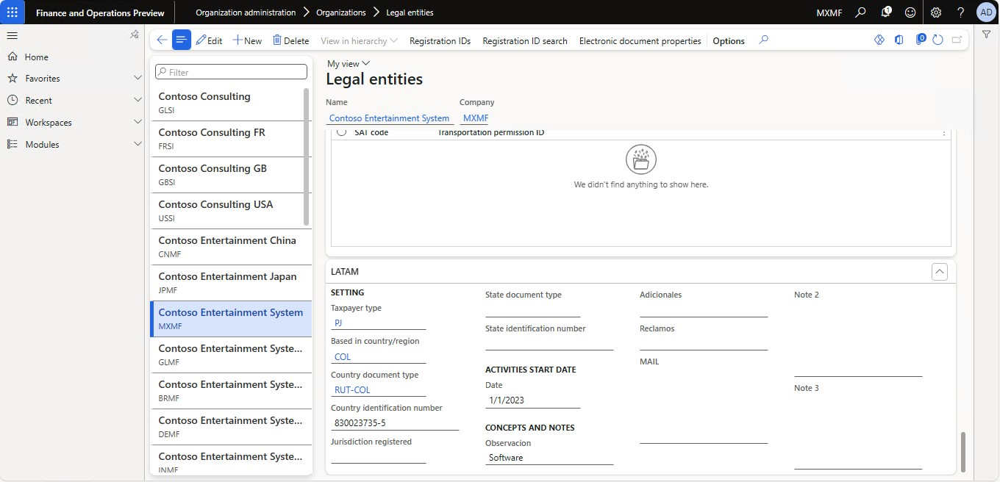
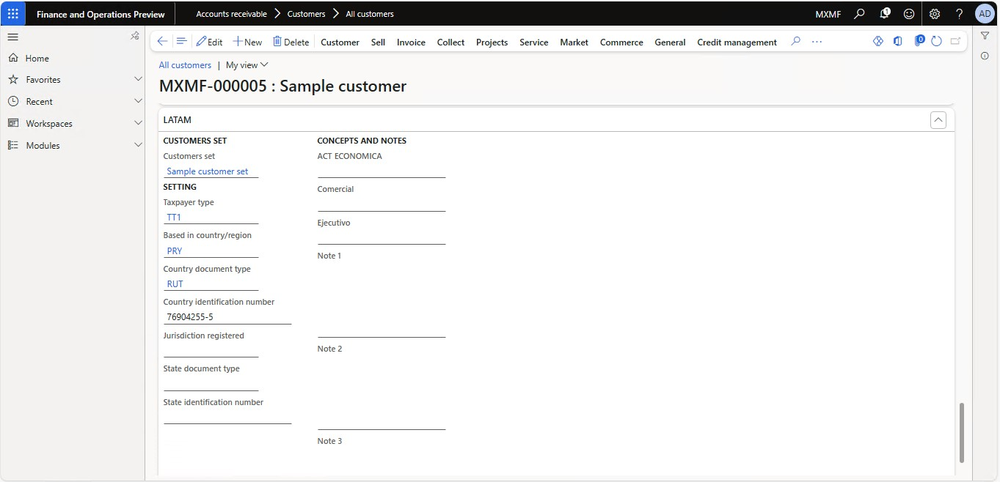
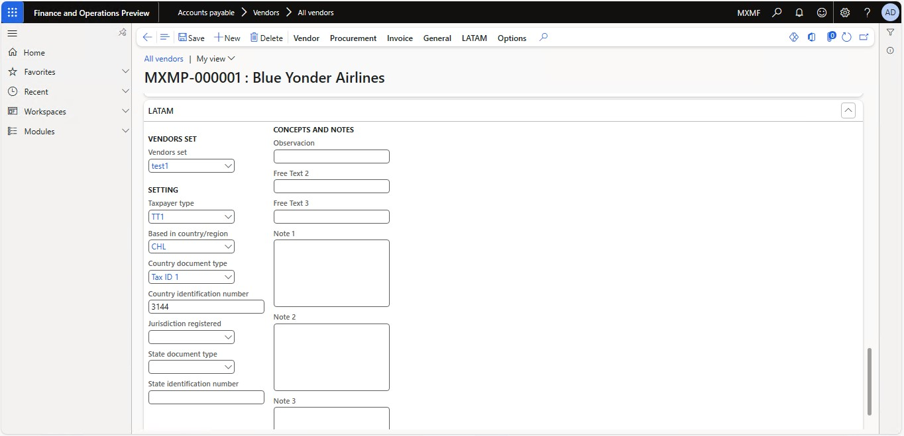
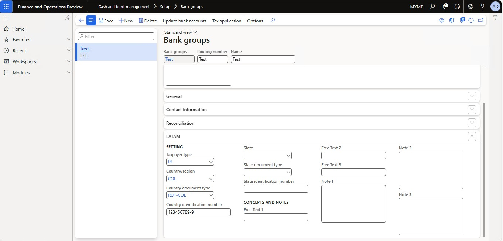
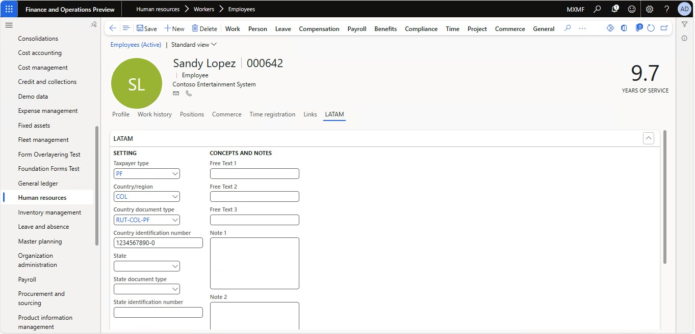
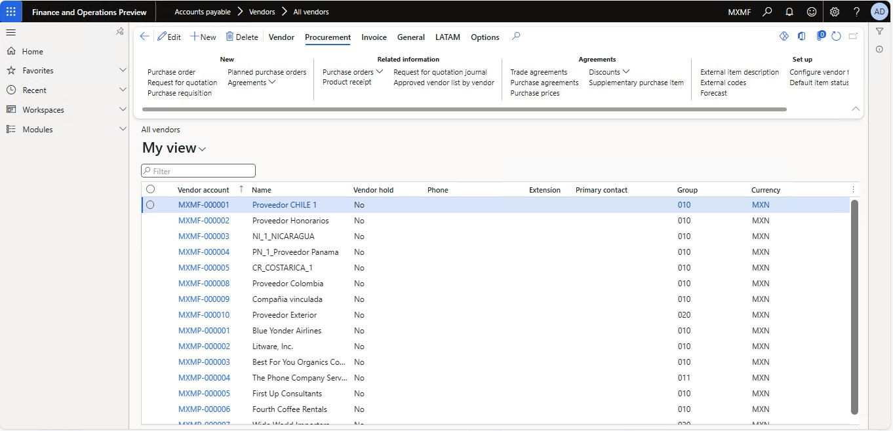
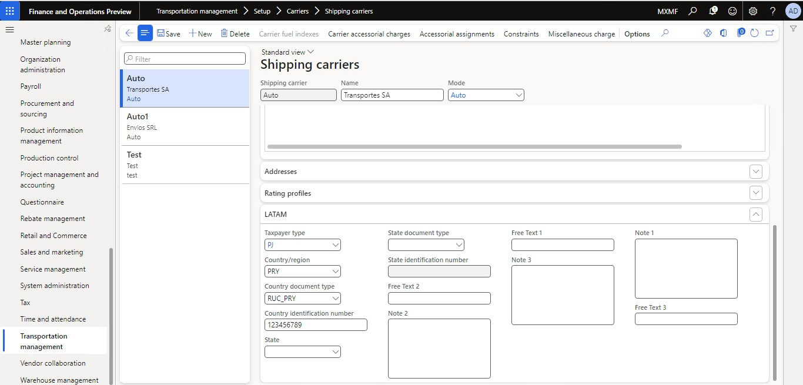

# Tax and legal attributes for Latin America
This article provides information about how to add tax and legal information that will be useful to comply company and fiscal legislation.
The attributes that can be configured in this section includes tax identification in different levels, taxpayer classification per country, and different customizable concepts that can be filed manually.
This section will be available in:
* Legal entity

* Customer

  
* Vendor

  
* Bank group

  
* Employee

* Contact

  
* Shipping carriers

## Prerequisites
To enable the **LATAM tax and legal** section first enable the LATAM Globalization feature and a country specific feature.
Then set the company address in a LATAM country where the globalization feature is enabled.	

## Set up the LATAM tax and legal information
1. Go to one of the configuration forms that has the LATAM section enabled:
* **Organization administration > Organizations > Legal entities**
* **Accounts receivable > Customers > All customers**
* **Accounts payable > Vendors > All vendors**
* **Warehouse management > Setup > Shipping > Shipping carriers**
* **Cash and bank management > Setup > Bank groups**
* **Human resources > Workers > Employees**
* **Sales and marketing > Relationships >Contacts >All contacts**
2. In the LATAM section complete the following fields:

| Field                         | Description                                                                                                                                                                                     |
|-------------------------------|-------------------------------------------------------------------------------------------------------------------------------------------------------------------------------------------------|
| Customer/Vendor set           | Select a customer/vendor set created that contains the document classes that will be used by the customer/vendor. This field will be only available in customer and vendor configuration forms. |
| Taxpayer type                 | Select taxpayer type created that match the company classification.                                                                                                                             |
| Based in Country              | Select the country where the company is located.                                                                                                                                                |
| Country document type         | This drop-down field will only allow you to select country tax ID types added to the country LATAM configuration selected in the previous field.                                                |
| Country identification number | Complete this field with the company Tax ID number.                                                                                                                                             |
| Jurisdiction registered       | This drop-down field will only allow you to select a state or province.                                                                                                                         |
| State document type           | This drop-down field allows you to select the document types for the company added in the taxpayer configuration in a State/Province level.                                                    |
| State identification number    | Complete this field with the company Tax ID number for the State/Province.                                                                                                                      |
| Activities start date         | Complete with the company commercial activity starting date, usually stipulated in the company statute. This field will be only available in the legal entity form.                             |
| Concepts and notes            | Complete the fields with the rest of information required, the labels can be customized in LATAM parameters.                                                                                    |

