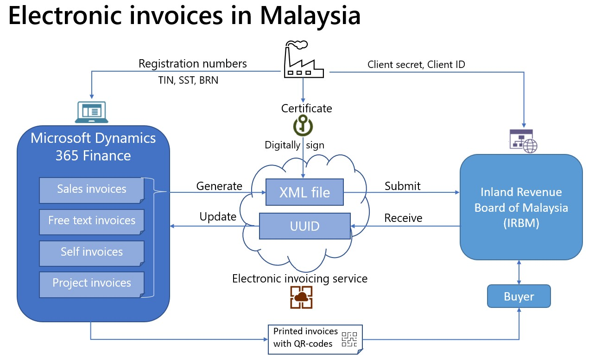
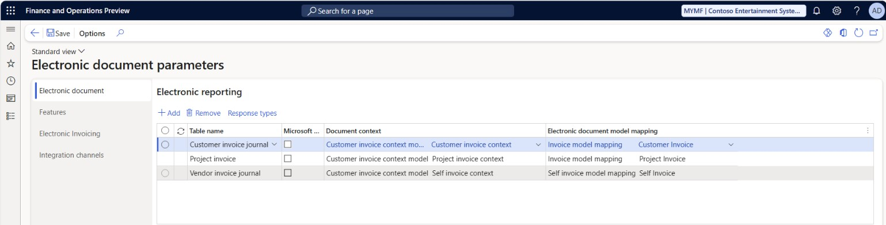
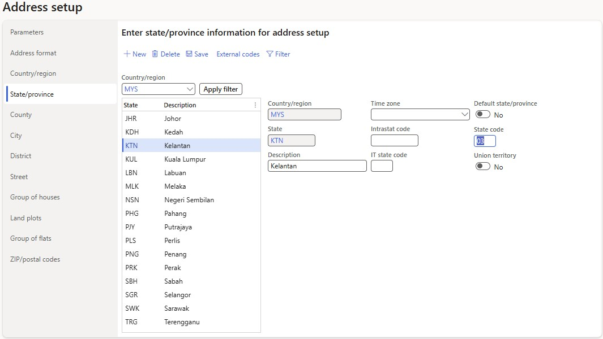
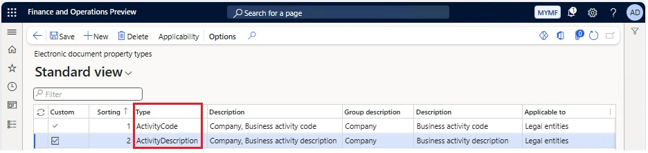
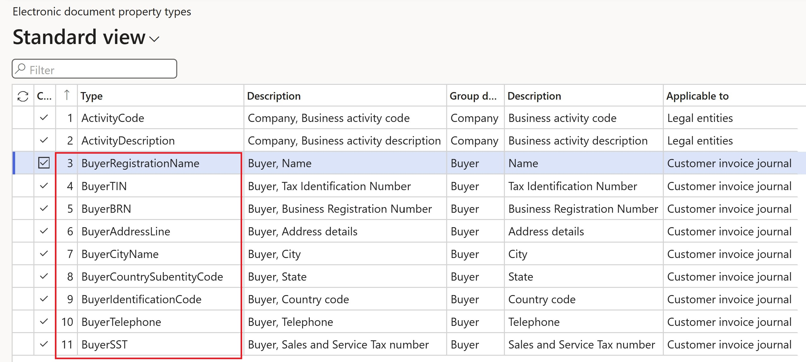

# Get started with electronic invoicing for Malaysia

[!INCLUDE[banner](../../includes/banner.md)]

This article provides information to help you get started with electronic invoicing for Malaysia. It guides you through the configuration steps that are country/region-dependent in Microsoft Dynamics 365 Finance or Dynamics 365 Supply Chain Management.

After you configure electronic invoicing, you can generate, digitally sign, and submit the XML files of electronic invoices according to the [regulatory requirements in Malaysia](https://www.hasil.gov.my/en/e-invoice/).

> [!NOTE]
> The electronic invoicing approach that this article describes is implemented by using an invoicing service that's applicable only to cloud deployments of Finance or Supply Chain Management.

## Prerequisites

Before you begin the procedures in this article, the following prerequisites must be met:

- The primary address of the legal entity must be in Malaysia.
- Your company must be a registered taxpayer in Malaysia and must have the following registration numbers: **Tax Identification Number (TIN)** and **Business Registration Number (BRN)**.
- Obtain **Client ID** and **Client secret** values in the [Inland Revenue Board of Malaysia (IRBN)](https://www.hasil.gov.my/) (Lembaga Hasil Dalam Negeri Malaysia \[LHDN\]). These values serve as credentials that are used to establish a secure connection to the IRBN portal.
- Obtain a digital signature certificate from one of the [Malaysian certification authorities](https://www.mcmc.gov.my/en/sectors/digital-signature/list-of-licensees). This certificate is used for digital signing of generated electronic invoices.
- Become familiar with electronic invoicing as it's described in [Electronic invoicing overview](../global/gs-e-invoicing-service-overview.md).
- Do the common part of electronic invoicing service configuration as described in [Set up electronic invoicing](../global/gs-e-invoicing-set-up-overview.md).

## Configure Azure Key Vault

Create an Azure key vault to store the required certificates and secrets that are issued for your company. For more information, see [Configure Azure resources for Electronic invoicing](../global/gs-e-invoicing-set-up-azure-resources.md).

Add the following required elements in the key vault:

- The secret for the **Client secret** value that's used to establish secure communication to IRBN.
- The secret for the **Client ID** value that's used to establish secure communication to IRBN.
- The certificate that's used for digital signing of outgoing electronic invoices.

## Configure Key Vault parameters for electronic invoicing

To configure Key Vault parameters for electronic invoicing, follow these steps.

1. Go to **Organization administration** \> **Setup** \> **Electronic document parameters**.
1. On the **Electronic invoicing** tab, in the **Key Vault settings** section, in the **Key Vault** field, select the reference to the key vault that you created in the previous section.
1. In the **SAS token secret** field, select the name of the storage account secret URL that must be used to authenticate access to the storage account.
1. Select **Key Vault parameters**.
1. On the **Key Vault parameters** page, in the **Certificates** section, select **Add** to create new elements of the appropriate type for each certificate or secret that's described in the previous section.

    - A **Client secret** element of the **Secret** type
    - A **Client ID** element of the **Secret** type
    - A **Certificate** element of the **Certificate** type

    > [!NOTE]
    > The values in the **Name** column should match the names of the certificates or secrets that are described in the previous section.

## Configure the electronic invoicing feature

Some of the parameters from the **Malaysian electronic invoicing (MY)** electronic invoicing feature are published with default values. Before you deploy this feature to the service, review the default values, and update them as required, so that they better reflect your business operations.

To configure the electronic invoicing feature, follow these steps.

1. Import the latest version of the **Malaysian electronic invoicing (MY)** Globalization feature as described in [Import features from the repository](../global/gs-e-invoicing-import-feature-global-repository.md).
1. Create a copy of the imported Globalization feature, and select your configuration provider for it. For more information, see [Create a Globalization feature](../global/gs-e-invoicing-create-new-globalization-feature.md).
1. On the **Versions** tab, verify that the **Draft** version is selected.
1. On the **Setups** tab, in the grid, select the **Sales invoice derived** feature setup, and then select **Edit**.
1. On the **Processing pipeline** tab, in the **Processing pipeline** section, select the **Sign document for Malaysia** action.
1. In the **Parameters** section, select the **Certificate name** parameter, and then, in the **Value** field, select the name of the [digital certificate](#DigCert) that you created.
1. In the **Processing pipeline** section, select the **Integrate with MyInvois (Submit document)** action.
1. In the **Parameters** section, select the **Client secret** parameter, and then, in the **Value** field, select the name of the [secret](#ClSec) that you created.
1. Select the **Client ID** parameter, and then, in the **Value** field, select the name of the [client ID](#ClID) that you created.
1. In the **Parameters** section, select the **Web service URL** and **Login service URL** parameters. In the **Value** fields, enter the testing or production URLs, depending on the implementation stage. Review the list of available URLs in [MyInvois system environment URLs](https://sdk.myinvois.hasil.gov.my/faq/#what-are-the-environment-urls).

    > [!NOTE]
    > Alternatively, you can leave the **Web service URL** and **Login service URL** parameters blank. Instead, you can select the **Environment type** parameter, and then, in the **Value** field, select the type of the environment, depending on the implementation stage. In this case, the required URLs are automatically constructed. If the **Web service URL** and **Login service URL** parameters are defined, they have higher priority than the **Environment type** parameter.

    

1. Repeat steps 7 through 10 for the **Integrate with MyInvois (Get document)** action.
1. On the **Processing pipeline** tab, in the **Processing pipeline** section, select the **Generate QR code for Malaysia** action.
1. In the **Parameters** section, select the **Environment type** parameter, and then, in the **Value** field, select the type of the environment, depending on the implementation stage.
1. Select **Save**, and close the page.
1. Repeat steps 4 through 14 for the **Project invoice derived** and **Self invoice derived** feature setups.
1. The copy of the feature is always created as a **Draft** version. Regardless of whether you made changes, complete and deploy the feature as described in [Complete and deploy a Globalization feature](../global/gs-e-invoicing-complete-publish-deploy-globalization-feature.md).

## Configure electronic document parameters

To configure electronic document parameters, follow these steps.

1. Make sure that the country/region-specific Electronic reporting (ER) configurations for the document context and electronic document model mapping that are required for Malaysia are imported. For more information, see [Set up electronic invoicing parameters](../global/gs-e-invoicing-set-up-parameters.md#set-up-electronic-document-parameters).

    > [!NOTE]
    > After you import the **Malaysian electronic invoicing (MY)** electronic invoicing feature, electronic documents are configured by default. Follow the remaining steps of this procedure if you must make changes. Otherwise, consider this section informational only.

1. Go to **Organization administration** \> **Setup** \> **Electronic document parameters**.
1. On the **Electronic document** tab, add records for the **Customer Invoice journal**, **Vendor Invoice journal**, and **Project invoice** table names.
1. For each table name, set the **Document context** and **Electronic document model mapping** fields in accordance with step 1.

    

1. For each table name, select **Response types**, select **New** to create a response type, and enter the following values:

    - In the **Response type** field, enter **ResponseData** (the default value).
    - In the **Description** field, enter any meaningful name. Alternatively, leave the field blank.
    - In the **Submission status** field, select **Pending**.
    - In the **Data entity name** field, select one of the following values, depending on the table name that you're configuring: 

        - For the **Customer Invoice journal** table name, select **Sales invoice entity**.
        - For the **Project invoice** table name, select **Project invoice entity**.
        - For the **Vendor Invoice journal** table name, select **Self invoice entity**.

    - In the **Model mapping** field, select **MY response data details format**.

    

    > [!NOTE]
    > **ResponseData** is the default name of the response type. If you must change it, make sure that the new name matches the name that was defined for the related variable of the **To client** type in the corresponding feature setups. To validate the variable's value, go to **Globalization Studio**, and select the **Electronic invoicing** tile. On the **Electronic invoicing features** page, verify that the **Malaysian electronic invoicing (MY)** feature is selected. On the **Setups** tab, in the grid, select the **Sales invoice derived** feature setup. Then select **Edit** or **View**, depending on the status of the feature version.

1. Select **Save**, and close the page.

    > [!NOTE]
    > The setup that's described here lets you submit electronic invoices for the following **posted** source documents:
    >
    > - Customer invoices that are based on sales orders
    > - Free text invoices
    > - Project invoices
    > - Self invoices that are based on vendor invoices from foreign vendors
    > - Credit notes and debit notes for all the previously described invoice types
    > - Refund notes, which represent credit notes for already paid invoices.

1. On the **Features** tab, select and enable the **Malaysian electronic invoice** feature.
1. Save your changes on the **Electronic document parameters** page, and then close the page.

## Configure registration numbers

> [!NOTE]
> When the output files of electronic invoices are generated, registration numbers of the **Enterprise ID (COID)** category are used as Business Registration Numbers (BRNs). If the **Enterprise ID (COID)** registration category already exists and has been assigned to a registration type, skip this procedure.

1. Go to **Organization administration** \> **Global address book** \> **Registration types** \> **Registration types**.
1. Create a registration type.
1. In the **Country/region** field, select **MYS - Malaysia**.
1. Go to **Organization administration** \> **Global address book** \> **Registration types** \> **Registration categories**.
1. Create a registration category.
1. In the **Registration types** field, select the registration type that you created in step 2.
1. In the **Registration categories** field, select **Enterprise ID (COID)**.

## Configure Sales and Service Tax numbers

To configure Sales and Service Tax (SST) numbers, follow the instructions in [SST registration number](apac-mys-gst.md#gstsst-registration-number).

> [!NOTE]
> Make sure that the configured SST registration number is in the **VAT ID** registration category.

## Configure electronic document property types

To configure the electronic document property type that's required to define the taxpayer activity code, follow these steps.

1. Go to **Accounts receivable** \> **Setup** \> **Electronic document property types**.
1. Select **New** to create an electronic document property type.
1. In the **Type** field, enter **ActivityCode**. You must enter the value exactly as it appears here.
1. On the Action Pane, select **Applicability**.
1. In the **Table name** field, select **CompanyInfo**.
1. Save and close the **Electronic document property type applicability setup** page.
1. Select **New** to create another electronic document property type.
1. In the **Type** field, enter **ActivityDescription**. You must enter the value exactly as it appears here.
1. On the Action Pane, select **Applicability**.
1. In the **Table name** field, select **CompanyInfo**.
1. Select **New** to create the record for another applicable table.
1. In the **Table name** field, select **VendTable**.
1. Save and close the **Electronic document property type applicability setup** page.
1. Save and close the **Electronic document property types** page.

## Configure address structure

To configure the structure of the postal address to define all required elements, follow these steps.

1. Go to **Organization administration** \> **Global address book** \> **Addresses** \> **Address setup**.
1. Make sure that all the following mandatory elements are configured:

    - Country code
    - Postal code
    - City name
    - Street
    - State code

1. For the states, on the **State/province** tab, in the **State code** field, define the official state code according to the [published requirements](https://sdk.myinvois.hasil.gov.my/codes/state-codes/).

## Configure legal entity data

### Enter the address

To enter the address, follow these steps.

1. Go to **Organization administration** \> **Organizations** \> **Legal entities**.
1. Select a legal entity.
1. On the **Addresses** FastTab, add a valid primary address for the selected legal entity.

### Enter the registration numbers

To enter the registration numbers, follow these steps.

1. Go to **Organization administration** \> **Organizations** \> **Legal entities**.
1. Select a legal entity, and then, on the **Tax registration** FastTab, in the **Tax registration number** field, enter the company's TIN.
1. On the Action Pane, select **Registration IDs**.
1. On the **Registration ID** FastTab, select **Add** to create a registration ID.
1. In the **Registration type** field, select the [BRN](#NRIC) registration type that you created earlier.
1. In the **Registration number** field, enter a valid BRN registration number for the selected legal entity.
1. Select **Add** to create another registration ID, if required.
1. In the **Registration type** field, select the [SST](#SST) registration type that you created earlier.
1. In the **Registration number** field, enter a valid SST registration number for the selected legal entity.

### Enter a business activity code and description

To enter a business activity code and description, follow these steps.

1. Go to **Organization administration** \> **Organizations** \> **Legal entities**.
1. Select a legal entity, and then, on the Action Pane, select **Electronic document properties**.
1. Select the line where the **Type** field is set to **ActivityCode**.
1. In the **Value** field, enter the taxpayer business activity code.
1. Select the line where the **Type** field is set to **ActivityDescription**.
1. In the **Value** field, enter the taxpayer business activity description.

> [!NOTE]
> The contact information for the legal entity is automatically retrieved from the related **Person** that is associated with the current user in Dynamics 365 Finance.

## Configure customer data

### Enter the address

To enter the address, follow these steps.

1. Go to **Accounts receivable** \> **Customers** \> **All customers**.
1. Select a customer.
1. On the **Addresses** FastTab, add a valid address for the selected customer.

### Enter the contact person

To enter the contact person, follow these steps.

1. Go to **Accounts receivable** \> **Customers** \> **All customers**.
1. Select a customer.
1. On the **Sales demographics** FastTab, in the **Primary contact** field, select the person who is considered the buyer's contact.

    > [!NOTE]
    > All available contact persons must already be defined for the selected customer. Make sure that the selected contact person has a valid email address and phone number.

### Enter the registration numbers

To enter the registration numbers, follow these steps.

1. Go to **Accounts receivable** \> **Customers** \> **All customers**.
1. Select a customer, and then, on the **Invoice and delivery** FastTab, in the **Tax exempt number** field, enter a valid TIN for the customer.
1. On the Action Pane, on the **Customer** tab, in the **Registration** group, select **Registration IDs**.
1. On the **Registration ID** FastTab, select **Add** to create a registration ID.
1. In the **Registration type** field, select the [BRN](#NRIC) registration type that you created earlier.
1. In the **Registration number** field, enter a valid BRN registration number for the selected customer.
1. Select **Add** to create another registration ID, if required.
1. In the **Registration type** field, select the [SST](#SST) registration type that you created earlier.
1. In the **Registration number** field, enter a valid SST registration number for the selected customer.

    > [!NOTE]
    > For **foreign** customers, actual tax registration numbers aren't always mandatory. If no tax registration numbers are defined for them, the following general numbers are used:
    >
    > - **EI00000000020** is used as the customer's **TIN**.
    > - **NA** is used as the customer's **BRN** and **SST**.

### Additional property configuration

**Customizable electronic document property types** can be used to extend the properties of legal entities, customers, vendors, and invoice journals. Users can configure them to cover some specific scenarios through configuration only. No coding is required.

To configure additional buyer and journal properties, follow these additional configuration steps.

1. Go to **Accounts receivable** \> **Setup** \> **Electronic document property types**.
1. Select **New** to create an electronic document property type.
1. In the **Type** field, enter **BuyerRegistrationName**. You must enter the value exactly as it appears here.
1. On the Action Pane, select **Applicability**.
1. In the **Table name** field, select **CustInvoiceJour**.
1. To create the record for another applicable table, select **New**.
1. In the **Table name** field, select **CustTable** as required.
1. Save your changes, and close the **Electronic document property type applicability setup** page.
1. Repeat steps 2 through 8 for the remaining properties:

    - BuyerTIN
    - BuyerBRN
    - BuyerAddressLine
    - BuyerCityName
    - BuyerCountrySubentityCode
    - BuyerIdentificationCode
    - BuyerTelephone
    - BuyerSST
    - BuyerTTX
    - BuyerNRIC
    - BuyerPASSPORT
    - BuyerARMY

1. Save your changes, and close the **Electronic document property types** page.

To enter the values for the previously described electronic document properties at the customer level, follow these steps.

1. Go to **Accounts receivable** \> **Customers** \> **All customers**.
1. Select a customer, and then, on the Action Pane, on the **Customer** tab, select **Electronic document properties**.
1. For each property that must be overridden in the electronic invoice, enter the required value in the **Value** field.

To enter the values for the electronic document properties at the invoice level, follow these steps.

1. Go to **Account receivable** \> **Inquiries and reports** \> **Invoices** \> **Invoice journal**.
1. Select a required invoice, and then, on the Action Pane, on the **Invoice** tab, select **Electronic document properties**.
1. For each property that must be overridden in the electronic invoice, enter the required value in the **Value** field.

> [!NOTE]
> Non-blank values in the previously described electronic document properties override the corresponding default values that are automatically populated from either customer or invoice master data.
>
> Values must be entered for the electronic document properties before electronic invoices are submitted to the authorities.

## Configure funding sources

If business processes assume that **project invoices** are issued, follow these additional configuration steps.

1. Go to **Project management and accounting** \> **Projects** \> **Project contracts**.
1. Create a new project contract, or select an existing project contract.
1. On the **Funding sources** FastTab, create or select a funding source of the **Customer** type, and then select **Details**.
1. On the **Funding source details** page, on the **Other** FastTab, in the **Contact** section, in the **Contact ID** field, select a valid contact person.

    > [!NOTE]
    > All available contact persons must already be defined for the selected customer. Make sure that the selected contact person has a valid email address and phone number.

## Configure vendor data

If business processes assume that self invoices are issued, you must also configure required vendor data.

### Enter the address

To enter the address, follow these steps.

1. Go to **Accounts payable** \> **Vendors** \> **All vendors**.
1. Select a vendor.
1. On the **Addresses** FastTab, add a valid address for the selected vendor.

### Enter the contact person

To enter the contact person, follow these steps.

1. Go to **Accounts payable** \> **Vendors** \> **All vendors**.
1. Select a vendor.
1. On the **Purchasing demographics** FastTab, in the **Primary contact** field, select the person who is considered the buyer's contact.

    > [!NOTE]
    > All available contact persons must already be defined for the selected vendor. Make sure that the selected contact person has a valid email address and phone number.

### Enter the registration numbers

To enter the registration numbers, follow these steps.

1. Go to **Accounts payable** \> **Vendors** \> **All vendors**.
1. Select a vendor, and then, on the **Invoice and delivery** FastTab, in the **Tax exempt number** field, enter a valid TIN for the vendor.
1. On the Action Pane, on the **Vendor** tab, in the **Registration** group, select **Registration IDs**.
1. On the **Registration ID** FastTab, select **Add** to create a registration ID.
1. In the **Registration type** field, select the [BRN](#NRIC) registration type that you created earlier.
1. In the **Registration number** field, enter a valid BRN registration number for the selected vendor.
1. Select **Add** to create another registration ID, if required.
1. In the **Registration type** field, select the [SST](#SST) registration type that you created earlier.
1. In the **Registration number** field, enter a valid SST registration number for the selected vendor.

    > [!NOTE]
    > For **foreign** vendors, actual tax registration numbers aren't always mandatory. If no tax registration numbers are defined for them, the following general numbers are used:
    >
    > - **EI00000000030** is used as the vendor's **TIN**.
    > - **NA** is used as the vendor's **BRN** and **SST**.

### Enter a business activity code and description

To enter a business activity code and descriptions, follow these steps.

1. Go to **Accounts payable** \> **Vendors** \> **All vendors**.
1. Select a vendor, and then, on the Action Pane, on the **Vendor** tab, select **Electronic document properties**.
1. Select the line where the **Type** field is set to **ActivityCode**.
1. In the **Value** field, enter the business activity code.
1. Select the line where the **Type** field is set to **ActivityDescription**.
1. In the **Value** field, enter the business activity description.

> [!NOTE]
> A Malaysian Standard Industrial Classification (MSIC) code might not be applicable to foreign vendors. In this case, the fixed value **00000** is used for the activity code, and the value **NA** is used as the activity description.

## Configure the application-specific parameters

This setup is required to establish a mapping between sales tax codes that are used in the system and legally required [tax types](https://sdk.myinvois.hasil.gov.my/codes/tax-types/#list).

Make sure that the following ER format configurations are imported:

- Sales invoice (MY)
- Project invoice (MY)
- Self invoice (MY)

To complete the configuration, follow these steps.

1. In the **Globalization Studio** workspace, select the **Electronic reporting** tile, and then select the **Reporting configurations** tile.
1. On the **Configurations** page, select the **Sales invoice (MY)** format configuration.
1. On the **Configurations** menu, in the **Application specific parameters** section, selected **Setup**.
1. In the **Lookups** section, make sure that the **$TaxTypes** lookup is selected.
1. In the **Conditions** section, select **Add** to add a condition.
1. In the **Name** column for the new condition, select the sales tax code that's defined in the application. Then, in the **Lookup result** column, select a tax type code according to the [official list of tax type codes](https://sdk.myinvois.hasil.gov.my/codes/tax-types/).
1. Add specific conditions for each sales tax code that's defined in the system, and save your changes.

    > [!NOTE]
    > In the **Name** column, you can select the **\*Blank\*** or **\*Not blank\*** placeholder value instead of a specific sales tax code.

1. In the **State** field, select **Completed**. Then select **Save**.
1. Repeat steps 2 through 8 for the **Project invoice (MY)** and **Self invoice (MY)** format configurations, as required.

## Configure sales tax codes

To cover scenarios for non-taxable, zero-rated, or exempted operations, define tax exempt codes in the system by following these steps.

1. Go to **Tax** \> **Setup** \> **Sales tax** \> **Sales tax exempt codes**.
1. Add the required exempt codes together with descriptions.
1. Save your changes, and close the page.
1. Go to **Tax** \> **Indirect taxes** \> **Sales tax** \> **Sales tax groups**.
1. In the **Setup** section, select the row for a required sales tax code, and then, in the **Exempt** column, mark the sales tax code as exempt. 
1. In the **Exempt code** field, reference one of the exempt codes that you created in step 1.
1. Save your changes, and close the page.

## Configure units of measure

To configure units of measure, follow these steps.

1. Go to **Organization administration** \> **Setup** \> **Units** \> **Units**.
1. Select a unit ID, and then select **External codes**.
1. On the **External codes** page, in the **Overview** section, in the **Code** column, enter a code that is equal to the selected unit ID.
1. In the **Standard code** column, select the checkbox.
1. In the **Value** section, in the **Value** field, enter the external code to use as the [units](https://sdk.myinvois.hasil.gov.my/codes/unit-types/) according to the required codification.

    > [!NOTE]
    > For scenarios where no specific units of measure are assumed, the default value **EA** is used.

## Issue electronic invoices

After you complete all the required configuration steps, you can generate and submit electronic invoices for posted invoices by going to **Organization administration** \> **Periodic** \> **Electronic documents** \> **Submit electronic documents**. For more information about how to generate electronic invoices, see [Submit electronic documents](../global/e-invoicing-submit-electronic-documents.md).

You can inquire about the results of a submission by going to **Organization administration** \> **Periodic** \> **Electronic documents** \> **Electronic document submission log** and selecting the required document type. For more information, see [Work with Electronic document submission log](../global/e-invoicing-submission-log.md).

## Configure printable invoice layouts

To enable QR code printing in full and simplified invoices, follow these steps.

1. Go to **Accounts receivable** \> **Setup** \> **Forms** \> **Form setup**.
1. Select **Print management**.
1. Select the **Customer invoice** report, and then, in the **Report format** field, reference the **SalesInvoice.ReportFull\_MY** or **SalesInvoice.ReportSimplified\_MY** layout.
1. Select the **Free text invoice** report, and then, in the **Report format** field, reference the **FreeTextInvoice.ReportFull\_MY** or **FreeTextInvoice.ReportSimplified\_MY** layout.

If you use self invoices, follow these steps.

1. Go to **Accounts payable** \> **Setup** \> **Forms** \> **Form setup**.
1. Select **Print management**.
1. Select the **Vendor invoice** report, and then, in the **Report format** field, reference the **VendInvoiceDocument.ReportMY** layout.

> [!NOTE]
> The QR code that's shown on the printouts of invoices represents the URL that takes you to the official portal of **MyInvois** system, where you can find the details of the related electronic invoice.
> 
> QR codes are printed only for invoices that were successfully submitted, validated, and accepted by the **MyInvois** system.

## Batch submission of electronic invoices

Additionally, to individual submission of electronic invoices described in the previous chapters, there is the possibility to submit posted invoices in batches, as consolidated electronic invoices.
By default, all invoices that were originated from **Retail** operations are subjects for consolidating and are not subject for individual submission. Although the system allows to forcibly individually submit some specifically selected Retail-related invoices.

To activate batch submission of invoices, enable the **Electronic document batch submission** feature in Feature management. For more information, see [Feature management overview](../../../fin-ops-core/fin-ops/get-started/feature-management/feature-management-overview.md).

### Configure electronic document parameters

import **Consolidated Invoice Model Mapping (MY)**

To configure electronic document parameters for batch submissions, follow these steps.

1. Go to **Organization administration** \> **Setup** \> **Electronic document parameters**.
1. On the **Electronic document** tab, add a new record for the **Customer Invoice journal** table name.
1. Turn on the option in the **Batch submission** column.
1. In the **Document context** field, select the **Batch submission** mapping name from the **Customer invoice context model** configuration.
1. In the **Electronic document model mapping** field, select the **YYY** mapping name from the **Consolidated Invoice Model Mapping (MY)** configuration.

...responses...

### Configure the electronic invoicing feature

Some of the parameters from the **Malaysian electronic invoicing (MY)** electronic invoicing feature are published with default values. Before you deploy this feature to the service, review the default values, and update them as required, so that they better reflect your business operations.

To configure the electronic invoicing feature, follow these steps...........

