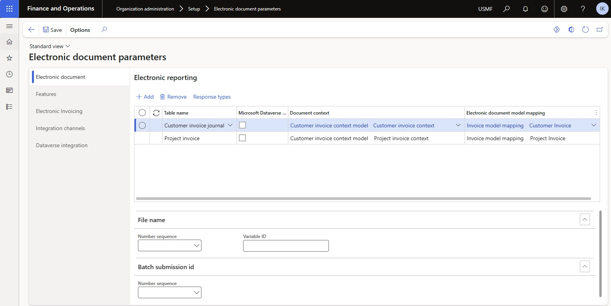

# Get started with Electronic invoicing for Malaysia

[!INCLUDE[banner](../../includes/banner.md)]

This article provides information that will help you get started with Electronic invoicing for Malaysia. It guides you through the configuration steps that are country/region-dependent in Microsoft Dynamics 365 Finance or Dynamics 365 Supply Chain Management.

After you configure Electronic invoicing, you can generate, digitally sign and submit the XML files of electronic invoices according to the regulatory [requirements](https://www.hasil.gov.my/en/e-invoice/) in Malaysia.

> [!NOTE]
> The electronic invoicing approach that this article describes is implemented by using an invoicing service that's applicable only to cloud deployments of Finance or Supply Chain Management.
## Prerequisites

Before you begin the procedures in this article, the following prerequisites must be met:

- The primary address of the legal entity must be in Malaysia.
- Your company must be a registered tax payer in Malaysia and have the following registration numbers: Tax Identification Number (**TIN**), Sales and Service Tax Number (**SST**), and National Registration Identity Card (**NRIC**).
- Obtain **Client ID** and **Client secret** in the Inland Revenue Board of Malaysia (**IRBN**) [Lembaga Hasil Dalam Negeri Malaysia (LHDN)](https://www.hasil.gov.my/). These credentials will be used for extablishing of secure connection to the IRBN portal.
- Obtain a **digital signature certificate** from one of [Malaysian Certification Authorities](https://www.mcmc.gov.my/en/sectors/digital-signature/list-of-licensees). The certificate will be used for digital signing of generated electronic invoices.
- Become familiar with Electronic invoicing as it's described in [Electronic invoicing overview](../global/gs-e-invoicing-service-overview.md).
- Do the common part of Electronic Invoicing service configuration as described in [Set up Electronic invoicing](../global/gs-e-invoicing-set-up-overview.md).

## Azure Key Valut configuration

...............

## Electronic invoicing feature configuration

Some of the parameters from the **Electronic invoicing for Malaysia** Electronic invoicing feature are published with default values. Before you deploy this feature to the service, review the default values, and update them as required, so that they better reflect your business operations.

1. Import the latest version of the **Electronic invoicing for Malaysia** Globalization feature as described in [Import features from the repository](../global/gs-e-invoicing-import-feature-global-repository.md).
1. Create a copy of the imported Globalization feature, and select your configuration provider for it. For more information, see [Create a Globalization feature](../global/gs-e-invoicing-create-new-globalization-feature.md).
1. ====Connection settings=======
1. ====Email action parameters (if necessary)=====
................

1. The copy of the feature is always created as a **Draft** version. Regardless of whether you made changes, complete and deploy the feature as described in [Complete and deploy a Globalization feature](../global/gs-e-invoicing-complete-publish-deploy-globalization-feature.md).

## Electronic document parameters configuration

1. Make sure that the country/region-specific Electronic reporting (ER) configurations for the document context and electronic document model mapping that are required for Malaysia are imported. For more information, see [Set up Electronic invoicing parameters](../global/gs-e-invoicing-set-up-parameters.md#set-up-electronic-document-parameters).

    > [!NOTE]
    > After you import the **Electronic invoicing for Malaysia** Electronic invoicing feature, electronic documents are configured by default. Follow the remaining steps of this procedure if you must make changes.

1. Go to **Organization administration** \> **Setup** \> **Electronic document parameters**.
1. On the **Electronic document** tab, add records for the **Customer Invoice journal** and **Project invoice** table names.
1. For each table name, set the **Document context** and **Electronic document model mapping** fields in accordance with step 1.

    

1. On the **Features** tab, select and enable the **Malaysian electronic invoice** feature.
1. Save your changes, and close the page.

## Configure registration numbers

> [!NOTE]
> The registration numbers of **Enterprise ID (COID)** category will be used as **National Registration Identity Card (NRIC)** numbers while generating output files of electronic invoices. If the **Enterprise ID (COID)** registration category already exists and has been assigned to a registration type, skip this procedure.

1. Go to **Organization administration** \> **Global address book** \> **Registration types** \> **Registration types**.
2. Create a registration type.
3. In the **Country/region** field, select **MYS - Malaysia**.
4. Go to **Organization administration** \> **Global address book** \> **Registration types** \> **Registration categories**.
5. Create a registration category.
6. In the **Registration types** field, select the registration type that you created in step 2.
7. In the **Registration categories** field, select **Enterprise ID (COID)**.

## Configure Sales and Service Tax Numbers

To configure Sales and Service Tax Number (SST) follow the procedure described in this article: [SST registration number](apac-mys-gst.md#gstsst-registration-number)

## Configure electronic document property types

Follow these steps to configure the electronic document property type that is required to define the taxpayer activity code.

1. Go to **Accounts receivable** \> **Setup** \> **Electronic document property types**, and select **New**.
2. Create an electronic document property type.
3. In the **Type** field, enter **ActivityCode**. You must enter the value exactly as it appears here.
4. On the Action Pane, select **Applicability**.
5. In the **Table name** field, select **CompanyInfo**.
6. Save and close the **Electronic document property type applicability setup** page.
7. Select **New** to create another electronic document property type.
8. In the **Type** field, enter **ActivityDescription**. You must enter the value exactly as it appears here.
9. On the Action Pane, select **Applicability**.
10. In the **Table name** field, select **CompanyInfo**.
11. Save and close the **Electronic document property type applicability setup** page.
12. Save and close the **Electronic document property types** page.

## Configure legal entity data

### Enter the address

1. Go to **Organization administration** \> **Organizations** \> **Legal entities**.
2. Select a legal entity.
3. On the **Addresses** FastTab, add a valid primary address for the selected legal entity.

### Enter the registration numbers

1. Go to **Organization administration** \> **Organizations** \> **Legal entities**.
2. Select a legal entity, and then, on the **Tax registration** FastTab, in the **Tax registration number** field, enter the company's Tax Identification Number (TIN).
3. On the Action Pane, select **Registration IDs**.
4. On the **Registration ID** FastTab, select **Add** to create a registration ID.
5. In the **Registration type** field, select the [NRIC](#NRIC) registration type that you created earlier.
6. In the **Registration number** field, enter a valid legal entity NRIC registration number. 
7. Select **Add** to create a new registration ID.
8. In the **Registration type** field, select the [SST](#SST) registration type that you created earlier.
9. In the **Registration number** field, enter a valid legal entity SST registration number.

### Enter a business activity code and description

1. Go to **Organization administration** \> **Organizations** \> **Legal entities**.
2. Select a legal entity, and then, on the Action Pane, select **Electronic document properties**.
3. Select the line where the **Type** field is set to **ActivityCode**.
4. In the **Value** field, enter the taxpayer business activity code.
5. Select the line where the **Type** field is set to **ActivityDescription**.
6. In the **Value** field, enter the taxpayer business activity description.

## Configure customer data

### Enter the address

1. Go to **Accounts receivable** \> **Customers** \> **All customers**.
2. Select a customer.
3. On the **Addresses** FastTab, add a valid address for the selected customer.

### Enter the contact person

1. Go to **Accounts receivable** \> **Customers** \> **All customers**.
2. Select a customer.
3. On the **Sales demographics** FastTab, in the **Primary contact** field, select the person who is considered the buyer's contact.

   > [!NOTE]
   > All available contact persons must already be defined for the selected customer. Make sure that the selected contact person has a valid electronic mail address. This email address will be used for further sending of generated e-invoices to the customer.

### Enter the registration numbers

1. Go to **Accounts receivable** \> **Customers** \> **All customers**.
2. Select a customer, and then, on the **Invoice and delivery** FastTab, in the **Tax exempt number** field, enter a valid Tax Identification Number (TIN) for the customer. T
3. On the Action Pane, on the **Customer** tab, in the **Registration** group, select **Registration IDs**.
4. On the **Registration ID** FastTab, select **Add** to create a registration ID.
5. In the **Registration type** field, select the [NRIC](#NRIC) registration type that you created earlier.
6. In the **Registration number** field, enter a valid NRIC registration number for the customer. 
7. Select **Add** to create a new registration ID.
8. In the **Registration type** field, select the [SST](#SST) registration type that you created earlier.
9. In the **Registration number** field, enter a valid SST registration number  for the customer.

## Configure sales tax codes

1. Go to **Tax** \> **Indirect taxes** \> **Sales tax** \> **Sales tax codes**.
2. Select a sales tax code, and then, on the Action Pane, on the **Sales tax code** tab, in the **Sales tax code** group, select **External codes**.
3. In the **Overview** section, create a line for the selected unit. In the **External code** field, enter the sales tax code that you selected in step 2.
4. In **Value** section, in **Value** field, enter an external code to use for the selected sales tax code, according to the [required codification](https://docs.peppol.eu/poacc/billing/3.0/codelist/UNCL5305/).
5. Go to **Tax** \> **Setup** \> **Sales tax** \> **Sales tax exempt codes**.
6. Define exempt codes that will be used in the event of non-taxable, zero-rated or exempted operations.

## Configure the application-specific parameters

Make sure that the following Electronic reporting (ER) format configurations are imported:

- Sales invoice (MY)
- Project invoice (MY)

Follow these steps to complete the configuration.

1. In the **Globalization Studio** workspace, select the **Electronic reporting** tile, and then select the **Reporting configurations** tile.
1. On the **Configurations** page, select the **Sales invoice (MY)** format configuration.
1. On the **Configurations** menu, in the **Application specific parameters** section, selected **Setup**.
1. In the **Lookups** section, make sure that the **$TaxTypes** lookup is selected.
1. In the **Conditions** section, select **Add** to add a condition.
1. In the **Name** column for the new condition, select the sales tax code that's defined in the application. Then, in the **Lookup result** column, select a tax type code according to the official [Tax type codes list](https://sdk.myinvois.hasil.gov.my/codes/tax-types/).
1. Add specific conditions for each sales tax code that's defined in the system, and save your changes.

    > [!NOTE]
    > In the **Name** column, you can select the **\*Blank\*** or **\*Not blank\*** placeholder value instead of a specific sales tax code.
