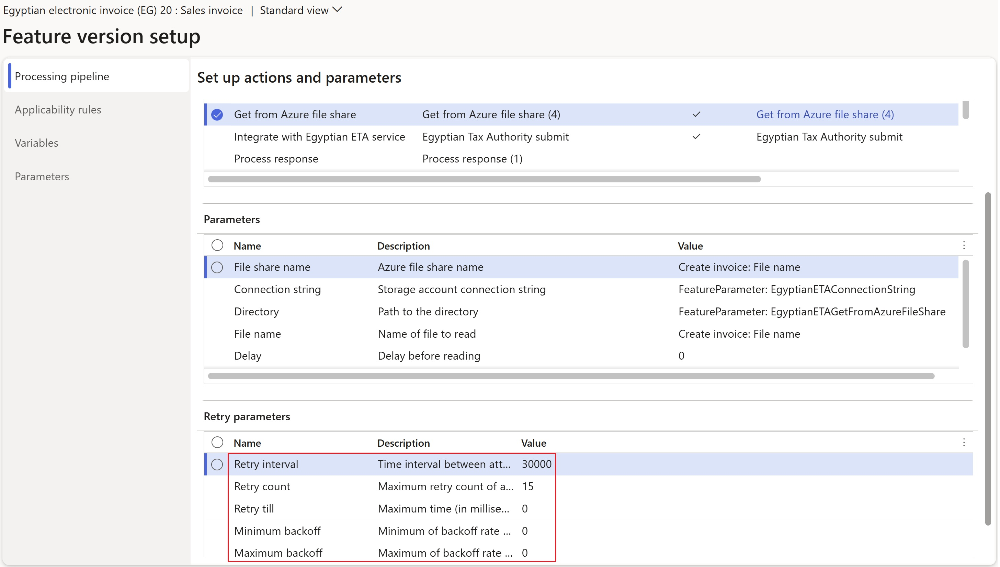
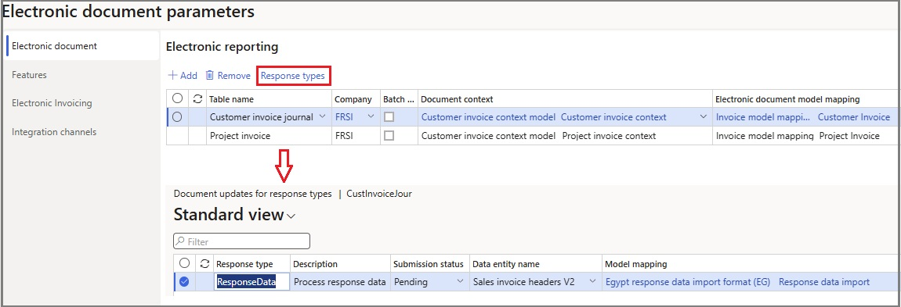

# Electronic invoicing in Egypt

[!include [banner](../../includes/banner.md)]

This article provides information to help you get started with Electronic invoicing for Egypt. It guides you through the configuration steps that are country/region-dependent in Microsoft Dynamics 365 Finance or Dynamics 365 Supply Chain Management. These steps complement the steps that are described in [Electronic invoicing configuration](../global/gs-e-invoicing-set-up-overview.md).

After you configure Electronic invoicing, you can generate JavaScript Object Notation (JSON) files of electronic invoices in the Egypt-specific format and submit them to the Egyptian tax authority.

## Prerequisites

Before you begin the procedures in this article, complete the following prerequisites:

- Become familiar with Electronic invoicing as it's described in [Electronic Invoicing service overview](../global/gs-e-invoicing-service-overview.md).
- Complete the common part of Electronic Invoicing service configuration as described in [Electronic invoicing configuration](../global/gs-e-invoicing-set-up-overview.md).
- Import the **Egyptian electronic invoice (EG)** electronic invoicing feature, version **20** or later, from the repository. Learn more in [Import features from the repository](../global/gs-e-invoicing-import-feature-global-repository.md).
- Configure an Azure file share as described in [Create an Azure file share in the Azure portal](../global/gs-e-invoicing-create-azure-file-share.md).

> [!NOTE]
> Egyptian authorities provide the certificate for digital signing with the required key. They provide this certificate only as a hardware token device that can't be added to an Azure key vault. However, Dynamics 365 Finance enables files to be written to and read from an Azure file share, and that file share can be configured to enable external signing of electronic documents. To learn more, go to the Egyptian tax authority's website by using the link that is provided in [Egyptian eInvoicing & eReceipt SDK - Frequently asked questions](https://sdk.invoicing.eta.gov.eg/faq/).

## Configure the electronic invoicing feature

Some of the parameters from the **Egyptian electronic invoice (EG)** electronic invoicing feature are published with default values. Before you deploy the electronic invoicing feature, review the default values, and update them as required, so that they better reflect your business operation.

To configure the electronic invoicing feature, follow these steps.

1. Make sure that the latest version of the **Egyptian electronic invoice (EG)** Globalization feature is imported as described in [Import features from the repository](../global/gs-e-invoicing-import-feature-global-repository.md).
1. Create a copy of the imported Globalization feature, and select your configuration provider for it. Learn more in [Create Globalization features](../global/gs-e-invoicing-create-new-globalization-feature.md).
1. On the **Versions** tab, verify that the **Draft** version is selected.
1. On the **Feature parameters** tab, specify values for the following connection and integration parameters. These parameters are required for interoperation with Egyptian tax authority's services.

    - **EgyptianETAClientID** – Enter the client ID that the regulatory authority provided.
    - **EgyptianETAClientSecret** – Enter the secret that the regulatory authority provided.
    - **EgyptianETAConnectionString** – Enter the connection string for the Azure file share that you provisioned as described in [Create an Azure file share in the Azure portal](../global/gs-e-invoicing-create-azure-file-share.md).
    - **EgyptianETASendToFileShareDirectory** – Enter the name of the Azure file share directory that invoices for digital signing should be written to.
    - **EgyptianETAGetFromAzureFileShare** – Enter the name of the Azure file share directory that digitally signed invoices should be read from.
    - **EgyptianETALoginserviceURL** – Enter the URL of the Egyptian tax authority's login service. The feature that Microsoft released points to the pre-production endpoint.
    - **EgyptianETAWebserviceURL** – Enter the URL of the Egyptian tax authority's web service. The feature that Microsoft released points to the pre-production endpoint.

    The following illustration shows an example of a feature parameter setup that includes the URL for the Egyptian tax authority's pre-production endpoint.

    

    > [!NOTE]
    > Because external signing is involved, features that Microsoft publishes repeatedly check the availability of signed invoices until a maximum limit is reached. You can reconfigure the retry parameters as you require by following the next two steps.

1. To reconfigure the retry parameters, on the **Setups** tab, select the **Sales invoice** or **Project invoice** setup, depending on the scenario. Then select **Edit**.
1. On the **Processing pipeline** tab, select the **Get from Azure file share** action, and then, in the **Retry parameters** section, configure the required values.

    

1. Complete the **Egyptian electronic invoice (EG)** feature, and deploy it to the service. Learn more in [Complete and deploy a Globalization feature](../global/gs-e-invoicing-complete-publish-deploy-globalization-feature.md).

## Configure electronic document parameters

To configure electronic document parameters, follow these steps.

1. Make sure that the country/region-specific Electronic reporting (ER) configurations for the document context and electronic document model mapping that are required for Egypt are imported. Learn more in [Set up Electronic document parameters](../global/gs-e-invoicing-set-up-parameters.md#set-up-electronic-document-parameters).
1. In addition to the ER configurations that are mentioned in step 1, import the Egypt-specific **Egypt response data import format (EG)** configuration from the repository. Learn more in [Import Electronic reporting (ER) configurations from Dataverse](../global/workspace/gsw-import-er-config-dataverse.md).

    > [!NOTE]
    > After you import the **Egyptian electronic invoice (EG)** electronic invoicing feature, electronic documents are configured by default. Follow the remaining steps of this procedure if you must make changes. Otherwise, consider them informational only.

1. Go to **Organization administration** \> **Setup** \> **Electronic document parameters**.
1. On the **Electronic document** tab, add records for the **Customer Invoice journal** and **Project invoice** table names.
1. For each table name, set the **Document context** and **Electronic document model mapping** fields in accordance with step 1.

    

1. For each table name, select **Response types**, and then follow these steps:

    1. On the **Response types** page, select **Add** to create a response type.
    1. In the **Response type** field, enter **ResponseData**.
    1. In the **Description** field, enter **Process response data**.
    1. In the **Submission status** field, select **Pending**.
    1. In the **Data entity name** field, select **SalesInvoiceHeaderV2Entity**.
    1. In the **Model mapping** field, select **Response data import**. The configuration is **Egypt response data import format (EG)**.
    1. Select **Save**, and then close the **Response types** page.
 
1. Select **Save**, and then close the **Electronic document parameters** page.

## Finance business data configuration

Follow the configuration steps in [Customer electronic invoices in Egypt](emea-egy-e-invoices.md)

## Issue electronic invoices

After you complete all the required configuration steps, you can generate and submit electronic invoices for posted invoices by going to **Organization administration** \> **Periodic** \> **Electronic documents** \> **Submit electronic documents**. Learn more about how to generate electronic invoices in [Submit electronic documents](../global/e-invoicing-submit-electronic-documents.md).

You can inquire about the results of a submission by going to **Organization administration** \> **Periodic** \> **Electronic documents** \> **Electronic document submission log** and selecting the required document type. Learn more in [Work with Electronic document submission log](../global/e-invoicing-submission-log.md).

## Privacy notice

Enabling the **Egyptian electronic invoice (EG)** feature might require that limited data is sent. This data includes the organization's tax registration ID. The data will be transmitted to third-party agencies that the tax authority authorized to send electronic invoices to it in the predefined format that is required for integration with the government's web service. An administrator can enable and disable the feature by going to **Organization administration** \> **Setup** \> **Electronic document parameters**. On the **Features** tab, select the row that contains the **Egyptian electronic invoice (EG)** feature, and then make the appropriate selection. Data that is imported from external systems into this Dynamics 365 online service are subject to our [privacy statement](https://go.microsoft.com/fwlink/?LinkId=512132). For more information, see the "Privacy notice" section in country/region-specific feature documentation.

[!INCLUDE[footer-include](../../../includes/footer-banner.md)]
