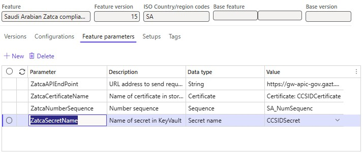

# Electronic invoicing in Saudi Arabia 

[!INCLUDE[banner](../../includes/banner.md)]

This article provides information that will help you get started with phase two of Electronic invoicing for Saudi Arabia. It guides you through the configuration steps that are country/region-dependent in Microsoft Dynamics 365 Finance or Dynamics 365 Supply Chain Management. These steps complement the steps that are described in [Electronic invoicing setup](../global/e-invoicing-set-up-overview.md).

## Prerequisites

Before you begin the procedures in this article, complete the following prerequisites:

- Become familiar with Electronic invoicing as it's described in [Electronic Invoicing service overview](../global/gs-e-invoicing-service-overview.md).
- Do the common part of Electronic Invoicing service configuration as described in [Electronic invoicing configuration](../global/gs-e-invoicing-set-up-overview.md).
- Import the **Saudi Arabian Zatca submission (SA)** version **14** or later and **Saudi Arabian ZATCA compliance check (SA)** version **20** or later Electronic invoicing features from the repository. For more information, see [Import features from the repository](../global/gs-e-invoicing-import-feature-global-repository.md).

## Configure the application-specific parameters

Before you begin, make sure that the following Electronic reporting (ER) format configurations are imported:

- Sales e-invoice (SA)
- Project e-invoice (SA)

Follow these steps to complete the configuration.

1. In the **Globalization Studio** workspace, select the **Electronic reporting** tile, and then select the **Reporting configurations** tile.
1. On the **Configurations** page, select the **Sales e-invoice (SA)** format configuration.
1. On the **Configurations** menu, in the **Application specific parameters** section, selected **Setup**.
1. In the **Lookups** section, make sure that the **PaymentMethodSubstitutionLookup** lookup is selected.
1. In the **Conditions** section, select **Add** to add a condition.
1. In the **Name** column for the new condition, select the method of payment that's defined in the application. Then, in the **Lookup result** column, select a standardized method of payment code according to [UN/EDIFACT Code list 4461](https://unece.org/fileadmin/DAM/trade/untdid/d16b/tred/tred4461.htm).
1. Add specific conditions for each method of payment that's defined in the system, and save your changes.

    > [!NOTE]
    > In the **Name** column, you can select the **\*Blank\*** or **\*Not blank\*** placeholder value instead of a specific method of payment.

1. In the **State** field, change the state of the application-specific parameters to **Completed**. Then select **Save**.
1. Repeat steps 2 through 8 for the **Project e-invoice (SA)** ER format configuration as required.

## Configure Electronic document parameters

Follow these steps to complete the configuration.

1. Make sure that the country/region-specific ER configurations that are required for Saudi Arabia are imported. For more information, see [Configure Electronic invoicing parameters](../global/gs-e-invoicing-set-up-parameters.md).
1. Go to **Organization administration** \> **Setup** \> **Electronic document parameters**.
1. On the **Electronic document** tab, add records for the **Customer Invoice journal** and, if required, for the **Project invoice**, **Journal lines**, and **Fiscal transaction document** table names.
1. For each table name, set the **Document context** and **Electronic document model mapping** fields in accordance with step 1.
1. For the **Customer Invoice journal** table name, select **Response types**.

    > [!NOTE]
    > When tax invoices are cleared, the Saudi Arabian tax authority (Zakat, Tax and Customs Authority \[ZATCA\]) generates a QR code that contains the digital signature for that clearance. This QR code must be imported back into Finance, together with other clearance information that the tax authority returns as a result of the submission of the tax invoices. To achieve this result, you must configure the response types in Finance.

1. Create a response type that has the same name as the related variable in the value of the **Configuration Integration point** parameter in the **Transform document (export), export QRCode** processing pipeline's action for the **Sales invoice** feature setup. The default value is **ResponseData**.
1. In the **Submission status** field, select **Pending**.
1. In the **Data entity name** field, select **Sales invoice QR code entity**.
1. In the **Model mapping** field, select **Zatca response data import**.

    

1. On the **Electronic invoicing** tab, on the **Number sequences** FastTab, add a record for the number sequence that should be used to count submitted electronic invoices.

## Configure Electronic invoicing features

> [!NOTE]
> This section describes the configuration steps for the **Saudi Arabian Zatca submission (SA)** Electronic invoicing feature. These steps assume that the [onboarding](#onboarding) process is completed, and that you've obtained the Production Cryptographic Stamp Identifier (PCSID). If the onboarding process is still in progress, and you've obtained only the Compliance Cryptographic Stamp Identifier (CCSID), complete the same configuration steps for the **Saudi Arabian ZATCA compliance check (SA)** Electronic invoicing feature.

Some of the parameters from the **Saudi Arabian Zatca submission (SA)** Electronic invoicing feature are published with default values. Before you deploy the Electronic invoicing feature to the service, review the default values, and update them as required so that they better reflect your business operations.

1. In the **Globalization Studio** workspace, select the **Electronic invoicing** tile.
1. On the **Electronic invoicing features** page, verify that the **Saudi Arabian Zatca submission (SA)** Electronic invoicing feature is selected.
1. On the **Versions** tab, verify that the **Draft** version is selected.
1. On the **Feature parameters** tab, specify values for the following connection and integration parameters that are required for interoperation with ZATCA's API:

    - **ZatcaAPIEndPoint** – Enter the URL of the development portal or the production environment that ZATCA provided.
    - **ZatcaCertificateName** – Select **CCSID** or **PCSID**, depending on your place in the [onboarding](#onboarding) process.
    - **ZatcaSecretName** – Select **CCSIDSecret** or **PCSIDSecret**, depending on your place in the onboarding process.
    - **ZatcaNumberSequence** – Select the [number sequence](#NumberSequence) that you previously created on the **Electronic document parameters** page.

    The following illustration shows an example of a feature parameter setup that includes the URL for ZATCA's production endpoint. Update the values based on the configuration on the **Electronic document parameters** page.

    

1. On the **Setups** menu, select the **Sales invoice** feature setup, and then select **Edit**.

    > [!NOTE]
    > For the **Saudi Arabian ZATCA compliance check (SA)** Electronic invoicing feature, select the **Tax invoice compliance check** feature setup instead.

1. In the **Processing pipeline** section, select **Integrate with Saudi Arabia Zatca service**, and then follow these steps:

    1. Select the **API method name** name.
    1. In the **Value** field, select **Invoice clearance** for tax invoices or **Invoice reporting** for simplified invoices.

        > [!NOTE]
        > Depending on your place in the [onboarding](#onboarding) process, create either a CCSID or a PCSID, and configure it in advance in the [Key Vault parameters](../global/gs-e-invoicing-set-up-parameters.md#create-a-key-vault-reference).

1. If required, repeat steps 4 through 9 for the **Project invoice**, **Prepayment invoice**, and **Retail simplified invoice** feature setups.

    > [!NOTE]
    > For the **Saudi Arabian ZATCA compliance check (SA)** Electronic invoicing feature, repeat steps 4 through 9 for the **Simplified invoice compliance check** and **Retail fiscal document compliance check** feature setups instead.

1. Complete and deploy the **Saudi Arabian Zatca submission (SA)** feature to the service. For more information, see [Complete and deploy a Globalization feature](../global/gs-e-invoicing-complete-publish-deploy-globalization-feature.md).

For more information about business data configuration and processing in Finance, see [Customer electronic invoices in Saudi Arabia](emea-sau-e-invoices.md).

## Electronic invoicing onboarding in Saudi Arabia

Onboarding is mandatory for all taxpayers who are subject to electronic invoicing in Saudi Arabia. Taxpayers and their software for e-invoicing must be onboarded with ZATCA. As a result of the onboarding process, taxpayers obtain Cryptographic Stamp Identifiers (CSIDs). CSIDs are required for integration with the electronic invoicing portal that ZATCA manages, and for further submission of electronic invoices.

Onboarding is an essential part of the Electronic invoicing configuration. For more information about the onboarding process, see [Onboarding for electronic invoicing in Saudi Arabia](gs-e-invoicing-sa-onboarding.md).

## Issue electronic invoices

After you complete all the required configuration steps, you can generate and submit electronic invoices for posted invoices. For more information about how to generate electronic invoices, see [Submit electronic documents](../e-invoicing-issuing-electronic-invoices-finance-supply-chain-management.md).

You can inquire about the results of a submission by going to **Organization administration** \> **Periodic** \> **Electronic documents** \> **Electronic document submission log** and selecting the required document type.

## Additional resources

- [Electronic Invoicing service overview](../global/gs-e-invoicing-service-overview.md)
- [Customer electronic invoices in Saudi Arabia](emea-sau-e-invoices.md)

[!INCLUDE[footer-include](../../../includes/footer-banner.md)]
