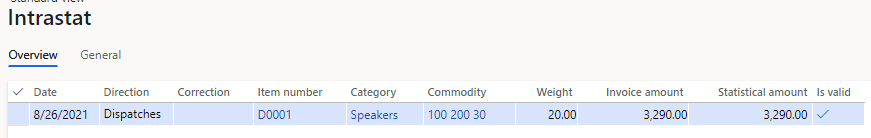
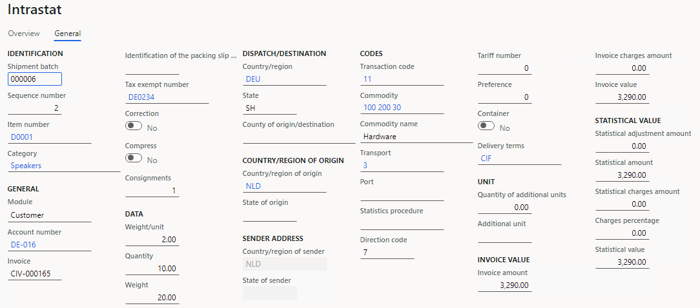
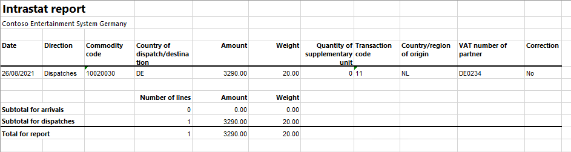
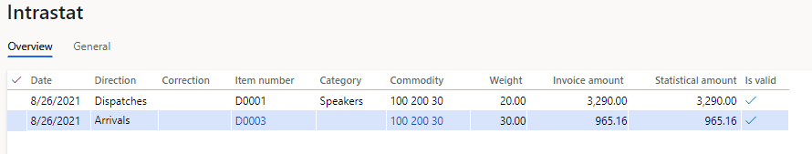
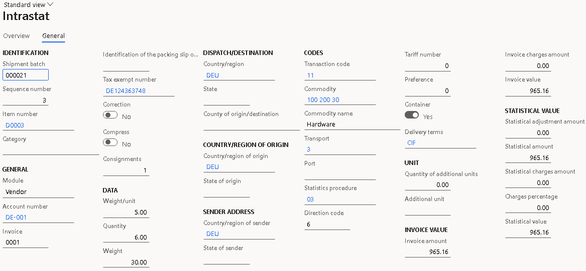
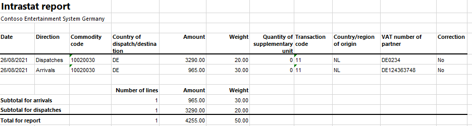

# Netherlands Intrastat

[!include [banner](../../includes/banner.md)]

This article explains how to set up the Netherlands Intrastat report in Microsoft Dynamics 365 Finance.

The **Intrastat** page is used to generate and report information about trade among European Union (EU) countries/regions. The Netherlands Intrastat declaration contains information about the trade of goods for reporting.

The following table lists the fields that are included on the Intrastat report. Some of the fields are available on arrivals while others are available on dispatches. If the field is available, we have indicated that it's included. If it's not available, we have indicated that it's not included. When there is a fixed field value, the value is provided in the table.

| **Field** | **Description** | **Arrivals** | **Dispatches** |
|-------------------------|-------------------------|-------------------------|-------------------------|
| Record type | Fixed text indicating the start of the report. | "9801" | "9801" |
| PSI/Agent VAT number | The Dutch value-added tax (VAT) number (BTW-nummer) of the company that is providing the statistical declaration to Statistics Netherlands. It consists of nine digits, the letter <em>B</em>, and then two more digits (for example, 123456789B01). (PSI is an abbreviation for "party liable to provide statistical information.") | Yes | Yes |
| Reporting period | The period (year and month) that the declaration applies to. | Yes | Yes |
| PSI/Agent name | The name of the company that is providing the statistical declaration to Statistics Netherlands. | Yes | Yes |
| Statistics Netherlands registration number | The software registration number. | Yes | Yes |
| Version number | The software version number. | Yes | Yes |
| Creation date and time | The date and time of the report creation. | Yes | Yes |
| PSI/Agent telephone number | The telephone number of the PSI or agent. | Yes | Yes |
| Transaction period | The year and month when the transfer of commodities occurred. | Yes | Yes |
| Flow | An indication of the nature of the commodity flow. | Yes | Yes |
| Reporting agent's VAT number | The VAT number of the trader that the information is provided for. It consists of nine digits, the letter <em>B</em>, and then two more digits (for example, 123456789B01). | Yes | Yes |
| Country of origin | The country or region where the commodities were produced or manufactured. | No | Yes |
| Partner member state | The country or region of origin (the country or region that the commodities were transported to the Netherlands from). Alternatively, the country or region of destination (the country or region that the commodities are intended to be transported to). | Yes | Yes |
| Mode of transport | The way that the commodities are transported to or from the Netherlands. | Yes | Yes |
| Container | This field doesn't apply for Intrastat. | "0" | "0" |
| Traffic region/port | This field doesn't apply for Intrastat. | "00" | "00" |
| Statistical system | This field doesn't apply for Intrastat. | "00" | "00" |
| Commodity code | The eight-digit commodity code according to the Combined Nomenclature. | Yes | Yes |
| Taric | This field doesn't apply for Intrastat. | "00" | "00" |
| Weight | The weight rounded off in kilograms. | Yes | Yes |
| Special measure | The supplementary unit. | Yes | Yes |
| Invoice value | The value that the seller charges to the buyer. This value must be specified in euros. | Yes | Yes |
| Statistical value | This field doesn't apply for Intrastat. | "0000000000" | "0000000000" |
| Administrative number | The invoice number. | Yes | Yes |
| Transaction | The nature of the agreement that forms the basis for the delivery of commodities. | No | Yes |
| Partner ID | The customer's foreign VAT number in an EU member state. | No | Yes |
| Record type (end record) | Fixed text indicating the end of the report | "9899" | "9899" |

## Set up Intrastat

From the Global repository, import the latest version of the following Electronic reporting (ER) configurations:

- Intrastat model
- Intrastat report
- Intrastat (NL)

For more information, see [Download ER configurations from the Global repository of Configuration service](../../../fin-ops-core/dev-itpro/analytics/er-download-configurations-global-repo.md).

### Set up VAT IDs

#### Create registration type for company code

To create a registration type for a company code, follow these steps.

1. In Dynamics 365 Finance, go to **Organization administration** \> **Global address book** \> **Registration types** \> **Registration types**.
1. On the Action Pane, select **New** to create the registration type for the VAT ID.
1. In the **Enter registration type details** dialog, in the **Name** field. enter a name for the new registration type. For example, enter **VAT ID**.
1. In the **Country/region** field, select **NLD**.
1. Select **Create**.

You also have to create VAT ID registration types for all the countries or regions that your company does business with.

#### Match the registration type with registration category

To match the registration type with registration category, follow these steps.

1. In Dynamics 365 Finance, go to **Organization administration** \> **Global address book** \> **Registration types** \> **Registration categories**.
1. On the Action Pane, select **New** to create new link between registration type and registration category.
1. For the registration type for the VAT ID, select the **VAT ID** registration category.
1. Repeat steps 2 through 3 for the other countries/regions' registration types that you created earlier.

#### Set up a VAT ID of data provider for your company

To set up a VAT ID of data provider for your company, follow these steps.

1. In Dynamics 365 Finance, go to **Organization administration** \> **Organizations** \> **Legal entities**.
1. In the grid, select your company.
1. On the Action Pane, select **Registration IDs**.
1. On the **Registration ID** FastTab, select **Add**.
1. In the **Registration type** field, select the registration type that you created earlier.
1. Enter your company's data provider VAT ID.

#### Create a customer's VAT registration number

To create a customer's VAT registration number, follow these steps.

1. In Dynamics 365 Finance, go to **Accounts receivable** \> **Customers** \> **All customers** and in the grid select a customer.
1. On the Action Pane on the **Customer** Tab, in the **Registration** section select **Registration IDs.**
1. On the **Registration ID** FastTab select **Add** to create new registration ID.
1. In the **Registration type** field select the registration type that you created on the **Create registration type for company code** step.
1. In the **Registration number** field enter the company's VAT number.
1. On the Action Pane select **Save** and close the page.

For more information, see [Registration IDs](../europe/emea-registration-ids.md).

Alternatively, you can create Customer's VAT registration numbers using **Tax exempt number** page:

1. In Dynamics 365 Finance, go to **Tax** \> **Setup** \> **Sales tax** \> **Tax exempt numbers**.
1. For each tax-exempt number, create a record that includes the following information:

    - In the **Country/region** field, select the tax registration of the counterparty.
    - In the **Tax exempt number** field, enter the tax-exempt number of the counterparty.
    - In the **Company name** field, enter the name of the counterparty.

1. Go to **Accounts receivable** \> **Customers** \> **All customers** and in the grid select a customer.
1. On the **Invoice and delivery** FastTab, in the **Sales tax** section, in the **Tax exempt number** field select the registration number created on the previous step.

### Set up foreign trade parameters

To set up foreign trade parameters, follow these steps.

1. In Dynamics 365 Finance, go to **Tax** \> **Setup** \> **Foreign trade parameters**.
1. On the **Intrastat** tab, on the **Electronic reporting** FastTab, in the **File format mapping** field, select **Intrastat (NL)**.
1. In the **Report format mapping** field, select **Intrastat report**.
1. On the **Commodity code hierarchy** FastTab, in the **Category hierarchy** field, select **Intrastat**.
1. In the **Transaction code** field, select the transaction code for property transfers. You use this code for transactions that produce actual or planned transfers of property against compensation (financial or otherwise). You also use it for corrections. Companies in the Netherlands use two-digit transaction codes.
1. In the **Credit note** field, select the transaction code for the return of goods. You use this code for the return of goods after the transaction that was originally recorded under the transaction code.
1. On the **Country/region properties** tab, in the **Country/region** field, list all the countries or regions that your company does business with. For each country that is part of the EU, in the **Country/region type** field, select **EU**, so that the country appears on your Intrastat report.
1. On the **Agent** tab, on the **Agent** FastTab, enter information about the company that is providing the statistical declaration to Statistics Netherlands.

### Set up product parameters for the Intrastat declaration

To set up product parameters for the Intrastat declaration, follow these steps.

1. In Dynamics 365 Finance, go to **Product information management** \> **Products** \> **Released products**.
1. In the grid, select a product.
1. On the **Foreign trade** FastTab, in the **Intrastat** section, in the **Commodity** field, select the commodity code.
1. In the **Origin** section, in the **Country/region** field, select the product's country or region of origin.
1. On the **Manage inventory** FastTab, in the **Net weight** field, enter the product's weight in kilograms.
1. Go to **Tax** \> **Setup** \> **Foreign trade** \> **Compression of Intrastat**, and select the fields that should be compared when Intrastat information is summarized. For Netherlands Intrastat, select the following fields:

    - Commodity
    - Transaction code
    - Country/region of origin
    - Transport
    - Country/region of sender
    - Country/region
    - Correction
    - Tax exempt number
    - Direction
    - Invoice

### Set up transport parameters for the Intrastat declaration

Follow these steps to set up the transport method and assign a transport mode to a mode of delivery.

To set up transport parameters for the Intrastat declaration, follow these steps.

1. In Dynamics 365 Finance, go to **Tax** \> **Setup** \> **Foreign trade**.
1. On the Action Pane, select **New**.
1. In the **Transport** field, enter a unique code. Note that companies in the Netherlands use one-digit transport codes.
1. Go to **Procurement and sourcing** \> **Setup** \> **Distribution** \> **Modes of delivery**.
1. In the grid, select a mode of delivery.
1. On the **Foreign trade** FastTab, in the **Transport** field, select the corresponding transport.

## Intrastat transfer

On the **Intrastat** page, on the Action Pane, you can select **Transfer** to automatically transfer the information about intracommunity trade from your sales orders, free text invoices, purchase orders, vendor invoices, vendor product receipts, project invoices, and transfer orders. Only documents that have an EU country as the country or region of destination or consignment will be transferred.

You can also manually enter transactions by selecting **New** on the Action Pane.

### Generate an Intrastat report

To generate an Intrastat report, follow these steps.

1. In Dynamics 365 Finance, go to **Tax** \> **Declarations** \> **Foreign trade** \> **Intrastat**.
1. On the Action Pane, select **Output** \> **Report**.
1. In the **Intrastat Report** dialog, set the following fields.

    | Field            | Description                                                                                |
    |------------------|--------------------------------------------------------------------------------------------|
    | From date        | Select the start date for the report.                                                      |
    | To date          | Select the end date for the report.                                                        |
    | Generate file    | Set this option to **Yes** to generate a .txt file for your Intrastat report.              |
    | File name        | Enter the name of the .txt file.                                                           |
    | Generate report  | Set this option to **Yes** to generate an .xlsx file for your Intrastat report.            |
    | Report file name | Enter the name of the .xlsx file.                                                          |
    | Only corrections | Set this option to **Yes** to generate an Intrastat report that includes only corrections. |

1. Select **OK**, and review the generated reports.

## Example

This example shows how to post arrivals and dispatches for Intrastat by using the **DEMF** legal entity.

### Preliminary setup

To do the preliminary setup, follow these steps.

1. In Dynamics 365 Finance, go to **Organization administration** \> **Organization** \> **Legal entities**, and select the **DEMF** legal entity.
1. On the **Addresses** FastTab, select **Edit**, and then, in the **Country/region** field, select **NLD (Netherlands)**.
1. Import the latest version of the following ER configurations:

    - Intrastat model
    - Intrastat report
    - Intrastat (NL)

### Create registration types for company codes

To create registration types for company codes, follow these steps.

1. In Dynamics 365 Finance, go to **Organization administration** \> **Global address book** \> **Registration types** \> **Registration types**.
1. Verify that **VATID** registration type for German VAT ID have been created.
1. On the Action Pane, select **New** to create the registration type for the VAT ID.
1. In the **Enter registration type details** dialog, in the **Name** field enter **VAT ID**.
1. In the **Country/region** field, select **NLD**.
1. Select **Create**.

### Match the registration type with registration category

To match the registration type with registration category, follow these steps.

1. In Dynamics 365 Finance, go to **Organization administration** \> **Global address book** \> **Registration types** \> **Registration categories**.
1. Verify that registration type **VATID** for Germany have been matched with the **VAT ID** registration category.
1. On the Action Pane, select **New** to create new link between registration type and registration category.
1. For the registration type **VAT ID**, select the **VAT ID** registration category.

### Set up a VAT ID of data provider for your company

To set up a VAT ID of data provider for your company, follow these steps.

1. In Dynamics 365 Finance, go to **Organization administration** \> **Organizations** \> **Legal entities**.
1. In the grid, select **DEMF**.
1. On the Action Pane, select **Registration IDs**.
1. On the **Registration ID** FastTab, select **Add**.
1. In the **Registration type** field, select **VAT ID**.
1. In the **Registration number** field enter **000099998B57**.

### Set up a customer's VAT registration number

To set up a customer's VAT registration number, follow these steps.

1. In Dynamics 365 Finance, go to **Accounts receivable** \> **Customers** \> **All customers** and in the grid select **DE-016**.
1. On the Action Pane on the **Customer** Tab, in the **Registration** group select **Registration IDs.**
1. On the **Registration ID** FastTab select **Add** to create new registration ID.
1. In the **Registration type** field select **VATID**.
1. In the **Registration number** field enter **DE0234**.
1. On the Action Pane select **Save** and close the page.

### Set up foreign trade parameters

To set up foreign trade parameters, follow these steps.

1. In Dynamics 365 Finance, go to **Tax** \> **Setup** \> **Foreign trade** \> **Foreign trade parameters**.
1. On the **Intrastat** tab, on the **General** FastTab, in the **Transaction** **code** field, select **11**.
1. On the **Electronic reporting** FastTab, in the **File format mapping** field, select **Intrastat (NL)**.
1. In the **Report format mapping** field, select **Intrastat Report**.
1. On the **Commodity code hierarchy** FastTab, in the **Category hierarchy** field, verify that **Intrastat** is selected.
1. On the **Country/region properties** tab, select **New**.
1. In the **Party country/region** field, select **NLD**.
1. In the **Country/region type** field, select **Domestic**.
1. In the **Party country/region** field, select **DEU**. Then, in the **Country/region type** field, select **EU**.
1. On the **Agent** tab, on the **Agent** FastTab, in the **Contact information** section, in the **Telephone** field, enter **12345678901**.
1. In the **Sales tax** section, in the **Tax exempt number** field, enter **123456789B01**.

### Set up product information

To set up product information, follow these steps.

1. In Dynamics 365 Finance, go to **Product information management** \> **Products** \> **Released products**.
1. In the grid, select **D0001**.
1. On the **Foreign trade** FastTab, in the **Intrastat** section, in the **Commodity** field, select **100 200 30**.
1. In the **Origin** section, in the **Country/region** field, select **NLD**.
1. On the **Manage inventory** FastTab, in the **Weight measurements** section, in the **Net weight** field, enter **2**.
1. On the Action Pane, select **Save**.
1. In the grid, select **D0003**.
1. On the **Foreign trade** FastTab, in the **Intrastat** section, in the **Commodity** field, select **100 200 30**.
1. In the **Origin** section, in the **Country/region** field, select **DEU**.
1. On the **Manage inventory** FastTab, in the **Weight measurements** section, in the **Net weight** field, enter **5**.
1. On the Action Pane, select **Save**.

### Change the site address

To change the site address, follow these steps.

1. In Dynamics 365 Finance, go to **Warehouse management** \> **Setup** \> **Warehouse** \> **Sites**.
1. In the grid, select **1**.
1. On the **Addresses** FastTab, select **Edit**.
1. In the **Edit address** dialog, in the **Country/region** field, select **NLD**.
1. Select **OK**.

### Set up transport parameters

To set up transport parameters, follow these steps.

1. In Dynamics 365 Finance, go to **Tax** \> **Setup** \> **Foreign trade** \> **Transport method**.
1. On the Action Pane, select **New**.
1. In the **Transport** field, enter **3**.
1. In the **Description** field, enter **Transport by road**.
1. Go to **Procurement and sourcing** \> **Setup** \> **Distribution** \> **Modes of delivery**.
1. In the grid, select **10**.
1. On the **Foreign trade** FastTab, in the **Transport** field, select **3**.

### Create a sales order with an EU customer

To create a sales order with an EU customer, follow these steps.

1. In Dynamics 365 Finance, go to **Accounts receivable** \> **Orders** \> **All sales orders**.
1. On the Action Pane, select **New**.
1. In the **Create sales order** dialog, on the **Customer** FastTab, in the **Customer** section, in the **Customer account** field, select **DE-016**.
1. On the **General** FastTab, in the **Storage dimensions** section, in the **Site** field, select **1**.
1. In the **Warehouse** field, select **11**.
1. Select **OK**.
1. On the **Header** tab, on the **Delivery** FastTab, in the **Misc. delivery info** section, in the **Mode of delivery** field, select **10**.
1. On the **Lines** tab, on the **Sales order lines** FastTab, in the **Item number** field, select **D0001**. Then, in the **Quantity** field, enter **10**.
1. On the **Line details** FastTab, on the **Foreign trade** tab, verify that the **Transaction code**, **Transport**, **Commodity**, and **Country/region of origin** fields are automatically set.
1. On the Action Pane, select **Save**.
1. On the Action Pane, on the **Invoice** tab, in the **Generate** group, select **Invoice**.
1. In the **Posting invoice** dialog, on the **Parameters** FastTab, in the **Parameter** section, in the **Quantity** field, select **All**.
1. Select **OK** to post the invoice.

### Transfer a transaction to the Intrastat journal and review the result

To transfer a transaction to the Intrastat journal and review the result, follow these steps.

1. In Dynamics 365 Finance, go to **Tax** \> **Declarations** \> **Foreign trade** \> **Intrastat**.
1. On the Action Pane, select **Transfer**.
1. In the **Intrastat (Transfer)** dialog, in the **Parameters** section, set the **Customer invoice** option to **Yes**.
1. Select **Filter**.
1. In the **Intrastat Filter** dialog, on the **Range** tab, select the first line, and verify that the **Field** field is set to **Date**.
1. In the **Criteria** field, select the current date.
1. Select **OK** to close the **Intrastat Filter** dialog.
1. Select **OK** to close the **Intrastat (Transfer)** dialog, and review the result. The line represents the sales order that you created earlier.

    

1. Select the transaction line, and then select the **General** tab to view more details.

    

1. On the Action Pane, select **Output** \> **Report**.
1. In the **Intrastat Report** dialog, on the **Parameters** FastTab, in the **Date** section, select the month when the sales order is created.
1. In the **Export** **options** section, set the **Generate file** option to **Yes**. Then, in the **File name** field, enter the required name.
1. Set the **Generate report** option to **Yes**. Then, in the **Report file name** field, enter the required name.
1. Select **OK**, and review the report in .txt format that is generated. The following table shows the values in the example report.

    | **Field**                                                | **Value**        |
    |----------------------------------------------------------|------------------|
    | Record type                                              | 9801             |
    | PSI/Agent VAT number                                     | 123456789B01     |
    | Reporting period                                         | 202108           |
    | PSI/Agent name                                           | Finanzamt Berlin |
    | Creation date and time                                   | 20210826074437   |
    | PSI/Agent telephone number                               | 12345678901      |
    | Transaction period                                       | 202108           |
    | Flow                                                     | 7                |
    | Reporting agent's VAT number                             | 000099998B57     |
    | Line number                                              | 00001            |
    | Country of origin                                        | NL               |
    | Country of origin/destination                            | DE               |
    | Mode of transport                                        | 3                |
    | Container                                                | 0                |
    | Traffic region/port                                      | 00               |
    | Statistical system (does not apply for Intrastat report) | 00               |
    | Commodity code                                           | 10020030         |
    | Taric                                                    | 00               |
    | Weight                                                   | +0000000020      |
    | Special measure                                          | +0000000000      |
    | Invoice value                                            | +0000003290      |
    | Statistical value (does not apply for Intrastat report)  | +0000000000      |
    | Administrative number                                    | CIV-000165       |
    | Transaction                                              | 11               |
    | Partner ID                                               | DE0234           |
    | Record type                                              | 9899             |

1. Review the report in Excel format that is generated.

    

### Create a purchase order

To create a purchase order, follow these steps.

1. In Dynamics 365 Finance, go to **Accounts payable** \> **Purchase orders** \> **All purchase orders**.
1. On the Action Pane, select **New**.
1. In the **Create purchase order** dialog, in the **Vendor account** field, select **DE-001**.
1. Select **OK**.
1. On the **Header** tab, on the **Delivery** FastTab, verify that the **Mode of delivery** field is set to **10**.
1. On the **Foreign** **trade** FastTab, in the **Transaction code** field, select **1**.
1. Verify that the **Transport** field is set to **3**.
1. On the **Lines** tab, on the **Purchase order lines** FastTab, in the **Item number** field, select **D0003**. Then, in the **Quantity** field, enter **6**.
1. On the **Line details** FastTab, on the **Foreign trade** tab, in the **Foreign trade** section, verify that the **Transaction code**, **Transport**, **Commodity** and **Country/region of origin** fields are automatically set.
1. On the Action Pane, on the **Purchase** tab, in the **Actions** group, select **Confirm**.
1. On the Action Pane, on the **Invoice** tab, in the **Generate** group, select **Invoice**.
1. On the Action Pane, select **Default from**. In the **Default quantity for lines** field, select **Ordered quantity**. Then select **OK**.
1. On the **Vendor invoice header** FastTab, in the **Invoice identification** section, in the **Number** field, enter **0001**.
1. In the **Invoice dates** section, in the **Invoice date** field, select **8/26/2021** (August 26, 2021).
1. On the Action Pane, select **Post** to post the invoice.

### Create an Intrastat declaration for arrivals

To create an Intrastat declaration for arrivals, follow these steps.

1. In Dynamics 365 Finance, go to **Tax** \> **Declarations** \> **Foreign trade** \> **Intrastat**.
1. On the Action Pane, select **Transfer**.
1. In the **Intrastat (Transfer)** dialog, set the **Vendor invoice** option to **Yes**.
1. Select **OK** to transfer the transactions, and then review the Intrastat journal.

    

1. Review the information on the **General** tab for the purchase order.

    

1. On the Action Pane, select **Output** &gt; **Report**.
1. In the **Intrastat Report** dialog, on the **Parameters** FastTab, in the **Date** section, select the month when the purchase order is created.
1. In the **Export** **options** section, set the **Generate file** option to **Yes**. Then, in the **File name** field, enter the required name.
1. Set the **Generate report** option to **Yes**. Then, in the **Report file name** field, enter the required name.
1. Select **OK**, and review the report in .txt format that is generated. The following table shows the values in the example report.

    | **Field**                                                | **Value**        |
    |----------------------------------------------------------|------------------|
    | Record type                                              | 9801             |
    | PSI/Agent VAT number                                     | 123456789B01     |
    | Reporting period                                         | 202108           |
    | PSI/Agent name                                           | Finanzamt Berlin |
    | Creation date and time                                   | 20210826074437   |
    | PSI/Agent telephone number                               | 12345678901      |
    | Transaction period                                       | 202108           |
    | Flow                                                     | 6                |
    | Reporting agent's VAT number                             | 000099998B57     |
    | Line number                                              | 00002            |
    | Country of origin/destination                            | DE               |
    | Mode of transport                                        | 3                |
    | Container                                                | 0                |
    | Traffic region/port                                      | 00               |
    | Statistical system (does not apply for Intrastat report) | 00               |
    | Commodity code                                           | 10020030         |
    | Taric                                                    | 00               |
    | Weight                                                   | +0000000030      |
    | Special measure                                          | +0000000000      |
    | Invoice value                                            | +0000000965      |
    | Statistical value (does not apply for Intrastat report)  | +0000000000      |
    | Administrative number                                    | 0001             |
    | Transaction                                              | 11               |
    | Record type                                              | 9899             |

1. Review the report in Excel format that is generated.

    

[!INCLUDE[footer-include](../../../includes/footer-banner.md)]
