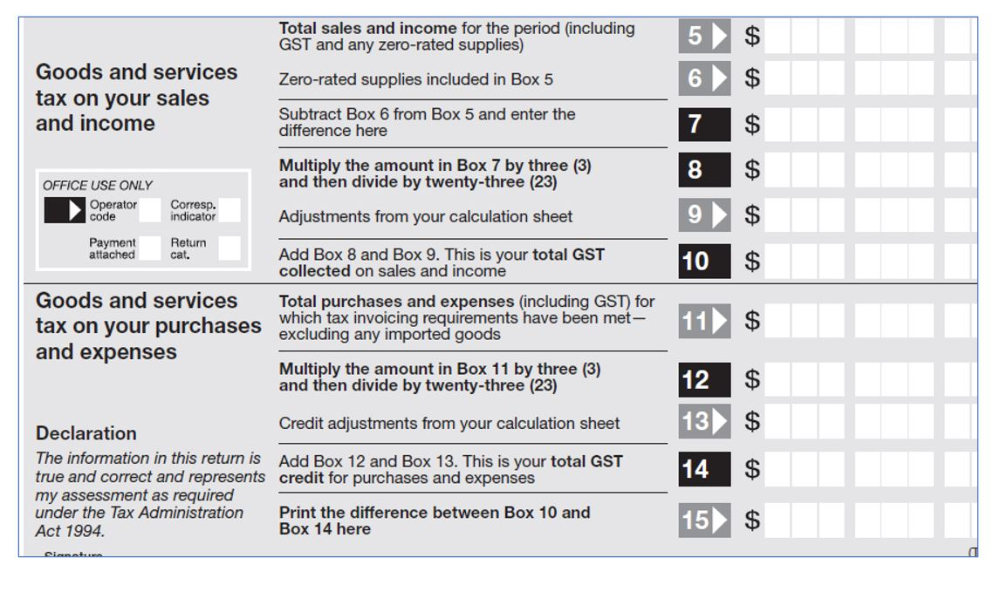
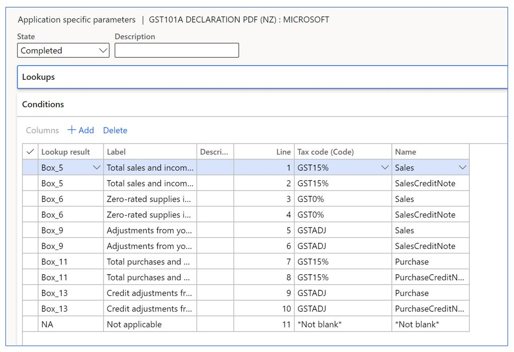

# GST declaration form GST101A for New Zealand (NZ-00003)

[!include [banner](../../includes/banner.md)]

This article explains how to set up and generate the GST return form GST101A for legal entities in New Zealand.

The GST return form for New Zealand is the standard document that summarizes the total output GST tax amount that's due, the total input GST tax amount that's recoverable, and the related GST tax amount liability. The form is used for all types of taxpayers and should be completed manually through the tax authority portal. The GST return form is commonly referred to as *Filing GST returns*.

The GST return form in Dynamics 365 Finance includes the following reports:

- GST return form GST101A: Information is consolidated into two groups of boxes (1 to 4), GST on sales and GST on expenses as described in the legislation. Legal entity details are printed on the top of the form. The form includes the GST number, the period covered by the return, the due date, the mailing address, and the daytime phone number.
 - Sales transactions details.
 - Purchase transaction details.
 
 ## Prerequisites
 
The primary address of the legal entity must be in New Zealand. In the **Feature management** workspace, enable the following features:

  - **VAT statement format reports**: This feature enables the setup and generation of VAT or GST statements reports by using electronic reporting formats from **Tax** > **Declarations** > **Report sales tax for settlement period** or **Settle and post sales tax**. For more information about how to enable features, see [Feature management overview](../../../fin-ops-core/fin-ops/get-started/feature-management/feature-management-overview.md).

In the **Electronic reporting** workspace, import the following Electronic reporting formats from the repository:

  - GST101A Declaration PDF(NZ)

## Import Electronic reporting configurations

Implementing the GST return form for New Zealand is based on Electronic reporting (ER) configurations. For more information about the capabilities and concepts of configurable reporting, see [Electronic reporting](../../../fin-ops-core/dev-itpro/analytics/general-electronic-reporting.md).

To generate the GST return form and related reports in a New Zealand legal entity, upload the following configurations from Lifecycle Services (LCS) or the global repository:

- Tax declaration model version 96
- Tax declaration model mapping version 96.167
- GST101A Declaration PDF(NZ) version 96.4 or later 

After you've finished downloading the ER configurations, complete the following the steps listed in the remainder of this article.

## Set up application-specific parameters
The GST declaration form includes a set of boxes (lines) that correspond to specific parts of the GST return declaration. Each box should include information about the base, adjustment, and GST amounts. To include the requirements established by the form, configure each box with the information that's automatically provided from the sales tax transactions generated from sales, purchases, or other operations where VAT tax is posted through the sales tax code configuration.

**Box5 - Total sales and income for the period (including GST and any zero-rates supplies)**.  Per legal definition, this box includes the total amount of standard-rated goods and services, including collected GST sold during the related period. In this scenario. you need to identify all standard and zero-rate tax transactions with a payable tax direction that were posted during the selected time selected. 

The application-specific parameters option lets you to establish the criteria of how the tax transactions will be collected and calculated in each box of the declaration form when the report is generated depending on the configuration of sales tax code. Complete the following steps to set the criteria.

1. In the **Electronic reporting** workspace, select the format, and then select **Configurations** > **Setup** to set up the rules to identify the tax transaction in the related box of the GST return form.
2. Select the current version and on the **Lookups** FastTab, select the lookup name **ReportFieldLookup**. This lookup identifies the list of boxes in the GST form that are required by the tax authority.
3. On the **Conditions** FastTab, select **Add**, and in the **Lookup result** column of the new line, select the related line of the GST return form.
4. In the **Tax code (Code)** column, select the sales tax code that is used to calculate the related line of GST return form.
5. In the **Name** column, select the tax transaction classification where the sales tax code is used.
6. Repeat steps 3-5 for all GST return form boxes (lines) and the combination of sales tax code and tax transaction types configured in your legal entity.
7. Select **Add** again, and then follow these steps to include the final record line: 
   
   - In the **Lookup result** column, select **NA**. 
   - In the **Tax code (Code)** column, select **Not blank**. 
   - In the **Name** column, select **Not blank**.
   
   By adding this last record (NA), you define the following rule: When the tax code and name that is passed as an argument doesn't satisfy any of the previous rules, the transactions will not be included in the GST return form. Although this rule isn't used when generating the report, the rule does help to avoid errors in report generation when there is a missing rule configuration.
   
8. In the **State** field, select **Completed**, and then select **Save**.
9. Close the **Application specific parameters** page.
 
 
 
The following table provides an example of how to configure these parameters to establish the configuration between the different boxes in the declaration form and sales tax code configuration implemented in Finance.

|     Lookup result    |     Lookup description                                     |     Line    |     Tax code (Code)    |     Name                  |
|----------------------|------------------------------------------------------------|-------------|------------------------|---------------------------|
|     Box_5            |     Total sales and income for the period                  |     1       |     GST15%             |     Sales                 |
|     Box_5            |     Total sales and income for the period                  |     2       |     GST15%             |     SalesCreditNote       |
|     Box_6            |     Zero-rated supplies included in Box 5                  |     3       |     GST0%              |     Sales                 |
|     Box_6            |     Zero-rated supplies included in Box 5                  |     4       |     GST0%              |     SalesCreditNote       |
|     Box_9            |     Adjustments from your calculation sheet                |     5       |     GSTADJ             |     Sales                 |
|     Box_9            |     Adjustments from your calculation sheet                |     6       |     GSTADJ             |     SalesCreditNote       |
|     Box_11           |     Total purchases and expenses                           |     7       |     GST15%             |     Purchase              |
|     Box_11           |     Total purchases and expenses                           |     8       |     GST15%             |     PurchaseCreditNote    |
|     Box_13           |     Credit adjustments from your calculation sheet 13      |     9       |     GSTADJ             |     Purchase              |
|     Box_13           |     Credit adjustments from your calculation sheet 13      |     10      |     GSTADJ             |     PurchaseCreditNote    |
|     NA               |     Not applicable                                         |     11      |     *Not blank*        |     *Not blank*           |

To avoid issues when the report is generated, create all mappings where the sales tax codes are posted. For example, if the second row in the table above was not included in the configuration, there may be errors when the report is generated because there is a credit note (sales invoice) with a sales tax code that's equal to GST15% posted in the related period. We recommend going to **Tax > 88Inquire > **Posted sales tax** to review all posted sales tax codes and those that aren't included in this mapping of the configuration.

The following table provides the available values in the **Name** column. This information helps you understand how the tax transactions are classified and assigned to the related sales tax code.

| Classifier value                | Condition |
|---------------------------------|-----------|
| PurchaseCreditNote              | <ul><li>Credit note</li><li>Tax direction = Sales tax receivable</li></ul> |
| Purchase                        | <ul><li>Not credit note</li><li>Tax direction = Sales tax receivable</li></ul> |
| SalesCreditNote                 | <ul><li>Credit note</li><li>Tax direction = Sales tax payable</li></ul> |
| Sales                           | <ul><li>Not credit note</li><li>Tax direction = Sales tax payable</li></ul> |
| PurchaseExemptCreditNote        | <ul><li>Credit note</li><li>Tax direction = Tax-free purchase</li></ul> |
| PurchaseExempt                  | <ul><li>Not credit note</li><li>Tax direction = Tax-free purchase</li></ul> |
| SalesExemptCreditNote           | <ul><li>Credit note</li><li>Tax direction = Tax-free sales</li></ul> |
| SaleExempt                      | <ul><li>Not credit note</li><li>Tax direction = Tax-free sales</li></ul> |
| UseTaxCreditNote                | <ul><li>Credit note</li><li>Tax direction = Use tax</li></ul> |
| UseTax                          | <ul><li>Not credit note</li><li>Tax direction = Use tax</li></ul> |
| PurchaseReverseChargeCreditNote | <ul><li>Credit note</li><li>Tax direction = Sales tax receivable</li><li>ReverseCharge\_W = Yes</li></ul> |
| PurchaseReverseCharge           | <ul><li>Not credit note</li><li>Tax direction = Sales tax receivable</li><li>ReverseCharge\_W = Yes</li></ul> |
| SalesReverseChargeCreditNote    | <ul><li>Credit note</li><li>Tax direction = Sales tax payable</li><li>ReverseCharge\_W = Yes</li></ul> |
| SalesReverseCharge              | <ul><li>Not credit note</li><li>Tax direction = Sales tax payable</li><li>ReverseCharge\_W = Yes</li></ul> |

## Set up General ledger parameters
To generate the GST return form report in PDF format, define an ER format on the **General ledger parameters** page.

1. Go to **Tax** > **Setup** > **General ledger parameters**.
2. On the **Sales tax** tab, in the **Tax options** section, in the **VAT statement format mapping** field, select **GST101A Declaration PDF(NZ)**. If you leave the **VAT statement format mapping** field blank, the standard sales tax report will be generated in SSRS format.

## Generate a GST return report
The process of preparing and submitting a GST return report for a period is based on sales tax payment transactions that were posted during the Settle and post sales tax job. For more information about sales tax settlement and reporting, see [Sales tax overview[(../general-ledger/indirect-taxes-overview.md)

Follow these steps to generate the tax declaration report.

1. Go to **Tax** > **Declarations** > **Sales tax** > **Report sales tax for settlement period** or **Settle and post sales tax**.
2. Select the **Settlement period**.
3. Select a value in the **From date** and **To date** fields.
4. Select the **Sales tax payment version**.
5. In the **Due date** field, select a due date. This option is available when the sales tax payment is posted.
7. Select **OK**. 

