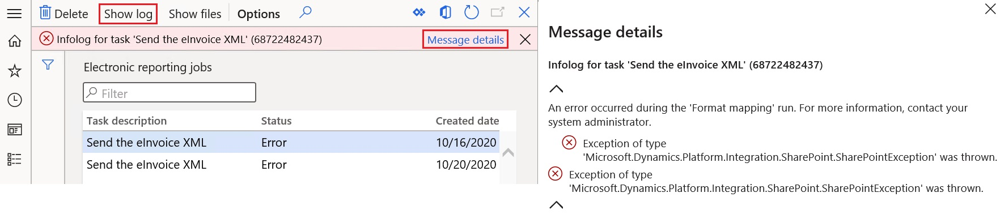

# Customer electronic invoices in Denmark

[!include [banner](../../includes/banner.md)]

This article explains how to configure and issue customer electronic invoices in Denmark by using the [OIOUBL](http://www.oioubl.info/Classes/da/Invoice.html) format for electronic invoices.

## Prerequisites

The primary address of the legal entity must be in Denmark.

## Import Electronic reporting configurations

In the **Electronic reporting** workspace, import the following Electronic reporting (ER) formats from the repository:

- OIOUBL Sales invoice (DK)
- OIOUBL Project invoice (DK)
- OIOUBL Sales credit note (DK)
- OIOUBL Project credit note (DK)

> [!NOTE]
> Any other required configurations are automatically imported.

For more information about how to import ER configurations, see [Import Electronic reporting (ER) configurations from Dataverse](../global/workspace/gsw-import-er-config-dataverse.md).

### Reference the imported ER format configurations

1. Go to **Accounts receivable** \> **Setup** \> **Accounts receivable parameters**.
2. On the **Electronic documents** tab, on the **Electronic reporting** FastTab, select the imported formats for electronic documents:

    - **Sales and Free text invoice:** OIOUBL Sales invoice (DK)
    - **Sales and Free text credit note:** OIOUBL Sales credit note (DK)
    - **Project invoice:** OIOUBL Project invoice (DK)
    - **Project credit note:** OIOUBL Project credit note (DK)

## Configure parameters

### Configure legal entity parameters

1. Go to **Organization administration** \> **Organizations** \> **Legal entities**.
2. On the **Tax registration** FastTab, in the **Tax registration number** field, enter the company's value-added tax (VAT) number.
3. On the **Bank account information** FastTab, in the **Routing number** field, enter the company's registration number.
4. In the **FI-Creditor ID** field, enter the creditor's identification number if you plan to use FIK payments.

### Configure methods of payment

According to OIOUBL standards, the payment method codes in the XML file output of electronic invoices must comply with the [official list of standardized codes](http://www.oioubl.info/codelists/en/urn_oioubl_codelist_paymentmeanscode-1.1.html).

The system supports the following predefined codes for payment methods and provides automatic conversion to the official codes.

| Internal payment method code | Official payment method code |
|------------------------------|------------------------------|
| DK:BANK                      | 42                           |
| DK:FIK                       | 93                           |
| DK:GIRO                      | 50                           |
| All other codes              | 97                           |

Follow these steps to configure methods of payment.

1. Go to **Accounts receivable** \> **Setup** \> **Payments setup** \> **Methods of payment**.
2. Create a new method of payment, or select an existing method to configure.
3. On the **General** FastTab, in the **Posting** section, in the **Account type** field, select **Bank**.
4. In the **Payment account** field, enter the company bank account that is associated with the method of payment.

    > [!NOTE]
    > The company bank account must already be set up at **Cash and bank management** \> **Bank accounts** \> **Bank accounts**.

### Configure units of measure

1. Go to **Organization administration** \> **Setup** \> **Units** \> **Units**.
2. Select a unit ID in the list, and then select **External codes**.
3. On the **External codes** page, in the **Overview** section, in the **Code** field, enter a code that corresponds to the selected unit ID.
4. In **Value** section, in **Value** field, enter the external code that should be used as the recommended unit of measure code according to [Codes for Units of Measure Used in International Trade](https://docs.oasis-open.org/ubl/prd1-UBL-2.1/cva/UBL-DefaultDTQ-2.1.html#d27e1).

### Configure sales tax codes

When you generate electronic invoices in OIOUBL format, the tax information in the output XML file must be hierarchically structured in a specific way.

The top level of the hierarchy is **Tax Scheme**. <!-- The provided link appears to be broken For the official list of tax schemes that are applicable to the OIOUBL format, see [OIOUBL Tax Schemes](http://oioubl.info/documents/da/da/Kodelister/OIOUBL_CODE_TaxSchemeID-1.5.pdf). -->

The next level of tax data grouping, within the tax scheme, is **Tax Category**. For the official list of tax categories that are applicable to the OIOUBL format, see [OIOUBL Tax Categories](http://oioubl.info/documents/da/da/Kodelister/OIOUBL_CODE_TAXCATEGORYID.pdf). 

For some taxes, an additional attribute, **Tax Type Code**, must be also defined.

You can associate tax schemes, tax categories, and tax type codes with sales tax codes by using application-specific parameters. For information about how to configure application-specific parameters, see the next section.

### Configure application-specific parameters 

Application-specific parameters must be configured for the following configurations:

- OIOUBL Sales invoice (DK)
- OIOUBL Project invoice (DK)
- OIOUBL Sales credit note (DK)
- OIOUBL Project credit note (DK)

For each configuration, follow these steps.

1. In the **Electronic reporting** workspace, on the **Reporting configurations** tile, in the list of configurations, select a required configuration. For example, select **OIOUBL Sales invoice (DK)**.
2. On the **Configurations** menu, in the **Application specific parameters** section, select **Setup**.
3. On the **Application specific parameters** page, on the **Lookups** FastTab, select **TaxSchemeSelector** in the grid.

    Next, on the **Conditions** FastTab, you will configure the correspondence between internal sales tax codes and official tax schemes codes. 

4. On the **Conditions** FastTab, select **Add** to add a condition to the grid.
5. In the **Code** field for the new condition, select the sales tax code that is defined in the system. 

    > [!NOTE]
    > In the **Code** field, you can select the **\*Blank\*** or **\*Not blank\*** placeholder value instead of a specific sales tax code.

6. In the **Lookup result** field, select a corresponding official tax schemes code.

    

7. On the **Lookups** FastTab, select **TaxCategorySelector** in the grid.
8. On the **Conditions** FastTab, repeat steps 4 through 6 to configure the correspondence between internal sales tax codes and official tax categories codes.
9. On the **Lookups** FastTab, select **TaxCodeTypeSelector** in the grid.
10. On the **Conditions** FastTab, repeat steps 4 through 6 to configure the correspondence between internal sales tax codes and tax type codes. If no tax type code is required, select **Not applicable**.
11. In the **State** field at the top of the page, select **Completed**, and then save your changes.

### Configure customer parameters

1. Go to **Accounts receivable** \> **Customers** \> **All customers**, and select a customer.
2. On the **Invoice and delivery** FastTab, set the **eInvoice** option to **Yes** to enable the generation of electronic invoices.
3. Set the **eInvoice attachment** option to **Yes** to attach a PDF copy of the printable invoice to the electronic invoice.
4. In the **Tax exempt number** field, enter the customer's VAT exempt number.
5. In the **EAN** field, enter the customer's identification number. This number will be used as the **Endpoint ID** value in the output XML file of the electronic invoice.
6. On the **Sales demographics** FastTab, in the **Primary contact** field, select a person who will be considered the buyer's contact.

    > [!NOTE]
    > All available contact persons must already be defined for this customer.

## Export customer electronic invoices

### Send e-invoices

After an invoice is posted, you can generate an electronic invoice by selecting the invoice and then selecting **Send** \> **Original** in the **Document** group on the **Invoice** tab of the Action Pane.

### View e-invoices

Follow these steps to inquire about the XML files of electronic invoices that have been generated.

1. Go to **Organization administration** \> **Electronic reporting** \> **Electronic reporting jobs**.
2. Select a job, and then select **Show files**.
3. Select **Open** to download the file that contains the electronic invoice.

    If generation of the electronic invoices failed because of errors, select **Show log**. Then select **Message details** in the message bar to view more details about the error.

    

### Send e-invoices to ER destinations

You can set up ER destinations for electronic invoice formats. In this case, output XML files that contain electronic invoices are automatically sent to the defined destinations immediately after the invoices are posted. When you post the invoices, you must turn on the **Print invoice** parameter.

For more information about ER destinations, see [Electronic reporting destinations](../../../fin-ops-core/dev-itpro/analytics/electronic-reporting-destinations.md).

[!INCLUDE[footer-include](../../../includes/footer-banner.md)]
