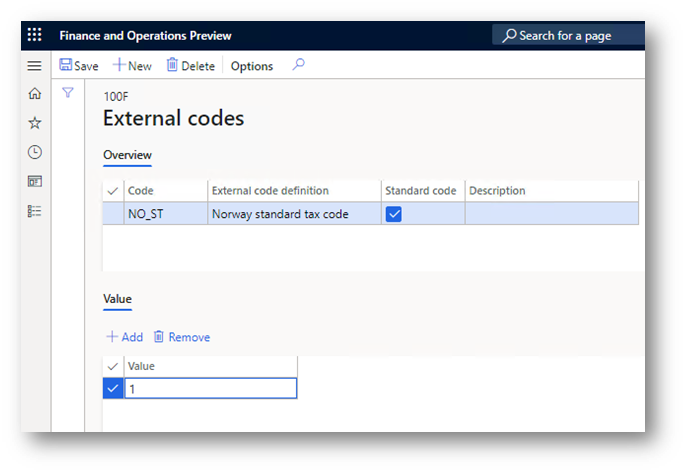

# Standard Audit File for Tax (SAF-T) for Norway

[!include [banner](../../includes/banner.md)]

This article explains how to set up and generate the Standard Audit File for Tax (SAF-T) for legal entities that have their primary address in Norway in Microsoft Dynamics 365 Finance.

> [!NOTE]
> - As of version 175.137 of `SAF-T Format (NO)` and 175.92 of `SAF-T Financial data model mapping`, the version 1.30 of SAF-T Financial is supported. SAF-T Financial of version 1.30 is required on January 1, 2025, but can be used for earlier periods if preferred. The old form, version 1.20, can be used for previous years (financial year 2024 and earlier).
> - Use of the [One voucher](../../general-ledger/one-voucher.md) functionality introduces a limitation on further SAF-T reporting for some scenarios that are subject to SAF-T. Specifically, a bank statement scenario must be posted by using different vouchers for transactions that have different counteragent accounts. Learn more about how to use the One voucher functionality and SAF-T in the [SAF-T report and One voucher](#one-voucher) section later in this article.

## Set up SAF-T for Norway

To use the **Norwegian SAF-T Financial data** report in Dynamics 365 Finance, complete the following setup tasks:

1. [Enable features in Feature management](#features).
1. [Import Electronic reporting (ER) configurations](#import).
1. [Set up the organization registration number](#organization-number).
1. [Set up the tax registration numbers of the company](#registration-number).
1. [Set up the ER format on the General ledger parameters page](#parameters).
1. [Associate sales tax codes used in Finance with Norwegian standard value-added tax (VAT) codes](#sales).
1. [Associate main accounts used in Finance with Norwegian standard accounts or an Income statement (Næringslivskoder)](#mainaccounts).
1. [Complete the configuration of application-specific parameters](#asp)

### Enable features in Feature management

To enable features in Feature management, follow these steps.

1. In Dynamics 365 Finance, go to **Feature management** \> **All**.
1. In the feature list, find and select the following features:

    - **Optimize datasets memory consumption at ER reports runtime**
    - **Performance improvement for Norwegian SAF-T report** – This feature is available in Finance version 10.0.44. We recommend that you enable it, because it improves report performance.
    - **Performance enhancement for general ledger dimension set balance calculation** – This feature must be enabled if you enable the **Performance improvement for Norwegian SAF-T report** feature. Learn more about the **Performance enhancement for general ledger dimension set balance calculation** feature in [New financial dimension sets](../../general-ledger/financial-dimension-set-new.md)

1. Select **Enable now**.

> [!NOTE]
> To enhance the performance of the SAF-T report for legal entities that have their primary address in Norway, we recommend that you enable the **Performance improvement for Norwegian SAF-T report** feature. This feature is available in Finance version 10.0.44 and the following builds of earlier versions:
>
> - **10.0.43**: 10.0.2177.**60**
> - **10.0.42**: 10.0.2095.**136**
> - **10.0.41**: 10.0.2015.**209**
>
> The **Performance improvement for Norwegian SAF-T report** feature uses new data sources that the [Performance enhancement for general ledger dimension set balance calculation](../../general-ledger/financial-dimension-set-new.md) feature introduces. Before you enable the **Performance improvement for Norwegian SAF-T report** feature, ensure that the **Performance enhancement for general ledger dimension set balance calculation** feature is enabled.
>
> We recommend that you use the following versions or later of ER configurations with the **Performance improvement for Norwegian SAF-T report** feature:
>
> - SAF-T Format (NO) **190.176**
> - SAF-T Financial data model mapping **190.138**

###  Import ER configurations

In Finance, import the following ER configurations from the Global repository.

| ER configuration name              | Configuration type |
|------------------------------------|--------------------|
| Standard Audit File (SAF-T)        | Model              |
| SAF-T Financial data model mapping | Model mapping      |
| SAF-T Format (NO)                  | Format (exporting) |

Learn more about how to import ER configurations in [Import Electronic reporting (ER) configurations from Dataverse](../global/workspace/gsw-import-er-config-dataverse.md).

Import the most recent versions of the configurations. The version description usually includes the number of the Microsoft Knowledge Base (KB) article that explains the changes that were introduced in the configuration version.

> [!NOTE]
> After you import all the ER configurations from the preceding table, set the **Default for model mapping** option to **Yes** for the **SAF-T Financial data model mapping** configuration.

###  Set up the organization registration number

Organization registration number of the legal entity is reported in SAF-T file in the **Header** \> **Company** \> **RegistrationNumber** field. To configure the organization registration number that should be reported in the **RegistrationNumber** field, follow these steps.

To set up the organization registration number, follow these steps.

1. In Dynamics 365 Finance, go to **Organization administration** \> **Organizations** \> **Legal entities**, and select your legal entity.
1. On the **Bank account information** FastTab, assign the organization number to the **Routing code** field.

###  Set up the company tax registration numbers

As of version 175.119 of the **SAF-T Format (NO)** ER format, the **TaxRegistration** node under **Header** \> **Company** of the report represents company VAT registration numbers that are in effect during the reporting period of the report, from among the registration IDs that are defined in the properties of the legal entity. The **TaxVerificationDate** field of the **TaxRegistration** node represents the expiration date of the registration ID where the number expiration date is within the reporting period. To configure the registration ID that should be reported in the **TaxRegistration** node, follow these steps.

To set up the company tax registration numbers, follow these steps.

1. In Dynamics 365 Finance, go to **Organization administration** \> **Organizations** \> **Legal entities**.
1. Select the legal entity, and then select **Registration IDs**.
1. Select or create the address in Norway, and then, on the **Registration ID** FastTab, select **Add**.
1. In the **Registration type** field, select the registration type that's dedicated to Norway, and that uses the **VAT ID** registration category.
1. In the **Registration number** field, enter the tax number.
1. On the **General** tab, in the **Effective** field, enter the date when the number becomes effective.

Learn more about how to set up registration categories and registration types in [Registration IDs](../europe/emea-registration-ids.md).

If the VAT registration number isn't specified among the registration IDs of the legal entity, the system retrieves the value from **Tax registration number** field on the **Tax registration** FastTab of the legal entity properties page.

###  Set up the ER format 

To set up the ER format, follow these steps.

1. In Finance, go to **General ledger** \> **Ledger setup** \> **General ledger parameters**.
1. On the **General ledger parameters** page, on the **Standard Audit File for Tax (SAF-T)** tab, in the **Standard Audit File for Tax (SAF-T)** field, select **SAF-T Format (NO)**.

> [!NOTE]
> In legal entities that have their primary address in Norway, the **Standard Audit File for Tax (SAF-T)** tab of the **General ledger parameters** page includes the **Use common menu item** checkbox in addition to the **Standard Audit File for Tax (SAF-T)** field.
>
> To run the **SAF-T Format (NO)** ER configuration, you must *clear* the **Use common menu item** checkbox. Select this checkbox only if you plan to use an ER configuration that can be run directly from the **Electronic reporting** workspace and doesn't require any data preprocessing on the Finance app side. Learn more about the common **Standard Audit File for Tax (SAF-T)** feature in [Standard Audit File for Tax (SAF-T) electronic report](../../general-ledger/standard-audit-file.md).

###  Associate sales tax codes used in Finance with Norwegian standard VAT codes

As the documentation explains, in Norwegian SAF-T Financial data, sales tax codes that are used in Finance must be associated with Norwegian standard VAT tax codes (**StandardTaxCode**) for the purpose of SAF-T reporting. The Norwegian standard VAT tax codes are available at <https://github.com/Skatteetaten/saf-t>.

As of version 175.119 of the **SAF-T Format (NO)** ER format, you can use one of the following two options to associate sales tax codes that are used in Finance with Norwegian standard VAT codes. Base your choice on your company's setup and preferences.

1. Use the application-specific parameters of the ER format.
1. Use the **External codes** functionality.

If you use option 1, the report doesn't consider option 2. If any of the sales tax codes that are used in Finance aren't associated with a value by using either the application-specific parameters of the ER format or the **External codes** functionality, you receive a warning message when you generate the report. This message includes information about the missing mapping.

#### Option 1: Associate sales tax codes used in Finance with Norwegian standard VAT codes by using the application-specific parameters of the ER format

To associate sales tax codes that are used in Finance with Norwegian standard VAT codes by using the application-specific parameters of the ER format, follow these steps.

1. In the **Electronic reporting** workspace, select the **Reporting configurations** tile.
1. On the **Configurations** page, expand **Standard Audit File (SAF-T)**, and then select **SAF-T Format (NO)**.
1. On the Action Pane, on the **Configurations** tab, in the **Application specific parameters** group, select **Setup**.
1. On the **Application specific parameters** page, select the latest version of the format that you want to define conditions for.
1. On the **Lookups** FastTab, select the **StandardTaxCodes\_Lookup** lookup, and define the appropriate conditions.
1. On the **Conditions** FastTab, define which tax codes must correspond to a specific lookup result. Use the "NA" lookup result for tax codes that have no Norwegian standard VAT code and must be reported as "NA" in SAF-T.
1. After you finish setting up conditions, in the **State** field, select **Completed**. Then save the configuration.

#### Option 2: Associate sales tax codes used in Finance with Norwegian standard VAT codes by using the External codes functionality

To associate sales tax codes that are used in Finance with Norwegian standard VAT codes by using the External codes functionality, follow these steps.

1. In Dynamics 365 Finance, go to **Tax** \> **Indirect taxes** \> **Sales tax** \> **Sales tax codes**.
1. On the **Sales tax code** page, select the **Sales tax code** record, and then, on the Action Pane, on the **Sales tax code** tab, in the **Sales tax code** group, select **External codes**.

    

1. On the **External codes** page, specify the Norwegian standard VAT tax codes that should be used for the selected sales tax code record for the purpose of SAF-T reporting.
1. In the **Overview** section, in the **Code** field, select the identifier of the external code definition. Then, in the **Value** section, in the **Value** field, enter a standard tax code that corresponds to the selected sales tax code.

    

###  Associate main accounts used in Finance with Norwegian standard accounts or an Income statement (Næringslivskoder)

In Norwegian SAF-T Financial data, main accounts that are used in Finance must be associated with Norwegian standard accounts or an Income statement (Næringslivskoder) for the purpose of SAF-T reporting. The Norwegian standard accounts are available at <https://github.com/Skatteetaten/saf-t>.

As of version 175.119 of the **SAF-T Format (NO)** ER format, you can use of the following two options to associate main accounts that are used in Finance with Norwegian standard accounts or an Income statement. Base your choice on your company's setup and preferences.

To associate main accounts that are used in Finance with Norwegian standard accounts or an Income statement (Næringslivskoder), follow these steps.

1. Use additional consolidation accounts. Use this option to associate main accounts that are used in Finance with an Income statement (grouping category and grouping code).
1. Use the application-specific parameters of the ER format. This option supports only Norwegian standard accounts and is available only before January 1, 2025.

If option 1 is used, the report doesn't consider option 2. If any of the main accounts that are used in Finance aren't associated with a value by using either the application-specific parameters of the ER format or additional consolidation accounts, you receive a warning message when you generate the report. This message includes information about the missing mapping.

> [!NOTE]
> SAF-T Financial of version 1.30 supports only `Grouping category` and `Grouping code` fields. `Standard accounts` are no longer supported. Due to this change, as of version 175.137, `SAF-T Format (NO)` introduces a validation with a warning before January 1, 2025, and a blocking exception starting January 1, 2025, if option 2 is used. Starting with version 175.137 of `SAF-T Format (NO)`, option 2 will no longer be supported, and the **Use grouping category** parameter is mandatory when you run the SAF-T report.

#### Option 1: Associate main accounts used in Finance with Norwegian standard accounts or an Income statement by using additional consolidation accounts

To associate main accounts that are used in Finance with Norwegian standard accounts or an Income statement by using additional consolidation accounts, follow these steps.

1. Create a [consolidation account group](../../general-ledger/tasks/create-consolidation-groups.md#create-a-consolidation-account-group). You can choose any name for consolidation account group, this name isn't used in the XML report. **Consolidation account group** is used as a link to the set of **Additional consolidation accounts** where Norwegian standard accounts or an Income statement (Næringslivskoder) for the purpose of SAF-T reporting are defined.
1. [Add accounts to the consolidation account group](../../general-ledger/tasks/create-consolidation-groups.md#add-accounts-to-consolidation-account-group). In the **Consolidation account** field, specify a standard account. If the **Use grouping category** option of the report is turned off, this value is reported in the **StandardAccountID** element of SAF-T under the **Master data** \> **GeneralLedgerAccounts** \> **Account** node (available only before January 1, 2025). If the **Use grouping category** option of the report is turned on, this value is reported in the **GroupingCode** field of the report. In the **Consolidation account name** field, you can optionally specify the standard account name or description. This value isn't used in SAF-T.

Learn more about additional consolidation accounts in [Consolidation account groups and additional consolidation accounts](../../budgeting/consolidation-account-groups-consolidation-accounts.md).

#### Option 2: Associate main accounts used in Finance with Norwegian standard accounts by using the application-specific parameters of the ER format

> [!NOTE]
> This option isn't supported after January 1, 2025, due to changes introduced in SAF-T Financial of version 1.30. Microsoft recommends that you use the following or a higher version of the ER configurations:
> - SAF-T Format (NO) **175.137**
> - SAF-T Financial data model mapping **175.92**

To associate the main accounts that are used in Finance with Norwegian standard accounts by using the application-specific parameters, follow these steps.

1. In Dynamics 365 Finance, go to the **Electronic reporting** workspace.
1. In the configuration tree, select the **SAF-T Format (NO)** ER format.
1. Make sure that the company that you're working in is the company for which you want to set up the application-specific parameters.
1. On the Action Pane, on the **Configurations** tab, in the **Application specific parameters** group, select **Setup**.
1. On the left side of the **Application specific parameters** page, select the version of the format that you want to use.
1. On the **Lookup** FastTab, select **StandardMainAccount_Lookup**. Then, on the **Conditions** FastTab, specify criteria by adding lines for each **Result** value that must be used in the selected company. If several main accounts in the selected company must result in the same standard account, add a separate line for each main account, and specify the same standard account for each one.
1. Select the value **NA** as the last condition in the list. It must be set to **\*Not blank\*** in the **Main account** column. Verify the value in the **Line** column to ensure that **NA** is the last condition in the table.
1. After you finish setting up conditions, change the value of the **State** field to **Completed**, save your changes, and close the page.

    

You can easily export the setup of application-specific parameters from one version of a report and import it into another by selecting **Export** or **Import** on the Action Pane. You can also export the setup from one report and import it into the same report in another company if the Main accounts are the same in both companies.

### Complete the configuration of application-specific parameters

Regardless of whether you use the options to associate standard tax codes and standard main accounts with application-specific parameters, you must complete the configuration of the application-specific parameters.

To complete the configuration of application-specific parameters, follow these steps.

1. In Dynamics 365 Finance, go to the **Electronic reporting** workspace.
1. In the configuration tree, select the **SAF-T Format (NO)** ER format.
1. Make sure that the company that you're working in is the company for which you want to set up the application-specific parameters.
1. On the Action Pane, on the **Configurations** tab, in the **Application specific parameters** group, select **Setup**.
1. On the left side of the **Application specific parameters** page, select the version of the format that you want to use.
1. Change the value of the **State** field to **Completed**, save your changes, and close the page.

## Generate the Norwegian SAF-T Financial data report

To generate the **Norwegian SAF-T Financial data** report, follow these steps.

1. In Dynamics 365 Finance, go to **General ledger** \> **Inquiries and reports** \> **Standard Audit File for Tax (SAF-T)** \> **Standard Audit File for Tax (SAF-T)**.
1. In the dialog for the report, in the **From date** and **To date** fields, specify the start and end dates of the period that you want to generate the report for.
1. Select the checkboxes for **Customers**, **Vendors**, and **Financial dimensions** to include all the records from the related tables on the report.

    If the **Customers** and **Vendors** checkboxes are cleared, the report includes only customers and vendors of your company that have transactions in the reporting period, and customers and vendors that have a non-zero balance.

    If the **Financial dimensions** checkbox is cleared, only financial dimensions that were used in transactions during the reporting period are reported in the **\<MasterFiles\>** node of the report.

1. In the **Personnel number** field, select an employee to add to the **\<AuditFileSender\>** node of the report. This node reports information about the contact person for the audit file (first name and last name).
1. Select the **Report tax information in sales tax currency** checkbox if you want to report tax information in the tax code currency.

    If the **Report tax information in sales tax currency** checkbox is selected, the **\<TaxInformation\>** element reports the following amounts in the tax code currency:

    - *GeneralLedgerEntries/Journal/Transaction/Line/TaxInformation/TaxBase*
    - *GeneralLedgerEntries/Journal/Transaction/Line/TaxInformation/TaxAmount/Amount*

    If the **Report tax information in sales tax currency** checkbox is cleared, the amounts in the **\<TaxInformation\>** element and all the amounts on the reports are reported in the accounting currency.

    The following amount is always reported in the document currency:

    - *GeneralLedgerEntries/Journal/Transaction/Line/TaxInformation/TaxAmount/CurrencyAmount*

    Where *GeneralLedgerEntries/Journal/Transaction/Line/TaxInformation/TaxAmount/Currency* represents the document currency.

1. Select **Include zero lines** to include documents that have a zero amount on the report.
1. In the **Consolidation account group** field, select the name of the consolidation account group that you created and set up for [Norwegian standard accounts or an Income statement](#mainaccounts). This parameter is mandatory as of January 1, 2025.
1. Select the **Use grouping category** checkbox to force **GroupingCategory** and **GroupingCode** nodes to be generated instead of the **StandardAccountID** element in the **GeneralLedgerAccounts** node. The value of **GroupingCategory** is copied from the name of the consolidation account group. Because of changes that were introduced in SAF-T Financial of version 1.30, the **Use grouping category** checkbox is a mandatory parameter as of January 1, 2025. We recommend that you use the following versions or later of ER configurations:

    - SAF-T Format (NO) **175.137**
    - SAF-T Financial data model mapping **175.92**

1. In the **Execution mode** field, select one of the following values:

    - **Single file** – The SAF-T is generated as one file that includes all the sections: **Header**, **MasterFiles**, and **GeneralLedgerEntries**.
    - **Separate files** – The SAF-T is generated as two or more files:

        - **Header and MasterFiles** – This file includes the header information and all the **MasterFiles** sections.
        - **Header and GeneralLedgerEntries** – This file can be automatically split into multiple files, depending on the data volume that is included in the reporting period. The files are split to comply with the 2-GB source XML data limitation that is specified as the Altinn portal and file size limitations.

    - **Only master files** – The SAF-T that is generated includes the **Header** and **MasterFiles** sections only.
    - **Only general ledger entries** – The SAF-T that is generated includes the **Header** and **GeneralLedgerEntries** sections only. This file can be automatically split into multiple files, depending on the data volume that is included in the reporting period. The files are split to comply with the 2-GB source XML data limitation that is specified as the Altinn portal and file size limitations.

You can also apply filters for the **Main accounts** and **General journal entry** fields by using **Records to include** FastTab in the dialog for the report.

A SAF-T report for a long time period, such as a quarter or a year, can include a large amount of data and take a long time to be generated. Therefore, we recommend that you use batch jobs. The dialog for the SAF-T report includes a **Run in the background** tab where you can set up report generation in batch mode. Set the **Batch processing** option to **Yes**. Learn more about batch processing in [Batch processing overview](../../../fin-ops-core/dev-itpro/sysadmin/batch-processing-overview.md).

To review batch jobs or find a generated file, follow these steps.

1. In Dynamics 365 Finance, go to **Organization administration** \> **Electronic reporting** \> **Electronic reporting jobs**.
1. Find a line that is related to your job, and then select **Show log**. If nothing is shown, no messages were produced when the file was generated.
1. To view a file, select **Show files**, find the file that you need, and then select **Open**.

Learn more about how to configure a destination for each ER format configuration and its output component in [Electronic reporting (ER) destinations](../../../fin-ops-core/dev-itpro/analytics/electronic-reporting-destinations.md).

## Report naming and splitting

The documentation for Norwegian SAF-T Financial data requires the following naming structure for the XML reports that are generated:

\<SAF-T export type\>\_\<organization number of the vendor that the data represents\>\_\<date and time(yyyymmddhh24hmise\>\_\<file number of total files\>.xml 

Here is an example:

SAF-T Financial\_999999999\_20160401235911\_1\_12.xml

Here is an explanation of the parts of this file name:

- **SAF-T Financial** states the SAF-T type of file.
- **999999999** represents the organization number that belongs to the owner of the data.

    If the organization number is missing, or the output XML file doesn't contain \<RegistrationNumber\>NA\</RegistrationNumber\>, go to **Organization administration** \> **Organizations** \> **Legal entities**, and select your legal entity. Then, on the **Bank account information** FastTab, assign the organization number to the **Routing code** field.

- **20160401235911** represents the date and time when the file was created. (A 24-hour clock is used for the time.)
- **1\_12** represents file 1 out of 12 total files in the export (that is, in the same selection).

The volume of a single XML file must be less than 2 gigabytes (GB). Every individual XML file that is submitted must be validated against the schema. All \<MasterFiles\> nodes must be in the first file, and the associated transactions must be in the subsequent files (the number of these files is flexible).

The following table shows a sample selection of one accounting year that has 12 periods. For each period, there is one file that contains transactions.

| File number | Contents of the audit file                     |
|-------------|------------------------------------------------|
| 1           | \<Header\> and \<MasterFiles\> nodes           |
| 2–13        | \<Header\> and \<GeneralLedgerEntries\> nodes  |

There can be a maximum of 10 XML files in the same zip archive.

In accordance with these requirements, the **SAF-T Format (NO)** ER format is implemented to automatically split the resulting report in XML format, based on the following assumptions:

- The maximum volume of the resulting XML report is 2,000,000 kilobytes (KB) (that is, 2 GB).
- All the XML files use the following naming structure:

    \<SAF-T export type\>\_\<organization number of the vendor that the data represents\>\_\<date and time(yyyymmddhh24hmise\>

- All the XML files are included in one zip archive.
- Each individual XML file is validated against the schema.

After the report is generated, if more than one XML file is generated, the user must manually number the generated files in the zip archive by adding **\_\<file number of total files\>** to the file names. The user must also make sure that there are no more than 10 XML files in the same zip archive. If there are more than 10 XML files in an archive, the user must manually split it into several archives, each of which has a maximum of 10 XML files.

## Implementation details

### \<AnalysisType\> and \<AnalysisTypeDescription\> nodes

The SAF-T report for Norway must include information about the **AnalysisTypeTable** node under the **MasterFiles** node of the report. **AnalysisTypeTable** must represent a table with the analysis code identifiers that are used for further specification of transaction data. In Finance, **Financial dimensions** is the data source for the **AnalysisTypeTable** node. When you set up **Financial dimensions** in your legal entity, use the **ReportColumnName** field of the **Financial dimension** data source for the value that will be reported in the \<AnalysisType\> node. Use the **Dimension name** field of the **Financial dimension** data source for the value that will be reported in the \<AnalysisTypeDescription\> node.

As of version 175.119 of the **SAF-T Format (NO)** ER format, the **Journal type** enumerated list of values is included as an additional data source for the **AnalysisTypeTable** node under the **MasterFiles** node of the report. The **AnalysisTypeTable** node includes all the values of the **LedgerPostingType** enumeration in Finance that are represented by the **Bilagsart** value in the **AnalysisTypeDescription** field. Each general journal account entry that's reported in the **GeneralLedgerEntries** \> **Journal** \> **Transaction** \> **Line** node of SAF-T is reported. The reported information includes information from the **LedgerPostingType** value of the **GeneralJournalAccountEntry** table that's represented in the **Analysis** node.

### SAF-T report and One voucher

Using the One voucher functionality introduces a limitation of further SAF-T reporting for data if one voucher was applied. We recommend that you set the **Allow multiple transactions within one voucher** parameter on the **General ledger parameters** page to **No** in your legal entity if you post transactions that are part of the SAF-T report. For information about One voucher functionality, see [One voucher](../../general-ledger/one-voucher.md).

[!INCLUDE[footer-include](../../../includes/footer-banner.md)]
