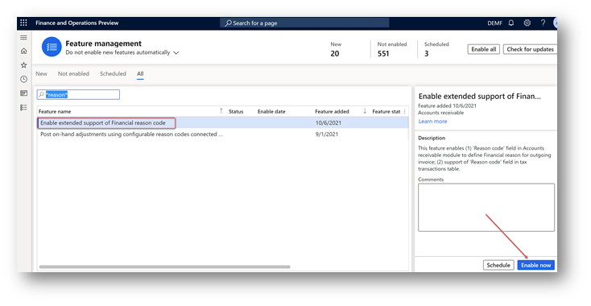
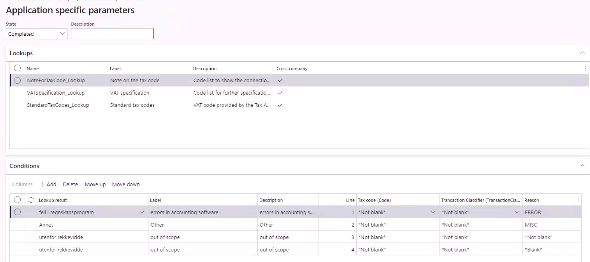
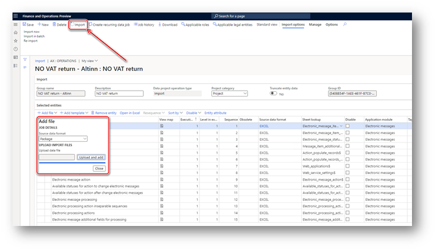
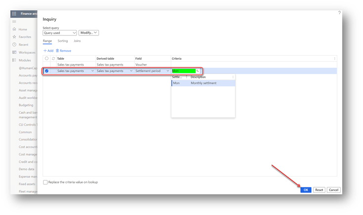
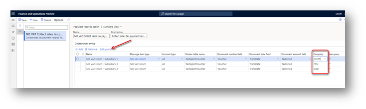

# Prepare your environment to interoperate with ID-porten and Altinn web services

[!include [banner](../../includes/banner.md)]

After your company has [registered an integration point](emea-nor-vat-return-integration-point.md) in the ID-porten web portal, complete the following tasks. 
These tasks will prepare your Microsoft Dynamics 365 Finance environment to interoperate with ID-porten and Altinn web services to submit value-added tax (VAT) returns.

- [Import and set up Electronic reporting (ER) configurations](#er-setup)
- [Set up application-specific parameters for the VAT Declaration format](#application-specific-parameters)
- [Import a package of data entities that includes a predefined Electronic messaging (EM) setup](#em-setup)
- [Set up the VAT registration number of the company that is reporting a VAT return](#vat-registration-number)
- [Set up a paper format to preview VAT returns](#preview-format)
- [Enable VAT return reporting for companies that report as a VAT group in the same system database](#vat-group)
- [Define a sales tax settlement period](#settlement-period)
- [Set up number sequences for Electronic messages functionality](#number-sequences)
- [Set up document management parameters](#document-management-parameters)
- [Set up a validation results transformation schema](#transformation-schema)
- [Set up security roles for electronic message processing](#em-security-roles)
- [Set up security roles for interoperation with ID-porten and Altinn web services](#web-security-roles)
- [Set up the client ID and client secret of your ID-porten integration point in Finance](#client-credentials)
- [Set up the internet address of ID-porten and Altinn web services](#internet-address)

ID-porten and Altinn web services require that you use Transport Layer Security (TLS) 1.2. For more information about how to enable TLS 1.2, see [How to enable TLS 1.2](/mem/configmgr/core/plan-design/security/enable-tls-1-2).

## Import and set up ER configurations

Import the following ER configurations to prepare Finance to generate VAT return formats that are valid for periods that start on January 1, 2022, in Norway, and to prepare it to interoperate with ID-porten and Altinn web services.

| Number | ER configuration name | Type | Description |
|---|---|---|---|
| **1** |**Tax declaration model** | **Model** | **A generic model for different tax declarations.** |
| 2 | Tax declaration model mapping | Model mapping | A generic model mapping for VAT declarations. |
| 3 | VAT Declaration XML (NO) | Format (exporting) | A VAT return in XML format for submission to Altinn. |
| 4 | VAT Declaration Excel (NO) | Format (exporting) | A VAT return in Microsoft Excel format for preview. |
| 5 | Altinn VAT interoperation (NO) | Format (exporting) | A format that is used to create a URL path for ID-porten and Altinn web service endpoints. |
| **6** | **Electronic Messages framework model** | **Model** |**The model for the Electronic messages framework.** |
| 7 | Altinn VAT model mapping | Model mapping (exporting, importing) | A model mapping that supports interoperation with ID-porten and Altinn web services for Norway. |
| 8 | Altinn VAT authorization format (NO) | Format (exporting) | The request parameters for the authorization code, access token, and building URLs where the request will be sent. |
| 9 | Altinn VAT import Altinn token format (NO) | Format (importing) | The ER format that is used to import the access token that is received from the Altinn web service into the database. |
| 10 | Altinn VAT import feedback status format (NO) | Format (importing) | The ER format that is used to import the feedback status that is received from the Altinn web service into the database. |
| 11 | Altinn VAT import ID-Porten token format (NO) | Format (importing) | The ER format that is used to import the access token that is received from the ID-porten web service into the database. |
| 12 | Altinn VAT import instance format (NO) | Format (importing) | The ER format that is used to import the parameters of the instance that is received from the Altinn web service into the database. |
| 13 | Altinn VAT import validation result format (NO) | Format (importing) | The ER format that is used to import the results of the VAT return validation that is received from the Altinn web service into the database. |
| 14 | Altinn VAT web request headers format (NO) | Format (exporting) | A format that is used to create headers for the Hypertext Transfer Protocol over Secure Sockets Layer (HTTPS) request. |

Import the latest versions of these configurations. The version description usually includes the number of the Microsoft Knowledge Base (KB) article that explains the changes that were introduced in the configuration version. Use the number of the KB article in the [Issue search portal in Microsoft Dynamics Lifecycle Service](https://lcs.dynamics.com/v2) to learn more about the changes that are introduced. If the latest configuration version contains references to objects that aren't available in your Finance version, the import process will be locked for that configuration version. In this case, import the latest version of the configuration that is available for your Finance version.

> [!NOTE]
> After all the ER configurations from the preceding table are imported, set the **Default for model mapping** option to **Yes** for the following configurations:
>
> - **Tax declaration model mapping** under **Tax declaration model**
> - **Altinn VAT model mapping** under **Electronic Messages framework model**

For more information about how to download ER configurations from the Microsoft global repository, see [Download ER configurations from the Global repository](../../../fin-ops-core/dev-itpro/analytics/er-download-configurations-global-repo.md).

> [!NOTE]
> As of version **136.301** of the **Tax declaration model mapping** under the **Tax declaration model**, we recommend that you enable the **Enable consumption of "Original document is credit note" property from tax transaction in VAT declaration reporting** feature in the **Feature management** workspace. After you enable the feature, run the **Consistency check for TaxTrans_Reporting** consistency check in **Fix errors** mode for every legal entity where tax transactions were posted. To run the consistency check, go to **System administration** \> **Periodic tasks** \> **Database** \> **Consistency check**, and then select **Program** \> **General ledger** \> **Sales tax** \> **Consistency check for TaxTrans_Reporting**.

## Set up application-specific parameters for the VAT Declaration format

The format that is used to report VAT returns to the Norwegian Tax Administration requires specific values from enumerated lists for some elements (for example, standard tax codes). To ensure that the required values are provided for these elements, you must set up the application-specific parameters for the **VAT Declaration XML (NO)** and **VAT Declaration Excel (NO)** ER formats before you start to use them. Application-specific parameters help associate master data from your Finance environment with the enumerated lists of elements that the Norwegian Tax Administration requires for the report.

> [!NOTE]
> We recommend that you enable the **Use application specific parameters from previous versions of ER formats** feature in the **Feature management** workspace. When this feature is enabled, parameters that are configured for an earlier version of an ER format automatically become applicable for a later version of the same format. If this feature isn't enabled, you must explicitly configure application-specific parameters for each format version. The **Use application specific parameters from previous versions of ER formats** feature is available in the **Feature management** workspace as of Finance version 10.0.23. For more information about how to set up the parameters of an ER format for each legal entity, see [Set up the parameters of an ER format per legal entity](../../../fin-ops-core/dev-itpro/analytics/er-app-specific-parameters-set-up.md).

Application-specific parameters for the **VAT Declaration XML (NO)** and **VAT Declaration Excel (NO)** ER formats include the following lookup fields for setup.

| Lookup field name | Description | Impact |
|---|---|---|
| [NoteForTaxCode_Lookup](#note-for-tax-code) | The code list that is used to show the connection between structured notes and VAT codes in the VAT notification. | During the runtime of the report, this lookup field is used to find the value from the enumerated list of values that the Norwegian Tax Administration requires, based on master data from Finance, and to report it in the `<merknad/utvalgtMerknad>` tag under the `<mvaSpesifikasjonslinje>` node. |
| [VATSpecification_Lookup](#vat-specification) | The code list for further specification of VAT. | During the runtime of the report, this lookup field is used to find value from the enumerated list of values that the Norwegian Tax Administration requires, based on master data from Finance, and to report it in the `<spesifikasjon>` tag under the `<mvaSpesifikasjonslinje>` node. |
| [StandardTaxCodes_Lookup](#standard-tax-code) | The VAT code that is provided by the Norwegian Tax Administration. | During the runtime of the report, this lookup field is used to find the standard tax code for the sales tax code that is used in sales tax posting in Finance, and to report it in the `<mvaKode>` tag of the report. |

> [!NOTE]
> We recommend that you enable the **Accelerate the ER labels storage** feature in the **Feature management** workspace. This feature helps improve network bandwidth utilization and overall system performance because, in most cases, ER labels of a single language are used when you work with a single ER configuration. The **Accelerate the ER labels storage** feature is available in the **Feature management** workspace as of Finance version 10.0.25. For more information about how to set up the parameters of an ER format for each legal entity, see [Performance](../../../fin-ops-core/dev-itpro/analytics/er-design-multilingual-reports.md#performance).

Follow these steps to set up the application-specific parameters for the **VAT Declaration XML (NO)** and **VAT Declaration Excel (NO)** ER formats.

1. In the **Electronic reporting** workspace, select the **Reporting configurations** tile.
2. On the **Configurations** page, expand **Tax declaration model**, and select **VAT Declaration XML (NO)**.
3. On the Action Pane, on the **Configurations** tab, in the **Application specific parameters** group, select **Setup**.
4. On the **Application specific parameters** page, select the latest version of the format that you want to define conditions for.
5. On the **Lookups** FastTab, select each lookup, and define appropriate conditions for it.
6. On the **Conditions** FastTab, define which tax codes or other available criteria must correspond to a specific lookup result.

    If conditions are defined on one line, the system generally applies them to a source tax transaction by using the **AND** operator. If conditions must be applied by using the **OR** operator, define them on separate lines. When a tax transaction from the reporting period meets a condition in the list, the value that is specified in the related **Result** column will be reported for the related document. More information about the setup of each lookup field is provided later in this article.

7. When you've finished setting up conditions, in the **State** field, select **Completed**. Then save the configuration.

    You can easily export the setup of application-specific parameters from one version of a report and import it into another version. You can also export the setup from **VAT Declaration XML (NO)** and import it into **VAT Declaration Excel (NO)**, provided that both reports have the same structure of lookup fields.

### Note for tax code (NoteForTaxCode_Lookup)

The `<merknad>` tag is an optional tag under the `<mvaSpesifikasjonslinje>` node. However, in some scenarios, the Norwegian Tax Administration might require reporting of this tag. To report this tag from your Finance environment, enable the [Enable extended support of Financial reason code](../europe/emea-financial-reason.md) feature in the **Feature management** workspace. 

1. Go to **Workspaces** \> **Feature management**.
2. On the **All** tab, find and select the **Enable extended support of Financial reason code** feature in the list.
3. Select **Enable now**.

When the feature is enabled in your Finance environment, tax transactions that are posted in the system will include a financial reason code and a comment from the original documents. You can then report the `<merknad>` tag under the `<mvaSpesifikasjonslinje>` node in your VAT return. Use **NoteForTaxCode_Lookup** to associate master data from your Finance environment with the enumerated list of values that the Norwegian Tax Administration requires. For this lookup field, the following master data sources are available for setup:

- **Tax code** – The sales tax code.
- **Tax classifier** – An enumerated list of values that represent different combinations of tax transaction directions and credit note criteria in Finance. For more information about how the tax classifier is calculated for a tax transaction, see [Detailed description of tax transaction classifier](#tax-transaction-classifier).
- **Reason** – The reason consists of financial reason codes that are defined in your Finance environment and used in tax transactions that are posted in the system. To set up financial reason codes, go to **Organization administration** > **Setup** > **Financial reasons**.

Define conditions from the current company's master data sources to determine which value from the enumerated list of values that the Norwegian Tax Administration requires must be reported for the corresponding combination of master data from your Finance environment.

The following table shows the lookup results for **NoteForTaxCode_Lookup**.

| Lookup result (Norwegian) | Lookup result (English) |
|---|---|
| periodisering | Accrual |
| feil mva-kode brukt tidligere | Incorrect VAT code previously used |
| feil i regnskapsprogram | Errors in the accounting software |
| omsetning før registrering | Turnover before registration |
| omberegning/retur | Recalculation/return | 
| midlertidig innførsel | Temporary importation |
| gjeninnførsel | Re-importation |
| tolldeklarasjon på feil organisasjonsnummer | Customs declaration on an incorrect organization number |
| gjenutførsel | Re-export |
| gjenutførsel eller retur | Re-export or return |
| midlertidig utførsel | Temporary export |
| tjenesteeksport | Service exports |
| store anskaffelser| Large procurements |
| anskaffelser foretatt før mva-plikt | Procurements made before VAT liability |
| forsikringsoppgjør| Insurance settlement |
| sesongvariasjon | Seasonal variation |
| kreditnota | Credit note |
| Annet | Other |
| utenfor rekkevidde | Out of scope (introduced in [699358](https://fix.lcs.dynamics.com/Issue/Details?bugId=699358&dbType=3&qc=b53d15d28a992c61827bf70302fa9b5c176337520030077a14cedb1131994315)) |

> [!IMPORTANT]
> It's important that you add **Annet** (**Other**), which must collect data from other cases as the last item in the list. **Line value** must be the last value in your table. In all the other columns, select **\*Not blank\***. Because **Reason** is not a mandatory field in tax transactions, add one more line with the **Annet** (**Other**) lookup result value, **\*Blank\*** in the **Reason** column, and **\*Not blank\*** in all the other columns.
>
> If you select a financial reason code for a document that isn't associated with any lookup result from the previous table (so that the **Annet** value will be applied), the system won't be able to report that reason as one of the values from the enumerated list that the Norwegian Tax Administration requires. In this case, the reason code and comment will be reported in the `<merknad/beskrivelse>` tag under the `<mvaSpesifikasjonslinje>` node. The comment will be reported as-is in the related **Reason comment** field of the original document.

Hotfix [699358](https://fix.lcs.dynamics.com/Issue/Details?bugId=699358&dbType=3&qc=b53d15d28a992c61827bf70302fa9b5c176337520030077a14cedb1131994315) introduces a new **utenfor rekkevidde** (out of scope) value for the lookup result of the **NoteForTaxCode_Lookup** lookup field. Use this value to map all the financial reasons that should be omitted in your VAT return. Specifically, you can use this value to map **\*Blank\*** and **\*Not blank\*** values.

The following illustration shows an example of the setup for the **NoteForTaxCode_Lookup** lookup field.

Finance will interpret this setup in the following way:

- All tax transactions that are posted with the **ERROR** reason code will be grouped and reported with the *feil i regnskapsprogram* value in the `<merknad/utvalgtMerknad>` tag under the `<mvaSpesifikasjonslinje>` node.
- All tax transactions that are posted with the **MISC** reason code will be reported with their financial reason comment in the `<merknad/beskrivelse>` tag under the `<mvaSpesifikasjonslinje>` node. The financial reason comment will be reported as-is in the related **Reason comment** field of the original document.
- All other tax transactions that have a **\*Blank\*** or not **\*Not blank\*** value for the reason code will be grouped, and the `<merknad>` tag under the `<mvaSpesifikasjonslinje>` node will be omitted.

#### Detailed description of the tax transaction classifier

The tax transaction classifier is associated with the direction of the tax transaction and the credit note identifier. The following table provides a definition of this classifier.

| Classifier value | Condition |
|---|---|
| PurchaseCreditNote | <ul><li>Credit note</li><li>Tax direction = Sales tax receivable</li></ul> |
| Purchase | <ul><li>Not credit note</li><li>Tax direction = Sales tax receivable</li></ul> |
| SalesCreditNote | <ul><li>Credit note</li><li>Tax direction = Sales tax payable</li></ul> |
| Sales | <ul><li>Not credit note</li><li>Tax direction = Sales tax payable</li></ul> |
| PurchaseExemptCreditNote | <ul><li>Credit note</li><li>Tax direction = Tax-free purchase</li></ul> |
| PurchaseExempt | <ul><li>Not credit note</li><li>Tax direction = Tax-free purchase</li></ul> |
| SalesExemptCreditNote | <ul><li>Credit note</li><li>Tax direction = Tax-free sales</li></ul> |
| SaleExempt | <ul><li>Not credit note</li><li>Tax direction = Tax-free sales</li></ul> |
| UseTaxCreditNote | <ul><li>Credit note</li><li>Tax direction = Use tax</li></ul> |
| UseTax | <ul><li>Not credit note</li><li>Tax direction = Use tax</li></ul> |
| PurchaseReverseChargeCreditNote | <ul><li>Credit note</li><li>Tax direction = Sales tax receivable</li><li>ReverseCharge\_W = Yes</li></ul> |
| PurchaseReverseCharge | <ul><li>Not credit note</li><li>Tax direction = Sales tax receivable</li><li>ReverseCharge\_W = Yes</li></ul> |
| SalesReverseChargeCreditNote | <ul><li>Credit note</li><li>Tax direction = Sales tax payable</li><li>ReverseCharge\_W = Yes</li></ul> |
| SalesReverseCharge | <ul><li>Not credit note</li><li>Tax direction = Sales tax payable</li><li>ReverseCharge\_W = Yes</li></ul> |

### VAT specification (VATSpecification_Lookup)

For this lookup field, the following master data sources are available for setup:

- **Tax code** – The sales tax code.
- **Tax classifier** – An enumerated list of values that represent different combinations of tax transaction directions and credit note criteria in Finance. For more information about how the tax classifier is calculated for a tax transaction, see [Detailed description of tax transaction classifier](#tax-transaction-classifier).
- **Item sales tax group** – The item sales tax group.
- **Sales tax group** – The sales tax group.

Define the conditions from the current company's master data sources to determine which value from the enumerated list of values that the Norwegian Tax Administration requires must be reported in the `<spesifikasjon>` tag under the `<mvaSpesifikasjonslinje>` node for the corresponding combination of master data from your Finance environment.

The following table shows the lookup results for **VATSpecification_Lookup**.

| Lookup result (Norwegian) | Lookup result (English) |
|---|---|
| justering | Adjustment |
| tap på krav | Losses on claims |
| tilbakeføringAvInngåendeMerverdiavgift | Reversal of input VAT |
| uttak | Withdrawals |
| varer | Goods |
| tjenester | Services |
| Annet | Other |

> [!IMPORTANT]
> It's important that you add **Annet** (**Other**), which must collect data from other cases as the last item in the list. **Line value** must be the last value in your table. In all the other columns, select **\*Not blank\***. Because in some cases, the **Item sales tax group** and **Sales tax group** fields can be empty in tax transactions, add one more line with the **Annet** (**Other**) lookup result value, **\*Blank\*** in **Item sales tax group**, and **Sales tax group** columns and **\*Not blank\*** in all the other columns.
>
> Values from *Specification* enumerated list of values must be used with specific *Standard tax codes* only. Make sure that your **VATSpecification_Lookup** setup is compatible with applicability rules defined by Norwegian Tax Administration provided in documentation on [Information models, XSD and encoding](https://skatteetaten.github.io/mva-meldingen/mvameldingen_eng/informasjonsmodell/#encoding-code-list).

### Standard tax codes (StandardTaxCodes_Lookup)

For this lookup field, the following master data sources are available for setup:

- **Tax code** – The sales tax code.
- **Tax classifier** – An enumerated list of values that represent different combinations of tax transaction directions and credit note criteria in Finance. For more information about how the tax classifier is calculated for a tax transaction, see [Detailed description of tax transaction classifier](#tax-transaction-classifier).
- **Item sales tax group** – The item sales tax group (supported as of version **112.71** of **VAT Declaration XML (NO)** and version **112.71.59** of **VAT Declaration Excel (NO)**).
- **Sales tax group** – The sales tax group (supported as of version **112.71** of **VAT Declaration XML (NO)** and version **112.71.59** of **VAT Declaration Excel (NO)**).

> [!IMPORTANT]
> When you import version **112.71** of **VAT Declaration XML (NO)** and version **112.71.59** of **VAT Declaration Excel (NO)** into your Finance environment, you must export the application-specific parameters from the previously used version of the formats by using the **Export** button on the Action Pane of the **Application specific parameters** page. You must then import the parameters into version **112.71** of **VAT Declaration XML (NO)** and version **112.71.59** of **VAT Declaration Excel (NO)**. This export/import process is required because the structure of the application-specific parameters has changed in version **112.71** of **VAT Declaration XML (NO)** and version **112.71.59** of **VAT Declaration Excel (NO)**. While the application-specific parameters configuration is being imported, the system automatically updates the structure to the new version. You should then see the additional **Item sales tax group** and **Sales tax group** columns for **StandardTaxCodes\_Lookup**. The new structure makes the setup more flexible and improves the user experience in some scenarios. You can choose to keep the new columns blank if they aren't aligned with your company's specific setup and requirements. 

Define conditions from the current company's master data sources to determine which value from the enumerated list of values that the Norwegian Tax Administration requires must be reported in the `mvaKode` tag under the `mvaSpesifikasjonslinje` node for corresponding combinations of master data from your Finance environment.

The following table shows the lookup results for **StandardTaxCodes_Lookup**.

| Lookup results | Description (Norwegian) | Description (English) |
|---|---|---|
| 1 | Fradragsberettiget innenlands inngående merverdiavgift, 25% | Deductible domestic input VAT, 25% |
| 11 | Fradragsberettiget innenlands inngående merverdiavgift, 15 % | Deductible domestic input VAT, 15% |
| 12 | Fradragsberettiget innenlands inngående merverdiavgift, 11,11% | Deductible domestic input VAT, 11.11% |
| 13 | Fradragsberettiget innenlands inngående merverdiavgift, 12% | Deductible domestic input VAT, 12% |
| 14 | Fradragsberettiget innførselsmerverdiavgift, 25% | Input VAT deductible (paid on import), 25% |
| 15 | Fradragsberettiget innførselsmerverdiavgift, 15% | Input VAT deductible (paid on import), 15% |
| 3 | Utgående merverdiavgift, 25 % | Outgoing VAT, 25% |
| 31 | Utgående merverdiavgift, 15 % | Outgoing VAT, 15% |
| 32 | Utgående merverdiavgift, 11,11 % | Outgoing VAT, 11.11% |
| 33 | Utgående merverdiavgift, 12 % | Outgoing VAT, 12% |
| 5 | Innenlands omsetning og uttak fritatt for merverdiavgift | Domestic sales and withdrawals exempt from VAT |
| 51 | Innenlandsk omsetning med omvendt avgiftplikt | Domestic turnover with reverse charge |
| 52 | Utførsel av varer og tjenester | Export of goods and services |
| 6 | Omsetning utenfor merverdiavgiftsloven | Turnover outside the VAT Act |
| 81 | Grunnlag innførsel av varer med fradragsrett for innførselsmerverdiavgift, 25% | Basis for importation of goods with a right to deduct import VAT, 25% |
| 82 | Grunnlag innførsel av varer uten fradragsrett for innførselsmerverdiavgift, 25% | Basis for importation of goods without a right to deduct import VAT, 25% |
| 83 | Grunnlag innførsel av varer med fradragsrett for innførselsmerverdiavgift, 15% | Basis for importation of goods with a right to deduct import VAT, 15% |
| 84 | Grunnlag innførsel av varer uten fradragsrett for innførselsmerverdiavgift, 15% | Basis for importation of goods without a right to deduct import VAT, 15% |
| 85 | Grunnlag innførsel av varer som det ikke skal beregnes merverdiavgift av | Basis for importation of goods that VAT is not to be calculated from |
| 86 | Tjenester kjøpt fra utlandet med fradragsrett for merverdiavgift, 25% | Services purchased from abroad with a right to deduct VAT, 25% |
| 87 | Tjenester kjøpt fra utlandet uten fradragsrett for merverdiavgift, 25% | Services purchased from abroad without a right to deduct VAT, 25% |
| 88 | Tjenester kjøpt fra utlandet med fradragsrett for merverdiavgift, 12% | Services purchased from abroad with a right to deduct VAT, 12% |
| 89 | Tjenester kjøpt fra utlandet uten fradragsrett for merverdiavgift, 12% | Services purchased from abroad without a right to deduct VAT, 12% |
| 91 | Kjøp av klimakvoter eller gull med fradragsrett for merverdiavgift, 25% | Purchase of emissions trading or gold with a right to deduct VAT, 25% 
| 92 | Kjøp av klimakvoter eller gull uten fradragsrett for merverdiavgift, 25% | Purchase of emissions trading or gold without a right to deduct VAT, 25% |

> [!IMPORTANT]
> It's important that you define conditions for all sales tax codes that are used in tax transactions during the reporting period. If no appropriate lookup result is defined for a sales tax code that is used in transactions during the reporting period, generation of a VAT return will be stopped. 

> [!NOTE]
> Documents that are subject to the following `mvaKode` values must be reported in the VAT return by using two lines: one where the direction is **Sales tax payable**, and one where it's **Sales tax receivable**. We recommend that you post these documents by using the [reverse charge mechanism for the VAT/GST scheme](../global/emea-reverse-charge.md).
>
> - **81** – Purchases of goods from abroad with deductions (standard rate)/Deductions on purchases of goods from abroad with deductions (standard rate).
> - **83** – Purchases of goods from abroad with deductions (middle rate)/Deductions on purchases of goods from abroad with deductions (middle rate).
> - **86** – Purchases of services from abroad with deductions (standard rate)/Deductions on purchases of services from abroad with deductions (standard rate).
> - **88** – Purchases of services from abroad with deductions (low rate)/Deductions on purchases of services from abroad with deductions (low rate). 
> - **91** – Purchases of emission allowances and gold/Deductions on purchases of emission allowances and gold. 
>
> The reverse charge mechanism enables a document to be posted that has two tax transactions: one where the direction is **Sales tax payable**, and one where it's **Sales tax receivable**. Those transactions are then reported in the VAT return as two lines.
>
> Purchases of goods and services from abroad without deduction entitlements that are subject to the following `mvaKode` values must be reported in the VAT return by using one line where the direction is **Sales tax payable**. We recommend that you post these documents by using the [reverse charge mechanism for the VAT/GST scheme](../global/emea-reverse-charge.md) where the sales tax code that is set up with a positive tax rate has a non-deductible percentage that equals 100.
>
> - **82** – Purchases of goods from abroad without deduction entitlement (standard rate).
> - **84** – Purchases of goods from abroad without deduction entitlement (middle rate).
> - **85** – Basis for importation of goods that VAT isn't to be calculated from.
> - **87** – Purchases of services from abroad without deduction entitlement (standard rate).
> - **89** – Purchases of services from abroad without deduction entitlement (low rate). 
>
> The reverse charge mechanism enables a document to be posted with two tax transactions: one where the direction is **Sales tax payable**, and one where it's **Sales tax receivable**. The transaction where the direction is **Sales tax payable** is then reported in the VAT return. The transaction where the direction is **Sales tax receivable** isn't reported in the VAT return.

## Import a package of data entities that includes a predefined EM setup

The process of setting up the EM functionality for VAT returns with direct submission to Altinn has many steps. Because the names of some predefined entities are used in the ER configurations, it's important that you use a set of predefined values that are delivered in a package of data entities for the related tables. Some records in the data entities package include a link to ER configurations. Before you start to import the data entities package, import ER configurations into Finance.

1. In [Lifecycle Services](https://lcs.dynamics.com/v2), go to the **Shared asset library**, and select **Data package** as the asset type. 
2. In the list of data package files, find **NO VAT return Altinn vN** (where "N" is the version of the package), and download it to your computer. We recommend that you download the latest available version of the package.
3. In Finance, select the company that you will interoperate with Altinn from, and then go to **Workspaces** \> **Data management**.
4. Before you import setup data from the data entities package, make sure that the data entities in your application are refreshed and synced. In the **Data management** workspace, go to **Framework parameters** \> **Entity settings**, and then select **Refresh entity list**. Wait for confirmation that the refresh has been completed. For more information about how to refresh the entity list, see [Entity list refresh](../../../fin-ops-core/dev-itpro/data-entities/data-entities.md#entity-list-refresh).
5. Validate that the source data and target data are correctly mapped. For more information, see [Validate that the source data and target data are mapped correctly](../../../fin-ops-core/fin-ops/data-entities/data-import-export-job.md#validate-that-the-source-data-and-target-data-are-mapped-correctly).
6. In the **Data management** workspace, select **Import**, and then, on the **Import** FastTab, set the **Group name** field.
7. On the **Selected entities** FastTab, select **Add file**.
8. In the **Source data format** field, select **Package**, and then select **Upload and add**. 
9. Find and select the **NO VAT return Altinn vN** setup file that you previously downloaded.
10. Wait until the data entities from the file are listed in the grid on the **Selected entities** FastTab, and then select **Close**.
11. Before the data entities are used for the first time to import the data from the package, sync the mapping of the source data and the target data. In the list for the package, select a data entity, and then, on the Action Pane, select **Modify target mapping**. 
12. Above the grid for the package, select **Generate mapping** to create a mapping from scratch. Then save the mapping.
13. Repeat steps 11 and 12 for every data entity in the package before you start the import.
14. You can now import data from the **NO VAT return Altinn vN** setup file into the selected company. On the Action Pane, select **Import** to start the import.

    

    For more information, see [Data management overview](../../../fin-ops-core/dev-itpro/data-entities/data-entities-data-packages.md).

    For more information about the predefined setup that is included in the data entities in the package for the **NO VAT return with direct submission to Altinn** feature, see [Checklist for Electronic messages setup for VAT returns with direct submission to Altinn](emea-nor-vat-return-checklist.md).

## Set up the VAT registration number of the company that is reporting a VAT return

The **NO VAT return – Altinn** setup file provides the **Tax registration number** additional field for **NO VAT return** EM processing. This field enables a VAT registration number that is independent of the legal entity's primary address and registration ID to be defined for the company that must report VAT returns by using the **NO VAT return with direct submission to Altinn** feature in Finance. Therefore, legal entities that have multiple VAT registrations can easily submit VAT returns that are specific to their VAT registration in Norway. For more information about how to support filing for multiple VAT registrations, see [Multiple VAT registration numbers](../global/emea-multiple-vat-registration-numbers.md).

Follow these steps to define the VAT registration number that the **NO VAT return with direct submission to Altinn** feature in Finance must use to submit VAT returns.

1. Go to **Tax** \> **Setup** \> **Electronic messages** \> **Electronic messages processing**, and select the **NO VAT return** processing.
2. On the **Message additional fields** FastTab, in the **Tax registration number** field, define the VAT registration number that should be used to send the VAT return to Altinn.
3. Save your changes.

    

If the VAT registration number isn't specified in the **Tax registration number** additional field of the **NO VAT returns** processing, the system retrieves it from the registration ID that is defined in the properties of the legal entity that is associated with the **VAT ID** registration category. For more information, see [Registration type](../europe/emea-registration-ids.md#registration-type-creation) and [Registration category](../europe/emea-registration-ids.md#supported-registration-categories).

## Set up a paper format to preview VAT returns

You can generate a VAT return in Excel format to preview VAT amounts during the period. Follow these steps to enable this capability.

1. Go to **Workspaces** \> **Feature management**.
2. On the **All** tab, find and select the **VAT statement format reports** feature in the list.
3. Select **Enable now**.
4. Go to **Tax** \> **Setup** \> **General ledger parameters**.
5. On the **Sales tax** tab, in the **Tax options** section, in the **VAT statement format mapping** field, select **VAT Declaration Excel (NO)**.
6. Go to **Tax** \> **Indirect taxes** \> **Sales tax** \> **Sales tax authorities**. 
7. Select the tax authority that is associated with the sales tax settlement period for which you report VAT returns for Norway.
8. In the **Report layout** field, select **Default**.
9. Save your changes.

To generate a VAT return in Excel format, go to **Tax** \> **Declarations** \> **Sales tax** \> **Report sales tax for settlement period**. To generate a VAT return to preview VAT amounts for a selected sales tax payment transaction, go to **Tax** \> **Inquiries and reports** \> **Sales tax inquiries** \> **Sales tax payments**, and then, on the Action Pane, select **Print report**.

## Enable VAT return reporting for companies that report as a VAT group in the same system database

> [!NOTE]
> This part of the setup for the **NO VAT return with direct submission to Altinn** feature is required only for companies that report as a VAT group in the same system database.

To prepare Finance to report a VAT return for a VAT group, make sure that your business processes and the system setup meet the following conditions:

- Tax information from all the subsidiaries is registered in the same system (in this case, Finance).
- The system correctly reflects all the tax transactions in accordance with the rules and principles of Norway.
- Settlement periods for all the legal entities that are involved in the VAT group are identically defined.
- The **Settle and post sales tax** job is completed in each subsidiary legal entity.
- Application-specific parameters for the VAT return format are set up for each subsidiary legal entity. The setup configurations are completed for both the **VAT Declaration XML (NO)** format and the **VAT Declaration Excel (NO)** format.
- A VAT return in Excel format is correctly generated in each subsidiary legal entity.
- One legal entity is set up for interoperation with Altinn according to the information in this article.
- Sales tax settlement periods for the **NO VAT Collect sales tax payments** action are defined for each subsidiary legal entity.

To enable Finance to report VAT returns from multiple legal entities in the same system database, you must enable the **Cross-company queries for the populate records actions** feature in the **Feature management** workspace. 

1. Go to **Workspaces** \> **Feature management**.
2. On the **All** tab, find and select the **Cross-company queries for the populate records actions in the list** feature in the list.
3. Select **Enable now**. 

## Define a sales tax settlement period

Electronic message processing that is defined for the **NO VAT return – Altinn** setup package has no dependency from the primary address of the legal entity. Therefore, the package can be implemented in any legal entity in Finance.

The **NO VAT return** processing lets you collect sales tax payment transactions in the legal entity. You can then generate a VAT return in XML or Excel format. The collection of sales tax payment transactions is implemented by using the **NO VAT Collect sales tax payments** action of the **Populate record** type. To correctly collect sales tax payment transactions, you must define a sales tax settlement period for the **NO VAT Collect sales tax payments** action.

1. Go to **Tax** \> **Setup** \> **Electronic messages** \> **Populate records**, and select **NO VAT Collect sales tax payments**.
2. On the **Datasources setup** FastTab, select **NO VAT return**, and then select **Edit query**.
3. In the row for the **Sales tax payments** table, in the **Settlement period** field, define the sales tax settlement period that is related to the tax transactions from the selected legal entity that must be reported to Altinn.

    

    If you don't set the **Settlement period** field, all tax transactions from the selected legal entity will be considered for reporting.

If your company must report a VAT return as a VAT group, make sure that all the conditions that are described in the [Enable VAT return reporting for companies that report as a VAT group in the same system database](#vat-group) section of this article are met. Then follow these steps to set up the sales tax settlement period for all the legal entities that are included in the VAT group.

1. Go to **Tax** \> **Setup** \> **Electronic messages** \> **Populate records**.

    On the **Populate records** page, the grid on the **Datasources setup** FastTab includes a **Company** field. For existing records that were created during the general setup of the **NO VAT return with direct submission to Altinn** feature, this field shows the identifier of the current legal entity. It's assumed that the settlement period for the current legal entity was set up during the general setup of the **NO VAT return with direct submission to Altinn** feature.

2. On the **Datasources setup** FastTab, in the grid, add a line for each subsidiary legal entity that must be included in reporting for the VAT group. For each new line, set the following fields.

    | Field name | Value |
    |---|---|
    | Name | Enter a text value that will help you understand where this record comes from. For example, enter **NO VAT payment of Subsidiary 1**. |
    | Message item type | Select **VAT return**. This value is the only value that is available for all records. |
    | Account type | Select **All**. |
    | Master table name | Specify **TaxReportVoucher** for all the records. |
    | Document number field | Specify **Voucher** for all the records. |
    | Document date field | Specify **TransDate** for all the records. |
    | Document account field | Specify **TaxPeriod** for all the records. |
    | Company | Select the ID of the subsidiary legal entity. |
    | User query | This checkbox is automatically selected when you define criteria by selecting **Edit query**. |

3. For each new line, select **Edit query**, and specify a related settlement period for the legal entity that is specified in the **Company** field on the line.

For more information about how to populate records from multiple companies in EM, see [Populate records from multiple companies](../../general-ledger/electronic-messaging-setup.md#multiple-companies-populate).

## Set up number sequences for Electronic messages functionality

To work with the Electronic messages functionality, you must define the related number sequences.

1. Go to **Tax** \> **Setup** \> **General ledger parameters**.
2. On the **Number sequences** tab, set up two number sequences:

    - Message
    - Message item

## Set up document management parameters

Before you submit a VAT return to Altinn, make sure that the following file types are defined on the **File types** tab of the **Document management parameters** page (**Organization administration** \> **Document management** \> **Document management parameters**):

- **XML** – eXtensible Markup Language
- **XLS** – Microsoft Excel worksheet
- **XLSX** – Microsoft Office Excel 2007 worksheet
- **XSLT** – eXtensible Stylesheet Language Transformations
- **JSON** – JavaScript Object Notation
 
If any of these file types aren't defined on the **File types** tab, add them.

## Set up a validation results transformation schema

The Tax Administration web service validates VAT returns. This web service then sends the validation results in XML format. To make it easier for users to read and analyze the validation results, you can download and use an Extensible Stylesheet Language Transformations (XSLT) transformation.

1. In [Lifecycle Services](https://lcs.dynamics.com/v2), go to the **Shared asset library**, and select **Data package** as the asset type. 
2. In the list of data package files, find **NO VAT validation result converter**, and download it to your computer. The file name is, **NO VAT validation result converter.zip**.
3. Unarchive the `NO VAT validation result converter.zip` file to get the `NO VAT validation result converter.xslt` file.
4. Go to **Tax** \> **Setup** \> **Electronic messages** \> **Message processing actions**, and select **NO VAT Import validation response action**.
5. Select **Attachments**.
6. On the **Attachments for Messages action - Action: NO VAT Import validation response** page, on the Action Pane, select **New** \> **File**.
7. Select the `NO VAT validation result converter.xslt` file you unarchived in step 3.
8. Repeat steps 3 through 6 for the **NO VAT Import final validation result** action.

The system will automatically apply the attached XSLT file to validation results from ID-porten. You will then be able to review the results in HTML format in a browser.

## Set up security roles for electronic message processing

Different groups of users might require access to different electronic message processing. You can limit access to each type of processing, based on security groups that are defined in the system.

Follow these steps to define which security roles have access to the **NO VAT return** processing.

1. Go to **Tax** \> **Setup** \> **Electronic messages** \> **Electronic message processing**.
2. Select the **NO VAT return** processing, and add the security groups that must work with this processing. 

If security roles aren't defined for electronic message processing, only a system admin can view the electronic message processing by going to **Tax** \> **Inquiries and reports** \> **Electronic messages** \> **Electronic messages**.

## Set up security roles for interoperation with ID-porten and Altinn web services

When an access token for ID-porten and Altinn is retrieved, it's stored in the system database in an encrypted format. The access token must be used whenever a request of any type is sent to ID-porten or Altinn. For security reasons, access to the access token must be limited to the security groups that send requests. If a user who isn't in one of those security groups tries to send a request to Altinn, a message notifies them that they aren't allowed to use the selected web application for interoperation.

Follow these steps to set up security groups that must have access to access tokens for ID-porten or Altinn.

1. Go to **Tax** \> **Setup** \> **Electronic messages** \> **Web applications**.
2. Select the web application (**ID-porten** or **Altinn**) to define security groups for.
3. On the **Security roles** FastTab, add the security groups that must be able to send requests to either ID-porten or Altinn (depending on the web application that you selected in step 2).

If security roles aren't defined for a web application, only a system admin can use the selected web application for interoperation.

## Set up the client ID and client secret of your ID-porten integration point in Finance

When you [register an integration point in the ID-porten web portal](emea-nor-vat-return-integration-point.md), you should safely store the client ID and client secret that will be used for direct submission to Altinn from Finance. In the following procedure, you will copy the client ID and client secret of your integration point in ID-porten and paste them into Finance.

1. Go to **Tax** \> **Setup** \> **Electronic messages** \> **Web applications**, and select the **NO ID-Porten** web application in the list on the left.
2. In the **Client ID** field, paste the client ID of your integration point in ID-porten.
3. In the **Client secret** field, paste the client secret of your integration point in ID-porten.
4. Save your changes.

## Set up the internet address of ID-porten and Altinn web services

Internet addresses (URLs) are subject to change by the Norwegian Tax Administration. We recommend that you check for actual URLs on the official Altinn and ID-porten website. 

Follow these steps to set up a URL that is used in **ID-porten**.

1. Go to **Tax** \> **Setup** \> **Parameters** \> **Electronic messages** \> **Web applications**, and select the **NO ID-Porten** web application in the list on the left.
2. **Base URL** field is blank.

    > [!IMPORTANT]
    > For actual production internet addresses, go to <https://idporten.no/.well-known/openid-configuration>.

3. In the **Authorization URL path** field, enter `https://login.idporten.no/authorize` for *production* integration or `https://login.test.idporten.no/authorize` for *sandbox* integration.
4. In the **Token URL path** field, enter `https://idporten.no/token` for *production* integration or `https://test.idporten.no/token` for *sandbox* integration.
5. Copy the full URL of the current page from your browser's address bar, and paste it into the **Redirect URL** field.

Follow these steps to set up an internet address that is used by **Altinn** web services.

1. Go to **Tax** \> **Setup** \> **Parameters** \> **Electronic messages** \> **Web applications**, and select the **NO Altinn** web application in the list on the left.
2. In the **Base URL** field, enter one of the following internet addresses:

    - `https://platform.tt02.altinn.no/authentication/api/v1/exchange/id-porten` to interoperate with the *sandbox* endpoint of Altinn
    - `https://platform.altinn.no/authentication/api/v1/exchange/id-porten` to interoperate with the *production* endpoint of Altinn

    > [!IMPORTANT]
    > For actual internet addresses, go to <https://skatteetaten.github.io/mva-meldingen/mvameldingen_eng/test/#production-environment>.

3. Go to **Tax** \> **Setup** \> **Parameters** \> **Electronic messages** \> **Web service settings**, and enter the following information to define the internet address for web services to interoperate with the *sandbox APIs* that the Norwegian Tax Administration provides.

    | Web service name | Internet address |
    |---|---|
    | NO Altinn GET JSON | `https://skd.apps.tt02.altinn.no/skd/mva-melding-innsending-etm2/instances` |
    | NO Altinn POST JSON | `https://skd.apps.tt02.altinn.no/skd/mva-melding-innsending-etm2/instances` |
    | NO Altinn POST XML | `https://skd.apps.tt02.altinn.no/skd/mva-melding-innsending-etm2/instances` |
    | NO Altinn PUT JSON | `https://skd.apps.tt02.altinn.no/skd/mva-melding-innsending-etm2/instances` |
    | NO Altinn PUT XML | `https://skd.apps.tt02.altinn.no/skd/mva-melding-innsending-etm2/instances` |
    | NO Altinn GET attachments | Leave this field blank. |
    | NO Validate VAT return | `https://idporten-api-sbstest.sits.no/api/mva/grensesnittstoette/mva-melding/valider` |

For *production* interoperation with web services that the Norwegian Tax Administration provides, use the following internet addresses.

| Web service name | Internet address |
|---|---|
| NO Altinn GET JSON        | `https://skd.apps.altinn.no/skd/mva-melding-innsending-v1/instances` |
| NO Altinn POST JSON       | `https://skd.apps.altinn.no/skd/mva-melding-innsending-v1/instances` |
| NO Altinn POST XML        | `https://skd.apps.altinn.no/skd/mva-melding-innsending-v1/instances` |
| NO Altinn PUT JSON        | `https://skd.apps.altinn.no/skd/mva-melding-innsending-v1/instances` |
| NO Altinn PUT XML         | `https://skd.apps.altinn.no/skd/mva-melding-innsending-v1/instances` |
| NO Altinn GET attachments | Leave this field blank. |
| NO Validate VAT return    | `https://idporten.api.skatteetaten.no/api/mva/grensesnittstoette/mva-melding/valider` |

[!INCLUDE[footer-include](../../../includes/footer-banner.md)]
