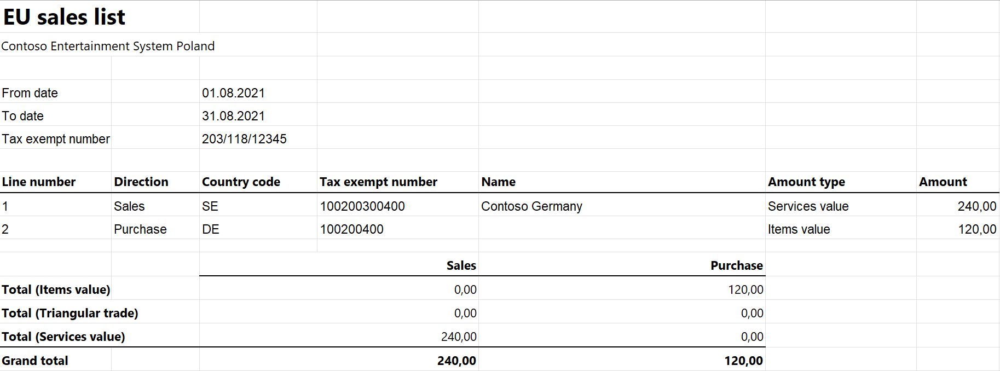

# EU Sales list for Poland

[!include [banner](../../includes/banner.md)]

This article provides information about the European Union (EU) sales list report for Poland (VAT-UE, VAT-UEK for corrections). The Polish EU sales list report contains information about sale and purchase of goods and services for reporting in XML format.

The following fields are included in the Polish EU sales list report:

-  **EU sales list header:**
    - Reporting period
    - Company name
    - Authority ID
    - Company VAT ID
- **EU sales list lines:**
    - Customer VAT ID or Vendor VAT ID
    - Total amount of items
    - Total amount of services
    - Total amount of triangular trade

As of version 10.0.44 of Dynamics 365 Finance, you can also report corrections to the **EU sales list lines** in XML for Poland - VAT-UEK. This format includes the following fields:

-  **EU sales list header:**
    - Reporting period
    - Company name
    - Authority ID
    - Company VAT ID
- **EU sales list lines:**
    - Customer VAT ID or Vendor VAT ID before correction
    - Total amount of items before correction
    - Total amount of services before correction
    - Total amount of triangular trade before correction
    - Customer VAT ID or Vendor VAT ID after correction
    - Total amount of items after correction
    - Total amount of services after correction
    - Total amount of triangular trade after correction

Possibility to report corrections to EU sales list in XML for Poland is supported as of version ... of `EU Sales list (PL)` electronic reporting format. This version of the format can be imported and used in  in the following or later versions of Finance.

| Version | Build |
|---------|-------|
| 10.0.44 | any |
| 10.0.43 | ... |
| 10.0.42 | ... |
| 10.0.41 | ... |
| 10.0.40 | ... |

## Setup

For general setup information, see [EU Sales list reporting](../europe/emea-eu-sales-list.md#prerequisites).

The company name is used in the XML file for the EU sales list report. The value from the **Tax registration number** field on the **Tax registration** FastTab of the **Legal entities** page is used in the .xlsx file for the EU sales list report.

To set up and use EU sales list reporting for multiple VAT registrations, see [Multiple VAT registration numbers](../global/emea-multiple-vat-registration-numbers.md) and [Reporting for multiple VAT registrations](../global/emea-reporting-for-multiple-vat-registrations.md).

### Set up information about the company

Create a registration type, and assign it to the **VAT ID** registration category for Poland and all the countries or regions that your company does business with, as described in Registration IDs.

1. In Microsoft Dynamics 365 Finance, go to **Organization administration** > **Organizations** > **Legal entities**.
2. In the grid, select your company.
3. On the Action Pane, select **Registration IDs**.
4. On the **Registration ID** FastTab, select **Add**.
5. On the **Overview** tab, in the **Registration type** field, select the registration type that you created.
6. Enter your company's VAT ID.
7. Optional: On the **General** tab, in the **General** section, you can change the period that the VAT ID is used for.
8. Close the page.
9. On the **Foreign trade and logistics** FastTab, in the **Intrastat** section, in the **VAT exempt number export** field, select the VAT ID that you created in step 6.

    > [!NOTE] 
    > The value from the **VAT exempt number export** field is used in the .xml file for the EU sales list report if your legal entity has a single VAT registration. For multiple VAT registrations, the Registration ID of VAT ID categiry is used.

### Import Electronic reporting configurations

Import the latest versions of the following Electronic reporting (ER) configurations for the EU sales list from Dataverse:
    - EU Sales list model
    - EU Sales list by columns report
    - EU Sales list by rows report
    - EU Sales list (PL)

For more information, see [Import Electronic reporting (ER) configurations from Dataverse](../global/workspace/gsw-import-er-config-dataverse.md).

### Set up foreign trade parameters

1. In Finance, go to **Tax** > **Setup** > **Foreign trade** > **Foreign trade parameters**.
2. On the **EU sales list** tab, set the **Report cash discount** option to **Yes** if a cash discount should be included in the value when a transaction is included in the EU sales list.
3. Set the **Transfer purchases** option to **Yes**.
4. On the **Electronic reporting** FastTab, in the **File format mapping** field, select **EU Sales list (PL)**.
5. In the **Report format mapping** field, select **EU Sales list by rows report** or **EU Sales list by columns report**.
6. On the **Country/region properties** tab, select **New**, and specify the following information:
    - In the **Country/region** column, select **POL**.
    - In the **Country/region type** column, select **Domestic**. For multiple VAT registrations, in the **Country/region type** column, select **EU**
7. List all the countries or regions that your company does business with. For each country that is part of the EU, in the **Country/region type** field, select **EU** to show trade with those countries on the **EU sales list** page.

### Set up a sales tax authority

1. Go to **Tax** > **Indirect taxes** > **Sales tax** > **Sales tax authorities**.
2. Create a sales tax authority.
3. In the **Authority identification** field, enter the code of the tax authority.

## Work with the EU sales list

For general information about the types of transactions that are included in the EU sales list, how to generate the EU sales list report, and how to close the EU sales list reporting period, see [EU Sales list reporting](../europe/emea-eu-sales-list.md#working-with-the-esl).

### Generate an EU sales list report

1. Go to **Tax** > **Declarations** > **Foreign trade** > **EU sales list**.
2. On the Action Pane, select **Transfer** to transfer transactions to **EU sales list**.
3. On the Action Pane, select **Reporting**.
4. In the **EU sales list reporting** dialog box, on the **Parameters** FastTab, set the following fields.

    | Field                       | Description                                                                         |
    |-----------------------------|-------------------------------------------------------------------------------------|
    | Reporting period            | Select **Monthly** or **Quarterly**.                                                |
    | From date                   | Select the start date for the report.                                               |
    | Generate file               | Set this option to **Yes** to generate an .xml file for your EU sales list report.  |
    | File name                   | Enter the name of the .xml file.                                                    |
    | Generate report             | Set this option to **Yes** to generate an .xlsx file for your EU sales list report. |
    | Report file name            | Enter the name of the .xlsx file.                                                   |
    | Authority                   | Select the sales tax authority.                                                     |
    | Correction                  | Unmark the checkbox.                                                     |
    | I acknowledge that for providing untruths or concealing the truth, there is a risk of liability described in the Fiscal Penal Code | Set this option to **Yes** to generate files.             |

6. Select **OK**, and review the generated reports.

### Generate a correction for EU sales list report

1. Go to **Tax** > **Declarations** > **Foreign trade** > **EU sales list**.
2. Select the line, that you want to correct and select **Copy lines** > **To lines with status included** to create a new line that is linked to an existing one with **Corrected** checkbox marked automatically.
3. Select the newly created line and update necessary fields.
4. In the **EU sales list reporting** dialog box, on the **Parameters** FastTab, set the following fields.
5. On the Action Pane, select **Reporting**.
6. In the **EU sales list reporting** dialog box, on the **Parameters** FastTab, set the following fields.

    | Field                       | Description                                                                         |
    |-----------------------------|-------------------------------------------------------------------------------------|
    | Reporting period            | Select **Monthly** or **Quarterly**.                                                |
    | From date                   | Select the start date for the report.                                               |
    | Generate file               | Set this option to **Yes** to generate an .xml file for your EU sales list report.  |
    | File name                   | Enter the name of the .xml file.                                                    |
    | Generate report             | **Generate report** checkbox is not available when you report a correction. |
    | Report file name            | **Report file name** field is not available when you report a correction.                                                   |
    | Authority                   | Select the sales tax authority.                                                     |
    | Correction                  | Select the checkbox. **Generate report** checkbox and **Report file name** field are not available when you report a correction. |
    | I acknowledge that for providing untruths or concealing the truth, there is a risk of liability described in the Fiscal Penal Code | Set this option to **Yes** to generate files.             |

7. Select **OK**, and review the generated file.

## Example

For general information about how to create a setup, postings, and transfer transactions by using the **DEMF** legal entity for Poland, see [Example for generic EU Sales list](../europe/emea-eu-sales-list-example.md). For this example, you must also create **PL0123456789** as the company's VAT ID.

For information about how to set up purchases and create a vendor invoice, see [Set up purchase transfers](../europe/emea-eu-sales-list-example.md#set-up-purchase-transfers).

### Set up a sales tax authority

1. Go to **Tax** > **Indirect taxes** > **Sales tax** > **Sales tax authorities**.
2. Create the **TA_POL** sales tax authority.
3. In the **Authority identification** field, enter **555**.

### Generate an EU sales list report

1. Go to **Tax** > **Declarations** > **Foreign trade** > **EU sales list**.
2. On the Action Pane, select **Reporting**.
3. In the **EU sales list reporting** dialog box, on the **Parameters** FastTab, set the following fields:
    - In the **Reporting period** field, select **Monthly**.
    - In the **From date** field, select **8/1/2021** (August 1, 2021).
    - Set the **Generate file** option to **Yes**.
    - In the **File name** field, enter **PL-001F**.
    - Set the **Generate report** option to **Yes**.
    - In the **Report file name** field, enter **PL-001R**.
    - Set the **I acknowledge that for providing untruths or concealing the truth, there is a risk of liability described in the Fiscal Penal Code** option to **Yes**.
4.  Select **OK**, and review the report in XML format that is generated. The following tables show the values in the example report.

    **EU sales list header**

    | Field name | Field value                         | Comment                                               |
    |------------|-------------------------------------|-------------------------------------------------------|
    | Rok        | 2021                                | The reporting year.                                   |
    | Miesiac    | 08                                  | The first month of the reporting period.              |
    | KodUrzedu  | 555                                 | The authority identification number.                  |
    | NIP        | 0123456789                          | The company's VAT ID without the country/region code. |
    | PelnaNazwa | Contoso Entertainment System Poland | The company's name.                                   |

    **EU sales list lines**

    | Field name | Line 1    | Line 2       | Comment                                                                                                                                                                                                                                           |
    |------------|-----------|--------------|---------------------------------------------------------------------------------------------------------------------------------------------------------------------------------------------------------------------------------------------------|
    | Grupa      | 1         | 3            | The value is **1** for a record for sold items, **2** for a record for purchased items, and **3** for a service record.                                                                                                                           |
    | a          | DE        | SE           | The country/region code.                                                                                                                                                                                                                          |
    | b          | 100200400 | 100200300400 | The customer's VAT ID without the country/region code.                                                                                                                                                                                            |
    | c          | 120.00    | 240.00       | The sum of all invoices by customer/vendor.                                                                                                                                                                                                       |
    | d          |           |              | The value is **1** for a record where the **List code** field is set to **Triangular/Prod. on toll**. The value is **2** for a record where the **List code** field is set to **Triangular/EU trade**. For all other records, the field is blank. |

5. Review the report in Excel format that is generated.

    

[!INCLUDE[footer-include](../../../includes/footer-banner.md)]
