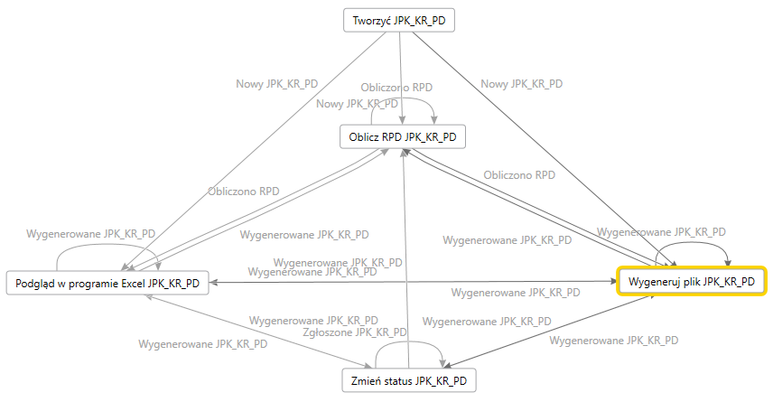

# SAF Accounting Books Income Tax - JPK_KR_PD reporting

In Finance, you have two options for generating the SAF Accounting Books Income Tax - JPK_KR_PD report, depending on your needs:

- *Option 1: Using EM Processing*. This method provides the full scope of the report, including the Tax Register (RPD) section. It also allows you to preview the file in Excel, making it easier to review and validate data before submission.
- *Option 2: Using the Standard Audit File Accounting Books Income Tax menu item*. This option offers a quick way to review the accounting book and triale balance sections of the report.

## Generate JPK_KR_PD from Electronic messages

The JPK_KR_PD reporting process is predefined by the data entities that are [delivered in the PL JPK_KR_PD setup.zip package](emea-pol-saf-pd-setup#em-import). The following illustration shows an overview of the process.

 

The **PL JPK_KR_PD EM setup.zip** package provides a setup for the JPK_KR_PD processing that supports the process of JPK_KR_PD reporting. This setup consists of the following steps:

- **Tworzyć (Create)**: Create an electronic message for JPK_KR_PD reporting.
- **Oblicz RPD JPK_KR_PD (Calculate RPD JPK_KR_PD)**: Calculate the values of the RPD figures based on **Financial dimension set**.
- **Podgląd w programie Excel (Preview in Excel format)**: Generate the JPK_KR_PD report in Microsoft Excel format for preview.
- **Wygeneruj plik (Generate file)**: Generate an XML file in JPK_KR_PD format.
- **Zmień status (Change status)**: Change the status of the electronic message. 

### Create an electronic message for JPK_KR_PD reporting - Tworzyć

1. Go to **Tax** > **Inquiries and reports** > **Electronic messages** > **Electronic messages**.
2. Select **JPK_KR_PD**, and then, on the **Messages** FastTab, select **New**.
3. In the **Run processing** dialog box, select **OK**.
4. A new electronic message is created. Enter a description, and specify the start and end dates of the period that you want to generate the JPK_KR_PD report for.
5. On the **Message additional fields** FastTab, you can manually specify values for the RPD figures to be reported in JPK_KR_PD report. If you specify the values of the RPD figures manually, make sure they are provided in the format expected by the report schema.

### Calculate the values of the RPD figures based on Financial dimension set - Oblicz RPD JPK_KR_PD

If you [configured Finance to automatically calculate the amounts](emea-pol-saf-pd-setup#rpd) for the Income Tax Register (RPD) section of the SAF Accounting Books Income Tax – JPK_KR_PD report as the balance based on a specific combination of Financial dimension set values, you can run the **Oblicz RPD JPK_KR_PD** action. Users can review the automatically calculated amounts before generating the electronic file.

1. Go to **Tax** > **Inquiries and reports** > **Electronic messages** > **Electronic messages**.
2. Select **JPK_KR_PD**, and then, select the electronic message created by the previouse **Tworzyć JPK_KR_PD** action and click **Collect data** button.
3. In the **Run processing** dialog box, the **Oblicz RPD JPK_KR_PD** action is selected. Click **OK** button to proceed. The process of RPD figures calculation uses the **Performance enhancement for general ledger dimension set balance calculation** feature, thus the performance should be similar to performance of the trial balance inquiry. However, you can enable calculation in batch mode if necessary.
4. When the **Oblicz RPD JPK_KR_PD** action is completed, the values of **Additional fields** of the electronic message are calculated. You can review then on the **Message additional fields** FastTab.

### Generate the JPK_KR_PD report in Microsoft Excel format for preview - Podgląd w programie Excel

When all the data is ready in the system, follow these steps to generate the JPK_KR_PD report in Excel format.

1. On the **Electronic messages** page, on the **Messages** FastTab, select **Generate report**.
2. In the **Run processing** dialog box, in the **Action** field, select **Podgląd w programie Excel JPK_KR_PD**. The following parameters are available on the report dialog.

| Parameter | Description |
|---|---|
| From date | Specify the first date to export reporting data for. |
| To date | Specify the last date to export reporting data for. |
| Print with zero balances | By default, the **ZOiS** section of the SAF Accounting Books Income Tax - JPK_KR_PD includes main accounts that have a non-zero opening balance and/or transactions in the reporting period. Select this checkbox if you also want to include main accounts that have a zero opening balance and no turnover during the reporting period. | 
| Purpose of submission | 
Select one of the following values to specify the purpose of the report submission:
<ul><li>JPK for the first time</li><li>JPK correction</li></ul> |
| Report composition | 
Select one or more of the following values to specify the sections of the report that you want to generate:
<ul><li>ZOiS</li><li>Dziennik (includes Dziennik, KontoZapis, Ctrl, Kontrahent)</li><li>RPD</li><li>RPD</li></ul> |
| Include closing transactions | Select this parameter to include closing transactions in the data that is exported. |
| Include reversal | Select this parameter to include reversed transactions in the data that is exported. |
| Posting layer | Select one or more posting layers to consider transactions from. This parameter affects all parts of the report. |

3. To run report generation in a batch, specify parameters on the **Run in the background** FastTab. When the report is generated, it's attached to the electronic message as a file.
4. Select **OK**.
5. To view the file, select the electronic message, and then select the **Attachments** button (paper clip symbol) in the upper-right corner of the page.
6. On the **Attachments for Message** page, select the attachment, and then, on the Action Pane, select **Open**.

### Generate an XML file in JPK_KR_PD format - Wygeneruj plik

When all the data is ready in the system, follow these steps to generate an JPK_KR_PD file in XML format.

1. On the **Electronic messages** page, on the **Messages** FastTab, select **Generate report**.
2. In the **Run processing** dialog box, in the **Action** field, select **Wygeneruj plik JPK_KR_PD**. The following parameters are available on the report dialog.

| Parameter | Description |
|---|---|
| From date | Specify the first date to export reporting data for. |
| To date | Specify the last date to export reporting data for. |
| Print with zero balances | By default, the **ZOiS** section of the SAF Accounting Books Income Tax - JPK_KR_PD includes main accounts that have a non-zero opening balance and/or transactions in the reporting period. Select this checkbox if you also want to include main accounts that have a zero opening balance and no turnover during the reporting period. | 
| Purpose of submission | 
Select one of the following values to specify the purpose of the report submission:
<ul><li>JPK for the first time</li><li>JPK correction</li></ul> |
| Report composition | 
Select one or more of the following values to specify the sections of the report that you want to generate:
<ul><li>ZOiS</li><li>Dziennik (includes Dziennik, KontoZapis, Ctrl, Kontrahent)</li><li>RPD</li><li>RPD</li></ul> |
| Include closing transactions | Select this parameter to include closing transactions in the data that is exported. |
| Include reversal | Select this parameter to include reversed transactions in the data that is exported. |
| Posting layer | Select one or more posting layers to consider transactions from. This parameter affects all parts of the report. |

3. To run report generation in a batch, in the **Run processing** dialog box, specify parameters on the **Run in the background** FastTab.
4. Select **OK**.

The action log is related to the electronic message log information about the user who generated the JPK_KR_PD and performed other actions with the electronic message.

When an XML file for the JPK_KR_PD report is generated, it's attached to the electronic message. To view the file, select the electronic message, and select the **Attachments** button (paper clip symbol) in the upper-right corner of the page. On the **Attachments for Message** page, select the attachment, and then, on the Action Pane, select **Open**.

### Change the status of the electronic message - Zmień status

When the JPK_KR_PD report is successfully completed, use the **Zmień status** action to change the status to **Zgłoszone JPK_KR_PD**. Electronic message in this status does not allow to regenerate report. You can still revert the status back to **Wygenerowane JPK_KR_PD** if necessary.

## Generate JPK_KR_PD using menu item

You can generate a SAF Accounting Books Income Tax - JPK_KR_PD using **General ledger** \> **Inquiries and reports** \> **Standard Audit File for Tax (SAF-T)** \> **Standard Audit File Accounting Books Income Tax** menu item.

> [!NOTE]
> The RPD section of JPK_KR_PD report is supported only when the report is generated from the Electronic messages page (using the JPK_KR_PD Electronic message processing).
> We recommend using the SAF Accounting Books Income Tax menu item to generate the JPK_KR_PD for preview only.

Go to **General ledger** \> **Inquiries and reports** \> **Standard Audit File for Tax (SAF-T)** \> **Standard Audit File Accounting Books Income Tax**, set the following parameters, and then select **OK**.

| Parameter | Description |
|---|---|
| From date | Specify the first date to export reporting data for. |
| To date | Specify the last date to export reporting data for. |
| Print with zero balances | By default, the **ZOiS** section of the SAF Accounting Books Income Tax - JPK_KR_PD includes main accounts that have a non-zero opening balance and/or transactions in the reporting period. Select this checkbox if you also want to include main accounts that have a zero opening balance and no turnover during the reporting period. | 
| Purpose of submission | 
Select one of the following values to specify the purpose of the report submission:
<ul><li>JPK for the first time</li><li>JPK correction</li></ul> |
| Report composition | 
Select one or more of the following values to specify the sections of the report that you want to generate:
<ul><li>ZOiS</li><li>Dziennik (includes Dziennik, KontoZapis, Ctrl, Kontrahent)</li><li>RPD</li></ul>
 RPD option supported when report is run from Electronic messaging only.
 |
| Include closing transactions | Select this parameter to include closing transactions in the data that is exported. |
| Include reversal | Select this parameter to include reversed transactions in the data that is exported. |
| Posting layer | Select one or more posting layers to consider transactions from. This parameter affects all parts of the report. |

### Using a batch job to generate a SAF Accounting Books Income Tax - JPK_KR_PD

A SAF Accounting Books Income Tax - JPK_KR_PD for a long period, such as a quarter or a year, can include a large amount of data and take a long time to be generated. Therefore, we recommend that you use batch jobs. The dialog box for every SAF report includes a **Run in the background** tab where you can set up report generation in batch mode. Set the **Batch processing** option to **Yes**. Learn more about batch processing in [Batch processing overview](../../../fin-ops-core/dev-itpro/sysadmin/batch-processing-overview.md).

To review batch jobs or find a generated file, follow these steps.

1. Go to **Organization administration** \> **Electronic reporting** \> **Electronic reporting jobs**.
1. Find a line that is related to your job, and then select **Show log**. If nothing is shown, no messages were produced when the file was generated.
1. To view a file, select **Show files**, find the file that you need, and then select **Open**.

When an electronic report is generated in batch mode, you can find related batch information and the generated output file as an attachment by going to **Organization administration** \> **Electronic reporting** \> **Electronic reporting jobs**.

Learn more about how to configure a destination for each ER format configuration and its output component in [Electronic reporting (ER) destinations](../../../fin-ops-core/dev-itpro/analytics/electronic-reporting-destinations.md).
