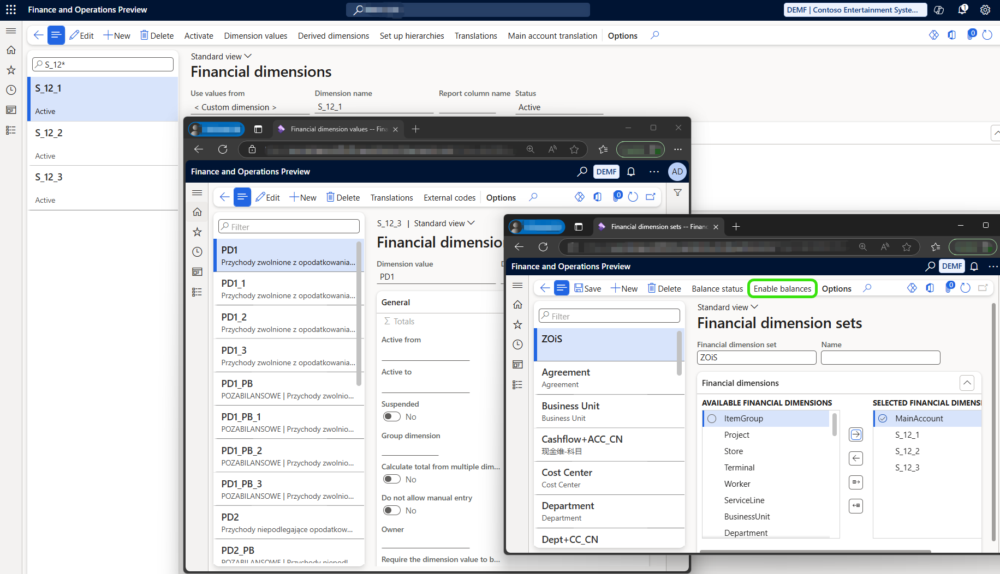
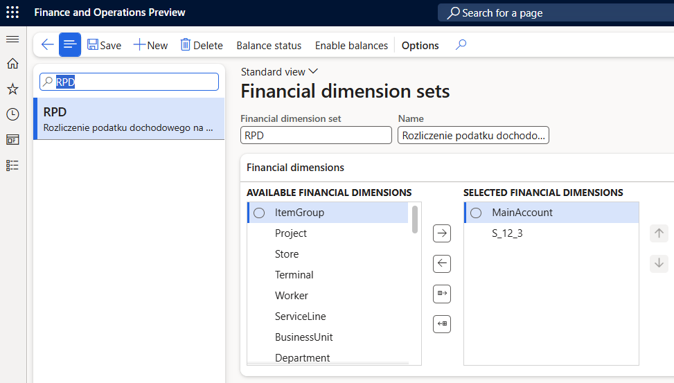

# Prepare for JPK_KR_PD reporting

[!INCLUDE[banner](../../includes/banner.md)]

This article explains how to prepare for JPK_KR_PD reporting in legal entities in Poland in Microsoft Dynamics 365 Finance.

Before you can generate a SAF Accounting Books Income Tax - JPK_KR_PD, you must complete the following setup steps.

1. [Set up a sales tax authority](#tax-authorities)
2. [Import Electronic reporting (ER) configurations](#er-import)
3. [Import a package of data entities that includes a predefined electronic message setup](#em-import)
4. [Set up account tags for trial balance (S_12_1, S_12_2, S_12_3 fields of ZOiS)](#acc-tags)
   - [Option 1: Using Financial dimensions and Financial dimension set](#fin-dim)
   - [Option 2: Using Consolidation accounting groups](#consolidation-accounting-groups)
5. [Set up Financial dimension set and Financial dimensions for Income Tax Register (RPD)](#rpd)
6. [Set up standard chart of accounts (optional, for companies using non-standard chart of accounts in Poland)](#standard-coa)
7. [Configure application-specific parameters for the format of the report](#asp-setup)
8. [Set up General ledger parameters for preview the JPK_KR_PD in Excel](#er-format-setup)

## Set up a sales tax authority

You can find general information about how to set up a sales tax authority in [Set up sales tax authorities](../../general-ledger/tasks/set-up-sales-tax-authorities.md).

To generate a SAF Accounting Books Income Tax - JPK_KR_PD in the required format for the appropriate tax authority, you must set up the **Authority identification** for sales tax authorities.

To set up the **Authority identification** for sales tax authorities, follow these steps.

1. In Dynamics 365 Finance, go to **Tax** \> **Indirect taxes** \> **Sales tax** \> **Sales tax authorities**.
2. In the **Authority identification** field, specify the code of the tax office competent for the taxpayer's registered office. This code will be reported in the **\<KodUrzedu\>** field of the SAF Accounting Books Income Tax - JPK_KR_PD.

## Import ER configurations

In Microsoft Dynamics 365 Finance, import the following ER configurations from Dataverse. Learn more about how to import ER configurations in [Import Electronic reporting (ER) configurations from Dataverse](../../localizations/global/workspace/gsw-import-er-config-dataverse.md).

| ER configuration name | Type | Description |
|---|---|---|
| Standard Audit File (SAF-T) | Model | The common data model for different audit reports. |
| General ledger data model mapping | Model mapping | The model mapping that provides general source mapping for several electronic reports for Poland. |
| JPK_KR_PD XML (PL) | Format | Standard Audit File Accounting Books Income Tax, JPK_KR_PD. |
| JPK_KR_PD Excel (PL) | Format | Preview format for Standard Audit File Accounting Books Income Tax. |

Import the most recent versions of the configurations. The version description usually includes the number of the Knowledge Base (KB) article that explains the changes that were introduced in the configuration version.

> [!IMPORTANT]
> If your organization is using other JPK reports, and the **Default for model mapping** option is set to **Yes** for the **Standard Audit File model mapping** configuration, you can keep that setting. In this case, when the **JPK_KR_PD XML (PL)** or **JPK_KR_PD Excel (PL)** format is run from the **SAF Accounting Book Income Tax** menu item or from Electronic messages page (using JPK_KR_PD Electronic message processing), it automatically uses the **General ledger data model mapping** configuration. To run the **JPK_KR_PD XML (PL)** or **JPK_KR_PD Excel (PL)** format from other places in Finance, set the **Default for model mapping** option to **Yes** for the **General ledger data model mapping** configuration instead.

## Import a package of data entities that includes a predefined electronic message setup

The process of setting up the Electronic messaging functionality for JPK_KR_PD reporting has many steps. Because the names of some predefined entities are used in the ER configurations, it's important that you use a set of predefined values that are delivered in a package of data entities for the related tables.

To import a package of data entities that includes a predefined electronic message setup, follow these steps.

1. Go to [Microsoft Dynamics Lifecycle Services](https://lcs.dynamics.com/v2).
2. In the Shared asset library, select the **Data package** asset type.
3. Find **PL JPK_KR_PD EM setup.zip** in the list of data package files, and download it to your computer.
4. In Finance, select the company that you will generate the JPK_KR_PD report from, and then go to **Workspaces** \> **Data management**.

    Before you import setup data from the package of data entities, you must make sure that the data entities in your application are refreshed and synced.

5. In the **Data management** workspace, go to **Framework parameters** \> **Entity settings**, and then select **Refresh entity list**. Wait for confirmation that the refresh has been completed. For more information about how to refresh the entity list, see [Entity list refresh](../../../fin-ops-core/dev-itpro/data-entities/data-entities.md#entity-list-refresh).
6. Validate that the source data and target data are correctly mapped. For more information, see [Validate that the source data and target data are mapped correctly](../../../fin-ops-core/fin-ops/data-entities/data-import-export-job.md#validate-that-the-source-data-and-target-data-are-mapped-correctly).
7. Before the data entities are used for the first time to import the data from the package, sync the mapping of source data and target data. In the list for the package, select a data entity, and then, on the Action Pane, select **Modify target mapping**. Then, above the grid for the package, select **Generate mapping** to create a mapping from scratch.
8. Save the mapping.
9. Repeat steps 5 through 7 for each data entity in the package.

For more information about Data management, see [Data management](../../../fin-ops-core/dev-itpro/data-entities/data-entities-data-packages.md).

You must now import data from the **PL JPK_KR_PD EM setup.zip** file into the selected company.

To import data into the selected company, follow these steps.

1. In Dynamics 365 Finance, go to the **Data management** workspace.
2. Select **Import**.
3. Set the **Source data format** field to **Package**.
4. Create a new importing project by selecting **New** on the Action Pane.
5. On the **Select entities** FastTab, select **Add file**.
6. Select **Upload and add**, select the **PL JPK_KR_PD EM setup.zip** file on your computer, and upload it.
7. When entities from the package are listed in the grid, select **Close**.
8. On the Action Pane, select **Import** to start to import data from the data entities.

You will receive a notification in **Messages**, or you can manually refresh the page to view the progress of the data import. When the import process is completed, the **Execution summary** page shows the results.

> [!IMPORTANT]
> Some records in the data entities in the package include a link to ER configurations. Therefore, be sure to import ER configurations into Finance before you start to import the data entities package.

When the data from the **PL JPK_KR_PD EM setup.zip** file is imported to your legal entity, follow these steps to activate the executable classes parameters.

1. In Dynamics 365 Finance, go to **Tax** \> **Setup** \> **Electronic messages** \> **Executable class settings**.
2. Select **Wygenerowanie JPK_KR_PD** executable class and on the the Action Pane, select **Parameters**.
3. On the **Parameters** dialog, select **OK** to activate the executable class.

Parameters of the **Obliczanie pól dodatkowych RPD** executable class are initiated on the [Set up Financial dimension set and Financial dimensions for Income Tax Register (RPD)](#rpd) step later in this topic.

## Set up account tags for trial balance: S_12_1, S_12_2, S_12_3 fields of ZOiS

Depending on the business needs of your organization, you might have to include the following information in the **ZOiS** (Turnover and balance statement) part of the SAF Accounting Books Income Tax - JPK_KR_PD.

| ZOiS field | Description (English) | Description (Polish) |
|---|---|---|
| S_12_1 | Account tag resulting from the regulation on the additional scope of data to be supplemented in the accounting records (optional field for entities applying IFRS) | Znacznik konta wynikający z rozporządzenia w sprawie dodatkowego zakresu danych, o które należy uzupełnić prowadzone księgi rachunkowe (pole opcjonalne dla jednostek stosujących MSSF) |
| S_12_2 | Additional account tag resulting from the regulation on the additional scope of data to be supplemented in the accounting records (optional field) | Dodatkowy znacznik konta wynikający z rozporządzenia w sprawie dodatkowego zakresu danych, o które należy uzupełnić prowadzone księgi rachunkowe (pole opcjonalne) |
| S_12_3 | Additional account tag resulting from the regulation on the additional scope of data to be supplemented in the accounting records (PD) (optional field) | Dodatkowy znacznik konta wynikający z rozporządzenia w sprawie dodatkowego zakresu danych, o które należy uzupełnić prowadzone księgi rachunkowe (PD) (pole opcjonalne) |

There are two options supported in Finance to report account tags in JPK_KR_PD:
- *Option 1: Using Financial dimensions and Financial dimension set*. In this approach, necessary account tags are set up as **Financial dimensions** within the system. These dimensions are applied at the ledger transaction level, ensuring that each transaction carries the appropriate classification. This method provides flexibility, as it allows account tagging at the transaction level, enabling detailed financial analysis and reporting. 
- *Option 2: Using Consolidation accounting groups*. This approach requires creating **Consolidation account groups**, with the number of groups matching the different account tag enumeration lists applicable to the organization’s operations. Account tags are directly assigned to each main account in the system. Unlike the first option, this method does not require additional attributes at the ledger transaction level, simplifying the tagging process.

The decision on which option to use depends on your organization’s structure, reporting requirements, and the level of detail needed for financial tracking.

> [!NOTE]
> The JPK_KR_PD solution uses the **Performance enhancement for general ledger dimension set balance calculation** feature. To learn more about the feature, see [New financial dimension sets](../../general-ledger/financial-dimension-set-new.md). The **Performance enhancement for general ledger dimension set balance calculation** feature must be enabled to calculate the amounts in ZOiS section of JPK_KR_PD.

### Option 1: Using Financial dimensions and Financial dimension set

To report required account tags in ZOiS section of JPK_KR_PD, you can use **Financial dimensions**. For more information about how to create and use **Financial dimensions** in Finance, see [Financial dimensions](../../general-ledger/financial-dimensions.md).

You must create dedicated **Financial dimension** for each of the account tag type applicable in your organization: S_12_1, S_12_2, S_12_3. For each of the created **Financial dimension** create all the account tag values applicable to your organization according to regulations in Poland as **Financial dimension values**.

When all the applicable **Financial dimensions** are created, set up **Financial dimension set** dedicated to ZOiS section of JPK_KR_PD report. For more information on how to create and use the **Financial dimension sets**, see [Financial dimension sets](../../general-ledger/financial-dimension-sets.md).

> [!IMPORTANT]
> When you create the **Financial dimension set** dedicated to ZOiS section of the JPK_KR_PD report it is important that you add the **Main account** as the first dimension in the set, S_12_1 as the second, S_12_2 if applicable as the next after the S_12_1 and the S_12_3 next to the S_12_2 if used or S_12_1 if the S_12_2 is not used. The order of dimensions in the dimension set is crucial for proper reporting of account tags in the ZOiS and Dziennik sections of the JPK_KR_PD report.
> 

### Option 2: Using Consolidation accounting groups

When chart of accounts (CoA) of your legal entity contains enough details to cover all the account tags applicable to your organization, use the [Consolidation account groups and additional consolidation accounts](../../budgeting/consolidation-account-groups-consolidation-accounts.md) functionality to create the association between main accounts in Finance and applicable values of **S_12_1**, **S_12_2**, **S_12_3**.

1. Create a [consolidation account group](../../general-ledger/tasks/create-consolidation-groups.md#create-a-consolidation-account-group). For example, create a group that is named **S_12_3**.
2. [Add accounts to the consolidation account group](../../general-ledger/tasks/create-consolidation-groups.md#add-accounts-to-consolidation-account-group). In the **Consolidation account** field, specify the applicable value of the **S_12_3** enumeration. This value is reported in the **S_12_3** element in the **ZOiS** section of the SAF Accounting Books Income Tax - JPK_KR_PD.

You must create as many consolidation account groups as are required to cover the different account tag enumeration lists that are applicable to your organization's business operations. 

## Set up Financial dimension set and Financial dimensions for Income Tax Register (RPD)

You can configure Finance to automatically calculate the amounts for the Income Tax Register (RPD) section of the SAF Accounting Books Income Tax – JPK_KR_PD report as the balance based on a specific combination of **Financial dimension set** values. Users can review the automatically calculated amounts before generating the electronic file.

> [!NOTE]
> The RPD amounts are calculated by an executable class action of JPK_KR_PD Electronic messaging processing and calculated amounts are attached to an **Electronic message** as values of **Additional fields**. It is important that you complete the [Import a package of data entities that includes a predefined electronic message setup](#em-import) of the setup before you can proceed to establish the rules of automatic collection of the RPD amounts.

To automatically calculate the RPD amounts, you must set up a **Financial dimension set**. This can be one already used in your organization, the one used for the ZOiS section, or a completely new one. For more information about how to create and use **Financial dimensions** in Finance, see [Financial dimensions](../../general-ledger/financial-dimensions.md). For more information on how to create and use the **Financial dimension sets**, see [Financial dimension sets](../../general-ledger/financial-dimension-sets.md). 

> [!NOTE]
> The JPK_KR_PD solution uses the **Performance enhancement for general ledger dimension set balance calculation** feature. To learn more about the feature, see [New financial dimension sets](../../general-ledger/financial-dimension-set-new.md). The **Performance enhancement for general ledger dimension set balance calculation** feature must be enabled when you are automatically calculate the amounts for the Income Tax Register (RPD) section of the SAF Accounting Books Income Tax – JPK_KR_PD report.
> 

When **Financial dimension set** for the Income Tax Register (RPD) section of  SAF Accounting Books Income Tax - JPK_KR_PD report is set up, you can establish the rules of automatic collection of the RPD amounts. 

To establish the rules of automatic collection of the RPD amounts, follow these steps.

1. In Dynamics 365 Finance, go to **Tax** \> **Setup** \> **Electronic messages** \> **Executable class settings**.
2. Select **Obliczanie pól dodatkowych RPD** executable class and on the Action Pane, select **Parameters**.
3. In **Financial dimension set** field select the **Financial dimension set** created for Income Tax Register (RPD) section of  SAF Accounting Books Income Tax - JPK_KR_PD report.
4. In **Posting layer** field select one or many posting layers that must be included in amounts collection for RPD.
5. Mark **Include closing transactions** check box if you wnat to include closing transactions in RPD figures calculation. 
6. For every RPD figure that you want to be automatically calulated as the balance based on a specific combination of values of the selected **Financial dimension set**, select the corresponding **Additional field** and specify the **Range** of applicble **Financial dimension** values.
7. When all the RPD figures setup is completed, select **OK** to save settings. User will be able to see and adjust if necessary these settings every time they calculate the RPD figures.

## Set up standard chart of accounts (optional, for companies using non-standard chart of accounts in Poland)

When your organization uses non-standard chart of accounts (CoA) in Poland and the SAF Accounting Books Income Tax - JPK_KR_PD must reflect information that is aligned with the standard chart of accounts that is used in Poland, use the [Consolidation account groups and additional consolidation accounts](../../budgeting/consolidation-account-groups-consolidation-accounts.md) functionality to create the association between main accounts in Finance and standard main accounts in Poland.

1. Create a [consolidation account group](../../general-ledger/tasks/create-consolidation-groups.md#create-a-consolidation-account-group) to establish the association between the main accounts and the standard chart of accounts that is used in Poland.
2. [Add accounts to the consolidation account group](../../general-ledger/tasks/create-consolidation-groups.md#add-accounts-to-consolidation-account-group). In the **Consolidation account** field, specify the applicable value of the standard chart of accounts in Poland. This value is reported in the **S_1** element in the **ZOiS** section of the SAF Accounting Books Income Tax - JPK_KR_PD. The value that you specify in **Consolidation account name** field is reported in the **S_2** element in the **ZOiS** section of the SAF Accounting Books Income Tax - JPK_KR_PD. You must establish an association between all main accounts in Finance that are used for posting operations within the legal entity from which the JPK_KR_PD file will be generated.

## Configure application-specific parameters for the format of the report

Application-specific parameters of the **JPK_KR_PD** format in ER facilitate the mapping of your financial data to the required values that are defined by the **JPK_KR_PD** schema.

To prepare Finance to generate a SAF Accounting Books Income Tax - JPK_KR_PD in compliance with the required schema, follow these steps.

1. In Dynamics 365 Finance, go to the **Electronic reporting** workspace.
2. In the configuration tree, select **General ledger data model mapping** configuration and set **Default for model mapping** option to **Yes**. Ensure that no other model mapping configuration under the **Standard Audit File (SAF-T)** model is not set as **Default for model mapping**.
3. In the configuration tree, select **Standard Audit File (SAF-T)** \> **JPK_KR_PD XML (PL)**.
4. On the Action Pane, on the **Configurations** tab, in the **Applications specific parameters** group, select **Setup**.
5. On the left side of **Application specific parameters** page, select the latest version of the format.
6. On the **Lookups** FastTab, select a lookup field in the list. Detailed descriptions of all the lookup fields of the **JPK_KR_PD XML (PL)** format are provided after this procedure.
7. On the **Conditions** FastTab, define the required conditions, and specify the values in the **Lookup result** column.
8. As the last two lines, add lines that have the conditions **Not blank** and **Blank** where applicable.
9. Repeat steps 5 through 7 for each additional lookup field.
10. When all the lookup fields are set up, select **Completed** in the **State** field, and save the configuration.
11. On the Action pane, select **Export**, export the application-specific parameters as an XML file, and close the **Application specific parameters** page.
12. In the configuration tree, select **Standard Audit File (SAF-T)** \> **JPK_KR_PD Excel (PL)**.
13. On the Action Pane, on the **Configurations** tab, in the **Applications specific parameters** group, select **Setup**.
14. On the left side of **Application specific parameters** page, select the latest version of the format.
15. On the Action pane, select **Import**, and select the XML files saved in step 10.
16. Select **Completed** in the **State** field, and save the configuration.
17. Optional: If necessary, in the configuration tree, select **General ledger data model mapping** configuration and set **Default for model mapping** option to **No**. Set the **Default for model mapping** option to **Yes** for the model mapping configuration that was previously selected. For example, if your organization uses the other JPK reports in Poland, set the **Standard Audit File model mapping** configuration as default.

### OpisDziennika - Journal description

Use the free-text **OpisDziennika** lookup field to define the mapping of the journal description of general journal entries in Finance to the values that will be reported in the **D_2** field of the SAF Accounting Books Income Tax - JPK_KR_PD.

| ZOiS field | Description (English) | Description (Polish) |
|---|---|---|
| D_2 | Journal description - character field. Partial journals used by the entity as an element of accounting records in accordance with art. 14 sec. 3 and 4 of the Accounting Act. | Opis dziennika - pole znakowe. Dzienniki częściowe stosowane przez jednostkę, jako element ksiąg rachunkowych zgodnie z art. 14 ust. 3 i 4 UoR. Powinny one zostać opatrzone nazwą np. Zakup, Sprzedaż |

The following condition is available for mapping in this lookup field.

| Condition | Description |
|---|---|
| Original Document Type (OriginalDocumentType) | Select the original document types that are used in your business operations. In the **Lookup result** field, specify how they should be reported in the **Dziennik** section of the SAF Accounting Books Income Tax - JPK_KR_PD. |

As the last two lines, add lines that have the conditions **Not blank** and **Blank**.

### ZOiSTyp - Turnover and balance statement type

Use the **ZOiSTyp** lookup field to define the type of ZOiS that is applicable for your organization. In the **Lookup result** column, select **ZOiSTyp**. Then, in the **Turnover and balance statement type** column, select which ZOiS type is applicable for your organization. The following values are available.

| ZOiS type | Description (English) | Description (Polish) |
|---|---|---|
| ZOiS1 | Turnover and balance statement for banks | Zestawienie obrotów i sald dla banków |
| ZOiS2 | Turnover and balance statement for insurers and reinsurers | Zestawienie obrotów i sald dla ubezpieczycieli i zakładów reasekuracji |
| ZOiS3 | Turnover and balance statement for public benefit and volunteer organizations | Zestawienie obrotów i sald dla organizacji pożytku publicznego i wolontariatu |
| ZOiS4 | Turnover and balance statement for investment funds | Zestawienie obrotów i sald dla funduszy inwestycyjnych |
| ZOiS5 | Turnover and balance statement for brokerage houses | Zestawienie obrotów i sald dla domów maklerskich |
| ZOiS6 | Turnover and balance statement for SKOK | Zestawienie obrotów i sald dla SKOK |
| ZOiS7 | Turnover and balance statement for other entities | Zestawienie obrotów i sald dla jednostek pozostałych |
| ZOiS8 | Turnover and balance statement for entities applying IFRS| Zestawienie obrotów i sald dla jednostek stosujących MSSF |

### KodUrzedu - Tax authority identification

Use the **KodUrzedu** lookup field to define which tax authority should be reported in the **\<KodUrzedu\>** field. In the **Lookup result** column, select **KodUrzedu**. Then, in the **Tax authority identification** column, select which of the tax authorities that are set up in your legal entity should be used on the report.

### PodatnikZnacznik - Taxpayer tag

Use the **PodatnikZnacznik** lookup field to specify the tag that is applicable to your organization. In the **Lookup result** column, select **PodatnikZnacznik**. Then, in the **Taxpayer tag** column, select which tag is applicable to your organization. The following values are available.

| Taxpayer tag (Tag) | Description (English) | Description (Polish) |
|---|---|---|
| EstonianCIT | Tag for Estonian CIT taxpayer | Znacznik dla podatnika CIT estońskiego |
| IFRS | Tag for taxpayer using IFRS | Znacznik dla podatnika stosującego MSSF |
| StandardPL | Standart Polish CIT | Standardowy polski CIT |

### ZnacznikKonta - Account tags and Polish chart of accounts

Use the **ZnacznikKonta** lookup field to define which of the previously set up consolidation accounting groups that are applicable to your organization should be reported in which fields of the SAF Accounting Books Income Tax - JPK_KR_PD. In the **Lookup result** column, select the **PL_CoA** report tag for the standard chart of accounts. Then, in the **Consolidation group** column, select which consolidation accounting group should be used for the selected tag. The following lookup result values are available.

| Lookup field | Description (English) | Description (Polish) |
|---|---|---|
| S_12_1 | Account tag resulting from the regulation on the additional scope of data to be supplemented in the accounting records (optional field for entities applying IFRS) | Znacznik konta wynikający z rozporządzenia w sprawie dodatkowego zakresu danych, o które należy uzupełnić prowadzone księgi rachunkowe (pole opcjonalne dla jednostek stosujących MSSF) |
| S_12_2 | Additional account tag resulting from the regulation on the additional scope of data to be supplemented in the accounting records (optional field) | Dodatkowy znacznik konta wynikający z rozporządzenia w sprawie dodatkowego zakresu danych, o które należy uzupełnić prowadzone księgi rachunkowe (pole opcjonalne) |
| S_12_3 | Additional account tag resulting from the regulation on the additional scope of data to be supplemented in the accounting records (PD) (optional field) | Dodatkowy znacznik konta wynikający z rozporządzenia w sprawie dodatkowego zakresu danych, o które należy uzupełnić prowadzone księgi rachunkowe (PD) (pole opcjonalne) |
| PL_CoA | Consolidation account groups for Polish chart of accounts | Grupy kont konsolidacyjnych dla polskiego planu kont | 

### RodzajDowodu - Accounting voucher type

Use the free-text **RodzajDowodu** lookup field to define the mapping of the type of accounting voucher of general journal entries in Finance to the values that should be reported in the **D_5** field of the SAF Accounting Books Income Tax - JPK_KR_PD.

| ZOiS field | Description (English) | Description (Polish) |
|---|---|---|
| D_5 | Type of accounting document (which is the basis for the accounting entry, as referred to in art. 23 sec. 2 item 2 of the Accounting Act) placed on the accounting document by the issuer, in accordance with art. 21 sec. 1 item 1 of the Accounting Act. | Rodzaj dowodu księgowego (który stanowi podstawę zapisu księgowego, o czym mowa w art. 23 ust. 2 pkt 2 UoR) umieszczony na dowodzie księgowym przez wystawcę, zgodnie z art. 21 ust. 1 pkt 1 UoR (pole znakowe). |

The following condition is available for mapping in this lookup field.

| Condition | Description |
|---|---|
| Original Document Type (OriginalDocumentType) | Select the original document types that are used in your business operations. In the **Lookup result** field, specify how they should be reported in the **Dziennik** section of the SAF Accounting Books Income Tax - JPK_KR_PD. |

As the last two lines, add lines that have the conditions **Not blank** and **Blank**.

## Set up General ledger parameters for preview the JPK_KR_PD in Excel

Users of a legal entity with primary address in Poland can review their JPK_KR_PD by using the **General ledger** \> **Inquires and reports** \> **Standard Audit File for Tax (SAF-T)** \> **SAF Accounting Books Income Tax** menu item. 

> [!NOTE]
> - The RPD section of JPK_KR_PD report is supported only when the report is generated from the **Electronic messages** page (using the **JPK_KR_PD** Electronic message processing).
> - Microsoft recommends using the **SAF Accounting Books Income Tax** menu item to generate the JPK_KR_PD for preview only.

To set up the ER format that's run by the **SAF Accounting Books Income Tax** menu item, follow these steps.

1. In Dynamics 365 Finance, go to **General ledger** \> **Ledger setup** \> **General ledger parameters**.
2. On the **Standard Audit File for Tax (SAT-T)** tab, in the **SAF Accounting Books Income Tax** field, select the **JPK_KR_PD Excel (PL)** ER format.

[!INCLUDE[footer-include](../../../includes/footer-banner.md)]
