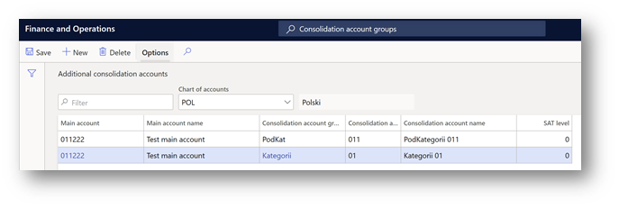
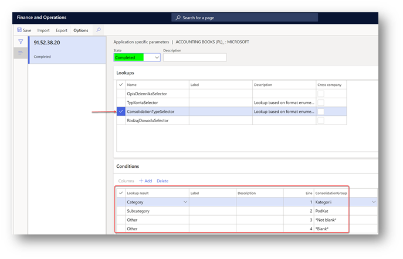
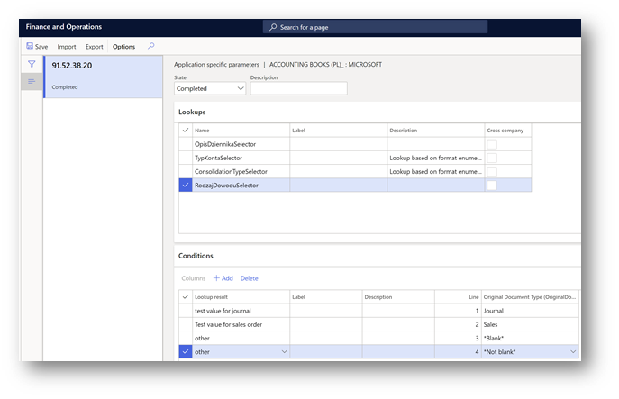

# SAF Accounting Books - JPK_KR

[!include [banner](../../includes/banner.md)]

This article provides information on how to prepare your Finance to report SAF Accounting books (JPK_KR) report that’s required for reporting periods before January 1, 2025.

As of January 1, 2025 the JPK_KR_PD (Jednolity Plik Kontrolny – Księgi Rachunkowe Podatnika) is a new mandatory reporting standard in Poland, that requires taxpayers to submit detailed accounting books in a structured electronic format. For more details about how to prepare your system and generate the JPK_KR_PD report, see [SAF Accounting Books Income Tax - JPK_KR_PD](emea-pol-standard-audit-file-saf-pd.md).

> [!NOTE]
> The SAF Accounting books (JPK_KR) report will be deprecated as of January 1, 2026. For deprecation announcement of SAF Accounting books (JPK_KR), see [Removed or deprecated features in Dynamics 365 Finance in the Finance 10.0.43 release](/dynamics365/finance/get-started/removed-deprecated-features-finance#features-removed-or-deprecated-in-the-finance-10043-release)

## Setup

Before you can generate a SAF VAT invoices file, you must complete the following setup.

1. [Import Electronic reporting configurations](#er-import).
2. [Set up Electronic reporting format in General ledger parameters](#er-format-setup).
5. [Configure Application-specific parameters for the format of the report](#asp-setup).

###  Import Electronic reporting configurations

In Microsoft Dynamics 365 Finance, import the following Electronic reporting (ER) configurations from Microsoft Dataverse.

For more information about how to import ER configurations, see [Import Electronic reporting (ER) configurations from Dataverse](../../localizations/global/workspace/gsw-import-er-config-dataverse.md).

| ER configuration name       | Type          | Description |
|-----------------------------|---------------|-------------|
| Standard Audit File (SAF-T) | Model         | The common data model for different audit reports. |
| Standard Audit File model mapping | Model mapping | The model mapping that provides general source mapping for several electronic reports for Poland. |
| SAF Poland                  | Format        | The XML format that represents a parent format for several JPK formats for Poland. |
| Accounting Books (PL)       | Format        | Accounting books (KR) SAF-T for Poland, JPK_KR. |

Import the most recent versions of the configurations. 
The version description usually includes the number of the Microsoft Knowledge Base (KB) article that explains the changes that were introduced in the configuration version.

> [!IMPORTANT]
> After all the ER configurations from the previous table are imported, set the **Default for model mapping** option to **Yes** for the **Standard Audit File model mapping** configuration.

###  Set up Electronic reporting format in General ledger parameters
To set up Electronic reporting format in General ledger parameters, follow these steps.
1. Go to **General ledger** > **Ledger setup** > **General ledger parameters**.
2. On the **Standard Audit File for Tax (SAT-T)** tab, in the **SAF Accounting books** field, select the ER format, **Accounting Books (PL)**.

###  Configure Application-specific parameters for the format of the report

As of **version 98.59.49**, the **Accounting Books (PL)** ER format can generate a SAF Accounting books file. However, before the file can be generated, you must complete the following setup:

- Set up the **TypKonta** field under the **ZOiS** node.
- Set up the **KodKategorii**, **OpisKategorii**, **KodPodkategorii**, and **OpisPodKategorii** fields under the **ZOiS** node.

### The TypKonta field 

The **TypKonta** field must be reported with one of the following values:

- Bilansowe
- Pozabilansowe
- Rozliczeniowe
- Wynikowe

**Version 98.59.49 and later** of the **Accounting Books (PL)** ER format for the report lets you define the **TypKonta** field based on the main account and main account type.

1. Go to the **Electronic reporting** workspace.
1. In the configuration tree select **Standard Audit File (SAF-T) \> SAF Poland \> Accounting Books (PL)**.
1. On the Action Pane, select **Configurations \> Applications specific parameters \> Setup**.
1. Select the latest version of the format.
1. On the **Lookups** FastTab, select **TypKontaSelector**.
1. On the **Conditions** FastTab, define the required conditions.
1. As the last line, add a line that has the condition **Not blank** in the **Account ID** and **Account type** columns.
1. In the **State** field, select **Completed**, and save the application-specific configuration.

### KodKategorii, OpisKategorii, KodPodkategorii, and OpisPodKategorii fields

The **KodKategorii**, **OpisKategorii**, **KodPodkategorii**, and **OpisPodKategorii** fields under the **ZOiS** node of the report must represent the category and subcategory according to "Zespołu Kont Syntetycznych." To support this requirement, [consolidation account groups and additional consolidation accounts](../../budgeting/consolidation-account-groups-consolidation-accounts.md) were used. You can use other consolidation account features to define category and subcategories, together with their descriptions, for all main accounts that will be used on the **JPK_KR** report.

To define category and subcategories, together with their descriptions, for all main accounts that will be used on the **JPK_KR** report, follow these steps.
1. Go to **General ledger \> Chart of accounts \> Accounts \> Consolidation account groups**.
1. Create two new groups: one for categories and one for subcategories.

    

1. Go to **General ledger \> Chart of accounts \> Accounts \> Additional consolidation accounts**.
1. Create categories and subcategories for all main accounts, based on the consolidation account groups that you created in step 2. 

    - For categories, specify the value that must be reported in the **KodKategorii** field of the report in the **Consolidation account** column, and in the **OpisKategorii** field of the report in the **Consolidation account name** column. Also specify a description.
    - For subcategories, specify the value that must be reported in the **KodPodKategorii** field of the report in the **Consolidation account** column, and in the **OpisPodKategorii** field of the report in the **Consolidation account name** column. Also specify a description.

    

1. When you've finished setting up categories and subcategories, define the consolidation accounts groups that the ER format must consider. Open the **Electronic reporting** workspace, and then, in the configuration tree, select **Standard Audit File (SAF-T) \> SAF Poland \> Accounting Books (PL)**.
1. On the Action Pane, select **Configurations \> Applications specific parameters \> Setup**.
1. Select the latest version of the format.
1. On the **Lookups** FastTab, select **ConsolidationTypeSelector**.
1. On the **Conditions** FastTab, define the required conditions.
1. As the last two lines, add lines that have the conditions **Not blank** and **Blank** for the **Other** lookup result.
1. In the **State** field, select **Completed**, and save the configuration.

    

### RodzajDowodu and OpisDziennika fields under the Dziennik node
The **RodzajDowodu** field under the **Dziennik** node of the report must represent the type of accounting voucher according to article 23, paragraph 2, item 2 of the Act (UoR). The **OpisDziennika** field must represent the journal description according to article 14, paragraphs 3 and 4 of the Act. To support this requirement, new free-text application-specific parameters are introduced in the format of the report.

1. Go to the **Electronic reporting (ER) workspace**, and then, in the configuration tree, select **Standard Audit File (SAF-T) \> SAF Poland \> Accounting Books (PL)**.
1. On the Action Pane, select **Configurations \> Applications specific parameters \> Setup**.
1. Select the latest version of the format.
1. On the **Lookups** FastTab, select **RodzajDowoduSelector**.
1. On the **Conditions** FastTab, define the required conditions. Manually specify the values in the **Lookup result** column according to article 23, paragraph 2, item 2 of the Act.
1. As the last two lines, add lines that have the conditions **Not blank** and **Blank**.

    

1. On the **Lookups** FastTab, select **OpisDziennikaSelector**.
1. On the **Conditions** FastTab, define the required conditions. Manually specify the values in the **Lookup result** column according to article 14, paragraphs 3 and 4 of the Act.
1. As the last two lines, add lines that have the conditions **Not blank** and **Blank**.
1. In the **State** field, select **Completed**, and save the configuration.

##  Generate a SAF Accounting books file (JPK_KR)

A SAF Accounting books file must be provided upon request. The file must include accounting data for the reporting period. It must also include the selected posting layers for all the main accounts that have non-zero aggregated turnover or transactions during the reporting period.

To generate a SAF Accounting books file, select **General ledger > Inquiries and reports > Standard Audit File for Tax (SAF-T) > SAF Accounting books**, set the following parameters and select **OK** to generate the report.

| Parameter                                   | Description |
|---------------------------------------------|-------------|
| From date                                   | Specify the first date to export reporting data for. |
| To date                                     | Specify the last date to export reporting data for. |
| Authority identification                    | Specify the identifier of the tax authority to use in the export file. |
| Posting layer                               | Select one or more posting layers from which to consider transactions. This parameter affects all parts of the report. |
| Should opening balance be shown by turnover | If this parameter is selected, the opening balance is affected by the accumulated turnover. This parameter affects only the ZOiS export file part. |
| Separate balance                            | This parameter can be considered for main accounts where the corresponding parameter is marked. This parameter affects only the ZOiS export file part. |
| Closing transactions                        | If this parameter is selected, closing transactions will be included in the data that is exported. This parameter affects only the ZOiS export file part. |
| Include Total main accounts                 | This check box is included in the report dialog box as of **version 98.59.49** of the **Accounting Books (PL)** ER format. You can use that ER format to generate a report that includes an account that is defined as **Total** in the chart of accounts of the legal entity. By default, this check box is cleared. Select it if you want your **JPK_KR** report, including **Total** accounts, in the **ZOiS** part. |
| Skip ZOiS part                              | This check box is included in the **Report parts** section of the report dialog box as of **version 78.45.25** of the **Accounting Books (PL)** ER format. The ER format lets you generate a report that doesn't include the **ZOiS** part. |
| Skip Dziennik part                          | This check box is included in the **Report parts** section of the report dialog box as of **version 78.45.25** of the **Accounting Books (PL)** ER format. The ER format lets you generate a report that doesn't include the **Dziennik** part. |
| Skip KontoZapis part                        | This check box is included in the **Report parts** section of the report dialog box as of **version 78.45.25** of the **Accounting Books (PL)** ER format. The ER format lets you generate the report that doesn't include the **KontoZapis** part. |
| Show all dimensions                         | This check box is included in the **Ledger transactions** section of the report dialog box as of **version 98.59.49** of the **Accounting Books (PL)** ER format. The ER format lets you generate a report that includes information about financial dimensions that are applied to the voucher line in the **KodKontaMa** and **KodKontaWinien** fields of the **KontoZapis** node. |

By default, the **Show all dimensions** check box is cleared. Select it if you want to include the **KodKontaMa** and **KodKontaWinien** fields in the **KontoZapis** node as financial dimensions. 

If the **Show all dimensions** check box is selected, the **KontoZapis** node shows all the dimensions.

## Using batch jobs for JPK_KR

Generating JPK_KR report for a long period such as a month or a quarter can include a large amount of data and take a long time; therefore, it is recommended to use batch jobs. 
Dialog page for every SAF report has a **Run in the background** tab. 
Open this tab to set up report's generation in batch mode. Select **Batch processing** check box. 
To learn more about batch processing, see [Batch processing overview](../../../fin-ops-core/dev-itpro/sysadmin/batch-processing-overview.md). 
To review batch jobs or find a generated file, follow these steps.
1. Go to **Organization administration** > **Electronic reporting** > **Electronic reporting jobs**, and find a line related to your job. 
1. Select **Show log** on the **Main menu**. If nothing is shown, no messages were produced when the file was generated. 
1. To see the file, select **Show files** on the **Main menu**, find a file that you need, and select **Open** on the **Main menu**.  

When an electronic report is generated in batch mode, you can find related batch information and the generated output file as an attachment by going to **Organization administration** \> **Electronic reporting** \> **Electronic reporting jobs**. 
For more information about how to configure a destination for each ER format configuration and its output component, see [Electronic reporting (ER) destinations](../../../fin-ops-core/dev-itpro/analytics/electronic-reporting-destinations.md).
