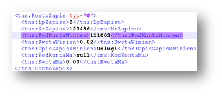

# SAF Accounting Books - JPK_KR

[!include [banner](../../includes/banner.md)]

This article explains how to prepare Microsoft Dynamics 365 Finance to report the SAF Accounting books - JPK_KR that is required for reporting periods before January 1, 2025.

JPK_KR_PD (Jednolity Plik Kontrolny – Księgi Rachunkowe Podatnika) is a new reporting standard in Poland that is mandatory for businesses as of January 1, 2025. It requires that taxpayers submit detailed accounting books in a structured electronic format. Learn more about how to prepare your system and generate the new SAF Accounting Books Income Tax - JPK_KR_PD in [SAF Accounting Books Income Tax - JPK_KR_PD](emea-pol-standard-audit-file-saf-pd.md).

> [!NOTE]
> As of January 1, 2026, the SAF Accounting books - JPK_KR will be deprecated. You can find the deprecation announcement in [Removed or deprecated features in Dynamics 365 Finance in the Finance 10.0.43 release](/dynamics365/finance/get-started/removed-deprecated-features-finance#features-removed-or-deprecated-in-the-finance-10043-release).

## Setup

Before you can generate a SAF Accounting Books - JPK_KR, you must complete the following setup.

1. [Import Electronic reporting (ER) configurations](#er-import).
1. [Set up the ER format in General ledger parameters](#er-format-setup).
1. [Configure application-specific parameters for the format of the report](#asp-setup).

### Import ER configurations

In Finance, import the following ER configurations from Dataverse. Learn more about how to import ER configurations in [Import Electronic reporting (ER) configurations from Dataverse](../../localizations/global/workspace/gsw-import-er-config-dataverse.md).

| ER configuration name | Type | Description |
|---|---|---|
| Standard Audit File (SAF-T) | Model | The common data model for different audit reports. |
| Standard Audit File model mapping | Model mapping | The model mapping that provides general source mapping for several electronic reports for Poland. |
| SAF Poland | Format | The XML format that represents a parent format for several JPK formats for Poland. |
| Accounting Books (PL) | Format | Accounting books (KR) SAF-T for Poland, JPK_KR. |

Import the most recent versions of the configurations. The version description usually includes the number of the Knowledge Base (KB) article that explains the changes that were introduced in the configuration version.

> [!IMPORTANT]
> After all the ER configurations from the previous table are imported, set the **Default for model mapping** option to **Yes** for the **Standard Audit File model mapping** configuration.

###  Set up the ER format in General ledger parameters

To set up the ER format in General ledger parameters, follow these steps.

1. Go to **General ledger** \> **Ledger setup** \> **General ledger parameters**.
1. On the **Standard Audit File for Tax (SAT-T)** tab, in the **SAF Accounting books** field, select the **Accounting Books (PL)** ER format.

### Configure application-specific parameters for the format of the report

#### TypKonta, KodKategorii, OpisKategorii, KodPodkategorii, and OpisPodKategorii fields under the ZOiS node

As of **version 98.59.49**, the **Accounting Books (PL)** ER format can generate a SAF Accounting Books - JPK_KR. However, before the file can be generated, you must set up the following fields under the **ZOiS** node:

- TypKonta
- KodKategorii
- OpisKategorii
- KodPodkategorii
- OpisPodKategorii

##### TypKonta field

The **TypKonta** field must be reported with one of the following values:

- Bilansowe
- Pozabilansowe
- Rozliczeniowe
- Wynikowe

**Version 98.59.49 and later** of the **Accounting Books (PL)** ER format for the report lets you define the **TypKonta** field based on the main account and main account type.

1. Open the **Electronic reporting** workspace.
1. In the configuration tree, select **Standard Audit File (SAF-T)** \> **SAF Poland** \> **Accounting Books (PL)**.
1. On the Action Pane, on the **Configurations** tab, in the **Application specific parameters** group, select **Setup**.
1. Select the latest version of the format.
1. On the **Lookups** FastTab, select **TypKontaSelector**.
1. On the **Conditions** FastTab, define the required conditions.
1. As the last line, add a line that has the condition **Not blank** in the **Account ID** and **Account type** columns.
1. In the **State** field, select **Completed**.
1. Save the application-specific configuration.

##### KodKategorii, OpisKategorii, KodPodkategorii, and OpisPodKategorii fields

The **KodKategorii**, **OpisKategorii**, **KodPodkategorii**, and **OpisPodKategorii** fields under the **ZOiS** node of the report must represent the category and subcategory according to "Zespołu Kont Syntetycznych." To support this requirement, [consolidation account groups and additional consolidation accounts](../../budgeting/consolidation-account-groups-consolidation-accounts.md) were used. You can use other consolidation account features to define category and subcategories, together with their descriptions, for all main accounts that will be used in the SAF Accounting Books - JPK_KR.

To define category and subcategories, together with their descriptions, for all main accounts that will be used in the SAF Accounting Books - JPK_KR, follow these steps.

1. Go to **General ledger** \> **Chart of accounts** \> **Accounts** \> **Consolidation account groups**.
1. Create two new groups: one for categories and one for subcategories.

    

1. Go to **General ledger** \> **Chart of accounts** \> **Accounts** \> **Additional consolidation accounts**.
1. Create categories and subcategories for all main accounts, based on the consolidation account groups that you created in step 2.

    - For categories: In the **Consolidation account** column, specify the value that must be reported in the **KodKategorii** field of the report. In the **Consolidation account name** column, specify the value that must be reported in the **OpisKategorii** field of the report. Also specify a description.
    - For subcategories: In the **Consolidation account** column, specify the value that must be reported in the **KodPodKategorii** field of the report. In the **Consolidation account name** column, specify the value that must be reported in the **OpisPodKategorii** field of the report. Also specify a description.

    

1. After you finish setting up categories and subcategories, define the consolidation accounts groups that the ER format must consider. Open the **Electronic reporting** workspace, and then, in the configuration tree, select **Standard Audit File (SAF-T)** \> **SAF Poland** \> **Accounting Books (PL)**.
1. On the Action Pane, on the **Configurations** tab, in the **Application specific parameters** group, select **Setup**.
1. Select the latest version of the format.
1. On the **Lookups** FastTab, select **ConsolidationTypeSelector**.
1. On the **Conditions** FastTab, define the required conditions.
1. As the last two lines, add lines that have the conditions **Not blank** and **Blank** for the **Other** lookup result.
1. In the **State** field, select **Completed**.
1. Save the configuration.

    

#### RodzajDowodu and OpisDziennika fields under the Dziennik node

The **RodzajDowodu** field under the **Dziennik** node of the report must represent the type of accounting voucher according to article 23, paragraph 2, item 2 of the Act (UoR). The **OpisDziennika** field must represent the journal description according to article 14, paragraphs 3 and 4 of the Act. To support this requirement, new free-text application-specific parameters are introduced in the format of the report.

1. Open the **Electronic reporting** workspace.
1. In the configuration tree, select **Standard Audit File (SAF-T)** \> **SAF Poland** \> **Accounting Books (PL)**.
1. On the Action Pane, on the **Configurations** tab, in the **Application specific parameters** group, select **Setup**.
1. Select the latest version of the format.
1. On the **Lookups** FastTab, select **RodzajDowoduSelector**.
1. On the **Conditions** FastTab, define the required conditions. In the **Lookup result** column, manually specify the values according to article 23, paragraph 2, item 2 of the Act.
1. As the last two lines, add lines that have the conditions **Not blank** and **Blank**.

    

1. On the **Lookups** FastTab, select **OpisDziennikaSelector**.
1. On the **Conditions** FastTab, define the required conditions. In the **Lookup result** column, manually specify the values according to article 14, paragraphs 3 and 4 of the Act.
1. As the last two lines, add lines that have the conditions **Not blank** and **Blank**.
1. In the **State** field, select **Completed**.
1. Save the configuration.

## Generate a SAF Accounting Books - JPK_KR

A SAF Accounting Books - JPK_KR must be provided on request. The file must include accounting data for the reporting period. It must also include the selected posting layers for all the main accounts that have non-zero aggregated turnover or transactions during the reporting period.

To generate a SAF Accounting Books - JPK_KR, go to **General ledger** \> **Inquiries and reports** \> **Standard Audit File for Tax (SAF-T)** \> **SAF Accounting books**, set the following parameters, and then select **OK**.

| Parameter | Description |
|---|---|
| From date | Specify the first date to export reporting data for. |
| To date | Specify the last date to export reporting data for. |
| Authority identification | Specify the identifier of the tax authority to use in the export file. |
| Posting layer | Select one or more posting layers to consider transactions from. This parameter affects all parts of the report. |
| Should opening balance be shown by turnover | Select this parameter if the opening balance should be affected by the accumulated turnover. This parameter affects only the **ZOiS** part of the export file. |
| Separate balance | This parameter can be considered for main accounts where the corresponding parameter is marked. It affects only the **ZOiS** part of the export file. |
| Closing transactions | Select this parameter to include closing transactions in the data that is exported. This parameter affects only the **ZOiS** part of the export file. |
| Include Total main accounts | This checkbox is included in the report dialog box as of **version 98.59.49** of the **Accounting Books (PL)** ER format. It lets you generate a report that includes an account that is defined as **Total** in the chart of accounts of the legal entity. By default, this checkbox is cleared. Select it if you want your report, including **Total** accounts, in the **ZOiS** part. |
| Skip ZOiS part | This checkbox is included in the **Report parts** section of the report dialog box as of **version 78.45.25** of the **Accounting Books (PL)** ER format. It lets you generate a report that doesn't include the **ZOiS** part. |
| Skip Dziennik part | This checkbox is included in the **Report parts** section of the report dialog box as of **version 78.45.25** of the **Accounting Books (PL)** ER format. It lets you generate a report that doesn't include the **Dziennik** part. |
| Skip KontoZapis part | This checkbox is included in the **Report parts** section of the report dialog box as of **version 78.45.25** of the **Accounting Books (PL)** ER format. It lets you generate a report that doesn't include the **KontoZapis** part. |
| Show all dimensions | This checkbox is included in the **Ledger transactions** section of the report dialog box as of **version 98.59.49** of the **Accounting Books (PL)** ER format. It lets you generate a report that includes information about financial dimensions that are applied to the voucher line in the **KodKontaMa** and **KodKontaWinien** fields of the **KontoZapis** node. |

By default, the **Show all dimensions** checkbox is cleared. Select it if you want to include the **KodKontaMa** and **KodKontaWinien** fields as financial dimensions in the **KontoZapis** node.

If the **Show all dimensions** checkbox is selected, the **KontoZapis** node shows all the dimensions.

## Using a batch job to generate a SAF Accounting Books - JPK_KR

A SAF Accounting Books - JPK_KR for a long period, such as a month or a quarter, can include a large amount of data and take a long time to be generated. Therefore, we recommend that you use batch jobs. The dialog box for every SAF report includes a **Run in the background** tab where you can set up report generation in batch mode. Set the **Batch processing** option to **Yes**. Learn more about batch processing in [Batch processing overview](../../../fin-ops-core/dev-itpro/sysadmin/batch-processing-overview.md).

To review batch jobs or find a generated file, follow these steps.

1. Go to **Organization administration** \> **Electronic reporting** \> **Electronic reporting jobs**.
1. Find a line that is related to your job, and then select **Show log**. If nothing is shown, no messages were produced when the file was generated.
1. To view a file, select **Show files**, find the file that you need, and then select **Open**.

When an electronic report is generated in batch mode, you can find related batch information and the generated output file as an attachment by going to **Organization administration** \> **Electronic reporting** \> **Electronic reporting jobs**.

Learn more about how to configure a destination for each ER format configuration and its output component in [Electronic reporting (ER) destinations](../../../fin-ops-core/dev-itpro/analytics/electronic-reporting-destinations.md).
