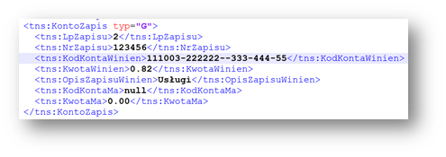

# SAF Accounting Books Income Tax - JPK_KR_PD

[!include [banner](../../includes/banner.md)]

The JPK_KR_PD (Jednolity Plik Kontrolny – Księgi Rachunkowe Podatnika) is a new mandatory reporting standard in Poland, 
requiring taxpayers to submit detailed accounting books in a structured electronic format. 
This requirement will become mandatory for businesses starting January 1, 2025.
Large taxpayers will need to report the new JPK_KR_PD for the first time in March 2026, in line with the deadline for filing their 2025 tax return1. 

## Setup

Before you can generate a SAF Accounting Books Income Tax report, you must complete the following setup.

1. [Import Electronic reporting configurations](#er-import)
2. [Set up Electronic reporting format in General ledger parameters](#er-format-setup)
3. [Set up sales tax authority](#tax-authorities)
4. [Set up consolidation accounting groups](#consolidation-accounting-groups)
5. [Configure Application-specific parameters for the format of the report](#asp-setup)

###  Import Electronic reporting configurations

In Finance, import the following Electronic reporting (ER) configurations from Dataverse.

For more information about how to import ER configurations, see [Import Electronic reporting (ER) configurations from Dataverse](../../localizations/global/workspace/gsw-import-er-config-dataverse.md).

| ER configuration name       | Type          | Description |
|-----------------------------|---------------|-------------|
| Standard Audit File (SAF-T) | Model         | The common data model for different audit reports. |
| General ledger data model mapping | Model mapping | The model mapping that provides general source mapping for several electronic reports for Poland. |
| JPK_KR_PD XML (PL) - *Preview*  | Format        | *Preview* of the JPK_KR_PD XML (PL), JPK_KR_PD. |

> [!NOTE]
> The **JPK_KR_PD XML (PL) - Preview** is provided solely for early adoption and preparatory purposes regarding the new reporting requirements.
> Please note that this preview does not include the RDP component and is subject to further updates.
> It will eventually be replaced with the finalized "JPK_KR_PD XML (PL)" format.
> Users are advised to use this version for preliminary familiarization only.

Import the most recent versions of the configurations. 
The version description usually includes the number of the Microsoft Knowledge Base (KB) article that explains the changes that were introduced in the configuration version.

> [!IMPORTANT]
> In case your organization is using other JPK reports and **Standard Audit File model mapping** configuration is set as **Default for model mapping**,
> you can keep this setting and **JPK_KR_PD XML (PL)** format will use the **General ledger data model mapping** automatically, when run from **SAF Accounting Book Income Tax** menu item.
>
> To run **JPK_KR_PD XML (PL)** format from other places in your Dynamics 365 Finance, set the **General ledger data model mapping** as **Default for model mapping**. 

###  Set up Electronic reporting format in General ledger parameters

1. Go to **General ledger** > **Ledger setup** > **General ledger parameters**.
2. On the **Standard Audit File for Tax (SAT-T)** tab, in the **SAF Accounting Books Income Tax** field, select the ER format, **JPK_KR_PD XML (PL)**. 

###  Set up sales tax authority

For general information about how to set up a sales tax authority, see [Set up sales tax authorities](../../general-ledger/tasks/set-up-sales-tax-authorities.md). 
To generate a JPK_KR_PD in the required format for the appropriate tax authority, you must set up the report layout for sales tax authorities. 

1. On the **Sales tax authorities** page (**Tax > Indirect taxes > Sales tax > Sales tax authorities**), 
set the **Report layout** field to **Default**. Select the same sales tax authority for the sales tax settlement period that will be used for the sales tax codes.
2. In the **Authority identification** specify the the code of the tax office competent for the taxpayer's registered office, that will be reported in `<KodUrzedu>` field of JPK_KR_PD.

###  Set up consolidation accounting groups

###  Configure Application-specific parameters for the format of the report

you must complete the following setup:

- Set up the **TypKonta** field under the **ZOiS** node.
- Set up the **KodKategorii**, **OpisKategorii**, **KodPodkategorii**, and **OpisPodKategorii** fields under the **ZOiS** node.

#### The TypKonta field 

The **TypKonta** field must be reported with one of the following values:

- Bilansowe
- Pozabilansowe
- Rozliczeniowe
- Wynikowe

**Version 98.59.49 and later** of the **Accounting Books (PL)** ER format for the report lets you define the **TypKonta** field based on the main account and main account type.

1. Open the **Electronic reporting** workspace, and then, in the configuration tree, select **Standard Audit File (SAF-T) \> SAF Poland \> Accounting Books (PL)**.
2. On the Action Pane, select **Configurations \> Applications specific parameters \> Setup**.
3. Select the latest version of the format.
4. On the **Lookups** FastTab, select **TypKontaSelector**.
5. On the **Conditions** FastTab, define the required conditions.
6. As the last line, add a line that has the condition **Not blank** in the **Account ID** and **Account type** columns.
7. In the **State** field, select **Completed**, and save the application-specific configuration.

#### KodKategorii, OpisKategorii, KodPodkategorii, and OpisPodKategorii fields

The **KodKategorii**, **OpisKategorii**, **KodPodkategorii**, and **OpisPodKategorii** fields under the **ZOiS** node of the report must represent the category and subcategory according to "Zespołu Kont Syntetycznych." To support this requirement, [consolidation account groups and additional consolidation accounts](../../budgeting/consolidation-account-groups-consolidation-accounts.md) were used. You can use other consolidation account features to define category and subcategories, together with their descriptions, for all main accounts that will be used on the **JPK_KR** report.

1. Go to **General ledger \> Chart of accounts \> Accounts \> Consolidation account groups**.
2. Create two new groups: one for categories and one for subcategories.

    

3. Go to **General ledger \> Chart of accounts \> Accounts \> Additional consolidation accounts**.
4. Create categories and subcategories for all main accounts, based on the consolidation account groups that you created in step 2. 

    - For categories, specify the value that must be reported in the **KodKategorii** field of the report in the **Consolidation account** column, and in the **OpisKategorii** field of the report in the **Consolidation account name** column. Also specify a description.
    - For subcategories, specify the value that must be reported in the **KodPodKategorii** field of the report in the **Consolidation account** column, and in the **OpisPodKategorii** field of the report in the **Consolidation account name** column. Also specify a description.

    

5. When you've finished setting up categories and subcategories, define the consolidation accounts groups that the ER format must consider. Open the **Electronic reporting** workspace, and then, in the configuration tree, select **Standard Audit File (SAF-T) \> SAF Poland \> Accounting Books (PL)**.
6. On the Action Pane, select **Configurations \> Applications specific parameters \> Setup**.
7. Select the latest version of the format.
8. On the **Lookups** FastTab, select **ConsolidationTypeSelector**.
9. On the **Conditions** FastTab, define the required conditions.
10. As the last two lines, add lines that have the conditions **Not blank** and **Blank** for the **Other** lookup result.
11. In the **State** field, select **Completed**, and save the configuration.

    

#### RodzajDowodu and OpisDziennika fields under the Dziennik node
The **RodzajDowodu** field under the **Dziennik** node of the report must represent the type of accounting voucher according to article 23, paragraph 2, item 2 of the Act (UoR). The **OpisDziennika** field must represent the journal description according to article 14, paragraphs 3 and 4 of the Act. To support this requirement, new free-text application-specific parameters are introduced in the format of the report.

1. Open the **Electronic reporting (ER) workspace**, and then, in the configuration tree, select **Standard Audit File (SAF-T) \> SAF Poland \> Accounting Books (PL)**.
2. On the Action Pane, select **Configurations \> Applications specific parameters \> Setup**.
3. Select the latest version of the format.
4. On the **Lookups** FastTab, select **RodzajDowoduSelector**.
5. On the **Conditions** FastTab, define the required conditions. Manually specify the values in the **Lookup result** column according to article 23, paragraph 2, item 2 of the Act.
6. As the last two lines, add lines that have the conditions **Not blank** and **Blank**.

    

7. On the **Lookups** FastTab, select **OpisDziennikaSelector**.
8. On the **Conditions** FastTab, define the required conditions. Manually specify the values in the **Lookup result** column according to article 14, paragraphs 3 and 4 of the Act.
9. As the last two lines, add lines that have the conditions **Not blank** and **Blank**.
10. In the **State** field, select **Completed**, and save the configuration.

## Generate a SAF Accounting books file (JPK_KR)

A SAF Accounting books file must be provided upon request. The file must include accounting data for the reporting period. It must also include the selected posting layers for all the main accounts that have non-zero aggregated turnover or transactions during the reporting period.

To generate a SAF Accounting books file, click **General ledger > Inquiries and reports > Standard Audit File for Tax (SAF-T) > SAF Accounting books**, and set the following parameters.

| Parameter                                   | Description |
|---------------------------------------------|-------------|
| From date                                   | Specify the first date to export reporting data for. |
| To date                                     | Specify the last date to export reporting data for. |
| Authority identification                    | Specify the identifier of the tax authority to use in the export file. |
| Posting layer                               | Select one or more posting layers from which to consider transactions. This parameter affects all parts of the report. |
| Should opening balance be shown by turnover | If this parameter is selected, the opening balance is affected by the accumulated turnover. This parameter affects only the ZOiS export file part. |
| Separate balance                            | This parameter can be considered for main accounts where the corresponding parameter is marked. This parameter affects only the ZOiS export file part. |
| Closing transactions                        | If this parameter is selected, closing transactions will be included in the data that is exported. This parameter affects only the ZOiS export file part. |
| Include Total main accounts                 | This check box is included in the report dialog box as of **version 98.59.49** of the **Accounting Books (PL)** ER format. You can use that ER format to generate a report that includes an account that is defined as **Total** in the chart of accounts of the legal entity. By default, this check box is cleared. Select it if you want your **JPK_KR** report, including **Total** accounts, in the **ZOiS** part. |
| Skip ZOiS part                              | This check box is included in the **Report parts** section of the report dialog box as of **version 78.45.25** of the **Accounting Books (PL)** ER format. The ER format lets you generate a report that doesn't include the **ZOiS** part. |
| Skip Dziennik part                          | This check box is included in the **Report parts** section of the report dialog box as of **version 78.45.25** of the **Accounting Books (PL)** ER format. The ER format lets you generate a report that doesn't include the **Dziennik** part. |
| Skip KontoZapis part                        | This check box is included in the **Report parts** section of the report dialog box as of **version 78.45.25** of the **Accounting Books (PL)** ER format. The ER format lets you generate the report that doesn't include the **KontoZapis** part. |
| Show all dimensions                         | This check box is included in the **Ledger transactions** section of the report dialog box as of **version 98.59.49** of the **Accounting Books (PL)** ER format. The ER format lets you generate a report that includes information about financial dimensions that are applied to the voucher line in the **KodKontaMa** and **KodKontaWinien** fields of the **KontoZapis** node. |

By default, the **Show all dimensions** check box is cleared. Select it if you want to include the **KodKontaMa** and **KodKontaWinien** fields in the **KontoZapis** node as financial dimensions. 

If the **Show all dimensions** check box is selected, the **KontoZapis** node shows all the dimensions.

As of **version 98.59.49**, the **Accounting Books (PL)** ER format can generate a SAF Accounting books file. However, before the file can be generated, 
