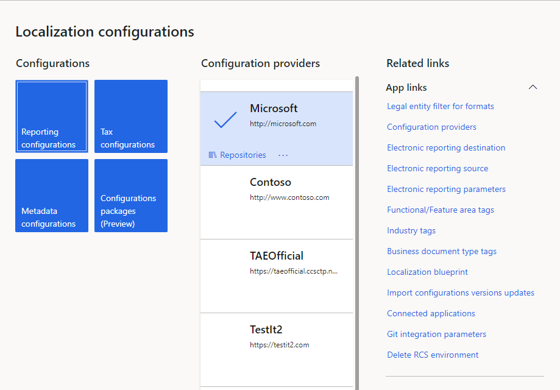
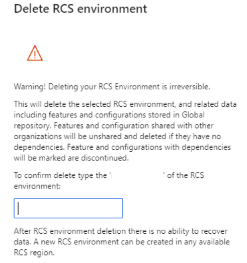

# Regulatory Configuration Service (RCS) - Delete an RCS environment

[!include [banner](../includes/banner.md)]

This article explains how a Regulatory Configuration Service (RCS) system administrator can delete an RCS environment and related data.

Before you can complete the procedure in this article, the following prerequisites must be met:

- You must have the **System Admin** role assigned to you for the RCS environment.
- The **System Admin** role must have the **RCSDeleteEnvironmentDuty** role assigned to it.

## Delete an RCS environment

1. Open RCS, and select the **Electronic reporting** workspace tile.
2. In the **Related links** section, select **Delete RCS environment**.

    

3. In the dialog box that appears, review the messages about the scope of environment deletion.

    

    > [!IMPORTANT]
    > Deletion of an RCS environment can't be reversed.
    >
    > The operation deletes the selected RCS environment and any related data, including features and configurations that are stored in the Global repository. Features and configurations that are shared with other organizations will be unshared and deleted if they have no dependencies. Features and configurations that have dependencies will be marked as discontinued.

4. In the field that is provided, enter the globally unique identifier (GUID) of the RCS environment to confirm that you want to delete it. The environment's GUID is included in the deletion message.
5. Select **Delete environment**.
	
Your RCS environment and any related data are now deleted.

> [!IMPORTANT]
> After you delete an RCS environment, there is no way to recover the data. A new RCS environment can be created in any available RCS region.
