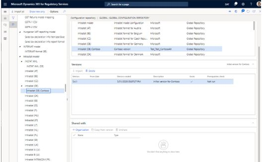

# Share Electronic reporting (ER) configurations in Regulatory Configuration Services (RCS) Global repository with external organizations

[!include [banner](../includes/banner.md)]

You can use Microsoft Regulatory Configuration Services (RCS) to share Electronic reporting (ER) configurations and then publish them to external organizations.

The following procedures explain how an RCS user can share a version of an ER configuration that has been configured in an RCS instance with an external organization. Before you can complete those procedures, you must complete the following prerequisites:

- Access an RCS instance.
- Create an active configuration provider. For more information, see [Create configuration providers and mark them as active](../../fin-ops-core/dev-itpro/analytics/tasks/er-configuration-provider-mark-it-active-2016-11.md).
- Create and upload a new version of an ER configuration. For more information, see [Create and upload a new version of an Electronic reporting (ER) configuration](rcs-global-repo-upload.md).

You must also make sure that an RCS environment is provisioned for your company.

1. In a finance and operations app, go to **Organization administration** \> **Workspaces** \> **Electronic reporting**.
2. If no RCS environment is provisioned for your company, select **Regulatory services – Configuration external**, and then follow the instructions to provision one.

If an RCS environment has been already provisioned for your company, use the page URL to access it by selecting the sign-in option.

## Verify the configuration that you want to share

Follow these steps to verify that the configuration that you want to share has already been uploaded to the Global repository.

1. In the **Electronic reporting** workspace, select **Repositories** for your configuration provider.

    

2. Select **Global repository** \> **Open**.
3. Search for the configuration that you want to share. You can use the filter field to narrow your search. If you can't find the configuration in the Global repository, follow the steps in [Create and upload a new version of an Electronic reporting (ER) configuration](rcs-global-repo-upload.md).

## Share ER configurations with external organizations

After a configuration has been created under your configuration provider, you can share it directly with external organizations by using the **Shared with** FastTab on the **Global configuration repository** page.

1. In the **Electronic reporting** workspace, select **Repositories** for your configuration provider.
2. Select **Global repository** \> **Open**. 
3. Select the configuration that you want to share.
4. On the **Shared with** FastTab, select **Organization**.

    

5. In the dialog box, enter the domain name for the external organization, and then select **OK**.

    

The configuration is shared with the external organization and is available to that organization in the Global repository. From there, it can be imported into the organization's instance of RCS or into its instances of finance and operations apps.

6. To unshare a configuration that has been previously shared with an external organization, select the configuration and click **Unshare**, and then select **OK**

[!INCLUDE[footer-include](../../includes/footer-banner.md)]
