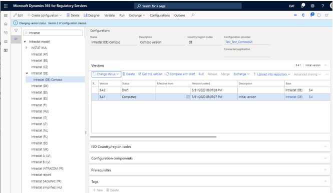
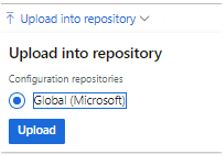
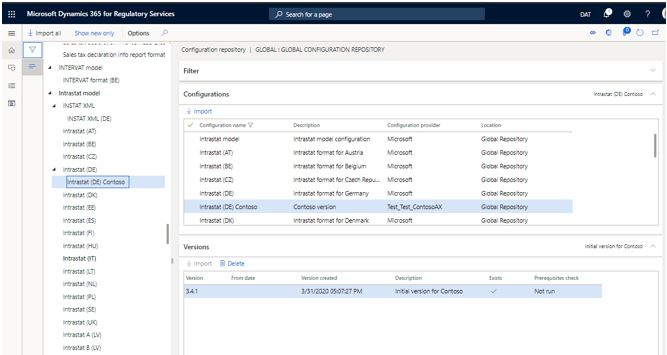
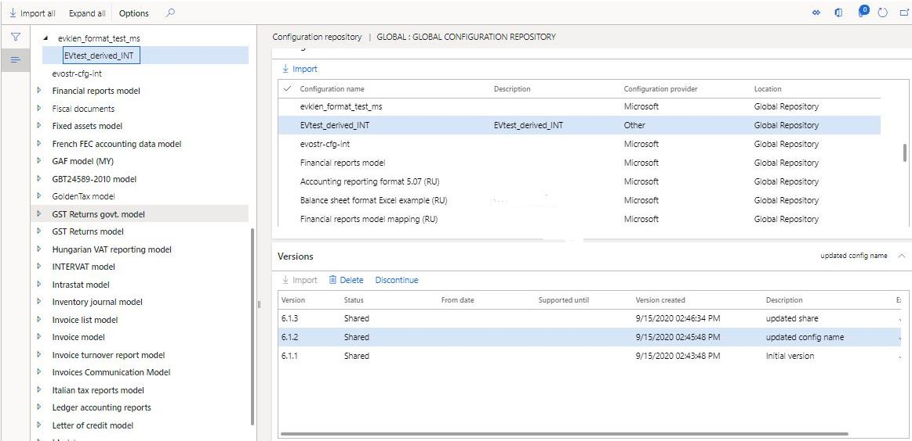
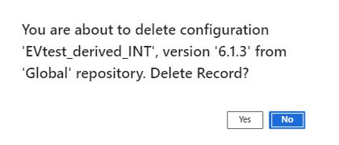

# Create ER configurations in Regulatory Configuration Services (RCS) and upload them to the Global repository

[!include [banner](../includes/banner.md)]

You can use Microsoft Regulatory Configuration Services (RCS) to design Electronic reporting (ER) configurations and publish them so that they can be used in your organization.

The following procedures explain how a user in the System Administrator or Electronic Reporting Developer role can create a derived version of an ER configuration that has been configured in an RCS instance, and then upload the derived configuration to the Global repository. 

Before you can complete those procedures, you must complete the following prerequisites:

- Have access to an RCS environment for your organization.
- Create an active configuration provider and make it active. For more information, see [Create configuration providers and mark them as active](../../fin-ops-core/dev-itpro/analytics/tasks/er-configuration-provider-mark-it-active-2016-11.md).

You must make sure that an RCS environment is provisioned for your organization. If you do not have an RCS instance provisioned for your organization, you can do so using the following steps:

1. In a finance and operations app, go to **Organization administration** \> **Workspaces** \> **Electronic reporting**.
2. In **Related links / External links**, select **Regulatory services – Configuration**, and then follow the instructions to **Sign up** to provision one.

If an RCS environment has been already provisioned for your organization, use the page URL to access it and select the **sign-in** option.

## Create a derived version of a configuration in RCS

> [!NOTE]
> If this is the first time that you have used RCS you will not have any configuration available for you to derive from. You will need to import a configuration from the Global repository. For more information, see [Download ER configurations from the Global repository of Configuration service](../../fin-ops-core/dev-itpro/analytics/er-download-configurations-global-repo.md).

1. **Sign-in** to RCS and select the **Electronic reporting** workspace.
2. Verify that you have an active configuration provider for your organization that is set to active (see prerequisites). 
3. Select **Reporting configurations**.
4. Select the configuration that you want to derive a new version from. You can use the filter field above the tree to narrow your search.
5. Select **Create configuration** \> **Derive from Name**.
6. Enter a name and description, and then select **Create configuration** to create a new derived version with a 'Draft' status.
7. Select the newly derived configuration and make additional changes to the configuration format, if needed. 
8. After your changes are complete you need to set **Change status** for the configuration to **Completed** to be able to publish it to the repository. Select **OK**.

> [!NOTE]
> When the configuration status is changed, you might receive a validation error message that is related to the connected applications. To turn off the validation, on the Action Pane on the **Configurations** tab, select **User parameters**, and then set the **Skip validation at configuration's status change and rebase** option to **Yes** 

## Upload a configuration to the Global repository

To share a new or derived configuration with your organization, you can upload it into the Global repository by following these steps:

1. Select the completed version of the configuration, and then select **Upload into repository**.
2. Select the **Global (Microsoft)** option, and then select **Upload**.

    

3. In the confirmation message box, select **Yes**. 
4. Update the description of the version as required, and then select **OK**. You can also optionally upload the version to a connected application or to a GIT repository.  

The status of the configuration is updated to **Shared**, and the configuration is uploaded to the Global repository. A draft version of the configuration you uploaded is also created and can be used if subsequent changes are required.

After the configuration has been uploaded to the Global repository, you can work with it there in the following ways:

- Import it into your Dynamics 365 instance. For more information, see [(ER) Import configurations from RCS](../../fin-ops-core/dev-itpro/analytics/tasks/import-configuration-rcs.md).
- Share it with a third party or an external organization, see [RCS Share Electronic reporting (ER) configurations with external organizations](rcs-global-repo-share-configuration.md)

    

## Delete a configuration from the Global repository
Complete the following steps to delete a configuration that your organization has created.

1. In the **Electronic reporting** workspace, verify that your configuration provider is **Active**. For more information, see [Create configuration providers and mark them as active](../../fin-ops-core/dev-itpro/analytics/tasks/er-configuration-provider-mark-it-active-2016-11.md).
2. On your active configuration provider, select **repository**.
3. Select the repository type **Global**, and select **Open**.
4. On the **Filter** FastTab, find the configuration that you want to delete by using the **Filter** functionality.
5. On the **Version** FastTab, select the version of the configuration that you want to delete, and then select **Delete**:

    

6. In the confirmation message box, select **Yes**.

    
 
The configuration version is deleted, and confirmation message is shown. 

> [!NOTE]
> Configurations can only be deleted by the Configuration provider that created them. If the configuration has been shared with another organization, the configuration will need to be unshared before you delete it.
 

[!INCLUDE[footer-include](../../includes/footer-banner.md)]

