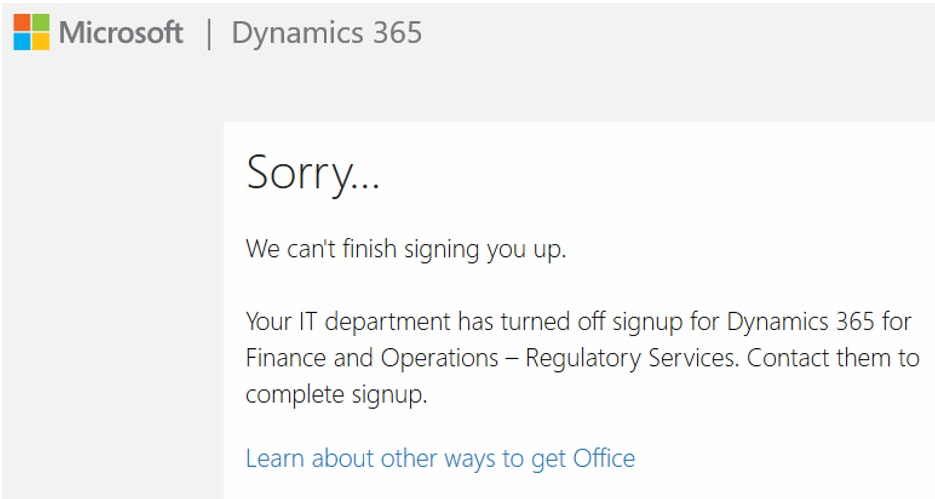

# Regulatory Configuration Service

[!include [banner](../includes/banner.md)]

Regulatory Configuration Service (RCS) is a standalone designer and lifecycle management service for no-code/low-code globalization functionality. RCS lets globalization stakeholders extend and customize key globalization areas of tax, e-invoicing, regulatory reporting, banking, and business documents without having to involve developers. This no-code/low-code globalization approach makes globalization easier, faster, and more cost effective to create or extend.

RCS provides the following capabilities:

- Support for all functionality that is provided by Electronic reporting (ER).
- A prerequisite to configure new globalization microservices.
- Support for Electronic Invoicing. For more information, see [Electronic Invoicing](/dynamics365-release-plan/2021wave1/finance-operations/dynamics365-finance/electronic-invoicing-add-on-dynamics-365-ga).
- Supports for Tax Calculation. For more information, see [Tax service](/dynamics365-release-plan/2021wave1/finance-operations/dynamics365-finance/tax-service-preview).
- Support for new globalization feature functionality that simplifies the lifecycle management of multi-component features and provides extra capability to configure actions and set up feature parameters. For more information, see [Regulatory Configuration Service – simplified globalization feature management for globalization services](/dynamics365-release-plan/2021wave1/finance-operations/dynamics365-finance/regulatory-configuration-service-simplified-globalization-feature-management-globalization-services).
- Support for centralized publication, storage, and sharing of custom configurations in the Global repository to simplify configuration management without requiring the use of Microsoft Dynamics Lifecycle Services (LCS).

## Access RCS

You can sign up for or sign in to RCS from the [Regulatory Configuration Service page](https://marketing.configure.global.dynamics.com/).

On the **Regulatory Configuration Service** page, review and accept the supplemental terms and conditions for use of the service, and then select one of the following buttons:

- **Sign up** if you're a first-time user of the service, and you're using a business email address to provision your organization a service environment
- **Sign in** if you've previously signed up for the service, and you want to access your organization environment

> [!NOTE] 
> After you sign up, we recommend that you add an additional SysAdmin user to the RCS environment. This user will be provisioned as the co-admin for the environment. This will help to provide stability for access to the RCS environment, as the SysAdmin role is to manage users for that environment. You can add users using **RCS workspace > System Administration**.

## Regional availability

RCS is generally available in the following regions:

- United States
- India
- France
- Europe

For a complete list of regions, see [Dynamics 365 and Power Platform: Availability, data location, language, and localization](https://aka.ms/dynamics_365_international_availability_deck).

> [!NOTE] 
> RCS isn't currently available for Government Community Cloud (GCC).

## RCS default company

Design time functionality that is used in RCS is shared across all companies. There is no company-specific functionality. Therefore, we recommend that you use one company, **DAT**, with your RCS environment.

However, in some scenarios, you might want to make ER formats use parameters that are related to a specific legal entity. In these scenarios only, you should use the default company switcher. For an example, see [Configure ER format to use parameters that are specified per legal entity](../../fin-ops-core/dev-itpro/analytics/er-app-specific-parameters-configure-format.md).

## Related RCS documentation

For more information about related components, see the following topics:

- **RCS:**

    - [Create ER configurations in RCS and upload them to the Global repository](rcs-global-repo-upload.md)

- **Global repository:**

    - [Create ER configuration & upload to Global repo](rcs-global-repo-upload.md)
    - [Share configuration in Global repo](rcs-global-repo-share-configuration.md)
    - [Enhanced filtering in Global repo](enhanced-filtering-global-repo.md)
    - [Download ER configurations from the Global repository](../../fin-ops-core/dev-itpro/analytics/er-download-configurations-global-repo.md)
    - [Discontinuing configurations in Global repo](discontinuing-configurations-rcs-global-repo.md)
    - [Regulatory Configuration Service (RCS) – Lifecycle Services (LCS) storage deprecation](rcs-lcs-repo-dep-faq.md)

- **Globalization feature:**

    - [Regulatory Configuration Service (RCS) - Globalization feature](/dynamics365-release-plan/2021wave1/finance-operations/dynamics365-finance/regulatory-configuration-service-simplified-globalization-feature-management-globalization-services)

## Troubleshooting RCS sign-up

When you sign up for RCS from the service page, you might encounter an issue that is related to Azure Active Directory (Azure AD). The error message that you receive indicates that sign-up for RCS is currently turned off and must be turned on before you can complete the sign-up process.

The issue occurs because you're blocked from signing up for ad-hoc subscriptions, and the `AllowAdHocSubscriptions` property must be enabled in your tenant. 

- If your IT department manages your organization's Azure tenants, contact that department to report the issue.
- If you're responsible for managing your Azure tenants, you can fix the issues by following the steps in [What is self-service sign-up for Azure Active Directory](/azure/active-directory/enterprise-users/directory-self-service-signup#how-do-i-control-self-service-settings).
