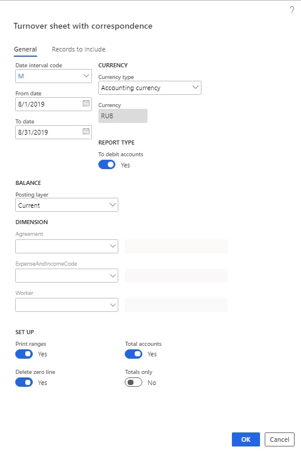
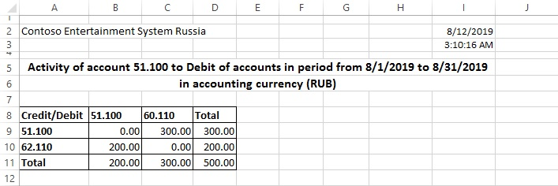
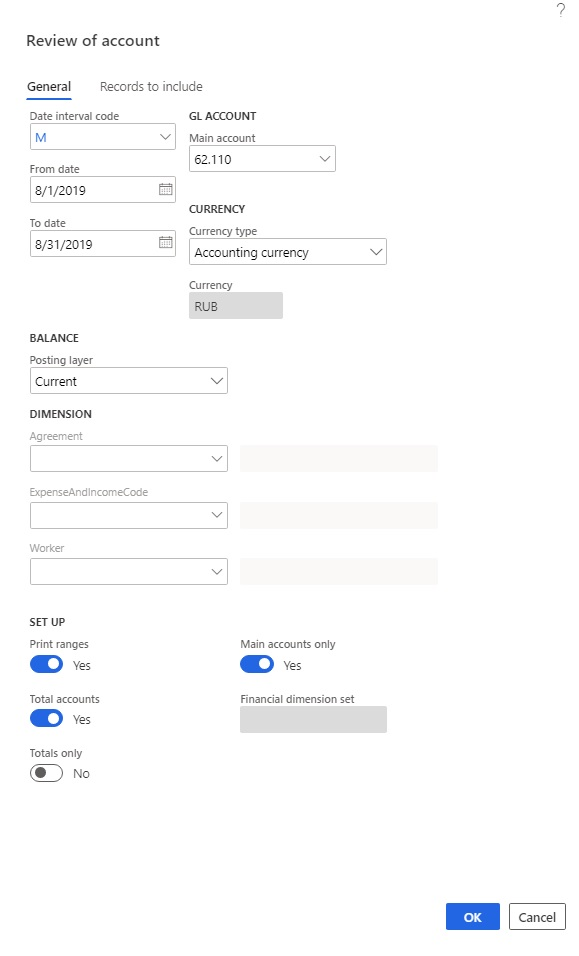
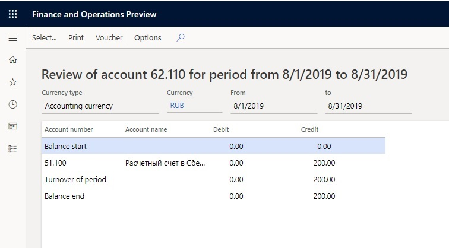
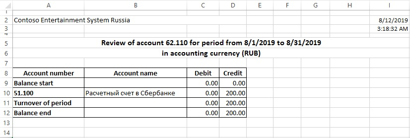

---
# required metadata
title: Account activity reports
description: This topic provides information about account activity reports including the Turnover sheet with correspondence.
author: v-nadyuz
ms.date: 02/07/2020
ms.topic: article
ms.prod: 
ms.technology: 

# optional metadata

# ms.search.form:  
audience: Application User
# ms.devlang: 
ms.reviewer: kfend
# ms.tgt_pltfrm: 
# ms.custom: 
ms.search.region: Russia
# ms.search.industry: 
ms.author: roschlom
ms.search.validFrom: 2018-10-28
ms.dyn365.ops.version: 8.1

---

# Account activity reports
[!include [banner](../includes/banner.md)]

The Turnover sheet with correspondence is a basic component of the accounting reports. It's a multirow, multicolumn table that contains information about the activity for all accounts during the accounting period. The number of rows and columns in the table is determined by the number of account numbers from the chart of accounts that you set up on the **Query** page.

The top row and the leftmost column of the table contain the account numbers from the chart of accounts. The intersection of rows and columns shows the total of all transactions for the period. The correspondence of those transactions is determined by the account numbers in the top row and the leftmost column that correspond to the selected cell.

For each row and column in the table, the totals are summarized. The summary for each row is recorded in the bottom row of the table, and the summary for each column is recorded in the rightmost column. The total amount of debit and credit turnover is shown in the cell at the intersection of the bottom row and the rightmost column.

1. Go to **General ledger** \> **Inquires and reports** \> **Account activity** \> **Turnover sheet with correspondence**.
2. On the **General** tab, in the **Date interval code** field, select the date interval code from the date interval directory.
3. In the **From date** and **To date** fields, select the start and end of the report generation period.

    > [!NOTE]
    > If you don't manually set these fields, values are entered based on the selected date interval code.

4. In the **Currency type** field, select the currency type for the report: **Accounting currency**, **Reporting currency**, or **Indicated currency**.
5. In the **Currency** field, select the transaction currency.

    > [!NOTE]
    > This field is available only if you select **Indicated currency** in the **Currency type** field.

6. Set the **To debit accounts** option to **Yes** if you want the debit for the selected accounts to appear as a header line. If this option is set to **No**, the debit for the selected accounts appears in the column.
7. In the **Dimension** section, in the **Agreement**, **ExpenseAndIncomeCode**, and **Worker** fields, specify dimension codes if you want to select transactions that have specific codes for the report.

    > [!NOTE]
    > If you leave these fields blank, the system will select transactions that have *any* dimension code for the report.

8. In the **Posting layer** field, select the posting layer.
9. Set the **Print ranges** option to **Yes** to view the query terms when you print the report.
10. Set the **Delete zero line** option to **Yes** if you don't want to print lines or columns that have 0 (zero) values.
11. Set the **Total accounts** option to **Yes** to total the accounts.
12. Set the **Totals only** option to **Yes** to view only total accounts.

    > [!NOTE]
    > This option is available only if you set the **Total accounts** option to **Yes**.

    

13. Select **ОК** to generate the report.

    

>  *Note.*
>
>  -  Select **Voucher** to view the ledger transactions that generated the
>     activity.
>
>  -  Select **Select** to change the report generation parameters.
>
>  -  Select **Print** to print the report in Microsoft Excel.

   

## General ledger report

The **General ledger** report contains information about the balances and activity for a specified account that is in correspondence with all accounts in the chart of accounts for a specified date interval. The report is broken down by reporting periods (for example, months). A separate page is generated for each account in the chart of accounts.

1. Go to **General ledger** \> **Inquires and reports** \> **Account activity** \> **General ledger**.
2. On the **General** tab, in the **Date interval code** field, select the date interval code from the date interval directory.
3. In the **From date** and **To date** fields, select the start and end of the report generation period.

    > [!NOTE]
    > If you don't manually set these fields, values are entered based on the selected date interval code.

4. In the **Currency type** field, select the currency type for the report: **Accounting currency**, **Reporting currency**, or **Indicated currency**.
5. In the **Currency** field, select the transaction currency.

    > [!NOTE]
    > This field is available only if you select **Indicated currency** in the **Currency type** field.

6. In the **From main account** and **To main account** fields, specify the range of accounts to generate the report for.
7. In the **Dimension** section, in the **Agreement**, **ExpenseAndIncomeCode**, and **Worker** fields, specify dimension codes if you want to select transactions that have specific codes for the report.

    > [!NOTE]
    > If you leave these fields blank, the system will select transactions that have *any* dimension code for the report.

8. Set the **Print ranges** option to **Yes** to view the query terms when you print the report.
9. Set the **Delete zero line** option to **Yes** if you don't want to print lines or columns that have 0 (zero) values.
10. Set the **Total accounts** option to **Yes** to total the accounts.
11. Set the **Totals only** option to **Yes** to view only total accounts.

    > [!NOTE]
    > This option is available only if you set the **Total accounts** option to **Yes**.

12. Set the **Debit activity** option to **Yes** to print the detailed account turnovers in debit correspondence.
13. Set the **Credit activity** option to **Yes** to print the detailed account turnovers in credit correspondence.
14. Set the **Use periods** option to **Yes** to print the report by interval, according to the reporting period. Set this option to **No** to print the report by months.

    

15. Select **ОК** to generate the report.

    

> [!NOTE]
>
> - Select **Voucher** to view the ledger transactions that generated the activity.
> - Select the total account cell to open the transactions on all accounts that are included in the range of the specified total account, and that generated activity on the total account.
> - Select **Select** to change the report generation parameters.
> - Select **Print** to print the report in Excel.

   

## Review of account report

The rows on the **Review of account** report contain information about the balances and activity of a specified account that is in debit and credit correspondence for the period that is under review. The final line of the report summarizes the activity. The first row of the report shows the balance at the beginning of the period, and the last row shows the balance at the end of the period.

1. Go to **General ledger** \> **Inquires and reports** \> **Account activity** \> **Review of account**.
2. On the **General** tab, in the **Date interval code** field, select the date interval code from the date interval directory.
3. In the **From date** and **To date** fields, select the start and end of the report generation period.

    > [!NOTE]
    > If you don't manually set these fields, values are entered based on the selected date interval code.

4. In the **Currency type** field, select the currency type for the report: **Accounting currency**, **Reporting currency**, or **Indicated currency**.
5. In the **Currency** field, select the transaction currency.

    > [!NOTE]
    > This field is available only if you select **Indicated currency** in the **Currency type** field.

6. In the **Main account** field, select the account to generate the report for.
7. In the **Dimension** section, in the **Agreement**, **ExpenseAndIncomeCode**, and **Worker** fields, specify dimension codes if you want to select transactions that have specific codes for the report.

    > [!NOTE]
    > If you leave these fields blank, the system will select transactions that have *any* dimension code for the report.

8. Set the **Print ranges** option to **Yes** to view the query terms when you print the report.
9. Set the **Total accounts** option to **Yes** to total the accounts.
10. Set the **Totals only** option to **Yes** to view only total accounts.

    > [!NOTE]
    > This option is available only if you set the **Total accounts** option to **Yes**.

11. Set the **Main accounts only** option to **Yes** to view only main accounts.

    

12. On the **Records to include** tab, you can select **Filter** to specify filter criteria.
13. Select **ОК** to generate the report.

> [!NOTE]
>
> - Select **Voucher** to view the ledger transactions that generated the activity.
> - Select **Select** to change the report generation parameters.
> - Select **Print** to print the report in Excel.

   

## Journal order/account activity report

You can use the **Journal order/account activity** report to review movement on a specified account in the context of transactions. You can also review the recalculation of the balance for each transaction.

1. Go to **General ledger \> Inquires and reports \> Account activity \> Journal order/account activity**.
2. On the **General** tab, in the **Date interval code** field, select the date interval code from the date interval directory.
3. In the **From date** and **To date** fields, select the start and end of the report generation period.

    > [!NOTE]
    > If you don't manually set these fields, values are entered based on the selected date interval code.

4. In the **Currency type** field, select the currency type for the report: **Accounting currency**, **Reporting currency**, or **Indicated currency**.
5. In the **Currency** field, select the transaction currency.

    > [!NOTE]
    > This field is available only if you select **Indicated currency** in the **Currency type** field.

6. In the **Main account** field, select the account to generate the report for. If you select a total account, the report will be generated for the transactions of all accounts that are included in the total.
7. In the **Dimension** section, in the **Agreement**, **ExpenseAndIncomeCode**, and **Worker** fields, specify dimension codes if you want to select transactions that have specific codes for the report.

    > [!NOTE]
    > If you leave these fields blank, the system will select transactions that have *any* dimension code for the report.

8.  Set the **Print ranges** option to **Yes** to view the query terms when you print the report.
9.  Set the **Total accounts** option to **Yes** to total the accounts.
10. Set the **Totals only** option to **Yes** to view only total accounts.

    > [!NOTE]
    > This option is available only if you set the **Total accounts** option to **Yes**.

11. Set the **Debit activity** option to **Yes** to print the detailed account turnovers in debit correspondence.
12. Set the **Credit activity** option to **Yes** to print the detailed account turnovers in credit correspondence.

    

13. On the **Records to include** tab, you can select **Filter** to specifyfilter criteria.
14. Select **ОК** to generate the report in Excel.

> [!NOTE]
>   
> - Select **Voucher** to view the ledger transactions that generated the activity.
> - Select the total account cell to open the transactions on all accounts that are included in the range of the specified total account, and that generated activity on the total account.
> - Select **Select** to change the report generation parameters.
> - Select **Print** to print the report in Excel.

[!INCLUDE[footer-include](../../includes/footer-banner.md)]