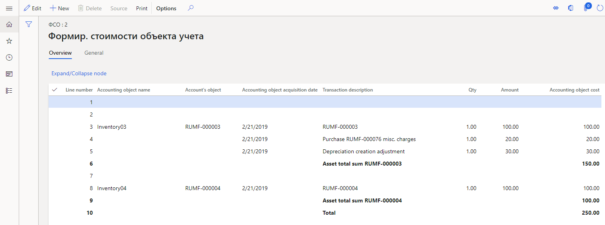

---
# required metadata
title: Fixed assets and intangible assets registers
description: This topic provides information about fixed assets and intangible assets registers.
author: anasyash
ms.date: 08/16/2021
ms.topic: article
ms.prod: 
ms.technology: 

# optional metadata

# ms.search.form:  
audience: Application User
# ms.devlang: 
ms.reviewer: kfend
# ms.tgt_pltfrm: 
# ms.custom: 
ms.search.region: Russia
# ms.search.industry: 
ms.author: roschlom
ms.search.validFrom: 2019-03-01
ms.dyn365.ops.version: 8.1

---

# Fixed assets and intangible assets registers
[!include [banner](../includes/banner.md)]

Fixed assets (FA) and intangible assets (IA) are considered depreciable assets. The following basic provisions of tax accounting for depreciable assets are stated in the Tax code of Russia:

-   Fixed assets or intangible assets that have a value that is less than or equal to 10,000 rubles, or a lifetime that is less than 12 months, aren't recognized as depreciable assets.
-   When the lifetime of fixed assets and intangible assets is determined, the allowable limits that are stated in the depreciation groups should be considered.
-   The depreciation of fixed assets and intangible assets in tax accounting can be calculated by using only two methods of depreciation: linear and non-linear.
-   Losses from the sale of a depreciable asset in tax accounting are recognized as deferrals and should be written off evenly, starting in the period after the period of sale and ending by the period that was initially specified as the end of the asset's lifetime.

For the tax accounting of fixed assets and intangible assets, create the following registers as described in the topic, [Create tax registers and the tax register journal](rus-profit-tax-registers.md#create-a-tax-register):

-   Goods cost calculation
-   FA – information about object
-   IA – object information
-   FA depreciation
-   IA depreciation
-   FA/IA sale
-   Depreciation bonus recovery

## Set up registers

### Set up expense codes

For **FA – information about object**, **IA – object information**, **FA depreciation**, and **IA depreciation** registers, you must create expense codes and income codes on the **Expense code** page, and you must set up ledger accounts for the expense codes. For more information, see [Expense and income codes](rus-expense-and-income-codes.md#create-an-expense-or-income-code).

### Set up register parameters

Follow these steps for each of the following registers: **FA – information about object**, **IA – object information**, **FA depreciation**, **IA depreciation**, and **FA/IA sale**.

1.  Go to **Tax** \> **Setup** \> **Profit tax** \> **Registers**. On the **Tax registers** page, set up a register.
2.  On the **Parameters** FastTab, set the following fields that are used to generate registers:

    -   Depreciation groups
    -   Type of fixed asset

    In each field, you can specify multiple comma-separated values. If you leave these fields blank, the register will be generated for all fixed assets or intangible assets.

3.  On the Action Pane, select **Specific** to set up the expense codes and income codes for the register.
4.  On the **Setup** FastTab, in the **Fixed asset type** field, select **Use for production** if you want to attribute fixed assets to production. Otherwise, select **Don't use for production**.

#### Set up the IA depreciation register

-   On the **Tax registers** page, on the **Parameters** FastTab, in the **Expense code** field, specify the expense code. You can specify multiple comma-separated values. If you leave this field blank, the register will be generated for all fixed assets or intangible assets. Otherwise, only depreciation transactions that have the selected expense codes will be considered.

#### Set up the FA/IA sale register

-   Go to **Tax** \> **Setup** \> **Profit tax** \> **Registers**. On the **Tax registers** page, on the **Parameters** FastTab, set the following fields to generate a register:

    -   **Expense code** – Specify the expense code. You can specify multiple comma-separated values. If you leave this field blank, the register will be generated for sales transactions for all fixed assets or intangible assets.
    -   **Do you want to calculate IA?** – Indicate whether lines for intangible assets should be calculated at the same time as the register lines.

## Set up Fixed assets (Russia)

In the **Fixed assets (Russia)** module, you can keep accounts of fixed assets and intangible assets for an unlimited number of value models.

All operations except putting into operation are performed independently in all value models. One of the models must be used for tax accounting. You can set up several depreciation groups for each value model.

Before you can calculate tax registers, you must set up the following prerequisites. For instructions, follow the links.

-   [Fixed asset value models](rus-set-up-fixed-assets.md#set-up-fixed-asset-value-models)
-   [Fixed asset posting profiles](rus-set-up-fixed-assets.md#set-up-fixed-asset-posting-profiles)
-   [Fixed asset groups](rus-set-up-fixed-assets.md#set-up-fixed-asset-groups)
-   [Fixed asset parameters](rus-set-up-fixed-assets.md#set-up-fixed-asset-parameters)
-   [Depreciation methods](rus-depreciation-setup.md#set-up-depreciation-methods)
-   [Depreciation groups](rus-depreciation-setup.md#set-up-depreciation-groups)

## The Goods cost calculation register

The **Goods cost calculation** register is used to generate the cost of the accounting object (that is, the fixed asset or intangible asset). The accounting object cost is then used to generate other registers.

The register lines are created after the **Putting into operation** for fixed assets and intangible assets is posted.

Miscellaneous purchase charges that are distributed across items are specified in the register as separate lines. The amounts on the miscellaneous charges lines are then added to the amounts on the invoice lines and constitute the cost of the accounting object.

If the cost of putting a fixed asset or intangible asset into operation differs from the purchase cost, a correction line is created in the register. This line indicates the difference in cost.

When a fixed asset is assembled from components, the register specifies all components, their quantity, and their cost. For more information about fixed asset assembly, see [Fixed asset assembly](rus-fixed-asset-acquisition.md#fixed-asset-assembly).

On the register lines, you can view the following information:

-   **Line number**
-   **Accounting object name** – The name of the accounting object.
-   **Account's object** – The inventory number of the fixed asset, or the product code.
-   **Accounting object acquisition date** – The acquisition date of the fixed asset.

The following fields are also available: **Transaction description**, **Qty**, **Amount**, and **Accounting object cost**.

## Example: Scenario that involves miscellaneous purchase charges

1.  Go to **Fixed assets (Russia) \> Setup \> FA groups**. On the **FA groups** page, create the following fixed asset group.

    | **FA group** | **Name**  |
    |--------------|-----------|
    | Inventory    | Inventory |

2.  Create the following two items. In the **Fixed assets (Russia)** section, in the **FA group** field, select the fixed asset group that you created.

    | **Product number** | **Product name** | **FA group** |
    |--------------------|------------------|--------------|
    | Inventory01        | Inventory01      | Inventory    |
    | Inventory02        | Inventory02      | Inventory    |

3.  Go to **Tax \> Setup \> Profit tax \> Registers**. On the **Tax registers** page, create the **Goods cost calculation** register. On the **Hide** FastTab, select the fields that should be hidden from the register.
4.  Go to **Tax \> Setup \> Profit tax \> Expense codes**. On the **Expense and income codes** page, create the following two expense codes.

    | **Expense code** | **Code type** | **Parent code** | **Sales tax code** |
    |------------------|---------------|-----------------|--------------------|
    | 902000000        | Income        |                 | НП                 |
    | 902030000        | Income        | 902000000       | НП                 |

5.  Go to **Fixed assets (Russia) \> Common \> Fixed assets**. On the **Fixed assets** page, create the following two fixed assets.

    | **FA group** | **Name**    | **Acquisition date** | **Acquisition cost** |
    |--------------|-------------|----------------------|----------------------|
    | Inventory    | Inventory01 | 01/01/2019           | 100.00               |
    | Inventory    | Inventory02 | 01/01/2019           | 100.00               |

    The **FA inventory number** field is automatically set. In this example, it's set to **RUMF-000003** for the first fixed asset and **RUMF-000004** for the second fixed asset.

6.  On the Action pane, select **Value models**. On the opened **FA value models** page, add the value models for the fixed assets. On the **General** FastTab, set the following fields (the names of the fields are in the first line of the table):

    | **Name**    | **Value model** | **Putting into operation amount** | **ExpenseAndIncomeCode** |
    |-------------|-----------------|-----------------------------------|--------------------------|
    | Inventory01 | RAP             | 150.00                            | 902030000                |
    | Inventory01 | TAX             | 150.00                            | 902030000                |
    | Inventory02 | RAP             | 100.00                            | 902030000                |
    | Inventory02 | TAX             | 100.00                            | 902030000                |

7.  Create a purchase order. In the **Vendor account** field, select **RUMF-000002**.
8.  Create the following two sales order lines.

    | **Item number** | **Quantity** | **Unit price** | **FA inventory number** | **ExpenseAndIncomeCode** |
    |-----------------|--------------|----------------|-------------------------|--------------------------|
    | Inventory01     | 1.00         | 100.00         | RUMF-000003             | 902030000                |
    | Inventory02     | 1.00         | 100.00         | RUMF-000004             | 902030000                |

9.  For the first line, create a miscellaneous charge where the **Charges value** field is set to **20.00**.
10. In the **Invoice date** field, specify **1/21/2019**, and then post the invoice.
11. Go to **Fixed assets (Russia) \> Journals \> FA journal**. Create the FA journal for putting into operation, and put the assets into operation, using February 21, 2019, as the transaction date. Edit the lines as shown the following table.

    | **Accounting** | **Date**  | **Account type** | **Account** | **Transaction type**   | **Debit** |
    |----------------|-----------|------------------|-------------|------------------------|-----------|
    | RAP            | 2/21/2019 | Fixed asset      | RUMF-000003 | Putting into operation | 150.00    |
    | TAX            | 2/21/2019 | Fixed asset      | RUMF-000003 | Putting into operation | 150.00    |
    | RAP            | 2/21/2019 | Fixed asset      | RUMF-000004 | Putting into operation | 100.00    |
    | TAX            | 2/21/2019 | Fixed asset      | RUMF-000004 | Putting into operation | 100.00    |

12. Post the journal.
13. Create the tax register journal for the first month of the year 2019. Calculate all registers, and approve the journal.
14. Create the tax register journal for the second month of the year 2019. Calculate all registers.
15. In the **Goods cost calculation** register, you should see the following information.

    

## The FA – information about object register

The **FA – information about object** register is used to collect information about the existence and movement of property that belongs to an organization and that is recognized, for tax purposes, as fixed assets as part of depreciable property.

The register contains information about all fixed assets that exist in the reporting period, and that have all statuses except **Scheduled** and **Purchased**.

On the register lines, you can view the following information:

-   **Line number**
-   **Inventory number** – The inventory number of the fixed asset.
-   **Object name** – The name of the fixed asset.
-   **Acquisition date** – The acquisition date of the fixed asset.
-   **Initial cost** – The initial cost of the fixed asset.
-   **Original cost adjustment** – The adjustment amount of the original cost, such as the amount of a major repair.
-   **Depreciation group** – The depreciation group of the **TAX** value model of the fixed asset.
-   **Useful life** – The lifetime of the **TAX** value model of the fixed asset.
-   **Depreciation method** – The depreciation method of the **TAX** value model of the fixed asset.
-   **Special factor using** – The factor for the depreciation method of the **TAX** value model of the fixed asset.
-   **Depreciation start date** – The start date of depreciation for the **TAX** value model.
-   **Depreciation sum** – The total amount of depreciation until the end of the current month for the **TAX** value model.
-   **Useful life (months)** – The number of lifetime months that passed until the end of the current month for the **TAX** value model.

The following fields will be set if depreciation for the fixed asset is stopped before the planned end of its depreciation:

-   **Depreciation stopping sign** – Here are some examples that show how this field is used:

    -   If the fixed asset is sold before the planned end of its depreciation, this field is set to **Disposal (sale)**.
    -   If the fixed asset is temporarily closed down before the planned end of its depreciation, this field is set to **Temporary closing-down**.

-   **Starting date of depreciation stopping** – Here are some examples that show how this field is used:

    -   If the fixed asset is sold before the planned end of its depreciation, this field is set to the sale date.
    -   If the fixed asset is temporarily closed down before the planned end of its depreciation, this field is set to the start date of the temporary closure.

-   **Depreciation interruption (months)** – For example, if the fixed asset is temporarily closed down before the planned end of its depreciation, this field is set to the number of months between the start date and end date of the temporary closure.
-   **Depreciation stopping last date** – For example, if the fixed asset is temporarily closed down before the planned end of its depreciation, this field is set to the end date of the temporary closure.
-   **Depreciation stopping interruption base** – For example, if the fixed asset is temporarily closed down before the planned end of its depreciation, this field is set to **Re-activation**.
-   **Taking out date of accounting** – The date of the taking out accounting of the fixed asset. For example, if the fixed asset is sold before the planned end of its depreciation, this field is set to the sale date.

The following fields are also available: **Subgroup**, **Using asset direction observation date**, **Asset group membership using for production**, **Special factor start date**, **Asset original cost**, **Original cost depreciation period**, **Depreciation stopping base**, and **Taking out base**.

## The IA – object information register

The **IA – object information** register is used to collect information about the existence and movement of property that belongs to an organization and that is recognized, for tax purposes, as intangible assets as part of depreciable property.

Register lines are created after the intangible assets are put into operation.

The register contains information about objects of depreciable property that have been created in the **Fixed assets** module, and that are of the **Intangible**, **Financial**, or **Goodwill** type.

The fields in this register resemble the fields that were previously described for the [FA – information about object register](#register-information-fixed).

## The FA depreciation register

The **FA depreciation** register is used to determine the amount of depreciation for fixed assets. The amount of depreciation is required to create direct expenses and other expenses that are recognized in the current tax period for tax purposes.

Register lines are created for each depreciation transaction.

The register shows the amount of depreciation for each object. It also shows the total amount of depreciation that is included in the direct cost or indirect cost.

On the register lines, you can view the following information:

-   **Line number**
-   **Depreciation month** – The date of the depreciation transaction of the **TAX** value model in the current month.
-   **Inventory number** – The inventory number of the fixed asset.
-   **Object name** – The name of the fixed asset.
-   **Depreciation method** – The depreciation method of the **TAX** value model of the fixed asset.
-   **Special factor using** – The factor for the depreciation method of the **TAX** value model of the fixed asset.
-   **Useful life for depreciation (months)** – The number of months of depreciation for the **TAX** value model of the fixed asset.
-   **Depreciation amount** – The amount of depreciation for the **TAX** value model in the current month.

The following fields are also available: **Total depreciation amount**, **Asset group membership using for production**, **Original (depreciated) cost**, and **Base cost**.

## The IA depreciation register

The **IA depreciation** register is used to determine the amount of depreciation for intangible assets. The amount of depreciation is included in indirect expenses that are recognized in the current tax period for tax purposes.

The register contains information about objects of depreciable property that have been created in the **Fixed assets** module, and that are of the **Intangible**, **Financial**, or **Goodwill** type.

The fields in this register are the same as the fields that were previously described for the [FA depreciation register](#fa-depreciation-register).

## The FA/IA sale register

The **FA/IA sale** register is used for the following purposes:

-   Summarize information about sales of depreciable property.
-   Generate the amount of loss that is caused by the sale of depreciable property and recognized as deferrals for tax purposes.

Register lines are created when sales transactions are generated. They are also created for each object of depreciable property.

Data in the register is based on data from the following registers:

-   FA – information about object
-   FA depreciation
-   Goods issued

On the register lines, you can view the following information:

-   **Line number**
-   **Transaction date** – The sale date of the fixed asset or intangible asset.
-   **Object name** – The inventory number of the fixed asset or intangible asset.
-   **Object selling price** – The selling price of the fixed asset or intangible asset.
-   **Initial value** – The acquisition cost of the fixed asset or intangible asset.
-   **Depreciation charges amount** – The total amount of depreciation until the end of the month of sale for the **TAX** value model.
-   **Total object selling expense** – The amount of expenses during the object sale. The value equals the initial cost minus the total depreciation amount.
-   **Deferrals selling loss** – The amount of deferrals that are created from the sale of fixed assets when there is a loss.

## The Depreciation bonus recovery register

The depreciation bonus for a fixed asset for which **Putting into operation** was posted after January 1, 2008, must be recovered if that fixed asset is sold to the affiliated customer within five years after the date when the **Putting into operation** for asset is posted. Both the 10-percent depreciation bonus and the 30-percent depreciation bonus should be restored. Additionally, both the depreciation bonus for the fixed asset itself and the depreciation bonus for the cost of reconstruction, modernization, and other improvements to the fixed asset should be restored.

After calculations are completed, the register shows data about depreciation bonus recovery transactions for fixed assets if the following conditions are met:

-   The fixed asset was put into operation after January 1, 2008.
-   The disposal (sale) operation was performed for the fixed asset.
-   Fewer than five years passed between the putting into operation date and the disposal date.
-   The fixed asset was sold to the affiliated customer.

On the register lines, you can view the following information:

-   **Line number**
-   **Transaction date** – The date of the disposal (sale).
-   **Expense/income type** – The expense code or income code that is specified in the transaction on the depreciation bonus.
-   **The naming of object of the account** – The text description of the transaction.
-   **Income amount** – The total amount of the depreciation bonus that was included in the income during the sale.
-   **CTL amount** – The calculated amount of the permanent tax liability. This amount is calculated by the expense method. As of the year 2020, this field is obsolete.

Data from the **Depreciation bonus recovery** register is included in the **Incomes – current period** and **Calculation of constant tax differences** registers.

> [!NOTE]
> The **Constant tax differences** register calculates constant tax differences by using the expenses approach. Starting in the reporting for the year 2020, any tax differences that are related to assets are classified as temporary tax differences. Therefore, the **Calculation of constant tax differences** register should be considered obsolete.

### Example: Scenario that involves a depreciation bonus

1.  On the **Depreciation groups** page, create the following two depreciation groups.

    | **Depreciation group** | **Depreciation method** | **Value model** | **Lifetime** | **Minimal depreciation** | **Depreciation start date** | **Depreciation bonus** |
    |------------------------|-------------------------|-----------------|--------------|--------------------------|-----------------------------|------------------------|
    | 01                     | Linear                  | RAP             | 25           | 0.01                     | Next month start            | 0.00                   |
    | 02                     | Linear                  | TAX             | 25           | 0.01                     | Next month start            | 30.00                  |

2.  On the **FA groups** page, create the following fixed asset group.

    | **FA group** | **Name**  |
    |--------------|-----------|
    | Inventory    | Inventory |

3.  Create the following item. In the **Fixed assets (Russia)** section, in the **FA group** field, select the fixed asset group that you just created.

    | **Product number** | **Product name** | **FA group** |
    |--------------------|------------------|--------------|
    | Inventory01        | Inventory01      | Inventory    |

4.  On the **Tax registers** page, create the following four registers: **FA – information about object**, **FA depreciation**, **FA/IA sale**, and **Depreciation bonus recovery**. For each register, on the **Hide** FastTab, select the fields that should be hidden from the register.
5.  On the **Expense and income codes** page, create the following two expense codes. For the second expense code, select the **FA – information about object** and **FA depreciation** registers.

    | **Expense code** | **Code type** | **Parent code** | **Sales tax code** |
    |------------------|---------------|-----------------|--------------------|
    | 911000000        | Income        |                 | НП                 |
    | 911050000        | Income        | 911000000       | НП                 |

6.  On the **Depreciation bonus** page, create the following record.

    | **Depreciation bonus** | **Depreciation bonus percent** |
    |------------------------|--------------------------------|
    | 30%                    | 30.00                          |

7.  Create the following fixed asset.

    | **FA group** | **Name**    | **Acquisition date** | **Acquisition cost** |
    |--------------|-------------|----------------------|----------------------|
    | Inventory    | Inventory01 | 01/01/2019           | 200,000.00           |

    The **FA inventory number** field is automatically set. In this example,
    it's set to **4031**.

8.  Add the value models for the fixed asset. On the **General** FastTab, set the following fields.

    | **Value model** | **Depreciation group** | **Putting into operation amount** |
    |-----------------|------------------------|-----------------------------------|
    | RAP             | 01                     | 200,000.00                        |
    | TAX             | 02                     | 200,000.00                        |

9.  Create the FA journal for putting into operation. Select **New** to create the following journal line.

    | **Transaction date** | **Transaction type**   | **FA inventory number** | **Depreciation bonus** |
    |----------------------|------------------------|-------------------------|------------------------|
    | 1/1/2019             | Putting into operation | 4031                    | 30%                    |

10. Select **OK**. Verify that one line for RAP value model and one line for TAX value model were created.
11. For both lines that were created, in the **Debit** field, specify **200,000.00**.
12. Post the journal.
13. Create the FA journal for depreciation, and do the depreciation proposal, using May 1, 2019, as the transaction date. Verify that the following lines have been created.

    | **Accounting** | **Date** | **Account type** | **Account** | **Transaction type** | **Description**    | **Credit** |
    |----------------|----------|------------------|-------------|----------------------|--------------------|------------|
    | RAP            | 2/1/2019 | Fixed asset      | 4031        | Depreciation         | Depr. by 2/28/2019 | 8,000.00   |
    | RAP            | 3/1/2019 | Fixed asset      | 4031        | Depreciation         | Depr. by 3/31/2019 | 8,000.00   |
    | RAP            | 4/1/2019 | Fixed asset      | 4031        | Depreciation         | Depr. by 4/30/2019 | 8,000.00   |
    | TAX            | 2/1/2019 | Fixed asset      | 4031        | Depreciation         | Depr. by 2/28/2019 | 5,600.00   |
    | TAX            | 2/1/2019 | Fixed asset      | 4031        | Depreciation         | Depreciation bonus | 60,000.00  |
    | TAX            | 3/1/2019 | Fixed asset      | 4031        | Depreciation         | Depr. by 3/31/2019 | 5,600.00   |
    | TAX            | 4/1/2019 | Fixed asset      | 4031        | Depreciation         | Depr. by 4/30/2019 | 5,600.00   |

14. Post the journal.
15. On the **All customers** page, create customer **RUMF-000001**. On the **Invoice and delivery** FastTab, in the **Affiliated** section, set the **Affiliated** option to **Yes**.
16. Create a sales order:

    1.  In the **Customer account** field, select **RUMF-000001**.
    2.  Create the following sales order line.

        | **Item number** | **Quantity** | **Unit price** | **FA inventory number** |
        |-----------------|--------------|----------------|-------------------------|
        | Inventory01     | 1            | 190,000.00     | 4031                    |

    3.  Switch to the **Header** view, and then, on the **Financial dimensions** FastTab, in the **ExpenseAndIncomeCode** field, select **911050000**.
    4.  In the **Invoice date** field, specify **4/30/2019**.
    5.  Post the invoice.

17. Create the tax register journal for first month of the year 2019, calculate all registers, and approve the journal.
18. Create the tax register journal for second month of the year 2019, and calculate all registers.

    In the **FA – information about object** register, you should see the following information.

    | **Column**              | **Value**   |
    |-------------------------|-------------|
    | Inventory number        | 4031        |
    | Object name             | Inventory01 |
    | Acquisition date        | 1/1/2019    |
    | Initial cost            | 200,000.00  |
    | Depreciation group      | 02          |
    | Useful life             | 25          |
    | Depreciation method     | Linear      |
    | Depreciation start date | 2/1/2019    |
    | Depreciation sum        | 65,600.00   |
    | Useful life (months)    | 1           |

    In the **FA depreciation** register, you should see the following two lines.

    | **Column**                            | **Line 1**  | **Line 2**  |
    |---------------------------------------|-------------|-------------|
    | Depreciation month                    | 2/1/2019    | 2/1/2019    |
    | Inventory number                      | 4031        | 4031        |
    | Object name                           | Inventory01 | Inventory01 |
    | Depreciation method                   | Linear      | Linear      |
    | Original (depreciated) cost           | 200,000.00  | 200,000.00  |
    | Useful life for depreciation (months) | 25          | 25          |
    | Depreciation amount                   | 60,000.00   | 5,600.00    |

    > [!NOTE]
    > 60,000.00 is the amount of the depreciation bonus, and 5,600.00 is the depreciation amount for February.

19. Approve the journal.
20. Create the tax register journal for the third month of the year 2019, calculate all registers, and approve the journal.
21. Create the tax register journal for fourth month of 2019 year, and calculate all registers.

    In the **FA/IA sale** register, you should see the following information.

    | **Column**                   | **Value**  |
    |------------------------------|------------|
    | Transaction date             | 4/30/2019  |
    | Object name                  | 4031       |
    | Object selling price         | 190,000.00 |
    | Initial value                | 200,000.00 |
    | Depreciation charges amount  | 16,800.00  |
    | Total object selling expense | 183,200.00 |

    > [!NOTE]
    > 16,800.00 is the total depreciation amount before the sale, and 183,200.00 is equal to 200,000.00 minus 16,800.00.

    In the **Depreciation bonus recovery** register, you should see the following information.

    | **Column**                          | **Value**                                                                   |
    |-------------------------------------|-----------------------------------------------------------------------------|
    | Transaction date                    | 4/30/2019                                                                   |
    | Expense/income type                 | «Восстановленная амортизационная премия» (ENU: Depreciation bonus recovery) |
    | The naming of object of the account | Depreciation bonus recovery for FA \# 4031                                  |
    | Income amount                       | 60,000.00                                                                   |
    | CTL amount                          | 12,000.00                                                                   |

[!INCLUDE[footer-include](../../includes/footer-banner.md)]
