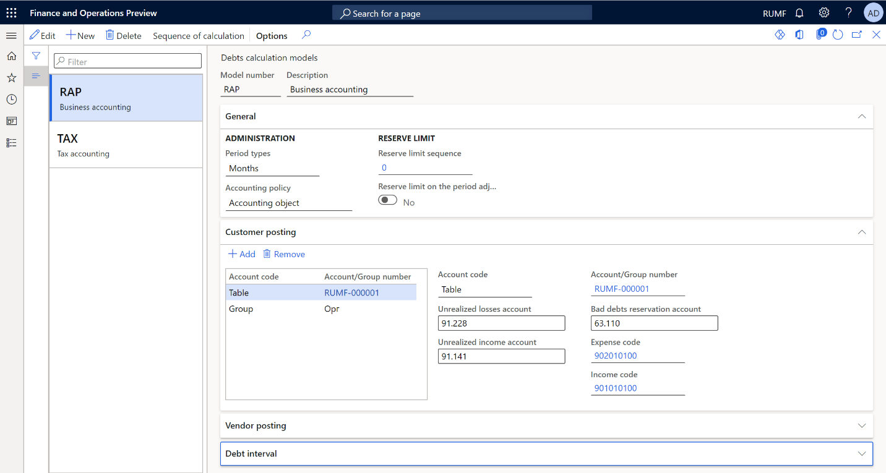

---
# required metadata

title: Bad debt reserves in Accounts receivable
description: This topic provides information about the tax registers for receivables, hopeless debts, and their write-off.
author: anasyash
ms.date: 08/16/2021
ms.topic: article
ms.prod: 
ms.technology: 

# optional metadata

#ms.search.form:
audience: IT Pro, Application User
# ms.devlang: 
ms.reviewer: kfend
# ms.suite: 
# ms.tgt_pltfrm: 
# ms.custom: 
ms.search.region: 
# ms.search.industry: 
ms.author: anasyash
ms.dyn365.ops.version: 
ms.search.validFrom: 
---

# Bad debt reserves in Accounts receivable

[!include [banner](../includes/banner.md)]

This topic provides information about the tax registers for receivables, hopeless debts, and their write-off.

Accounts receivable are formed based on outstanding invoices and advances that have been issued. Accounts receivable are considered *bad* if they aren't repaid within the period that was agreed on in the contract. *Hopeless debts* are debts that can be written off. An example is a debt that lasts more than three years.

The amounts of bad and hopeless debts are identified during the inventory of accounts receivable and are included in the allowance for bad debts reserve. The inventory is done on the end date of the previous tax period.

The bad debts reserve for profit tax accounting purposes is formed based on the number of days that the payment period is exceeded by:

- **Fewer than 45 days**: Arrears aren't included in the reserve.
- **Between 45 and 90 days**: The reserve amount is 50 percent of the outstanding amount.
- **More than 90 days**: The reserve amount is 100 percent of the outstanding amount.

The amount of the reserve for profit tax accounting can't exceed 10 percent of the revenue for the reporting tax period. This amount is adjusted for the reserve balance of the previous period:

- If the amount of the current quarter's reserve is less than the amount of the previous quarter's reserve balance, the difference is included in non-operating income when the reserve amount for the reporting period is formed.
- If the amount of the current quarter's reserve is more than the amount of the previous quarter's reserve balance, the difference is included in non-operating expenses when the reserve amount for the reporting period is formed.

The bad debts reserve can be used to cover only hopeless debts:

- If the reserve amount is more than the amount of hopeless debts that are written off, the difference is transferred to the next reporting period.
- If the reserve amount is less than the amount of hopeless debts that are written off, the difference is included in non-operating expenses that reduce the taxable base of profit.

The following tax registers provide information about accounts receivable and calculate the bad debts reserve in profit tax accounting and business accounting:

- Tax registers for the inventory of accounts receivable:

    - Accounts receivable inventory act
    - Accounts receivable inventory act (business accounting)

- Tax registers for calculating the bad debts reserve in accounts receivable:

    - Accounts receivable - bad debts reserve
    - Accounts receivable - reserve (business accounting)
    - Accounts receivable - reserve details
    - Accounts receivable - reserve details (business accounting)

- Tax registers for collecting information about the movement of the bad debts reserve in accounts receivable:

    - Accounts receivable - bad debt reserve movement
    - Accounts receivable - reserve movement (business accounting)
    - Accounts receivable - reserve movement details
    - Accounts receivable - reserve movement details (business accounting)

- Tax registers for collecting information about the movement of accounts receivable:

    - Accounts receivable movement
    - Accounts receivable movement (business accounting)

If you manually calculate tax registers one by one, consider using the following sequences for tax register calculation. If you calculate all tax registers together for the period, these sequences will automatically be used.

When you create the tax register journal for the current period, you should assume that the tax registers for the previous period were calculated in the following way:

1. At the end of the previous period, a tax register for the inventory of accounts receivable should have been calculated.
2. At the end of the previous period, a tax register for the calculation of the bad debts reserve in accounts receivable should have been calculated, based on the tax register for the inventory of accounts receivable. This register is the bad debts reserve for both the current period and future periods.

When you calculate tax registers for the current period, consider the following sequence of steps:

1. During the current period, run the write -off procedure for some debts that were recognized as hopeless before the end of the previous period, or that became hopeless during the current period.
2. Based on the information at the end of the previous period, and all operations during the current period, calculate the tax register by collecting information about the movement of accounts receivable.
3. Calculate the tax register by collecting information about the movement of the bad debts reserve in accounts receivable. This register contains all the information about the movement and use of the reserve that was calculated at the end of the previous period.
4. At the end of the current period, calculate the tax register for the inventory of accounts receivable. This register represents the status of all accounts receivable.
5. At the end of the current period, calculate the tax register for the calculation of the bad debts reserve in accounts receivable. This register is the bad debts reserve for future periods.

## Setup

### Create and set up two debts calculation models

Debts can be calculated for profit tax accounting purposes and business accounting reports. Create two models, one for business accounting and one for tax accounting.

1. Go to **Tax** > **Setup** > **Profit tax** > **Debts calculation models**.
2. On the Action Pane, select **New** to create the first of the two models.
3. In the **Model number** field, enter the short name of the model. For example, name the model for business accounting **RAP** and the model for tax accounting **TAX**.
4. In the **Description** field, enter a detailed description of the model. For example, enter **Business accounting** for the **RAP** model and **Tax accounting** for the **TAX** model.
5. On the **General** FastTab, set the following fields:

    - In the **Period types** field, select the calculation period. For example, select **Months** for the **RAP** model and **Quarters** for the **TAX** model.
    - In the **Accounting policy** field, select **Accounting object** or **Total**.
    - Leave the **Reserve limit sequence** field set to **0** (zero). You will configure the sequence later.
    - Set the **Reserve limit on the period adjustment** option to **Yes** to apply the reserve limit only to the revenue adjustment for the current reporting period.

6. If you chose **Accounting object** in the **Accounting policy** section (for example, for **RAP**), on the **Customer posting** and **Vendor posting** FastTab, set up the ledger accounts and expense/income codes for the bad debts reserves posting:

    1. Select **Add**.
    2. In the **Account code** field, select **Table**, **Group**, or **All**.
    3. In the **Account/Group number** field, select the customer or vendor account number if you selected **Table** in the **Account code** field. If you selected **Group** in the **Account code** field, select the customer or vendor group number.
    4. In the **Unrealized losses account** field, select the ledger account to use to post losses in transactions on bad debts. For example, select account **91 non-operating income and expenses** for the **RAP** model and account **Н91 non-operating income and expenses in TAX** for the **TAX** model.
    5. In the **Unrealized income account** field, select the ledger account to use to post income in transactions on bad debts. For example, select account **91 non-operating income and expenses** for the **RAP** model and account **Н91 off-balance sheet account for income** for the **TAX** model.
    6. In the **Bad debts reservation account** field, select the ledger account to use to form the bad debts reserve. For example, select account **63 reserves for bad debts** for the **RAP** model and account **Н63 reserves for bad debts for TAX** for the **TAX** model.
    7. In the **Expense code** field, select the expense code to link to the transaction for creating the bad debts reserve and writing off hopeless debts.
    8. In the **Income code** field, select the income code to link to the transaction for including the bad debts reserve in non-operation income.
    9. For the **TAX** model only: In the **Summary account** field, select the ledger account to use to offset the account that you selected in the **Bad debts reservation account** field to write off bad debt transactions. For example, select account **Н62 off-balance sheet account for account receivable**.

    > [!NOTE]
    > For the **RAP** model, the ledger account from the customer posting profile is used for this purpose.

    

    Alternatively, if you selected **Total** in the **Accounting policy** field, you complete the setup on the **General** FastTab instead of the **Customer posting** and **Vendor posting** FastTabs. Set the **Unrealized losses account**, **Unrealized income account**, **Bad debts reservation account**, **Expense code**, **Income code**, and
**Summary account** fields as described in the preceding substeps.

7. On the **Debt interval** FastTab, set up the percentage that is used to calculate the bad debts reserve, depending on the number of overdue days:

    - In the **Period debt type** field, specify **Hopeless**, and then select **Add** to create a bad debts interval.
    - In the **From** field, enter the lower limit of the debt interval, in days, for the current line. The **Days** and **Register** fields are automatically filled in.
    - In the **Percent** field, specify the percentage of debt that is included in the reserve for the current line.
    - In the **Description** field, enter a detailed description of the debt interval.

    The following illustration shows an example of the setup for a debt interval. For debts that are more than 70 days overdue, the reserve is calculated as 100 percent. For debts that are overdue between 50 and 70 days, the reserve is calculated as 80 percent. For debts that are overdue by fewer than 50 days, no reserve is calculated.

   

8. Repeat steps 2 through 7 to create the second model.

### Set up the models for tax and business accounting

1. Go to **Accounts receivable** > **Setup** > **Accounts receivable parameters**.
2. On the **Ledger and sales tax** tab, in the **Debtor debts** section, in the **Model number for business accounting** field, select **RAP**.
3. In the **Model number for tax accounting** field, select **TAX**.

    

### Create and set up registers

Depending on the settings of your debts calculation models, create and calculate the registers in each group of registers. For more information, see [Create tax registers and the tax register journal](rus-profit-tax-registers.md#create-a-tax-register).

| **Register type** | **Comment** |
|-------------------------|-------------------------|
| **Tax registers for the inventory of accounts receivable** ||
| Accounts receivable inventory act | For the **TAX** model |
| Accounts receivable inventory act (business accounting) | For the **RAP** model |
| **Tax registers for calculating the bad debts reserve in accounts receivable** ||
| Accounts receivable - bad debts reserve | For the **TAX** model when the **Accounting policy** field is set to **Total** |
| Accounts receivable - reserve (business accounting) | For the **RAP** model when the **Accounting policy** field is set to **Total** |
| Accounts receivable - reserve details | For the **TAX** model when the **Accounting policy** field is set to **Accounting object** |
| Accounts receivable - reserve details (business accounting) | For the **RAP** model when the **Accounting policy** field is set to **Accounting object** |
| **Tax registers for collecting information about the movement of the bad debts reserve in accounts receivable** ||
| Accounts receivable - bad debt reserve movement | For the **TAX** model when the **Accounting policy** field is set to **Total** |
| Accounts receivable - reserve movement (business accounting) | For the **RAP** model when the **Accounting policy** field is set to **Total** |
| Accounts receivable - reserve movement details | For the **TAX** model when the **Accounting policy** field is set to **Accounting object** |
| Accounts receivable - reserve movement details (business accounting) | For the **RAP** model when the **Accounting policy** field is set to **Accounting object** |
| **Tax registers for collecting information about the movement of accounts receivable** ||
| Accounts receivable movement | For the **TAX** model |
| Accounts receivable movement (business accounting) | For the **RAP** model |

### Set up a limit for the bad debts reserve in tax accounting

1. Go to **Tax** > **Setup** > **Profit tax** > **Rates**.
2. On the Action Pane, select **New** to create a rate.
3. In the **Rate code** field, enter the unique code of the rate.
4. In the **Calculation method** field, enter **Whole amount**.
5. On the **Values** FastTab, in the **Start date** field, enter the first date when the value of the rate will be used in the sequence of calculation.
6. To set the reserve amount, in the **Value** field, enter the percentage of revenue. For example, enter **0.10**.

    

7. Go to **Tax** > **Setup** > **Profit tax** > **Debts calculation models**.
8. On the Action Pane, select **Sequence of calculation** to create a reserve limit sequence for revenue.
9. In the **Channel reference** field, specify the register code for the tax model.
10. On the Action Pane, select **Counters**.
11. Select **New** to create a counter.
12. In the **Description** field, enter a description of the counter.
13. In the **Expense code** field, select the expense code of the revenue.
14. On the **Lines** FastTab, create settings for calculating the revenue and reserve limit.

   

   For more information about how to set up sequences of calculation, see [Sequence of calculations](rus-set-up-deferrals.md#sequence-of-calculation).

15. Go to the debts calculation models that you created earlier, and in the **Reserve limit** section, in the **Reserve limit sequence** field, enter the sequence for each model.

### Set up a number sequence for the write-off of hopeless debts

1. Go to **Accounts receivable** > **Setup** > **Accounts receivable parameters**.
2. On the **Number sequences** tab, in the **Number sequence code** field, select the number sequence code for the **Ledger voucher for debts amortization** reference.

### Exclude agreements from reserve calculation

For more information about how to create and set up agreements, see [Set up and create agreements](rus-set-up-and-create-agreements.md).

By default, sales agreements are included in the calculation of the bad debts reserve. To exclude an agreement from the calculation, follow these steps.

1. Go to **Accounts receivable** > **Orders** > **Sales agreements**, and select the sales agreement to exclude from the calculation.
2. Switch to the **Header** view, and then select **Edit**.
3. On the **Financial** FastTab, in the **Debtor debts** field, specify **Exclude from reserve in business accounting**, **Exclude from reserve in tax accounting**, or both.
4. Select **Save**.

## Tax registers

### Tax registers for the inventory of accounts receivable

There are two registers in this group.

| **Register** | **Comment** |
|-------------------------|-------------------------|
| Accounts receivable inventory act | For the **TAX** model |
| Accounts receivable inventory act (business accounting) | For the **RAP** model |

These registers reflect the balance of accounts receivable at the end of the reporting period. Accounts receivable are formed based on outstanding customer invoices and advances that are issued to vendors. All outstanding invoices are divided into categories that are defined on the **Debt interval** FastTab of the **Debts calculation models** page. The difference in days between the inventory date and the invoice due date determines the excess of the debt repayment period.

The following illustration shows an example of the **Accounts receivable inventory act** page.

For each register line, you can review the information in the following columns:

- **Line number**
- **Accounting object** – The number of the customer invoice or vendor prepayment.
- **Transaction date** – The date of the document that is shown in the **Accounting object** column.
- **Dead line** – The date that the debt must be repaid by.
- **Exclude from reserve** – A selected checkbox indicates that the document is excluded from reserve calculation. You can change this value by selecting **Edit** on the Action Pane. In that case, you must recalculate the dependent registers.
- **(Debt intervals****)** – There is a separate column for each debt period that you configured earlier (for example, **Debt &gt;=0 &lt;45**, **Debt &gt;=45 &lt;90**, and **Debt&gt;=90 &lt;360**). Each column shows the amount of bad debt for the corresponding debt period.
- **Non-confirmed debt** – Enter the amount of non-confirmed debt by customer. This column is available only for the **RAP** (business accounting) model.

### Tax registers for calculating the bad debts reserve in accounts receivable

There are four registers in this group.

| **Register** | **Comment** |
|-------------------------|-------------------------|
| Accounts receivable - bad debts reserve | For the **TAX** model when the **Accounting policy** field is set to **Total** |
| Accounts receivable - reserve (business accounting) | For the **RAP** model when the **Accounting policy** field is set to **Total** |
| Accounts receivable - reserve details | For the **TAX** model when the **Accounting policy** field is set to **Accounting object** |
| Accounts receivable - reserve details (business accounting) | For the **RAP** model when the **Accounting policy** field is set to **Accounting object** |

These registers reflect the amount of the reserve that is calculated for the current reporting period, based on the information in tax registers for the inventory of accounts receivable. The **Reserve** column shows the reserve amount . This reserve will be used in the future to write off hopeless debts.

The **Reminder** column shows the reserve balance for the previous period. The value is taken from the tax registers for collecting information about the movement of the bad debts reserve in accounts receivable. If the column is blank, the balance is considered to be **0** (zero). The **Expense** and **Revenue** columns show the difference between the calculated reserve for the current reporting period and the balance of the previous period. This difference is later posted to the ledger accounts for non-operating income or non-operating expenses.

The following illustration shows an example of the **Accounts receivable- reserve details** page.

 

On each register line, you can review the information in the following columns:

- **Line number**
- **Accounting object**: The number of the customer invoice or vendor prepayment. This column is available only for registers that use the **Accounting object** accounting policy.
- **Posting date**: The date of the document that is shown in the **Accounting object** column. This column is available only for registers that use the **Accounting object** accounting policy.
- **Dead line**: The date that the debt must be repaid by. This column is available only for registers that use the **Accounting object** accounting policy.
- **(Debt intervals)**: There is a separate column for each debt period that you configured earlier (for example, **Debt &gt;=0 &lt;45**, **Debt &gt;=45 &lt;90**, and **Debt&gt;=90 &lt;360**). Each column shows the amount of bad debt for the corresponding debt period.
- **Accounts receivable amount**: The amount of outstanding debt for the accounting object on the current line.
- **Reserve limit**: The amount of the bad debt reserve limit for the current reporting period. This amount is calculated according to the sequence that you configured earlier.
- **Reserve**: The total amount of the bad debts reserve.
- **Remainder**: The reminder of the bad debts reserve from the previous reporting period.
- **Expense**: The amount of the bad debts reserve for the current reporting period that is included in the expense.
- **Revenue**: The amount of the bad debts reserve for the current reporting period that is included in income. For example, the bad debts reserve was already created, but the outstanding debt was repaid.
- **Ledger voucher for reservation**: The number of the document that was used to post the ledger journal for accounts receivable bad debts reserves. This column is available only for registers that use the **Total** accounting policy.
- **Date**: The date of the current reporting period. This column is available only for registers that use the **Total** accounting policy.

#### Create a ledger journal for accounts receivable bad debts reserves

1. Go to **Tax** > **Journal entries** > **Tax register journal**.
2. Select the line where the **Accounts receivable - bad debts reserve** register for total accounting or the **Accounts receivable - reserve details** register for object accounting is calculated and approved.
3. On the Action Pane, select **Ledger journal** > **Accounts receivable - bad debts reserve**.
4. On the Action Pane, select **Create** >**Create journal**.

    The journal is created. Its lines show the vouchers for calculating amounts of the reserves for the current period. The amounts of the reserves are calculated in the group of **Accounts receivable - reserves** registers.

5. On the Action Pane, select **Lines** to view the vouchers and other details.

    

6.  On the Action Pane, select **Post** > **Post** to post the journal.

#### Create a reversing entry ledger journal for accounts receivable bad debts reserves

1. Go to **Tax** > **Journal entries** > **Tax register journal**.
2. Select the period where the **Accounts receivable - bad debts reserve** register for total accounting or the **Accounts receivable - reserve details** register for object accounting is calculated and approved.
3. On the Action Pane, select **Ledger journal** > **Accounts receivable - bad debts reserve**.
4. On the Action Pane, select **Create** > **Reverse journal**.

    The journal is created. Its lines show the vouchers for calculating amounts of the reserves for the current period. The amounts of the reserves are calculated in the group of **Accounts receivable - reserves** registers.

5. On the Action Pane, select **Lines** to view the vouchers and other details.
6. On the Action Pane, select **Post** > **Post** to post the journal.

    

### Tax registers for collecting information about the movement of the bad debts reserve in accounts receivable

There are four registers in this group.

| **Register** | **Comment** |
|-------------------------|-------------------------|
| Accounts receivable - bad debt reserve movement | For the **TAX** model when the **Accounting policy** field is set to **Total** |
| Accounts receivable - reserve movement (business accounting) | For the **RAP** model when the **Accounting policy** field is set to **Total** |
| Accounts receivable - reserve movement details | For the **TAX** model when the **Accounting policy** field is set to **Accounting object** |
| Accounts receivable - reserve movement details (business accounting) | For the **RAP** model when the **Accounting policy** field is set to **Accounting object** |

These registers summarize information about the movement and use of the bad debts reserve. They are calculated based on the results of the formation of the bad debts reserve and the use of the bad debt to write off hopeless debts.

> [!NOTE]
> The write-off of hopeless debts is processed by using the bad debts reserve that is created at the end of the previous period.

The following illustration shows an example of the **Accounts receivable - reserve movement details** page.

   

On each register line, you can review the information in the following columns:

- **Line number**
- **Accounting object**: The number of the customer invoice or vendor prepayment. This column is available only for registers that use the **Accounting object** accounting policy.
- **Posting date**: The date of the document that is shown in the **Accounting object** column. This column is available only for registers that use the **Accounting object** accounting policy.
- **Dead line**: The date that the debt must be repaid by. This column is available only for registers that use the **Accounting object** accounting policy.
- **Date**: The date when the reserve was created.
- **Reserve**: The total amount of the bad debts reserve that was calculated at the end of the previous period.
- **Hopeless**: The amount of the hopeless debts that were written off during the current period.
- **Used**: The amount of the reserve that was used to write off hopeless debts.
- **Remainder**: The remaining amount of the bad debts reserve from the previous period after use.
- **Excess**: The amount of written-off hopeless debt that exceeds the amount of the bad debts reserve on the reporting date. This amount is included in the non-operating expenses for the current period.

### Tax registers for collecting information about the movement of accounts receivable

There are two registers in this group.

| **Register** | **Comment** |
|-------------------------|-------------------------|
| Accounts receivable movement | For the **TAX** model |
| Accounts receivable movement (business accounting) | For the **RAP** model |

These registers summarize information about operations for the movement of receivables to identify the amounts of bad debts (so that a reserve can be formed) and hopeless debts (so that they can be accounted as part of expenses).

The registers reflect all facts about the occurrence, payment, or write-off of accounts receivable from the beginning of the tax period to the reporting date. The amounts of overpayments to budgets of different levels aren't reflected in these registers.

For transactions in foreign currencies, records are also made for each revaluation of debt when reports are prepared.

The following illustration shows an example of the **Accounts receivable movement** page.

On each register line, you can review the information in the following columns:

- **Line number**
- **Accounting object**: The number of the customer invoice or vendor prepayment.
- **Transaction date**: The date of the document that is shown in the **Accounting object** column.
- **Transaction description**
- **Dead line**: The date that the debt must be repaid by.
- **Accounting order**: The terms of payment.
- **(Debt intervals)**: There is a separate column for each debt period that you configured earlier (for example, **Debt &gt;=0 &lt;45**, **Debt &gt;=45 &lt;90**, and **Debt&gt;=90 &lt;360**). Each columns shows the amount of bad debt for the corresponding debt period.
- **Amount/Exchange difference**: The exchange amount or rate difference.
- **Acquisition cost**
- **Provision of pawn**
- **Close date**: The date of the write-off or payment transaction that is shown in the **Accounting object** column.
- **Close reason**: The description of the transaction for writing off or paying the debt.
- **Close amount**: The amount of the transaction for writing off or paying the debt.
- **(Remains intervals)**: There is a separate column for each debt period that you configured earlier (for example, **Remains &gt;=0 &lt;45**, **Remains &gt;=45 &lt;90**, and **Remains &gt;=90 &lt;360**). Each column shows the remaining amount of the outstanding accounts receivable debts after the debt movement for the corresponding debt period.

## Hopeless debt recognition and write-off

### Recognize and write off hopeless debt

1. Calculate and approve the tax register journal for the previous period.
2. Go to **Accounts receivable** > **Periodic tasks** > **Amortization** > **Accounts receivable amortization**.
3. In the **Calculation date** field, select the date. That date will be used to select the calculation period.
4. In the **Model** field, select the debts calculation model.

    The page shows hopeless debts as of the selected reporting date:

    - The **Customers** tab shows the list of customer invoices.
    - The **Vendors** tab shows the list of prepayments to suppliers.
    - The **Reserve** field shows the amount of the formed bad debts reserve at the beginning of the current period that can be used to write off hopeless debt.

5. To review the original transactions for customers or vendors, select **Transactions**.
6. To add other customer or vendor transactions to the list, on the Action Pane, select **Select customer debts** or **Select vendor debts**.
7. Mark the debts that must be written off. The **Total** field in the **Marked** section at the bottom of the page shows the total amount of the marked lines.

    

8. On the Action Pane, select **Update**. The marked transactions disappear. Additionally, in the **Written off** section at the bottom of the page, the amounts increase to the value that the **Total** field in the **Marked** section had before you selected **Update**. Transactions for customers and vendors, and transactions in the general ledger to write off each debt, are created. The date of the write-off operations corresponds to the date that you selected in the **Calculation date** field.

    
    > [!NOTE]
    > The total amount of write-off transactions from the bad debts reserve is the lesser of the amount of the bad debt lines that you marked and the amount of the bad debts reserve that was created at the end of the previous period.

    If the amount of hopeless debt that must be written off exceeds the amount of the bad debts reserve, additional transactions are generated for the remaining amount, to write the debt off to ledger account **91 non-operating expenses**.

### Cancel the write-off of hopeless debt

Follow these steps to cancel the write-off of hopeless debts.

1. Go to **Accounts receivable** > **Periodic tasks** > **Amortization** > **Accounts receivable amortization cancellation**.
2. In the **Calculation date** field, select the date. That date will be used to select the calculation period.
3. In the **Model** field, select the debts calculation model.

    The page shows written-off debts as of the selected reporting date:

    - The **Customers** tab shows the list of written-off customer invoices.
    - The **Vendors** tab shows the list of written-off prepayments to suppliers.
    - The **Reserve** field shows the amount of the formed bad debts reserve at the beginning of the current period that can be used to write off hopeless debt.
    - The **Written off** field shows the amount of the written-off bad debts from the reserve for accounts receivable or to the revenues/expenses account.

4. To review the original transactions for customers or vendors, select **Transactions**.
5. Mark the written-off debts that must be canceled. The **Total** field in the **Marked** section at the bottom of the page shows the total amount of the marked lines.

    

6. On the Action Pane, select **Update**. The marked transactions disappear. In the **Written off** section at the bottom of the page, the amounts decrease to the value that the **Total** field in the **Marked** section had before you selected **Update**. Transactions that cancel the write-off of accounts receivable are then generated.
