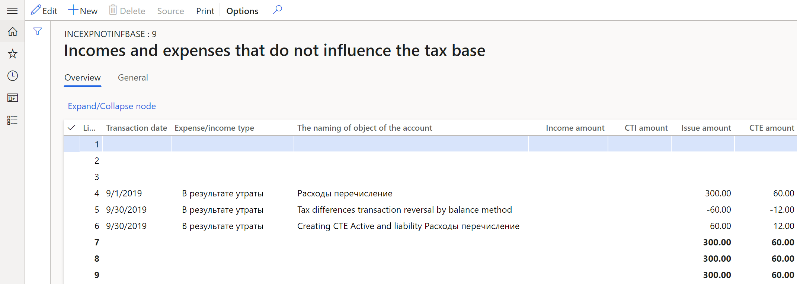

# Calculation of tax asset and tax liability registers

[!include [banner](../includes/banner.md)]

According to Russian legislation, the accounting profit and the profit tax base are formed according to different legislation and rules. Therefore, two tax types have been developed:

- **Constant tax**: Differences are based on income and expenses that form the accounting profit (loss) and are excluded from the calculation of the tax base for income tax. Constant tax differences generate constant tax income (CTI) and constant tax expense (CTE).
- **Temporary tax**: Differences are based on deferred income tax. The tax is from when expenses or income that form the accounting profit are in one reporting period, and the tax base is in another reporting period or in other reporting periods. Temporary tax differences generate deferred tax asset (DTA) and deferred tax liability (DTL).

This article provides information about the two methods that tax registers use to calculate tax differences:

- Balance method:
    - **Calculation of temporary tax differences by balance method** tax register
    - **Calculation of constant tax differences by balance method** tax register

- Accrual method:
    - **Calculation of temporary tax differences** tax register
    - **Calculation of constant tax differences** tax register
   
> [!NOTE]
> As of January 1, 2020, tax differences must be calculated by using the balance method.

## Turn on the feature

1. In the **Feature management** workspace, find and select the feature that is named **Tax differences registers by balance method**.
2. Select **Enable now**.

## Set up journal voucher creation for tax differences

Before you create a journal voucher for tax differences in the system, you must complete the following setup procedures.

1. [Set up General ledger parameters](#parameters).
2. [Set up a journal for ledger posting of tax differences by using the balance method](#method).
3. [Set up ledger accounts for deferred taxes](#taxes).
4. [Set up a sales tax code for profit tax](#profit).
5. [Set up a sales tax code for temporary tax differences that are based on deferrals](#deferrals).
6. [Set up tax registers](#registers).
7. [Set up tax difference registers](#difference).

### <a name="parameters">Set up General ledger parameters</a>

1. Go to **Tax** > **Setup** > **Parameters** > **General ledger parameters**.
2. On the **Profit tax** tab, in the **Compression** field, specify the level of detail that transactions for tax differences should have:

    - **Active and liability**: Generate a uniform transaction for each operation for each object. Operations include formation, repayment, and write-off.
    - **Expense and income**: Generate a uniform transaction for each operation for all objects that have the same expense/income code.
    - **Tax**: Generate a uniform transaction for each operation for all objects that have the same sales tax code.
    - **Total**: Generate a uniform transaction for each operation for all objects.

### <a name="method">Set up a journal for ledger posting of tax differences that are calculated by using the balance method</a>

1. Go to **General ledger** > **Journal setup** > **Journal names**.
2. On the Action Pane, select **New**.
3. In the **Name** field, enter **Tax differences by balance method**.
4. In the **Description** field, enter a description of the journal.
5. On the **General** FastTab, in the **Journal type** field, select **Tax differences by balance method**.
6. Set all other fields as required.

    

### <a name="taxes">Set up ledger accounts for deferred taxes</a>

1. Go to **Tax** > **Setup** > **Sales tax** > **Ledger posting groups**.
2. On the Action Pane, select **New**.
3. In the **Ledger posting group** field, enter the name of the ledger posting group.
4. In the **Description** field, enter a description of the ledger posting group.
5. On the **General** FastTab, in the **Sales tax payable** field, enter a ledger account:

    - If you calculate the current profit tax based on accounting data, enter a ledger account from group of accounts **68** for accounting differences.
    - If you calculate that current profit tax based on the profit tax declaration (tax accounting data), enter a ledger account from group of accounts **99** for tax differences.

   > [!NOTE]
   > According to the methodological recommendations for applying the new PBU18 accounting standard, as of January 1, 2020, companies have a choice about how they calculate the current profit tax. The calculation can be based on either accounting data or the profit tax declaration.
   > 
   > - When the current profit tax is calculated based on accounting data, the ledger posting of temporary deferred tax should be posted in correspondence with ledger  account **68.profit tax**. In this case, the ledger posting of constant tax differences should be posted in correspondence with ledger account **68.profit tax**.
   > - When the current profit tax is calculated based on the profit tax declaration, the ledger posting of temporary deferred tax should be posted in correspondence with  ledger account **99**. In this case, there is ledger posting of constant tax differences.
   > 
   > The company should make a make a note of their choice in the accounting policy.

6. On the Action Pane, select **Save**.
7. Go to **Tax** > **Setup** > **Profit tax** > **Ledger posting groups of profit tax**.
8. On the Action Pane, select **New**.
9. In the **Ledger posting group** field, select the name of the ledger posting group that you created in step 2. The **Sales tax payable** field is automatically set.
10. In the **Description** field, enter a description of the ledger posting group.
11. On the **General** FastTab, set the following fields:

     - In the **DTA** field, enter a ledger account from group of accounts **09**.
     - In the **DTL** field, enter a ledger account from group of accounts **77**.
     - In the **CTI** and **CTE** fields, enter a ledger account for posting amounts of CTI and CTI from group of accounts **99**.
    
12. On the Action Pane, select **Save**.

     

### <a name="profit">Set up a sales tax code for profit tax</a>

1. Go to **Tax** > **Indirect taxes** > **Sales tax** > **Sales tax codes**.
2. Create and set up a sales tax code for profit tax. For more information, see [Set up sales tax codes](../general-ledger/tasks/set-up-sales-tax-codes.md).
3. On the Action Pane, select **Sales tax code** > **Values**.
4. In the **Value** field, enter the value of the profit tax rate that will be used to calculate the tax difference.
5. On the Action Pane, select **Save**.

### <a name="deferrals">Set up an expense code for temporary tax differences that are based on deferrals</a>

1. Go to **Tax** > **Setup** > **Profit tax** > **Expense codes**.
2. Create and set up expense codes that are used for deferrals postings or that form constant tax differences. For more information, see [Create an expense or income code](rus-expense-and-income-codes.md#create-an-expense-or-income-code).
3. On the **General** FastTab, set the following fields:

    - In the **Code type** field, select **Issue**.
    - In the **Income tax** section, in the **Sales tax code** field, select the sales tax code for the profit tax rate.

    

### <a name="registers">Set up tax registers</a>

Before you complete this procedure, you must create expense codes. For more information, see [Create an expense or income code](rus-expense-and-income-codes.md#create-an-expense-or-income-code).

1. Go to **Tax** > **Setup** > **Profit tax** > **Registers**.
2. Select the tax register, and then, on the Action Pane, select **Expense codes**.
3. On the Action Pane, select **New**.
4. In the **Expense code** field, select the expense code. The tax register will reflect transactions that have the selected expense code.
5. In the **Condition name** field, enter a description.

### <a name="difference">Set up tax differences registers</a>

Create the registers of temporary and constant tax differences for one of the calculation methods, as described in the article, [Create tax registers and the tax register journal](rus-profit-tax-registers.md#create-a-tax-register).
Follow these steps to set up the **Calculation of temporary tax differences by balance method** and **Calculation of temporary tax differences** tax registers.

1. Go to **Tax** > **Setup** > **Profit tax** > **Registers**.
2. On the **Parameters** FastTab, set up the parameters that should be used to generate the register. If no value is specified for a parameter, the register will be generated for all values of that parameter. To specify multiple values for a parameter, separate them with commas:

    - On the line for the **Tax code for FA depreciation** parameter, in the **Value** column, select the sales tax code for profit tax.
    - On the line for the **Tax code for debt reserves** parameter, in the **Value** column, select the sales tax code for profit tax.
    - On the line for the **Depreciation groups** parameter, in the **Value** column, select the FA/IA group for tax accounting.
    - On the line for the **Type of fixed asset** parameter, in the **Value** column, select the asset type.
    - On the line for the **Deferrals groups** parameter, in the **Value** column, select the group of expenses for future periods.

3. In the **Expand** column, select the checkbox for the parameters that must be used to generate the register.

    

Follow these steps to generate the **Calculation of constant tax differences** tax register.

1. Go to **Tax** > **Setup** > **Profit tax** > **Registers**.
2. On the **Parameters** FastTab, on the line for the **Tax code for debt reserves** parameter, in the **Value** column, select the sales tax code for profit tax. The rate value of the selected sales tax code will be used to calculate the amount of the constant tax asset or constant tax liability.
3. In the **Expand** column, select the checkbox for the parameter, so that it will be used to generate the register.

    

## Tax registers

### Incomes and expenses that do not influence the tax base tax register

The **Incomes and expenses that do not influence the tax base** tax register contains information about income and expenses that don't influence the tax base. This information is used when the register of constant tax differences is calculated.

For each line of this tax register, the following information is shown:

- **Line number**
- **Expense/Income type**: The name of the assigned expense code.
- **Income amount**: The amount of the income.
- **CTI amount**: The amount of CTI for the **Income amount** value.
- **Issue amount**: The amount of the expense.
- **CTE amount**: The amount of CTE for the **Issue amount** value.

### Tax registers for the calculation of temporary tax differences

The **Calculation of temporary tax differences by balance method** and **Calculation of temporary tax differences** tax registers reflect information about tax differences in the following circumstances:

- Balances differ for the **RAP** and **TAX** fixed asset calculation models.
- Balances differ for the **RAP** and **TAX** deferral calculation models.
- Reserves for bad debts differ for the **RAP** and **TAX** calculation models.

The **Calculation of temporary tax differences by balance method** tax register has the following sources of formation:

- **Fixed assets (Russia)** module
- Deferrals
- Tax registers for bad debts reserve

The following illustration shows an example of the **Calculation of temporary tax differences by balance method** tax register.

For each line of this tax register, the following information is shown:

- **Line number**
- **Date attached**: The date when the accounting object was created.
- **The naming of object of the account**: A description of the accounting object.
- **Transaction date**: The end of the reporting period.
- **Initial DTA/DTL**: The amount of DTA or DTL at the beginning of the reporting period.
- **Book value in accounting**: The balance value of the asset at the end of the reporting period for the **RAP** calculation model.
- **Book value in tax accounting**: The balance value of the asset at the end of the reporting period for the **TAX** calculation model.
- **DTA/DTL**: The amount of DTA or DTL at the end of the reporting period.
- **Creating DTA**: The amount of DTA, if the initial amount of DTA doesn't exist.
- **Decreasing DTA**: The difference between the DTA amount at the beginning of the reporting period and the DTA amount at the end of the reporting period, if the initial amount of DTA exists.
- **Creating DTL**: The amount of DTL, if the initial amount of DTL doesn't exist.
- **Decreasing DTL**: The difference between the DTL amount at the beginning of the reporting period and the DTL amount at the end of the reporting period, if the initial amount of DTL exists.

For each line of the **Calculation of temporary tax differences** tax register, the following information is shown:

- **Line number**
- **Date attached**: The date when the accounting object was created.
- **The naming of object of the account**: A description of the accounting object.
- **Transaction date**: The end of the reporting period.
- **Bookkeeping amount**: The amount that was accepted for accounting.
- **Taxation amount**: The amount that was accepted for tax accounting.
- **Initial DTA/DTL**: The amount of DTA or DTL at the beginning of the reporting period.
- **Creating DTA**: The amount of DTA, if the initial amount of DTA doesn't exist.
- **Decreasing DTA**: The difference between the amount of DTA at the beginning of the reporting period and the amount of DTA at the end of the reporting period, if the initial amount of DTA exists.
- **Creating DTL**: The amount of DTL, if the initial amount of DTL doesn't exist.
- **Decreasing DTL**: The difference between the DTL amount at the beginning of the reporting period and the DTL amount at the end of the reporting period, if the initial amount of DTL exists.
- **Writing off DTA**
- **Writing off DTL**

### Tax registers for the calculation of constant tax differences

The **Calculation of constant tax differences by balance method** and **Calculation of constant tax differences** tax registers reflect information about the constant difference that is determined based on the amount of expenses and the rated amount for expenses of this type.
The **Calculation of constant tax differences by balance method** tax register has the following sources of information:

   - The **Incomes and expenses that do not influence the tax base** tax register.
   - The **Standard expenses in current period** tax register. For more information, see [Rated expenses registers](rus-rated-expenses-registers.md).

Unlike the **Calculation of constant tax differences by balance method** tax register, the **Calculation of constant tax differences** tax register isn't based on the following tax registers:

   - Restoring of depreciation bonus
   - Reserves for bad debts

The tax registers differ because, as of January 1, 2020, these assets form temporary tax differences.
The following illustration show an example of the **Calculation of constant tax differences by balance method** tax register.

For each line of this tax register, the following information is shown:

- **Line number**
- **Date attached**: The beginning of the reporting period.
- **The naming of object of the account**: A description of the accounting object.
- **Bookkeeping amount**: The amount that was accepted for accounting.
- **Taxation amount**: The amount that was accepted for tax accounting.
- **Differences (Income)**: The income, which is the difference between the tax and the accounting amount.
- **CTI amount**: The amount of CTI for the **Differences (Income)** value.
- **Differences (Expense)**: The expense, which is the difference between the tax and the accounting amount.
- **CTE amount**: The amount of CTE for the **Differences (Expense)** value.

For each line of the **Calculation of constant tax differences** tax register, the following information is shown:

- **Line number**.
- **Date attached**: The beginning of the reporting period.
- **Expense/income type**
- **The naming of object of the account**: A description of the accounting object.
- **Bookkeeping amount**: The amount that was accepted for accounting.
- **Taxation amount**: The amount that was accepted for tax accounting.
- **Differences (Income)**: The income, which is the difference between the tax and the accounting amount.
- **CTA amount**: The amount of constant tax asset (CTA) for the **Differences (Income)** value.
- **Differences (Expense)**: The expense, which is the difference between the tax and the accounting amount.
- **CTL amount**: The amount of constant tax liability (CTL) for the **Differences (Expense)** value.

## Create a journal voucher for tax differences

1. Go to **Tax** > **Journal entries** > **Tax register journal**.
2. Select the line for the period where the **Calculation of temporary tax differences by balance method** and **Calculation of constant tax differences by balance method** tax registers are calculated and approved.
3. On the Action Pane, select **Ledger journal** > **Tax differences by balance method**.
  
   > [!NOTE]
   > On the **Ledger journal** menu, the **Tax differences** command generates the tax difference amounts that are calculated in the **Calculation of temporary tax differences** and **Calculation of constant tax differences** tax registers. If you generate a ledger journal that has transactions for tax differences of one type, such as accrual method or balance method, the second menu item becomes unavailable. In other words, you can't simultaneously use the old and new methods to create a ledger posting for tax differences.

4. On the Action Pane, select **Create** > **Create journal**. The journal is created, and its lines include the vouchers for the tax difference of the current period.
5. On the Action Pane, select **Lines** to view the vouchers and other details.

    

6. On the Action Pane, select **Post** > **Post** to post the journal.

### Create a reversing journal voucher for tax differences

1. Go to **Tax** > **Journal entries** > **Tax register journal**.
2. Select the line for the period where the **Calculation of temporary tax differences by balance method** and **Calculation of constant tax differences by balance method** tax registers are calculated and approved.
3. On the Action Pane, select **Ledger journal** > **Tax differences by balance method**.
4. On the Action Pane, select **Create** > **Reverse journal**. The journal is created, and its lines include vouchers for the tax difference of the current period.
5. On the Action Pane, select **Lines** to view the vouchers and other details.

    

[!INCLUDE[footer-include](../../includes/footer-banner.md)]
