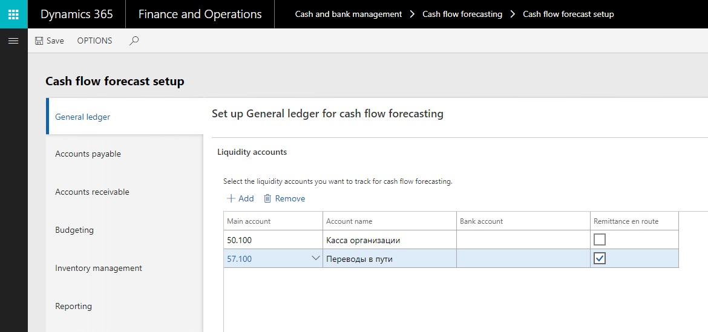
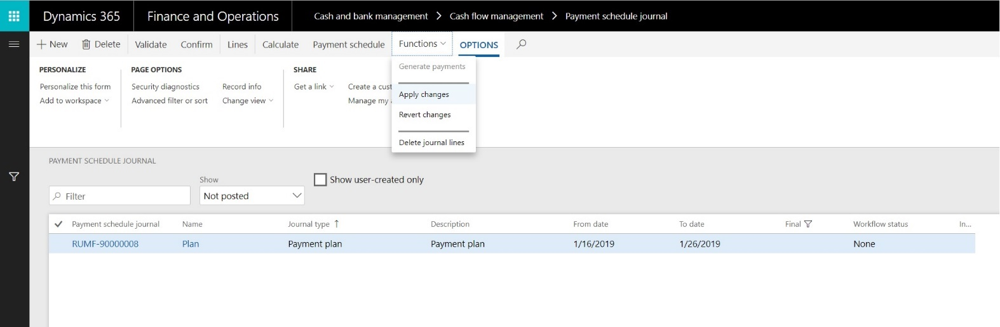
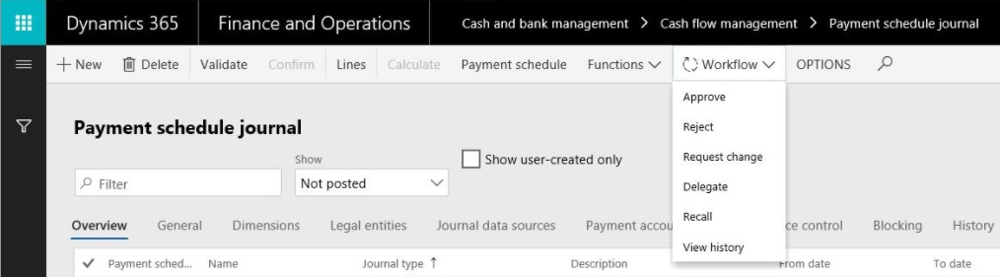

# Cash flow management (Russia)

[!include [banner](../includes/banner.md)]

In a centralized payment organization, there are many legal entities for operations, and each operating legal entity manages information for its own invoices. Payments for all the operating legal entities are generated from a single legal entity, which is sometimes referred to as the Treasury legal entity or Treasury company.

A Treasury company is responsible for monitoring the flow of cash and liquidity movement across companies and cash positions (shortage and surplus), and for preventing corporate cash shortage in a timely manner.

Here are the main goals of a Treasury company:

- Get an accurate liquidity/cash flow forecast, and do analysis for the medium-term/short-term horizon.
- Manage payments daily by using payment schedule journals.
- Control the company's cash position.
- Maintain the company's cash flows through centralized control.

This article provides a step-by-step example that shows the settings and user activities for cash flow management. 

> [!NOTE]
> The data set that is used in this article is for demo purposes only. The codes that you use for ledger accounts, value-added tax (VAT), rates, and so on, should comply with the rules that are accepted in your company.

In this example, Contoso Retail RUS (RURT) is a subsidiary of an industrial holding company and does business as an operating legal entity. Contoso Entertainment Systems Russia (RUMF) is an internal bank of an industrial holding company and handles all payments.

The following table shows the stages of payment that a treasurer deals with during payment processing.

<table>
<thead>
<tr>
<th>Business scenario</th>
<th>Payment cause</th>
<th>Payment stage</th>
</tr>
</thead>
<tbody>
<tr>
<td>The company requests and confirms delivery of goods (that is, a purchase order that has a delivery schedule that is confirmed). A treasurer includes information about the expected payments (inflow or outflow) in the cash flow forecast by creating payment schedule journal of type "payment plan".
</td>
<td>
<ul>
<li>Purchase order</li>
<li>Sales order</li>
<li>Free text invoice</li>
</ul>
</td>
<td>Planned payment</td>
</tr>
<tr>
<td>The company receives the payment request (prepayment request, invoice, and so on) from a seller. The manager creates a payment request, which should be approved by the manager lead and a treasurer. The treasurer includes information about the expected and approved payments (inflow or outflow) in the cash flow forecast.
<strong>Important:</strong> The Payment request and the associated functionality are available only if the <strong>Payment request</strong> license configuration key is turned on.
</td>
<td>
<ul>
<li>Vendor invoice</li>
<li>Prepayment invoice</li>
<li>Planned payment for confirmed purchase order</li>
<li>Customer return invoice</li>
</ul>
</td>
<td>Payment request</td>
</tr>
<tr>
<td>A treasurer generates and confirms the payment schedule journal (payment register). In this way, the company defines the list of payments that should be made by the bank/cash account.</td>
<td>Payment schedule journal (of the <strong>Payment register</strong> type)</td>
<td>Payment order</td>
</tr>
<tr>
<td>The company receives the statement from a bank. This statement includes the authorized transactions (completed payments).</td>
<td>Bank statement</td>
<td>Completed payment</td>
</tr>
</tbody>
</table>

After you complete the example that is provided in this article, you will be able to perform the following tasks:

- Configure parameters for cash flow management to support the new functionality.
- Process planned payments. Forecast transactions of incoming and outgoing payments are automatically created and updated based on purchase orders, sales orders, and free text invoices.
- If the **Payment request** license configuration key is turned on, process payment requests based on indebtedness to vendors, customers, and workers, and prepayment requirements from vendors. (The processing includes the creation, update, and approval of payment requests.)
- Process payment schedule journals for medium-term liquidity planning (payment plan) and daily payment management (payment register). Analyze cash deficit and surplus through payment schedule sheet balancing (the simulation function).
- Generate payments, based on an approved payment register, which is a type of payment schedule journal.

## Setup

### Set up the license configuration

1. Go to **System administration \> Setup \> License configuration**.
2. Under **Country/Regional specific features \> Russia**, select the **Cash flow management** check box.
3. If the organization plans to use payment requests, select the **Payment requests** check box.

### Optional: Set up an organization hierarchy for centralized payments

1. Go to **Organization administration \> Organizations \> Organization hierarchies**.
2. In the left pane, select **Centralized Payments**.

    

3. Select **View**.
4. On the **Hierarchy designer** page, create a hierarchy where **Contoso Entertainment Systems Russia** (**RUMF**) is the legal entity of the payment and **Contoso Retail RUS** (**RURT**) is the operating legal entity.

    

5. Publish the new hierarchy.

### Set up a workflow for cash flow management 

1. Go to **Cash and bank management \> Setup \> Cash and bank management workflows**.
2. Select **New** to create a record.
3. Select the required workflow type: **Workflow type for payment requests approval** or **Payment schedule journal approval workflow**.

    

4. Set up the new workflow by using the new **Approve the payment request** or **Approve payment schedule journal** workflow element.

    

5. Activate the new workflow.

### Set up a payment priority

1. Go to **Cash and bank management \> Setup \> Cash flow management \> Payment priority**.

    

2. Select **New** to create a record.
3. On the **Manage priority** FastTab, use the **Up** and **Down** buttons to arrange the priority list.
4. Go to **Accounts payable \> Vendors \> All vendors**.
5. Select the vendor, and then select **Edit**.
6. In the **Payment priority** field, specify a priority code for the associated party. You can also complete this operation on the **Party** and **Customer** pages.

    

### Set up a payment request type

1. Go to **Cash and bank management \> Setup \> Cash flow management \> Payment request type**.

    > [!NOTE]
    > The **Payment request type** page is available only if the **Payment request** license configuration key is turned on.

    

2. Select **New** to create a record.
3. Specify the payment priority.

    If a payment priority isn't specified for a payment request type, the lowest payment priority will be used for payment requests of that type. The payment priority for a payment request will be the higher of the payment priority of the party and the payment priority of the payment request type.

4. Specify the cash flow direction: **Cash inflow** or **Cash outflow**.
5. Specify the workflow that is associated with payment request approval, if the approval procedure should be applied to payment requests of this type.

### Specify cash flow management parameters

This setup should be completed for a Treasury company.

1. Go to **Cash and bank management \> Setup \> Cash and bank management parameters**.
2. On the **Cash flow management** tab, on the **Financial dimensions** FastTab, specify the dimension set. This step lets an organization determine which dimensions in the account structures that are associated with the chart of accounts (for legal entities in a centralized payment hierarchy) are available for cash flow management processing. For example, combinations of departments that have cost centers can be used for liquidity/cash flow forecast analysis.
3. On the **Default exchange rate type for forecast** FastTab, specify the default exchange rate type for forecasts. This value is used in payment plans when the currency of a payment source differs from the payment currency.

    > [!NOTE]
    > Complete the steps 4-7 if the **Payment request** license configuration key is turned on.

4. On the **Payment request types** FastTab, specify payment request types for **Indebtedness to vendor**, **Vendor prepayment**, **Indebtedness to customer**, and **Indebtedness to worker**. These payment request types are used during automatic creation of payment requests.
5. On the **Payments** FastTab, specify the vendor payment journal and customer payment journal that are used to post payments that are generated by the payment register.
6. On the **Payment request re-approval** FastTab, in the **Amount to pay change** field, specify the system behavior if the amount to pay for a payment request is changed. You can specify that the system should always initialize a payment request reapproval through a workflow, that the system should initialize a payment request reapproval only if the amount to pay has increased, or that reapproval is never required.

    

7. On the **Number sequences** tab, specify number sequence codes for the following references:

    - Payment request
    - Payment schedule journal

### Set up terms of payment

This setup is available only if the **Payment request** license configuration key is turned on.

1. Go to **Accounts payable \> Payment setup \> Terms of payment**.
2. Select **Edit**, and specify the payment request types for payments and prepayments, if specific payment request types should be used in these scenarios.

    

### Set up payment schedules

1. Go to **Accounts payable \> Payment setup \> Payment schedules**.
2. Create a payment schedule.
3. In the **Allocation** field, set the allocation method to **Specified**.
4. On the **Payment lines** FastTab, create payment lines. Select the **Prepayment** check box for a line if a payment request should be created for prepayment amount.

    

### Set up the remittance en route account

This setup should be completed for a Treasury company.

1. Go to **Cash and bank management \> Cash flow forecasting \> Cash flow forecast setup**.
2. On the **General ledger** tab, on the **Liquidity accounts** FastTab, select **Add**.
3. In the **Main account** field, select the ledger account.
4. Select the **Remittance en route** check box.

    

### Set up the minimum cash balance for bank accounts

This setup should be completed for a Treasury company.

1. Go to **Cash and bank management \> Bank accounts \> Bank accounts**.
2. Select a bank account, and then select **Edit**.
3. Specify the minimum cash balance. If the estimated balance amount of the bank account is less than the minimum cash balance that you specify, the payment schedule sheet will overwrite the estimated balance for that date.

    

### Set up the minimum cash balance for cash accounts

This setup should be completed for a Treasury company.

1. Go to **Cash and bank management \> Bank accounts \> Cash accounts**.
2. Select the cash account, and then select **Edit**.
3. Specify the minimum cash balance. If the estimated balance amount of the cash account is less than the minimum cash balance that you specify, the payment schedule sheet will overwrite the estimated balance for that date.

    

### Set up default payment order requisites for purchase agreements

> [!NOTE]
> Setup procedure is similar for both purchase agreements and sales agreements

1. Select **Accounts payable \> Purchase orders \> Purchase agreements**.
2. Select a purchase agreement that has a method of payment that is associated with a payment order in Russian rubles (RUB).
3. On the Action Pane, on the **Purchase agreement** tab, in the **Setup** group, select **Payment order**.
4. Select **Edit**, and specify default payment order requisites. Payment order requisites for a payment request or a payment journal line that is associated with this purchase agreement will be initialized from the purchase agreement.

    

## Planned payment processing

### Planned payments on purchase orders

A planned payment contains details about future payments: the amount, method of payment, payment account, payment priority, and cash discount amount.

The due date is calculated based on the **Confirmed delivery date** or **Delivery date** if the **Confirmed delivery date** isn't specified.

If a user posts an invoice, planned payments are recalculated. If a purchase order is fully invoiced, the purchase order won't have any planned payments.

If the **Payment request** license configuration key is turned on, a planned payment is created based on the financial dimensions from the purchase order lines. Otherwise, the planned payment is based on the financial dimensions from the purchase order header.

Planned payments are generated for a purchase order if a payment schedule is calculated, or if a user selects the **Planned payments** button.

This procedure should be completed in a subsidiary company.

1. Go to **Accounts payable \> Purchase orders \> All purchase orders**.
2. Create a purchase order. On the purchase order header, specify the terms of payments, payment schedule, method of payment, cash discount, and financial dimensions.
3. Create purchase order lines, and specify the sales tax group, item sales tax group, and financial dimensions. Distribute the amount of a line if distribution is required.
4. On the Action Pane, on the **Invoice** tab, in the **Bill** group, select **Planned payments**.
5. Review the planned payments that have been created based on the due dates, financial dimension values, sales tax group, and item sales tax group.

    

### Planned payments on sales orders

A planned payment contains details about future payments: the value, method of payment, payment account, payment priority, and cash discount amount.

If the **Payment request** license configuration key is turned on, a planned payment is created based on the financial dimensions from the sales order lines. Otherwise, the planned payment is based on the financial dimensions from the sales order header.

Planned payments are generated for a sales order if a payment schedule is calculated, or if a user selects the **Planned payments** button.

This step should be completed in a subsidiary company.

1. Go to **Accounts receivable \> Orders \> All sales orders**.
2. Create a sales order. On the sales order header, specify the terms of payments, payment schedule, method of payment, cash discount, and financial dimensions.
3. Create sales order lines, and specify the sales tax group, item sales tax group, and financial dimensions.
4. On the Action Pane, on the **Invoice** tab, in the **Bill** group, select **Planned payments**.
5. Review the planned payments that have been created based on the due dates, dimension values, sales tax group, and item sales tax group.

### Planned payments on free text invoices

A planned payment contains details about future payments: the value, method of payment, payment account, payment priority, and cash discount amount.

If the **Payment request** license configuration key is turned on, a planned payment is created based on the financial dimensions from the free text invoice lines. Otherwise, the planned payment is based on the financial dimensions from the free text invoice header.

Planned payments are generated for a free text invoice if a payment schedule is calculated, or if a user selects the **Planned payments** button.

This step should be completed in a subsidiary company.

1. Go to **Accounts receivable \> Invoices \> All free text invoices**.
2. Create a free text invoice. On the free text invoice header, specify the terms of payments, payment schedule, method of payment, cash discount, and financial dimensions.
3. Create free text invoice lines, and specify the sales tax group, item sales tax group, and financial dimensions. Distribute the amount of a line if distribution is required.
4. On the Action Pane, on the **Invoice** tab, in the **Details** group, select **Planned payments**.
5. Review the planned payments that have been created based on the due dates, dimension values, sales tax group, and item sales tax group.

### Periodic creation of planned payments

This step should be completed for a Treasury company.

1. Go to **Cash and bank management \> Periodic tasks \> Cash flow management \> Calculate planned payments**.
2. Set the following parameters.

    | Field                  | Description |
    |------------------------|-------------|
    | From date              | Specify the start of the date range for the planned payment sources. |
    | To date                | Specify the end of the date range for the planned payment sources. |
    | Planned payment source | Select a planned payment source. |
    | Legal entities         | Select legal entities. A Treasury company can include all legal entities that belong to the current centralized payment hierarchy. |
    | Recalculate all        | Set this option to **Yes** if all planned payments should be recalculated. If this option is set to **No**, only new planned payment will be created. |

    

## Payment request processing

### Create a manual payment request

1. Go to **Cash and bank management \> Cash flow management \> All payment requests**.
2. Create a payment request.
3. Specify the payment request type, currency of the payment request, account type (**Vendor**, **Customer**, or **Worker**), account, invoice account, agreement registration number, payment currency, due date, and method of payment.

    - The **Payment request type** field defines the cash flow direction and the workflow.
    - The **Method of payment** field defines the payment account type and payment account.
    - The **Payment request priority** value is defined by properties of the payment account type and party.
    - The centralized payment hierarchy defines the Treasury company. A payment request company is a company where a payment request is created.

    

4. Select **OK**.
5. In the **Header** view, on the **General** FastTab, set the required payment request parameters. You can change the value of the **Payment date**, **Payment currency**, **Payment priority**, and other parameters as you require.

    

6. On the **Payment** FastTab, set the required payment request parameters. You can change the value of the **Posting profile**, **Payment account type**, **Payment account**, and other parameters as you require.
7. On the **Payment order** FastTab, specify the required payment order requisites. By default, these requisites are initialized from a purchase agreement or sales agreement. This FastTab is available only if the method of payment is associated with a payment order in RUB.

    
    
8. On the **History** FastTab, review the details about payment request processing. You can change the payment request initiator as you require.
9. On the **Financial dimensions** FastTab, specify the financial dimensions of the payment request.
10. Switch to the **Lines** view.
11. Select **Add line** to create a record.
12. Specify the **Sales tax group**, **Item sales tax group**, and **Original amount** dimension values. By default, the **Amount to pay** field is set to **Original amount**.
  
  

13. Repeat steps 11 through 12 to create more lines, as you require.
14. Save the record.
15. On the Action Pane, on the **General** tab, in the **Bill** group, select **Cash discount**.
16. Create a record, and specify the cash discount date and cash discount amount.

  
  
17. Repeat step 16 to create more lines, as you require. Then close the page.
18. If all the data is filled in, and workflow approval can start, on the Action Pane, on the **Payment request** tab, in the **Generate** group, select **Confirmation**.
19. Select **Workflow \> Submit**.

    

The status of a payment request is automatically updated. The following table describes all the payment request statuses.

| Payment request status | System event |
|------------------------|--------------|
| Opened                 | A user creates a manual payment request. |
| Confirmed              | A user confirms a manual payment request, or the system creates a payment request that is based on a source (vendor invoice, customer invoice, or prepayment planned payment). |
| Scheduled              | A payment schedule journal of the **Payment plan** type (which includes a payment request) is posted. |
| Accepted               | A payment schedule journal of the **Payment register** type (which includes a payment request) is posted. |
| Completed              | A payment journal (which includes a payment request) is posted. |
| Canceled               | A user cancels a payment request. |

### Cancel a payment request

You can cancel a payment request only if its status is **Opened**, **Confirmed**, or **Scheduled**.

1. Go to **Cash and bank management \> Cash flow management \> All payment requests**.
2. Select a payment request.
3. On the Action Pane, on the **Payment request** tab, in the **Maintain** group, select **Cancel**.

  

4. Select **OK**.

  

### Put a payment request on hold

You can put a payment request on hold only if its status is **Opened**, **Confirmed**, or **Scheduled**.

A payment request that is on hold isn't included in payment schedule journals.

1. Go to **Cash and bank management \> Cash flow management \> All payment requests**.
2. Select a payment request.
3. On the Action Pane, on the **Payment request** tab, in the **Maintain** group, select **On hold**.
4. Set the **On hold** option to **Yes**, and specify a reason code.

  
  
5. Select **OK**.

To remove the hold from a payment request, on the Action Pane, on the **Payment request** tab, in the **Maintain** group, select **On hold**. Then set the **On hold** option to **No**.

### Split a payment request

You can split a payment request only if the following conditions are met:

- The status of the payment request is **Confirmed** or **Scheduled**.
- The payment request isn't included in an unposted payment schedule journal.
- The workflow status isn't **Submitted**.

The system will create a payment request by copying all the main requisites from the original payment request. The amount and amount to pay of the original payment request will be reduced. If the status of the original payment is **Scheduled**, but the new payment request is out of range for the associated payment schedule journal, the status of the new payment request will be **Confirmed**.

1. Go to **Cash and bank management \> Cash flow management \> All payment requests**.
2. Select a payment request.
3. On the Action Pane, on the **Payment request** tab, in the **Generate** group, select **Split request**.
4. Specify the amount to pay and the payment date for the new payment request.

  

5. Select **OK**.

### Copy a payment request

1. Go to **Cash and bank management \> Cash flow management \> All payment requests**.
2. Select a payment request.
3. On the Action Pane, on the **Payment request** tab, in the **New** group, select **Copy**.
4. Specify the due date for the new payment request.

  
  
5. Select **OK**.
6. Select the payment request created on step 3. 
7. On the Action Pane, on the **Payment request** tab, in the **New** group, select **Edit**.
8. Change the values of the payment request parameters as you require.
9. Select **OK**.

### Create a payment request for a vendor invoice

1. Go to **Accounts payable \> Purchase orders \> All purchase orders**.
2. Create a purchase order. On the purchase order header, specify the terms of payments, payment schedules, method of payment, cash discount, and financial dimensions.
3. Create purchase order lines, and specify the sales tax group, item sales tax group, and financial dimensions. Distribute the amount of a line.
4. Generate and post an invoice.
5. On the Action Pane, on the **Purchase** tab, in the **Generate** group, select **Payment requests**.

  

6. On the Action Pane, on the **Purchase** tab, in the **Journals** group, select **Payment requests**.
7. Review the payment requests that have been created.

  

8. On the **All vendors** page, on the Action Pane, on the **Vendor** tab, in the **Transactions** group, select **Transactions**.
9. Select the vendor transaction.
10. Select **Inquiry \> Payment requests**.
11. Review the associated payment requests.
12. On the Action Pane, on the **General** tab, in the **Related information** group, select **Request origin**.
13. Verify that the vendor transaction is a source for the payment request.

  

  > [!NOTE]
  > You can't change the payment requisites (method of payment, due date, vendor bank account, and so on) on an open vendor transaction if a payment request exists for that transaction. Instead, you should change the payment requisites in the payment request. They will then be automatically synced on the open vendor transaction.

### Create a payment request for a prepayment to a vendor

1. Go to **Accounts payable \> Purchase orders \> All purchase orders**.
2. Create a purchase order. On the purchase order header, specify the terms of payments, payment schedules, method of payment, cash discount, and financial dimensions.

    > [!NOTE]
    > One or more payment schedules lines should be marked as prepayments.

3. Create purchase order lines, and specify the sales tax group, item sales tax group, and financial dimensions. Distribute the amount of a line.
4. Confirm the purchase order.
5. Calculate planned payments by using the periodic operation. Alternatively, on the purchase order, on the Action Pane, on the **Invoice** tab, in the **Bill** group, select **Planned payments**. Close the page.
6. On the Action Pane, on the **Purchase** tab, in the **Generate** group, select **Payment requests**.
7. On the Action Pane, on the **Purchase** tab, in the **Journals** group, select **Payment requests**.
8. Review the payment requests that have been created.
9. On the **Payment request** page, on the Action Pane, on the **General** tab, in the **Related information** group, select **Request origin**.
10. Verify that the purchase order is a source for the payment request.

### Create a payment request for a customer invoice return

1. Go to **Accounts receivable \> Orders \> All sales orders**.
2. Create a return sales order. On the sales order header, specify the terms of payments, method of payment, and financial dimensions.
3. Create sales order lines, and specify the sales tax group, item sales tax group, and financial dimensions.
4. Generate and post an invoice.
5. On the Action Pane, on the **Sell** tab, in the **Generate** group, select **Payment requests**.
6. Select **Close**.
7. On the Action Pane, on the **Sell** tab, in the **Journals** group, select **Payment requests**.
8. Review the payment requests that have been created.
9. On the **All customers** page, on the Action Pane, on the **Customer** tab, in the **Transactions** group, select **Transactions**.
10. Select the last customer transaction.
11. Select the ellipsis button (**...**), and then select **Payment requests**.
12. Review the associated payment requests.
13. On the **Payment request** page, on the Action Pane, on the **General** tab, in the **Related information** group, select **Request origin**.
14. Verify that the customer transaction is a source for the payment request.

    > [!NOTE]
    > You can't change the payment requisites (method of payment, due date, customer bank account, and so on) on an open customer transaction if a payment request exists for that transaction. Instead, you should change the payment requisites in the payment request. They will then be automatically synced on the open customer transaction.

15. Go to **Accounts receivable \> Invoices \> All free text invoices**.
16. Create a return free text invoice. On free text invoice header, specify the terms of payments, method of payment, and financial dimensions.
17. Create free text invoice lines, and specify the sales tax group, item sales tax group, and financial dimensions.
18. Generate and post an invoice.
19. On the Action Pane, on the **Invoice** tab, in the **Details** group, select **Payment requests**.
20. Select **Close**.
21. On the Action Pane, on the **Invoice** tab, in the **Related information** group, select **Payment requests**.
22. Review the payment requests that have been created.
23. On the **All customers** page, on the Action Pane, on the **Customer** tab, in the **Transactions** group, select **Transactions**.
24. Select the last customer transaction.
25. Select the ellipsis button (**...**), and then select **Payment requests**.
26. Review the associated payment requests.
27. On the **Payment request** page, on the Action Pane, on the **General** tab, in the **Related information** group, select **Request origin**.
28. Verify that the customer transaction is a source for the payment request.

### Periodic creation of payment requests

This procedure should be completed for a Treasury company.

1. Go to **Cash and bank management \> Periodic tasks \> Cash flow management \> Create payment requests**.
2. Set the following parameters

    | Field                   | Description |
    |-------------------------|-------------|
    | From date               | Specify the start of the date range for the payment request sources. |
    | To date                 | Specify the end of the date range for the payment request sources. |
    | Request sources         | Select the sources of the payment request. |
    | Legal entities          | Select legal entities. A Treasury company can include all legal entities that belong to the current centralized payment hierarchy. |
    | Number of batch threads | Enter the number of parallel tasks for payment request creation. |

  

### Update a payment request

When you update a payment request, the **Amount to pay** value is changed on payment request lines and in the cash discount details.

Reapproval of payment requests can be required and is controlled by the **Amount to pay change** parameter on the **Cash and bank management parameters** page.

You can update a payment request only if the following conditions are met:

- The status of the payment request is **Confirmed** or **Scheduled**.
- The payment request isn't included in an unposted payment schedule journal.
- The workflow status isn't **Submitted**.

Follow these steps to update a payment request.

1. Go to **Cash and bank management \> Cash flow management \> All payment requests**.
2. Select a payment request that the **Outdated** check box is selected for.

    

    The system automatically selects this check box if the original source of a payment request has been changed through settlement or unsettlement. A selected check box indicates that the amount to pay of the payment request differs from the amount of the open vendor or customer transaction.

3. On the Action Pane, on the **Payment request** tab, in the **Generate** group, select **Request update**.

### Periodic update of payment requests

This step should be completed for a Treasury company.

1. Select **Cash and bank management \> Periodic tasks \> Cash flow management \> Update payment requests**.
2. Set the following parameters

    | Field                   | Description |
    |-------------------------|-------------|
    | From date               | Specify the start of the date range for the payment requests. |
    | To date                 | Specify the end of the date range for the payment requests. |
    | Request sources         | Specify the sources of the payment request. |
    | Legal entities          | Specify legal entities. A Treasury company can include all legal entities that belong to the current centralized payment hierarchy. |

    

## Payment schedule journal processing

### Set up a payment schedule journal

1. Go to **Cash and bank management \> Setup \> Cash flow management \> Payment schedule journal names**.

    

2. Select **New** to create a record, and specify a name and description for the journal.
3. Select the journal type:

    - **Payment plan** – This journal type is intended for payment forecasts that have a medium-term/short-term horizon.
    - **Payment register** – This journal type is intended for payment statement generation.

4. On the **General** FastTab, set the following parameters:

    - Set the **Payment on cash discount date** option to **Yes** if the payment date in the payment schedule should be used as the cash discount date.
    - If you selected **Payment plan** as the journal type, set the **Overdue payments** option to **Yes** if the payment schedule should include outstanding payments.
    - Set the **Active** option to **Yes** if this journal should use the workflow procedure.
    - In the **Workflow ID** field, select the workflow that should be applied.

5. The **Dimensions** FastTab defines how the lines of the payment schedule journal are aggregated. The analytic report of the payment schedule journal also uses these dimensions. Use the arrow buttons to move dimensions to or from the **Selected dimensions** list.

    

6. The **Legal entities** FastTab defines the legal entities that are used to generate payment schedule journals. Use the arrow buttons to move legal entities to or from the **Selected sources** list.
7. On the **Journal data sources** FastTab, select **Add line** to create a record.
8. Specify the data source and source direction for the payment schedule journal.

    The following table lists the possible sources.

    | Journal data source (direction)        | Description |
    |----------------------------------------|-------------|
    | Bank account balance (inflow)          | The current balance of bank accounts. |
    | Cash account balance (inflow)          | The current balance of cash accounts. |
    | Remittance en route balance (inflow)   | The current balance of general ledger (GL) accounts that are marked **Remittance en route**. |
    | Open payment journals (inflow/outflow) | Payments that are included in open payment journals. |
    | Open slip journals (inflow/outflow)    | Payments that are included in open cash slip journals. |
    | Planned payment (inflow/outflow)       | Planned payments. |
    | Payment request (inflow/outflow)       | Payment requests. |
    | Accounts payable (inflow/outflow)      | Open vendor transactions that aren't linked to a payment request. |
    | Accounts receivable (inflow/outflow)   | Open customer transactions that aren't linked to a payment request. |

9. Repeat steps 7 through 8 to create other lines that have the required journal data sources.
10. On the **Payment accounts** FastTab, set the **Include transactions with no specified bank account** option to **Yes** if the payment schedule journal should include planned payments and payment requests that a payment account isn't specified for.

    

11. Select **Add line** to create a record.
12. Specify the payment account type and account number. The payment schedule journal will include only sources that are associated with the specified payment accounts.
13. On the **Cash balance control** FastTab, select **Add line**, and then specify the currency and minimum cash balance. If the estimated balance amount of the cash account is less than the minimum cash balance that you specify, the payment schedule sheet will overwrite the estimated balance for that date.

    

### Payment plan processing

1. Go to **Cash and bank management \> Cash flow management \> Payment schedule journal**.
2. Create a payment schedule journal. In the **Name** field, select a payment schedule journal of the **Payment plan** type.

    

3. Use the **From date** and **To date** fields to specify an effective date range.
4. On the **General**, **Dimensions**, **Legal entities**, **Journal data sources**, **Payment accounts**, and **Cash balance control** tabs, change the attributes of the payment schedule journal as you require.
5. Select **Calculate**.
6. Select **Lines** to validate the payment schedule journal lines.

    

7. Select **Edit beginning balance** to change the beginning balance of this journal.
8. For lines that have **Payment request** as the journal data source, select **Payment request lines** to review the payment request lines that are included on the current journal line.
9. Close the page.
10. On the **Payment schedule journal** page, select **Payment schedule** to review the payment schedule sheet. If a cash shortage or surplus is detected and should be prevented, you can make changes.

    

11. Set the **Show totals per payment accounts** option to **Yes** if the payment schedule sheet should be calculated based on payment accounts.
12. Set the **Show totals per method of payments** option to **Yes** if the payment schedule sheet should be calculated based on methods of payments.
13. Use the right arrow button (**\>**) to select an aggregation parameter for the payment schedule sheet.
14. Select **Show results**.

    

    If the minimum cash balance for a currency or a payment account is exceeded, the payment schedule sheet highlights the **Estimated balance** amounts in yellow.

15. If the **Payment request** license configuration key is turned on, select the amount for a **Payment request** journal data source. If the **Payment request** license configuration key isn't turned on, select an **Accounts payable** or **Accounts receivable** journal data source. Select **Show origin** to open the sources of that amount.
16. Select the amount for a **Payment request** journal data source, and then select **Change payment sources**.

    

17. Select payment sources that should be moved to another date, or that should be paid by using another method of payment or payment account.

    

18. Select **Multiple change**, specify the new payment details in the **Modify payment attributes** dialog box, and then select **OK**.

    

    Alternatively, you can specify new payment attributes for a specific line.

19. Select **Update payment schedule**. The system updates the payment schedule sheet and creates uncommitted payment schedule journal lines for payment sources correction.

    

20. Make any other required changes to the payment schedule sheet.
21. On the **Payment schedule journal** page, select **Functions \> Apply changes** to apply your changes or **Functions \> Revert changes** to reject them.
22. If changes to the journal setup are required, select **Functions \> Delete journal lines**, and calculate the journal.

    

23. Select **Validate** to validate the journal. The system notifies you if canceled, on-hold, or incomplete workflow payment requests are included in this journal.
24. If all the data is correct, and workflow approval of the payment plan can start, select **Workflow \> Submit**.

    

    Approvers might see the following actions during the approval workflow: **Approve**, **Reject**, **Request change**, **Delegate**, **Recall**, and **View history**.

    

26. If the payment plan is approved, select **Confirm**. The status of the payment requests that are included is changed to **Scheduled**.
27. On the **Payment request** page, on the Action Pane, on the **General** tab, in the **Related information** group, select **Payment schedule journal**.
28. Review the payment schedule journal that is associated with the payment request.

### Payment register processing

1. Go to **Cash and bank management \> Cash flow management \> Payment schedule journal**.
2. Create a payment schedule journal. In the **Name** field, select a payment schedule journal of the **Payment register** type.
3. Use the **From date** and **To date** fields to specify an effective date range.
4. On the **General**, **Dimensions**, **Legal entities**, **Journal data sources**, **Payment accounts**, and **Cash balance control** tabs, change the attributes of the payment schedule journal as you require.
5. Select **Calculate**.
6. Select **Lines** to validate the payment schedule journal lines.
7. Select **Edit beginning balance** to change the beginning balance of this journal.
8. For lines that have **Payment request** as the journal data source, select **Payment request lines** to review the payment request lines that are included on the current journal line.
9. Close the page.
10. On the **Payment schedule journal** page, select **Payment schedule** to review the payment register. If a cash shortage or surplus is detected, you can make changes.
11. Select **Validate** to validate the journal. The system notifies you if canceled or on-hold payment requests are included in this journal.
12. If all the data is correct, and workflow approval of the payment plan can start, **Workflow \> Submit**.
13. If the payment plan is approved, select **Confirm**. The status of the payment requests that are included is changed to **Accepted**.
14. On the **Payment request** page, on the Action Pane, on the **General** tab, in the **Related information** group, select **Payment schedule journal**.
15. Review the payment schedule journal that is associated with the payment request.

    > [!NOTE]
    > Complete the steps 16-20 if the **Payment request** license configuration key is turned on.

16. On the **Payment schedule journal** page, select **Functions \> Generate payments**.
17. Set the parameters for payment journal generation.

    

18. Select **OK**.
19. Select **Accounts payable \> Payments \> Vendor payment journal** to validate and process the vendor payment journal that is created.
20. Select **Accounts receivable \> Payments \> Customer payment journal** to validate and process the customer payment journal that is created.

Standard payment proposal functionality will process open transactions that are linked to a payment request that has **Accepted** status.

The payment proposal algorithm includes additional changes that are applied when payment requests are used. The system considers the posting profile, the setting of the **Prepayment** parameter, and the payment order requisites that are filled in on payment requests.

[!INCLUDE[footer-include](../../includes/footer-banner.md)]
