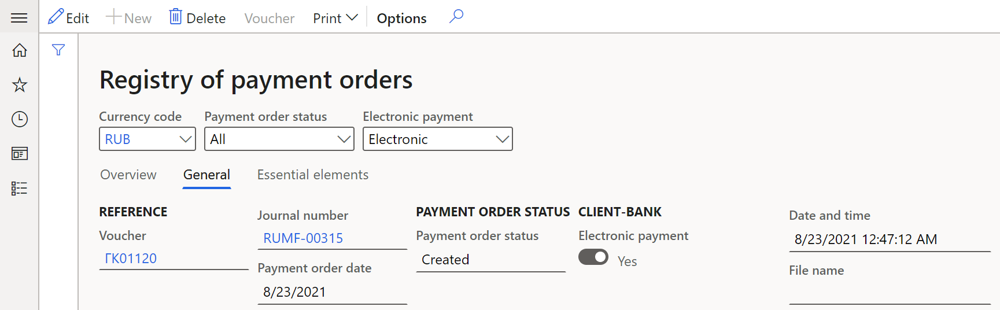

---
# required metadata

title: Client-Bank interface and reconciliation procedure
description: This topic provides information about user settings for export electronic outgoing payments and recnciliation procedure.
ms.date: 06/27/2022
ms.topic: article
ms.prod: 
author: akroshkina
ms.technology: 
manager: anayash

# optional metadata

#ms.search.form:
audience: IT Pro, Application User
# ms.devlang: 
ms.reviewer: kfend
# ms.suite: 
# ms.tgt_pltfrm: 
# ms.custom: 
ms.search.region: 
# ms.search.industry: 
ms.author: anasyash
ms.dyn365.ops.version: 
ms.search.validFrom: 
---

# Client-Bank interface and reconciliation procedure

## Overview

This topic provides information about user settings for export electronic
outgoing payments created in the payment journals using the Client-Bank system.
Payment formats with a specific bank must be customized using GER
configurations.

The Client-Bank interface allows you to automatically reconcile bank payments
and statement data instead of completely manual reconciliation.

## Set up

### Import configurations

Before you start using Client-Bank functionality, you should import GER
configurations from the Global repository of Configuration service.

1.  Import the following configurations:

    -   **Payment model mapping 1611**
    -   **Payment model mapping to destination RU**
    -   **Bank statement (RU)**
    -   **Payment order (RU)**

For more information, see [Import configurations from GR](https://docs.microsoft.com/en-us/dynamics365/fin-ops-core/dev-itpro/analytics/er-download-configurations-global-repo?toc=/dynamics365/finance/toc.json).

1.  Go to **Workspaces** \> **Electronic reporting**.
2.  On the **Configurations** section, select **Reporting configurations**.
3.  On the Action Pane, select **Edit**.
4.  On the navigation list, under **Payment model** section, select main payment model to be set it as the default. For example, select **Payment model mapping 1611**.
5.  On the **Configurations** page, set **Default for model mapping** to **Yes**.
6.  On the Action Pane, select **Save**.

### Set up kinds of documents

1.  Go to **Cash and bank management** \> **Setup** \> **Payment order setup** \> **Kinds of document**.
2.  On the Action Pane, select **New**.
3.  In **The code of document kind** field, enter the unique a two-digit code.
4.  In the **Description** field, enter the description of the document.
5.  In the **Document type** field, select one of the following:

-   **Pay document**.
-   **Memorial order**.
-   **Currency transfer**.
-   **Currency sale**.
-   **Currency purchase**.

### Set up methods of payment for export

To set up a matching format for exporting a payment and the specified payment method, follow these steps.

1.  Go to **Accounts payable \> Payment setup \> Methods of payment** for payments to vendors.
2.  To create new method of payment, on the Action Pane, select **New**. Set it in a usual way.
3.  In the **Payment status** field, select **Sent**.
4.  In the **Payment type** field, select **Electronic payment**.
5.  On the **General** FastTab, in the **Posting** section, in the **Account type** field, select **Bank**, in the **Payment account** field, select an account that was set earlier.
6.  On the **File formats** FastTab, in the **File formats** section, set the following fields:
7.  In the **Export format** field, select the custom export format.

>   [NOTE!] 
>   If the drop-down menu is empty, on the **File formats** FastTab, click **Setup**. Select available formats and add them to the **Selected** column. On the Action Pane select **Save**. Close this page and fill in the **Export format** field.

8.  In the **Generic electronic Export format** field, set **Enable** to **Yes**.
9.  In the **Export format configuration** field, select the custom export format.
10.  In the **Client-bank** section, set **Enable** to **Yes**.
11.  In the **Export format** field, select the export format.

### Set up the exchange interface

-   The Client-Bank functionality uses **txt** format for export payments.
-   To customize electronic format, see more information in [Formula designer in Electronic reporting (ER)](https://docs.microsoft.com/dynamics365/fin-ops-core/dev-itpro/analytics/general-electronic-reporting-formula-designer?toc=/dynamics365/commerce/toc.json).
-   All payments download in the **Downloads** folder by default. To change this, see [Electronic reporting (ER) destinations](https://docs.microsoft.com/dynamics365/fin-ops-core/dev-itpro/analytics/electronic-reporting-destinations).
-   
## Operations in the Client-Bank functionality for export

### Create outgoing payments before export

Outgoing payments can be, for example, payments to vendors, purchase/sale/transfer of currency and cash-bank operations.
To create and set up outgoing payments, follow these steps.

1.  Go to **Accounts payable \> Payments \> Vendor payment journal** for payments to vendors.
2.  Create and set up **Vendor payment journal** as described in [Set up and process payment orders for Russia](https://docs.microsoft.com/dynamics365/finance/localizations/rus-payment-order-settings-processing#create-payment-order-lines).
3.  On the Action Pane, select **Lines**.
4.  On the **List** tab, set the following fields:

    -   In the **Date** field, select an operation date.
    -   In the **Account** field, select a counteragent account.
    -   In the **Debit** field, write the amount of payment.
    -   In the **Currency** field, select currency payment code.
    -   In the **Offset account type** field, select **Bank**.

5.  On the **Payment** tab, set the following fields:

    -   In the **Document type** section, in the **The code of document kind** field, select a code of document kind which was created earlier.
    -   In the **Method of payment** field, select the payment method that corresponds to the payment. To successfully export a payment into the Client-Bank system, you must use the payment method set up earlier. The **Payment status**, **Offset account type** and **Offset account** fields will be filled automatically if they were set when creating the method of payment.

[NOTE!] **Offset account type** must be equal to **Bank**.

-   To set the parameters of the currency contract for which the currency is sold or purchased, fill in **Payment specification**, **Payment ID** fields and **Vendor account** field.
6.  On the **Bank** tab, set the following fields:

    -   For currency transactions: in the **Bank** section, fill the **Bank transaction type** field.
    -   For non-currency transactions: in the **Print payment order** section, in the **Payment documented on** field select a counteragent account. For currency transactions, a transit account is used.

7.  On the Action Pane, select **Save**.

### Export payments to the Client-Bank 

1.  Go to **Accounts payable \> Payments \> Vendor payment journal**.
2.  Mark the necessary lines.

>   [!NOTE] 
>   A separate export file is created for each bank account. If an error occurs, the system proceeds to processing lines for the next bank account.

7.  On the Action Pane, select **Generate payments**.
8.  On the **Generate payments** pane, select **Payment method**.
9.  Fill in **Method of payment** and **Bank account** fields as were set earlier.
10.  Fill in **File name** field.
11.  Select **OK**. Select **OK**. The payment order is created.

### Cancellation of payment export

1.  Go to **Cash and bank management \> Periodic tasks \> Third party bank \> Exported payments**. You can see all exported payments or payments whose export was canceled.
2.  On the **Overview** tab you can see these fields:

    -   **Document type**: the **The code of document kind** field from the payment journal.
    -   **Account type** is **Vendor**.
    -   **Payment order number**: the **Check number** field from the vendor payment journal.
    -   **Payment order date:** the **Date** field from the payment journal.
    -   **Counteragent**: the **Account** field from the payment journal.
    -   **Amount in transaction currency**: the **Debit** field from the payment journal.
    -   **Currency**, **Method of payment, Bank account** fields are taken from the corresponding payment journal lines.
    -   **Payment order status** is **Created** for exported payments or **Rejected** for canceled exported payments.

3.  On the **General** tab, in the **File** section, in the **Date and time** field you can see the date and time when the payment was exported.
4.  Select payment line and on the Action Pane, select **Exported payments \> Void payment order**. Then the **Payment order status** field changes to **Rejected**.
5.  To open the source line in not-posted journal of payment, on the Action Pane, select **Exported payments \> Journal line**.

### Registry of payment orders

1.  Go to **Accounts payable \> Inquiries and reports \> Payment \> Payment order register**. The form displays the payment documents sent in electronic format or on paper. For general information about the **Registry of payment orders** page, see [Set up and process payment orders for Russia](https://docs.microsoft.com/dynamics365/finance/localizations/rus-payment-order-settings-processing#review-registry-of-payment-orders).

>[!NOTE] 
> Currency transactions aren’t displayed here.

2.  For payments exported to the Client-Bank system, on the **General** tab, in the **Client-Bank** section the following fields are filled in:

-   **Electronic payment** is set to **Yes**.
-   **Date and time**: the date and time when the payment was exported.

