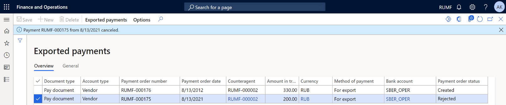

# Client-Bank interface and reconciliation procedure

This article provides information about user settings for exporting electronic outgoing payments that are created in the payment journals by using the Client-Bank system. You can use the Client-Bank interface to automatically reconcile bank payments and statement data instead of doing a manual reconciliation. Payment formats for a specific bank are customized by using Electronic reporting (ER) configurations.

## Setup

### Import configurations

Before you start to use the Client-Bank functionality, import ER configurations from the Global repository of the Configuration service.

1. In the Global repository, import the following configurations:

    - Payment model mapping 1611
    - Payment model mapping to destination RU
    - Bank statement (RU)
    - Payment order (RU)

    For more information, see [Import configurations from GR](../../fin-ops-core/dev-itpro/analytics/er-download-configurations-global-repo.md).

2. Go to **Workspaces** \> **Electronic reporting**.
3. In the **Configurations** section, select **Reporting configurations**.
4. On the Action Pane, select **Edit**.
5. In the navigation list, in the **Payment model** section, set the main payment model as the default payment model. For example, select **Payment model mapping 1611**.
6. On the **Configurations** page, set the **Default for model mapping** option to **Yes**.
7. On the Action Pane, select **Save**.

### Set up kinds of documents

1. Go to **Cash and bank management** \> **Setup** \> **Payment order setup** \> **Kinds of document**.
2. On the Action Pane, select **New**.
3. In the **The code of document kind** field, enter a unique two-digit code.
4. In the **Description** field, enter a description of the document.
5. In the **Document type** field, select one of the following values:

    - Pay document
    - Memorial order
    - Currency transfer
    - Currency sale
    - Currency purchase

    

### Set up methods of payment for export

To set up a matching format to export a payment and the specified payment method, follow these steps.

1. Go to **Accounts payable** \> **Payment setup** \> **Methods of payment**.
2. On the Action Pane, select **New**, and enter information about the new method of payment.
3. In the **Payment status** field, select **Sent**.
4. In the **Payment type** field, select **Electronic payment**.
5. On the **General** FastTab, in the **Posting** section, in the **Account type** field, select **Bank**.
6. In the **Payment account** field, select the account that was set earlier.
7. On the **File formats** FastTab, in the **File formats** section, in the **Export format** field, select the custom export format.

    > [!NOTE]
    > If the list for the **Export format** field is empty, select **Setup** on the **File formats** FastTab. Select available formats, and add them to the **Selected** column. On the Action Pane, select **Save**. Close the page, and then add a value to the **Export format** field.

8. In the **Generic electronic Export format** field, set the **Enable** option to **Yes**.
9. In the **Export format configuration** field, select the custom export format.
10. In the **Client-bank** section, set the **Enable** option to **Yes**.
11. In the **Export format** field, select the export format.

### Set up the exchange interface

The Client-Bank functionality uses text format for export payments. You can customize the electronic format. For more information, see [Formula designer in Electronic reporting (ER)](../../fin-ops-core/dev-itpro/analytics/general-electronic-reporting-formula-designer.md).

By default, all downloaded payments are stored in the **Downloads** folder. For information about how to select a different location, see [Electronic reporting (ER) destinations](../../fin-ops-core/dev-itpro/analytics/electronic-reporting-destinations.md).

## Operations in the Client-Bank functionality for export

### Create outgoing payments before export

Outgoing payments can be payments to vendors, or the purchase, sale, or transfer of currency and cash-bank operations.

To create and set up outgoing payments, follow these steps.

1. Go to **Accounts payable** \> **Payments** \> **Vendor payment journal** for payments to vendors.
2. Create and set up **Vendor payment journal**. For more information, see [Set up and process payment orders for Russia](rus-payment-order-settings-processing.md#create-payment-order-lines).
3. On the Action Pane, select **Lines**.
4. On the **List** tab, set the following fields:

    - In the **Date** field, select an operation date.
    - In the **Account** field, select a counteragent account.
    - In the **Debit** field, enter the amount of the payment.
    - In the **Currency** field, select the currency payment code.
    - In the **Offset account type** field, select **Bank**.

5. On the **Payment** tab, set the following fields:

    - In the **Document type** section, in the **The code of document kind** field, select the code that was created earlier.
    - In the **Method of payment** field, select the payment method that corresponds to the payment. To successfully export a payment to the Client-Bank system, you must use the payment method that was set up earlier. The **Payment status**, **Offset account type**, and **Offset account** fields are automatically set if they were set when the method of payment was created.

        > [!NOTE]
        > The **Offset account type** field must be set to **Bank**.

    - To set the parameters of the currency contract that the currency is sold or purchased for, enter or select a value in the **Payment specification**, **Payment ID**, and **Vendor account** fields.

6. On the **Bank** tab, set the following fields:

    - **For currency transactions:** In the **Bank** section, in the **Bank transaction type** field, select a value.
    - **For non-currency transactions:** In the **Print payment order** section, in the **Payment documented on** field, select a counteragent account. For currency transactions, a transit account is used.

7. On the Action Pane, select **Save**.

### Export payments to the Client-Bank system

1. Go to **Accounts payable** \> **Payments** \> **Vendor payment journal**.
2. Mark the necessary lines.

    > [!NOTE] 
    > A separate export file is created for each bank account. If an error occurs, the system goes on to process lines for the next bank account.

3. On the Action Pane, select **Generate payments**.
4. In the **Generate payments** dialog box, select **Payment method**.
5. Set **Method of payment** and **Bank account** fields as they were set earlier.
6. In the **File name** field, enter or select a value.

    

7. Select **OK**, and then select **OK** again. The payment order is created.

### Cancel payment export

1. Go to **Cash and bank management** \> **Periodic tasks** \> **Third party bank** \> **Exported payments**.

    You can view all exported payments or payments that export was canceled for.

    On the **Overview** tab, you can view the following fields and field values:

    - **Document type** – The value of the **The code of document kind** field from the payment journal.
    - **Account type** – The value is **Vendor**.
    - **Payment order number** – The value of the **Check number** field from the vendor payment journal.
    - **Payment order date** – The value of the **Date** field from the payment journal.
    - **Counteragent** – The value of the **Account** field from the payment journal.
    - **Amount in transaction currency** – The value of the **Debit** field from the payment journal.
    - **Currency**, **Method of payment**, and **Bank account** – The values from the corresponding payment journal lines.
    - **Payment order status** – This value is **Created** for exported payments or **Rejected** for canceled exported payments.

    

    On the **General** tab, in the **File** section, in the **Date and time** field, you can view the date and time when the payment was exported.

2. Select a payment line, and then, on the Action Pane, on the **Exported payments** tab, select **Void payment order**. The value of the **Payment order status** field is changed to **Rejected**.
3. To open the source line in the unposted payment journal, on the Action Pane, on the **Exported payments** tab, select **Journal line**.

### Registry of payment orders

- Go to **Accounts payable** \> **Inquiries and reports** \> **Payment** \> **Payment order register**. The page shows the payment documents that were sent in electronic format or on paper. For general information about the **Registry of payment orders** page, see [Set up and process payment orders for Russia](rus-payment-order-settings-processing.md#review-registry-of-payment-orders).

    > [!NOTE]
    > Currency transactions aren't shown on the **Registry of payment orders** page.

    

For payments that were exported to the Client-Bank system, on the **General** tab, in the **Client-Bank** section, the following fields are set:

- The **Electronic payment** option is set to **Yes**.
- The **Date and time** field is set to the date and time when the payment was exported.

