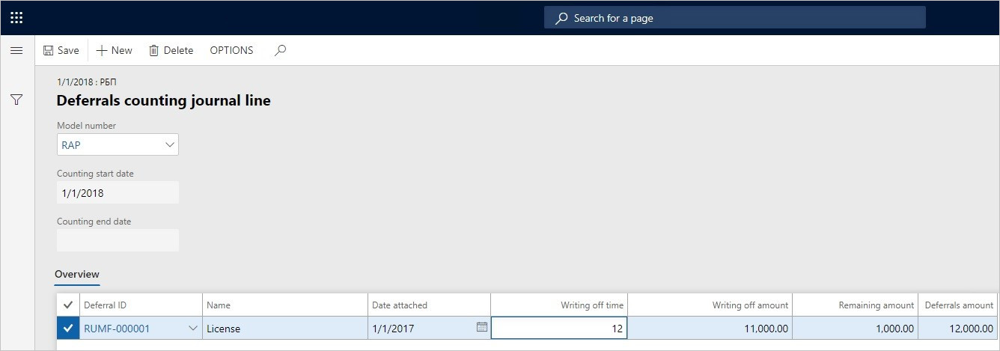

---
# required metadata
title: Deferrals counting (Russia)
description: This topic explains how to do deferrals counting.
author: anasyash
ms.date: 06/28/2019
ms.topic: article
ms.prod: 
ms.technology: 

# optional metadata
ms.search.form:  
audience: Application User
# ms.devlang: 
ms.reviewer: kfend
# ms.tgt_pltfrm: 
# ms.custom: 
ms.search.region: Russia
# ms.search.industry: 
ms.author: anasyash
ms.search.validFrom: 2019-06-28
ms.dyn365.ops.version: 10.0.1

---

# Deferrals counting (Russia)

[!include [banner](../includes/banner.md)]

The deferrals functionality supports the process of deferrals counting and lets you print the **Inventory act (INV-11)** report.

Before you generate the **Inventory act (INV-11)** report, you must create deferrals and post writing-off transactions in the deferrals journal.

1. Go to **General ledger** \> **Periodic tasks** \> **Deferrals** \> **Deferrals counting journal**.

    You can use the **Deferrals counting journal** page to create a Deferrals counting journal and print the **Inventory act (INV-11)** report.

    The following table describes the tabs on the **Deferrals counting journal** page.

    <table>
    <thead>
    <tr>
    <th>Tab</th>
    <th>Description</th>
    </tr>
    </thead>
    <tbody>
    <tr>
    <td>Overview</td>
    <td>Create a new Deferrals counting journal.
    
<strong>Note:</strong> You can't create more than one journal that has the same counting date.

    </td>
    </tr>
    <tr>
    <td>Officials</td>
    <td>Specify the names, positions, and titles of the officials.</td>
    </tr>
    </tbody>
    </table>

    The following table describes the buttons on the Action Pane of the **Deferrals counting journal** page.

    <table>
    <thead>
    <tr>
    <th>Button</th>
    <th>Description</th>
    </tr>
    </thead>
    <tbody>
    <tr>
    <td>Lines</td>
    <td>Open the <strong>Deferrals counting journal line</strong> page, where you can create journal lines.</td>
    </tr>
    <tr>
    <td>Close</td>
    <td>Open the <strong>End deferrals counting</strong> dialog box. In the <strong>Counting end date</strong> field, you can then enter the date when you want to close the journal. The date that you specify is shown in the <strong>Counting end date</strong> field on the <strong>Deferrals counting journal</strong> page.
    
<strong>Note:</strong> You can't close the journal if journal lines aren't created.

    </td>
    </tr>
    <tr>
    <td>Print</td>
    <td>Open the <strong>Deferrals counting</strong> dialog box, where you can print the <strong>Inventory act (INV-11)</strong> report by using the Microsoft Excel template for the selected model number.</td>
    </tr>
    </tbody>
    </table>

    The following table describes the fields on the **Deferrals counting journal** page.

    <table>
    <thead>
    <tr>
    <th>Field</th>
    <th>Description</th>
    </tr>
    </thead>
    <tbody>
    <tr>
    <td>Show</td>
    <td>Select which vouchers or journals are shown on the page, based on the posting status:
    <ul>
    <li><strong>All</strong> – Show all journals.</li>
    <li><strong>Open</strong> – Show only journals that aren't posted.</li>
    <li><strong>Posted</strong> – Show only journals that are posted.</li>
    </ul>
    </td>
    </tr>
    <tr>
    <td>Journal batch number</td>
    <td>The deferral journal number.</td>
    </tr>
    <tr>
    <td>Name</td>
    <td>Select the journal name that has the <strong>Deferrals</strong> journal type.</td>
    </tr>
    <tr>
    <td>Resolution number</td>
    <td>Enter the resolution number for the counting journal.</td>
    </tr>
    <tr>
    <td>Resolution date</td>
    <td>Select the resolution date for the counting journal.</td>
    </tr>
    <tr>
    <td>Counting start date</td>
    <td>Select the start date of the deferrals counting period. By default, this field is set to the current date.</td>
    </tr>
    <tr>
    <td>Counting end date</td>
    <td>The end date of the deferrals counting period.</td>
    </tr>
    <tr>
    <td>Closed</td>
    <td>This check box is automatically selected when the deferral counting is completed and the journal is closed.</td>
    </tr>
    <tr>
    <td>Position</td>
    <td>Select the position title of the official.</td>
    </tr>
    <tr>
    <td>Employee name</td>
    <td>Select the name of the official in the list of company employees.</td>
    </tr>
    <tr>
    <td>Title</td>
    <td>Select the job title of the employee.</td>
    </tr>
    </tbody>
    </table>

2. To create a new Deferrals counting journal, follow these steps:

    1. On the Action Pane, select **New**.

        > [!NOTE]
        > You can't create more than one Deferrals counting journal that has the same counting date.

    2. In the **Name** field, select the journal name that has the **Deferrals** journal type.
    3. In the **Resolution number** field, enter the resolution number for the counting journal.
    4. In the **Resolution date** field, select the resolution date for the counting journal.
    5. In the **Counting start date** field, select the start date of the deferrals counting period. By default, this field is set to the current date.

        The **Counting end date** field is set to the end date that was set for the deferrals counting period in the **End deferrals counting** dialog box.

    6. Select the **Officials** tab to set up the names, positions, and titles of the officials.
    7. In the **Position** field, select the position title of the official.
    8. In the **Employee name** field, select the name of the official in the list of company employees.
    9. In the **Job title** field, select the job title of the employee.

3. On the Action Pane, select **Lines** to open the **Deferrals counting journal line** page.

    You can use the **Deferrals counting journal line** page to view or modify existing journal lines, or to manually create new lines.

    The following table describes the fields on the **Deferrals counting journal line** page.

    | Field               | Description                                                                                                         |
    |---------------------|---------------------------------------------------------------------------------------------------------------------|
    | Model number        | Select the deferral model number.                                                                                   |
    | Counting start date | The start date that is specified for the deferral counting period on the **Deferrals counting journal** page.       |
    | Counting end date   | The end date that is specified for the deferral counting period on the **Deferrals counting journal** page.         |
    | Deferral ID         | Select the identification code that is associated with deferral.                                                    |
    | Name                | Enter the deferral name.                                                                                            |
    | Date attached       | Select the deferral creation date.                                                                                  |
    | Writing off time    | Select the write-off period for the deferral.                                                                       |
    | Writing off amount  | Enter the amount that is written off between the creation of the deferral and the beginning of the counting period. |
    | Remaining amount    | Enter the amount that must be written off in the future.                                                            |
    | Deferrals amount    | Select the deferral amount in the default currency.                                                                 |

4. To modify existing Deferrals counting journal lines, follow these steps:

    1. In the **Model number** field, select the deferral model number of the journal lines.

        > [!NOTE]
        > The **Counting start date** and **Counting end date** fields are set to the start and end dates that were set for the deferrals counting period on the **Deferrals counting journal** page.

    2. In the **Deferral ID** field, modify the deferral code.
    3. In the **Name** field, modify the deferral name.
    4. In the **Date attached** field, select the deferral creation date.
    5. In the **Writing off time** field, select the write-off period for the deferral.
    6. In the **Writing off amount** field, enter the amount that is written off between the creation of the deferral and the beginning of the counting period.
    7. In the **Remaining amount** field, enter the amount that must be written off in the future.
    8. In the **Deferrals amount** field, select the deferral amount in the default currency.
    9. Close the **Deferrals counting journal line** page.

    

5. To print the **Inventory act (INV-11)** report, follow these steps:

    1. On the Action Pane, select **Close** to open the **End deferrals counting** dialog box.
    2. In the **Counting end date** field, enter the date when you want to close the journal.

        > [!NOTE]
        > The date that you specify is shown in the **Counting end date** field on the **Deferrals counting journal** page.

    3. Select **OK** to close the journal.
    4. On the Action Pane, select **Print** to open the **Deferrals counting** dialog box.
    5. In the **Model number** field, select the deferral model number.
    6. Select **OK** to print the **Inventory act (INV-11)** by using the Excel template for the selected model number.

[!INCLUDE[footer-include](../../includes/footer-banner.md)]