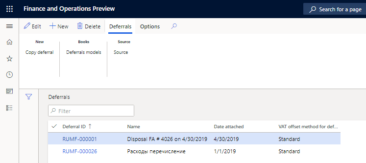

---
# required metadata
title: Create or generate deferrals (Russia)
description: This topic explains how to manually create deferrals and how to generate them by using a periodic task.
author: anasyash
manager: AnnBe
ms.date: 06/16/2020
ms.topic: article
ms.prod: 
ms.service: dynamics-ax-applications
ms.technology: 

# optional metadata
ms.search.form:  
audience: Application User
# ms.devlang: 
ms.reviewer: kfend
ms.search.scope: Core, Operations
# ms.tgt_pltfrm: 
# ms.custom: 
ms.search.region: Russia
# ms.search.industry: 
ms.author: anasyash
ms.search.validFrom: 2019-06-28
ms.dyn365.ops.version: 10.0.1

---

# Create or generate deferrals (Russia)

[!include [banner](../includes/banner.md)]

## Manually create deferrals

You can use the **Deferrals** page to manually create a deferral. You must specify the deferrals model for a deferral. The status of a deferral that is manually created is updated to **Scheduled**. You can't manually modify the status.

1. Go to **General ledger** \> **Deferrals** \> **Deferrals**.
2. On the Action Pane, select **New** to create a deferral.
3. In the **Deferral ID** field, enter the unique identification number of the deferral.
4. In the **Name** field, enter a name for the deferral.
5. In the **Comment** field, enter a detailed description of the deferral.
6. In the **Date attached** field, select the date when the deferral is created.
7. In the **Expense code** field, select the expense code.
8. In the **VAT offset method for deferrals** field, select the method that is used to deduct value-added tax (VAT) for the deferral. The following options are available:

    - **Standard** – Process the incoming VAT for factures that are related to deferrals by using the standard VAT deduction method.
    - **Proportionate** – Process the incoming VAT for factures that are related to deferrals by using the proportional VAT deduction method.

    

9. On the Action Pane, on the **Deferrals** tab, in the **Books** group, select **Deferrals models** to open the **Deferrals models** page.
10. Define the deferrals model that must be applied for the deferral.

    

11. On the Action Pane, select **Transactions** to open the **Deferrals transactions** page.
12. Review the transactions that are related to the selected model for the deferral, and then close the page.

    

13. On the **Deferrals models** page, on the Action Pane, select **Balance** to open the **Deferral balances** page.
14. Review the balances that are related to the selected model for the deferral, and then close the page.

    

15. On the **Deferrals models** page, on the Action Pane, select **Writing off sum** to open **Deferrals writing off profile** page.
16. On the Action Pane, select **Calculate** to review calculated writing-off amounts that are related to the selected model for the deferral.

    

## Generate deferrals by using a periodic task

To automatically generate deferrals, you must set up the sequences of calculation and counters for the deferrals groups.

1. Go to **General ledger** \> **Periodic tasks** \> **Deferrals** \> **Deferrals creating**.

    You can use the **Deferrals creating** page to update calculation sequences for deferrals or to automatically generate deferrals by using the periodic task.

    > [!NOTE]
    > Before you can generate deferrals by using the periodic task, you must create and post vendor invoices.

    The following table describes the fields on **Deferrals creating** page.

    | Field             | Description                                                                       |
    |-------------------|-----------------------------------------------------------------------------------|
    | Sequence          | The sequence number that is specified on the **Standard expenses sequence** page. |
    | Description       | The sequence name.                                                                |
    | Channel           | The deferral output channel for the selected sequence.                            |
    | Channel reference | The deferrals group where the calculated results are entered.                     |

    The following table describes the buttons on the Action Pane of the **Deferrals creating** page.

    | Button           | Description                                                                               |
    |------------------|-------------------------------------------------------------------------------------------|
    | Counters         | Open the **Counter setup** page, where you can set up counters for calculation sequences. |
    | Calculate all    | Calculate all the deferrals write-off factor sequences.                                   |
    | Calculate marked | Calculate the selected deferrals write-off factor sequence.                               |

2. To generate deferrals by using the periodic task, follow these steps:

    1. Select the line that includes the counter that you set up, and then, on the Action Pane, select **Calculate all** or **Calculate marked**.
    2. In the **Start date** and **End date** fields, enter the date range for the deferral calculation period.
    3. Select the **Overwrite** check box to overwrite existing deferrals for the specified period that don't contain write-off vouchers or disposal vouchers. Only deferrals on which there was no write off or disposal operations will be recalculated.
    4. Select the **Preview** check box to view or modify the deferrals before they are created.

        When this check box is selected, a page that shows deferrals information appears before deferrals are created. Therefore, you can change the parameters for the deferrals that are created. When the check box is cleared, deferrals are automatically generated based on the parameters that were entered on the **Deferrals creating** page.

    5. Select the **Only from ledger vouchers** check box to create deferrals only from the ledger documents. No deferrals that are generated based on purchases will be accounted for.
    6. Go to **General ledger** \> **Deferrals** \> **Deferrals** to view the deferrals that are generated. To view the transaction details on the **Deferrals transactions** page, on the Action Pane, select **Deferrals models**, and then select **Transactions**.

When you generate deferrals for vendor invoices by using the periodic task, deferral transaction vouchers of **Receipt** type are created.

## View created deferrals

To view manually and automatically created deferrals, go to **General ledger > Deferrals > Deferrals**.

