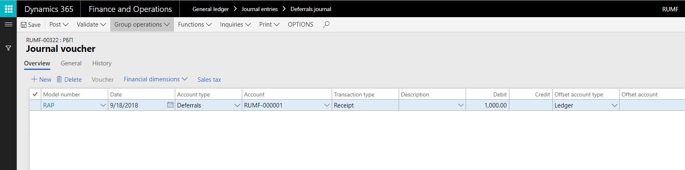

---
# required metadata
title: Receipt of deferrals 
description: This topic explains how to create and post receipt transactions for deferrals that were manually created. It also explains how to reverse receipt transactions.
author: anasyash
ms.date: 06/28/2019
ms.topic: article
ms.prod: 
ms.technology: 

# optional metadata
ms.search.form:  
audience: Application User
# ms.devlang: 
ms.reviewer: kfend
# ms.tgt_pltfrm: 
# ms.custom: 
ms.search.region: Russia
# ms.search.industry: 
ms.author: anasyash
ms.search.validFrom: 2019-06-28
ms.dyn365.ops.version: 10.0.1

---

# Receipt of deferrals

[!include [banner](../includes/banner.md)]

You use the **Journal voucher** page to create a receipt transaction for deferrals that were manually created. When you post the receipt transaction, the status of the deferrals is updated to **In process**.

1. Go to **General ledger** \> **Journal entries** \> **Deferrals journal**.
2. On the Action Pane, select **New**.
3. In the **Name** field, select a journal name.
4. On the Action Pane, select **Lines** to open the **Journal voucher** page.
5. On the **Overview** tab, select **New** to create a line.
6. In the **Transaction date** field, select the transaction date.
7. In the **Transaction type** field, select **Receipt**.
8. In the **Deferral ID** field, select the deferral to create a receipt transaction for.
9. In the **Model number** field, select the model number for the deferral.
10. Select **OK**. Voucher lines are created for the selected deferral on the **Journal voucher** page.

    A transaction of the **Receipt** type is created for the deferral. This transaction has the specified receipt date.

    

11. On the Action Pane, select **Validate** \> **Validate** and then **Post** \> **Post** to validate and post the journal.
12. Go to **General ledger** \> **Deferrals** \> **Deferrals** to view the deferrals that are generated. To view the transaction details on the **Deferrals transactions** page, on the Action Pane, select **Deferrals models**, and then select **Transactions**.

## Reverse a receipt transaction

You use the **Reverse transaction** page to reverse a receipt transaction that was manually created for deferrals. Receipt transactions that are generated by using the periodic task can be reversed. However, the other general ledger transactions that are created during the periodic task must be manually reversed in the general ledger journal.

Deferrals that are created after the fixed asset is disposed of are reversed when the fixed asset transaction is reversed.

1. Go to **General ledger** \> **Deferrals** \> **Deferrals**.
2. Select a deferral ID, and then, on the Action Pane, on the **Deferrals** tab, in the **Books** group, select **Deferrals models** to open the **Deferrals models** page.
3. Select a deferrals model, and then, on the Action Pane, select **Transactions** to open the **Deferrals transactions** page.
4. Select the receipt transaction to reverse, and then, on the Action Pane, select **Reverse transaction** to open the **Reverse transaction** dialog box.
5. In the **Date of storno** field, select the reversal date. All transactions that are created on this date are reversed.
6. Select the **By all models** check box to reverse transactions that are created by using the tax value model and the base value model.
7. Select **OK** to reverse the transaction.

[!INCLUDE[footer-include](../../includes/footer-banner.md)]