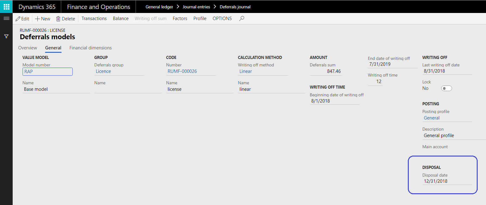

---
# required metadata
title: Dispose of deferrals (Russia)
description: This topic explains how to dispose of deferrals.
author: anasyash
ms.date: 06/28/2019
ms.topic: article
ms.prod: 
ms.technology: 

# optional metadata
ms.search.form:  
audience: Application User
# ms.devlang: 
ms.reviewer: kfend
# ms.tgt_pltfrm: 
# ms.custom: 
ms.search.region: Russia
# ms.search.industry: 
ms.author: anasyash
ms.search.validFrom: 2019-06-28
ms.dyn365.ops.version: 10.0.1

---

# Dispose of deferrals (Russia)

[!include [banner](../includes/banner.md)]

1. Go to **General ledger** \> **Journals** \> **Deferrals journal**.
2. On the Action Pane, select **New**.
3. In the **Name** field, select the deferrals journal name.
4. On the Action Pane, select **Lines** to open the **Journal voucher** page.
5. On the Action Pane, select **Group operations** \> **Disposal** to open the **Disposal** dialog box.
6. In the **Disposal date** field, select the disposal date of the transaction.
7. Set the **Retirement on life time** option to **Yes** to remove of the **Disposal date** value in the deferrals value model.
8. On the **Records to include** FastTab, select **Filter** to open the **Inquiry** dialog box, where you can set up the selection criteria.
9. Select **OK** to return to the **Journal voucher** page. The disposal voucher details are shown for the selected deferrals on the specified date.
10. To dispose of one deferral voucher, on the **Overview** FastTab, select **New** to open the **Create new line** dialog box.
11. In the **Transaction date** field, select the disposal date of the transaction.
12. In the **Transactions type** field, select **Disposal**.
13. In the **Deferral ID** field, select the deferral code.
14. In the **Model number** field, select the deferral models number. If the model code isn't specified in the journal, all models that were created for the deferral will be selected.
15. Select **OK** to return to the **Journal voucher** page.
16. On the Action Pane, select **Functions** \> **Edit line** to edit the journal before you post it.
17. On the Action Pane, select **Post** \> **Post** to post the voucher. Retirement on life time is shown as the **Disposal date** value on the deferrals value model.

    

    > [!NOTE]
    > A journal line will be posted only if there is no gap between the last posted write-off and the disposal period.

18. To view the posted transactions, go to **General ledger** \> **Deferrals** \> **Deferrals**. On the Action Pane, select **Deferrals models**, and then select **Writing off transactions**.

    When the status of a deferral is **Closed**, and the line is shaded gray on the **Deferrals models** page, you can post the reversal voucher only if its transaction type is **Writing off** and its status is **Closed**. 

    The view the deferrals that are generated, go to **General ledger** \> **Deferrals** \> **Deferrals**. To view the transaction details on the **Deferrals transactions** page, select **Deferrals models**, and then select **Transactions**.

[!INCLUDE[footer-include](../../includes/footer-banner.md)]