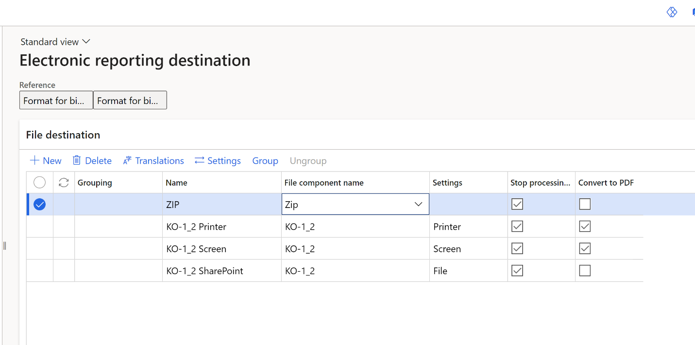

# Enable Electronic reporting (ER) destinations to store Russian accounting documents

[!include [banner](../includes/banner.md)]

This article explains how to configure Electronic reporting (ER) destinations for post-processing of Russian accounting documents that are generated in Microsoft Excel and Word formats. You can set up the configuration to show a preview of the document on the screen, send the document to the printer, or save the file to SharePoint or Power BI. For information about Federal Accounting Standard 27-2021 in Russia and Dynamics 365 Finance, see the white paper [Dynamics 365 Finance and Supply Chain Management-Federal Accounting Standard 27-2021 in Russia](https://servicetrust.microsoft.com/ViewPage/TrustDocumentsV3?command=Download&downloadType=Document&downloadId=cc7a904b-d553-43b3-94fd-58fa02e4f702&tab=7f51cb60-3d6c-11e9-b2af-7bb9f5d2d913&docTab=7f51cb60-3d6c-11e9-b2af-7bb9f5d2d913_Compliance_Guides).

To use this functionality, you must enable the **Allow using the ER framework for post-processing of reports in Excel and Word formats** feature in the **Feature management** workspace. This feature changes the behavior of several reports in the Russian localization that generate accounting documents in Microsoft Office formats (Excel and Word). When the feature is enabled, the ER framework is used for post-processing of generated documents, so that you can show the file, store the file in a configured destination, or show the report on the screen.

For several reports that you configure the **File** destination for in the Print management framework, the post-processing is activated when you print the report by using Print management.

For several other reports that can't be configured in the Print management framework, the post-processing is activated when you print the report.

The tables in the [Accounting documents](#accounting-documents) section of this article list the reports that this feature is applicable to. The tables show the name of the file component that must configure for each report in ER destinations. They also indicate whether the **File** destination can be configured for the report in Print management.

Follow these steps to configure ER destinations for accounting documents.

1. In the **Feature management** workspace, enable the **Allow using the ER framework for post-processing of reports in Excel and Word formats** feature.
2. Import the latest versions of these ER configurations from the Global configuration repository:

    - **Format for binary data pipeline**
    - **Model for binary data pipeline**
    - **Mapping for binary data pipeline**

    For downpoad instructions, see [Download ER configurations from the Global repository of Configuration service](../../fin-ops-core/dev-itpro/analytics/er-download-configurations-global-repo.md).

3. Go to **Organization administration** \> **Document management** \> **Document management parameters**.
4. On the **General** tab, on the **Electronic reporting** FastTab, in the **Accounting documents** field, select the **Format for binary data pipeline** format that you imported earlier.
5. Go to **Organization administration** \> **Electronic reporting** \> **Electronic reporting destination**.
6. Select **New**.
7. In the **Reference** field, select **Format for binary data pipeline**.
8. In the **File destination** section, create lines for the required destinations for each accounting document that you generate. For more information about ER destinations, see [Electronic reporting (ER) destinations](../../fin-ops-core/dev-itpro/analytics/electronic-reporting-destinations.md).

    

> [!TIP]
> If you don't want to get a zip folder together with the generated document, create a line for the **Zip** component, and leave the **Settings** field blank. If you don't create this line, you will always get a zip folder together with the document, in addition to the configured ER destinations for that document.
>
> To show the file on the screen, select the **Convert to PDF** checkbox for the line. If you don't select this checkbox, make sure that you've installed Office online. For more information, see [Use the PDF conversion option](../../fin-ops-core/dev-itpro/analytics/electronic-reporting-destinations.md#ConvertToPDF).

If you enable **File** destination setting to store the document as a file on SharePoint, each time that you generate a document, a new file will be created and stored.

If you enable **Power BI** destination setting to store the document as a file on SharePoint, each time that you generate a document, a new file version of the same document will be created. For more information about this option, see [Configure Electronic reporting (ER) to pull data into Power BI](../../fin-ops-core/dev-itpro/analytics/general-electronic-reporting-report-configuration-get-data-powerbi.md#schedule-execution-of-the-configured-er-format).

If execution or storage of the document fails, you can find details about the failure reasons on the **Electronic reporting jobs** page.

## Accounting documents

### Petty cash

For information about how to print these documents, see [Petty cash for Eastern Europe and Russia](emea-petty-cash.md) and [Cash - Local primary forms and unified reports](rus-local-primary-forms-and-unified-reports.md).

| File component name | Description (EN)                             | Form code (EN) | Description (RU)                                             | Form code (RU) | File type | File destination |
|---------------------|----------------------------------------------|----------------|--------------------------------------------------------------|----------------|-----------|------------------|
| KO-1_2              | Incoming cash order KO-1                     | KO-1           | Приходный кассовый ордер                                     | КО-1           | Excel     | No               |
| KO-1_2              | Outgoing cash order KO-2                     | KO-2           | Расходный кассовый ордер                                     | КО-2           | Excel     | No               |
| KO-3                | Cash vouchers registration journal KO-3      | KO-3           | Журнал регистрации приходных и расходных кассовых документов | КО-3           | Excel     | No               |
| KO-4                | Cash book KO-4                               | KO-4           | Кассовая книга                                               | КО-4           | Excel     | No               |
| CashDueAnnouncement | Cash contribution to the bank - form 0402001 | 402001         | Объявление на взнос наличными                                | 402001         | Excel     | No               |
| CashCountStatement  | Cash inventory act INV-15                    | INV-15         | Акт инвентаризации наличных денежных средств                 | ИНВ-15         | Excel     | No               |
|CashCountStatementSupplement|Supplement for Cash inventory act INV-15|               | Приложение к Акту инвентаризации наличных денежных средств   |                 | Excel     | No               |
|RetailCashCollection | Cash collection reports                      |                | Отчеты по инкассированию                                     |                 | Excel     | No               |

### Bank

For information about how to print these documents, see [Set up and process payment orders for Russia](rus-payment-order-settings-processing.md) and [Foreign currency sales, purchases, and transfers](rus-currency-sale-purchase.md).

| File component name | Description (EN)             | Form code (EN) | Description (RU)            | Form code (RU) | File type | File destination |
|---------------------|------------------------------|----------------|-----------------------------|----------------|-----------|------------------|
| PaymentOrder        | Payment order - form 0401060 | 401060         |                             | 401060         | Excel     | No               |
| CurrencyTransfer    | Currency sale order          |                | Поручение на продажу валюты |                | Word      | No               |
| CurrencyTransfer    | Currency purchase order      |                | Поручение по покупку валюты |                | Word      | No               |
| InvoiceForPayment   | Invoice For Payment          |                | Счет на оплату              |                | Excel     | Yes               |

### Fixed assets

For information about how to print these documents, see [Unified printing forms for fixed assets (Russia)](printing-forms-fixed-assets.md).

| File component name | Description (EN)                  | Form code (EN) | Description (RU)                                                                                      | Form code (RU) | File type | File destination |
|---------------------|-----------------------------------|----------------|-------------------------------------------------------------------------------------------------------|----------------|-----------|------------------|
| OC-1                | Acceptance report FA-1            | OC-1           | Акт о приеме-передаче объекта основных средств ОС-1                                                   | ОС-1           | Excel     | No               |
| OC-1A               | Acceptance report FA-1a           | OC -1a         | Акт о приеме-передаче здания, сооружения ОС-1а                                                        | ОС-1а          | Excel     | No               |
| OC-2                | Internal transfer slip FA-2       | OC -2          | Накладная на внутреннее перемещение объектов основных средств                                         | ОС-2           | Excel     | No               |
| OC-3                | Acceptance-delivery report FA-3   | OC-3           | Акт о приеме-сдаче отремонтированных, реконструированных, модернизированных объектов основных средств | ОС-3           | Excel     | No               |
| OC-4                | Writing off statement FA-4        | OC-4           | Акта о списании объекта основных средств                                                              | ОС-4           | Excel     | No               |
| OC-4A               | Writing off statement FA-4a       | OC-4a          | Акт о списании автотранспортных средств                                                               | ОС-4а          | Excel     | No               |
| OC-6                | FA inventory card FA-6            | OC-6           | Инвентарная карточка учета объекта основных средств                                                   | ОС-6           | Excel     | No               |
| OC-14               | Equipment acceptance report FA-14 | OC-14          | Акт о приеме (поступлении) оборудования                                                               | ОС-14          | Excel     | No               |

### Fixed assets counting

For information about how to print these documents, see [Fixed asset counting (Russia)](rus-fixed-assets-counting.md).

| File component name | Description (EN)                        | Form code (EN) | Description (RU)                                                   | Form code (RU) | File type | File destination |
|---------------------|-----------------------------------------|----------------|--------------------------------------------------------------------|----------------|-----------|------------------|
| INV-1               | FA Inventory list INV-1                 | INV-1          | Инвентаризационная опись основных средств                          | ИНВ-1          | Excel     | No               |
| INV-1A              | Intangible assets inventory list INV-1a | INV-1a         | Инвентаризационная опись нематериальных активов                    | ИНВ-1а         | Excel     | No               |
| INV-18              | Collation statement INV-18              | INV-18         | Сличительная ведомость результатов инвентаризации основных средств | ИНВ-18         | Excel     | No               |

### Not valuable fixed assets

For information about how to print these documents, see [Not valuable fixed assets (NVFAs) (Russia)](rus-not-valuable-assets.md).

| File component name | Description (EN)                       | Form code (EN) | Description (RU)                                                                  | Form code (RU) | File type | File destination |
|---------------------|----------------------------------------|----------------|-----------------------------------------------------------------------------------|----------------|-----------|------------------|
| MB-2                | Inventory card MB-2                    | MB-2           | Карточка учета малоценных и быстроизнашивающихся предметов                        | МБ-2           | Word      | No               |
| MB-4                | Retirement act MB-4                    | MB-4           | Акт выбытия малоценных и быстроизнашивающихся предметов                           | МБ-4           | Excel     | No               |
| MB-7                | Working clothes issue sheet (No. MB-7) | MB-7           | ВЕДОМОСТЬ № учета выдачи спецодежды, спецобуви и предохранительных приспособлений | МБ-7           | Word      | No               |
|                     | Write off MB-8                         | MB-8           | Акт на списание малоценных и быстроизнашивающихся предметов                       | МБ-8           | Excel     | No               |

### Advance holders

For information about how to print these documents, see [Advance holders reports](rus-local-management-reports-primary-forms.md).

| File component name | Description (EN)    | Form code (EN) | Description (RU) | Form code (RU) | File type | File destination |
|---------------------|---------------------|----------------|------------------|----------------|-----------|------------------|
| AO-1                | Advance report AO-1 | AO-1           | Авансовый отчет  | АО-1           | Excel     | No               |

### Deferrals

For information about how to print these documents, see [Deferrals counting (Russia)](rus-counting-deferrals.md).

| File component name | Description (EN)                  | Form code (EN) | Description (RU)                             | Form code (RU) | File type | File destination |
|---------------------|-----------------------------------|----------------|----------------------------------------------|----------------|-----------|------------------|
| INV-11              | Act of deferrals inventory INV-11 | INV-11         | Акт инвентаризации расходов будущих периодов | ИНВ-11         | Excel     | No               |

### Inventory forms

| File component name | Description (EN)                                          | Form code (EN) | Description (RU)                                            | Form code (RU) | File type | File destination |
|---------------------|-----------------------------------------------------------|----------------|-------------------------------------------------------------|----------------|-----------|------------------|
| M-17                | Inventory item card M-17                                  | M-17           | Карточка учета материалов                                   | М-17           | Excel     | No               |
| TORG-16             | Issue statement TORG-16 (Certificate of unserviceability) | TORG-16        | Акт о списании товаров                                      | ТОРГ-16        | Excel     | Yes              |
| TORG-13             | Transfer slip TORG-13                                     | TORG-13        | Накладная на внутреннее перемещение, передачу товаров, тары | ТОРГ-13        | Excel     | Yes              |
| M-11                | Requirement slip M-11                                     | M-11           | Требование-накладная                                        | М-11           | Excel     | Yes              |
| INV-19              | Collation statement INV-19                                | INV-19         | Сличительная ведомость результатов инвентаризации тмц       | ИНВ-19         | Excel     | Yes              |
| TORG-29             | Trade report TORG-29                                      | TORG-29        | Товарный отчет                                              | ТОРГ-29        | Excel     | No               |
| INV-3               | Counting list INV-3                                       | INV-3          | Инвентаризационная опись товарно-материальных ценностей     | ИНВ-3          | Excel     | No               |

### Accounts receivable and Accounts payable

For information about how to print these documents, see [Local reports and primary forms in Accounts receivable and Accounts payable](rus-local-reports-primary-forms-ar-ap.md).

| File component name | Description (EN)                         | Form code (EN) | Description (RU)                                                                                     | Form code (RU) | File type | File destination |
|---------------------|------------------------------------------|----------------|------------------------------------------------------------------------------------------------------|----------------|-----------|------------------|
| M-4                 | Receipt statement for materials M-4      | M-4            | Приходный ордер                                                                                      | М-4            | Excel     | Yes              |
| M-7                 | Receipt statement for goods M-7          | M-7            | Акт о приемке материалов                                                                             | М-7            | Excel     | Yes              |
| TORG-12             | Invoice TORG-12                          | TORG-12        | Товарная накладная                                                                                   | ТОРГ-12        | Excel     | Yes              |
| M-15                | Invoice M-15                             | M-15           | Накладная на отпуск материалов на сторону                                                            | М-15           | Excel     | Yes              |
| AcceptanceReport    | Acceptance act                           |                | Акт приемки выполненных работ                                                                        |                | Word      | No               |
| TORG-1              | Act of goods receive TORG-1              | TORG-1         | Акт о приемке товаров                                                                                | ТОРГ-1         | Excel     | Yes              |
| TORG-2              | Deviation acts of goods receive TORG-2   | TORG-2         | Акт об установленном расхождении по количеству и качеству при приемке товарно-материальных ценностей | ТОРГ-2         | Excel     | Yes              |
| TORG-3              | Deviation acts of goods receive TORG-3   | TORG-3         | Акт об установленном расхождении по количеству и качеству при приемке импортных товаров              | ТОРГ-3         | Excel     | Yes              |
| TransportInvoice    | Transportation invoice                   |                | Транспортная накладная                                                                               |                | Excel     | Yes              |
| JobTicket           | Job ticket                               |                | Заказ-наряд на предоставление транспортного средства                                                 |                | Excel     | Yes              |
| 1-T                 | Bill of lading 1-T                       | 1-T            | Товарно-транспортная накладная                                                                       | 1-Т            | Excel     | Yes              |
| INV-17              | Inventory Act INV-17                     | INV-17         | Акт инвентаризации расчетов с покупателями поставщиками и прочими дебиторами и кредиторами           | ИНВ-17         | Excel     | No               |
| INV-17              | Certificate to inventory act INV-17      |                | Справка инвентаризации расчетов с покупателями поставщиками и прочими дебиторами и кредиторами       |                | Excel     | No               |
| MH-1                | Acceptance report in storage MH-1        | MH-1           | Акт о приеме передаче товарно-материальных ценностей на хранение                                     | МХ-1           | Excel     | Yes              |
| MH-2                | Bailment statement MH-2                  | MH-2           | Журнал учета товарно-материальных ценностей                                                          | МХ-2           | Excel     | No               |
| MH-3                | Return report from storage MH-3          | MH-3           | Акт о возврате товарно-материальных ценностей, сданных на хранение                                   | МХ-3           | Excel     | Yes              |
| INV-5               | Counting list INV-5                      | INV-5          | Инвентаризационная опись товарно-материальных ценностей, принятых на ответственное хранение          | ИНВ-5          | Excel     | No               |
| INV-6               | Act of inventory holdings en route INV-6 | INV-6          | Акт инвентаризации товарно-материальных ценностей находящихся в пути                                 | ИНВ-6          | Excel     | No               |
| CorrFacture         | Correcting facture                       |                | Корректирующий счет-фактура                                                                         |                | Excel     | No               |
|FactureAccountingJournal| Facture Accounting Journal               |      | Журнал учета счетов-фактур                                                                           |                | Excel     | No               |
|ActAdjust             | Act of adjustment                 |          | Акт сверки взаиморасчетов                                                                             |                | Excel     | No               |
|PurchBook             | Purchase book                |          | Книга покупок                                                                            |                | Excel     | No               |
|SalesBook             | Sales book                |          | Книга продаж                                                                            |                | Excel     | No               |

### General ledger

For information about how to print these documents, see [Account activity reports](rus-account-activity-reports.md).

| File component name           | Description (EN)                   | Description (RU)                       | File type | File destination |
|-------------------------------|------------------------------------|----------------------------------------|-----------|------------------|
| TuroverSheetWithCorrspondence | Turnover sheet with correspondence | Шахматная ведомость оборотов по счетам | Excel     | No               |
| AccountReview                 | Review of account                  | Анализ счета                           | Excel     | No               |
| JournalOrder                  | Journal order/account activity     | Журнал ордер/ведомость                 | Excel     | No               |
| AccountActivityGeneralLedger  | General ledger                     | Главная книга                          | Excel     | No               |
| FactureAccountingJournal      | Facture Accounting Journal         | Журнал учета счетов-фактур             | Excel     | No               |
| RTax25RegTrans                | Register lines                     | Строки регистра                        | Excel     | No               |

### Inventory reports

For information about how to print these documents, see [Inventory reports](rus-inventory-reports.md).

| File component name | Description (EN)           | Description (RU)              | File type | File destination |
|---------------------|----------------------------|-------------------------------|-----------|------------------|
| InventoryTurnover   | Inventory balance turnover | Оборотная ведомость по складу | Excel     | No               |
