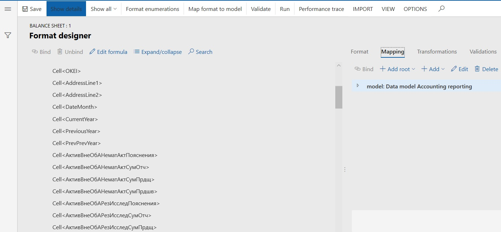
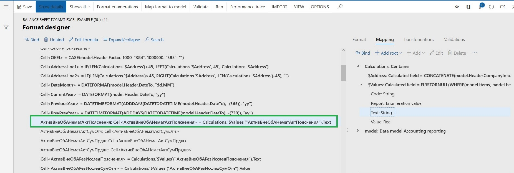

---
# required metadata

title: Configure financial reports in Excel (Russia)
description: This topic walks you through the process of creating an Electronic reporting (ER) configuration that contains a template for generating a financial report in an Excel format. 
author: Anasyash
ms.date: 07/19/2021
ms.topic: article
ms.prod: 
ms.technology: 

# optional metadata

# ms.search.form: 
audience: Application User
# ms.devlang: 
ms.reviewer: kfend
# ms.tgt_pltfrm: 
# ms.custom: 
ms.search.region: Russia
# ms.search.industry: 
ms.author: anasyash
ms.search.validFrom: 
ms.dyn365.ops.version: 10.0.1

---

# Configure financial reports in Excel (Russia)

[!include [banner](../includes/banner.md)]

This topic explains how a user in the System Administrator or Electronic Reporting Developer role can create a new Electronic reporting (ER) configuration that contains a template for generating a financial report in Microsoft Excel format.

Before you read this topic, you should review [Create Electronic reporting (ER) configurations](../../fin-ops-core/dev-itpro/analytics/electronic-reporting-configuration.md?toc=%2ffin-and-ops%2ftoc.json) and related electronic reporting topics about creating configurations.

## Set up a financial report

Set up a financial report so that it has the list of financial report cells and rules for calculating financial reports cells.

1. Upload data management package settings. For this example, upload the **RU Accounting reporting 5.07 (2016).zip** data management package settings as described in [Accounting reporting in electronic format](rus-accounting-reporting.md).
2. Go to **General ledger \> Financial reports setup \> Financial reports**.
3. Select the line that has the value **Баланс** in the **Report code** column.
4. Select **Setup**.
5. On the **Requisites setup** page, set up calculation rules for report cells, as described in [Financial reporting (Russia)](rus-financial-reports.md#set-up-calculation-rules-for-report-cells).

## Create an Excel template for the financial report

Create an Excel template for your financial report. At a minimum, you should assign names to all the Excel cells that should have values on the report that is generated.

For an example, download the [Excel template example for a Russian balance sheet](/dynamics/s-e/).

## Create an ER configuration for the financial report in Excel format

Create an ER configuration format that is based on the **Financial reports model** ER model.

Before you complete this procedure, see [ER Design a configuration for generating reports in OPENXML format (November 2016)](../../fin-ops-core/dev-itpro/analytics/tasks/er-design-reports-openxml-2016-11.md?toc=%2ffin-and-ops%2ftoc.json) for information about how to set up an ER configuration that generates a report in Excel format.

1. Download the latest version of the following ER configurations:

    - Financial reports model
    - Financial reports model mapping (RU)
    - Balance sheet format Excel example (RU)

    For instructions, see [Download Electronic reporting configurations from Lifecycle Services](../../fin-ops-core/dev-itpro/analytics/download-electronic-reporting-configuration-lcs.md).

2. Go to **Workspaces \> Electronic reporting**.
3. Select the **Reporting configurations** tile.
4. Create a format for a financial report in Excel format:

    1. On the **Configurations** page, select the **Financial reports model** ER configuration.
    2. On the Action Pane, select **Create configuration \> Format based on data model Financial reports model**.
    3. Enter a name.
    4. In the **Format type** field, select **Excel**.
    5. In the **Data model definition** field, select **Financial report**.
    6. Select **Create configuration**.
    7. Select the new configuration, and then, on the Action Pane, select **Designer**.
    8. On the Action Pane, on the **Import** tab, select **Import from Excel**.
    9. In the **Import from Excel** dialog box, select **Add template**, and then select the **Balance sheet.xls** Excel file.
    10. Set the **Create Excel Sheet format element** option to **Yes**.
    11. Select **OK**.
    12. Review the cells that are created from the names in the Excel template.

        

    13. Close the page.

5. Configure the **Balance sheet format Excel example (RU)** ER format:

    1. On the **Configurations** page, select the **Balance sheet format Excel example (RU)** ER configuration, and then, on the Action Pane, select **Designer**.
    2. Expand the **Excel = "Balance sheet"** format element and then the **Sheet\<стр.1_2\>** format element. Review all cells that will contain data in the output for the financial report.
    3. On the **Mapping** tab, review the elements of the **Financial reports model** that are sources for financial report cells.
    4. Review the cells from **DD** through **PrevPrevYear** (**DD**, **MM**, **YYYY**, **Company name**, and so on). Make sure that they are mapped to model elements from the **Header** group that contains various information about the organization and report.

        > [!NOTE]
        > If any of the information about the organization on your financial report isn't in scope **Financial reports model**, you can follow these steps:
        >
        > 1. If the missed data is external, create format User input parameter.
        > 2. Create a derived model that is based on the **Financial reports model**, and add new model elements. Then create a derived model mapping that is based on **Financial reports model mapping**, and bind new model elements to Finance data sources.
        >
        > For more information about how to create ER data models, see [ER Design domain specific data model](../../fin-ops-core/dev-itpro/analytics/tasks/er-design-domain-specific-data-model-2016-11.md?toc=%2ffin-and-ops%2ftoc.json).
 
        For more information about how to map data model elements to data sources, see the following topics:

        - [Define ER model mappings and select data sources for them](../../fin-ops-core/dev-itpro/analytics/tasks/er-define-model-mapping-select-data-sources-2016-11.md?toc=%2ffin-and-ops%2ftoc.json)
        - [ER Map data model to selected data sources](../../fin-ops-core/dev-itpro/analytics/tasks/er-map-data-model-selected-data-sources-2016-11.md?toc=%2ffin-and-ops%2ftoc.json)

    5. Review the cells that the financial report values are exported to. For example, the **АктивВнеОбАНематАктПояснения**, **АктивВнеОбАНематАктСумОтч**, **АктивВнеОбАНематАктСумПрдщ**, and **АктивВнеОбАНематАктСумПрдшв** cells are mapped to the following calculated field: **Calculations.'\$Values'("\<Input parameter = Cell name\>").Value** or **Calculations.'\$Values'("\<Input parameter = Cell code\>").Text**.

        The **Calculations.'\$Values'** calculated field contains the value of the financial report cell that has a code that equals the "Input parameter."

        For more information about the Financial reports model, see [Financial reporting (Russia)](rus-financial-reports.md).

6. Bind the calculated values of financial report cells to elements of the ER format cells:

    > [!NOTE]
    > In the current example, elements are already bound in the format. To complete the steps in the example, you must first unbind the elements.
    > 
    > Select the **АктивВнеОбАНематАктПояснения** ER format cell, and then select **Unbind**. 
    > Repeat this for the following three ER format cells: **АктивВнеОбАНематАктСумОтч**, **АктивВнеОбАНематАктСумПрдщ**, and **АктивВнеОбАНематАктСумПрдшв**. 
    > You won't need to do this for your new reports. 
    
    1. On the **Mapping** tab, expand the **Calculations** container, expand the **\$Values** calculated field, and select the **Text** element.
    2. In the list of Excel format cells, select the **АктивВнеОбАНематАктПояснения** cell, and then select **Bind**.

        

    3. On the **Mapping** tab, select the **Value** element.
    4. In the list of Excel format cells, select the **АктивВнеОбАНематАктСумОтч** cell, and then select **Bind**.
    5. Repeat the previous two steps for **АктивВнеОбАНематАктСумПрдщ**, and **АктивВнеОбАНематАктСумПрдшв** Excel cells.
    

## Run the financial report format

You can configure the Electronic messages feature to run any ER configuration.

To run the ER format that is based on the **Financial reports model**, follow these steps.

1. Go to **General ledger \> Inquiries and reports \> Financial reports (Russia)**.
2. In the **Financial reports (Russia)** dialog box, in the **Format mapping** field, select the ER format that should be run. For example, select **Balance sheet format Excel example (RU)**.
3. Select **OK**.
4. In the **Electronic report parameters** dialog box, define the report parameters.

    | Field                                                            | Description |
    |------------------------------------------------------------------|-------------|
    | Signatory first name, Signatory middle name, Signatory last name | Enter the full name of the signatory. |
    | To date                                                          | Enter the base date of the financial report. |
    | Approval date                                                    | Enter the approval date of the financial report. |
    | Reporting date                                                   | Enter the reporting date for the corrective report. |
    | Economic activity type code                                      | Enter the economic activity type code ("ОКВЭД"). |
    | Organizational form code                                         | Enter the organizational form code ("ОКОПФ"). |
    | Ownership form code                                              | Enter the ownership form code ("ОКФС"). |
    | Report                                                           | Select the financial report that should be calculated. For this example, select **Баланс**. |

5. Select **OK**.
6. Review the Excel report that is generated.

[!INCLUDE[footer-include](../../includes/footer-banner.md)]
