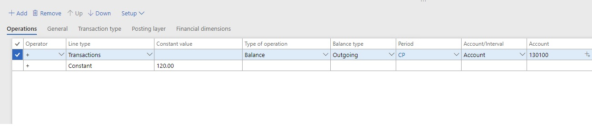
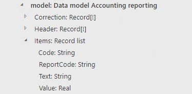
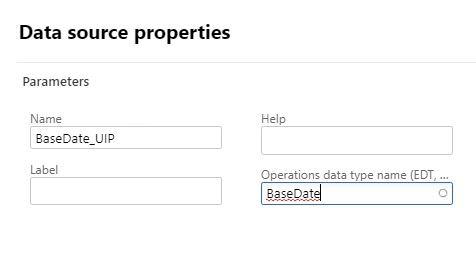
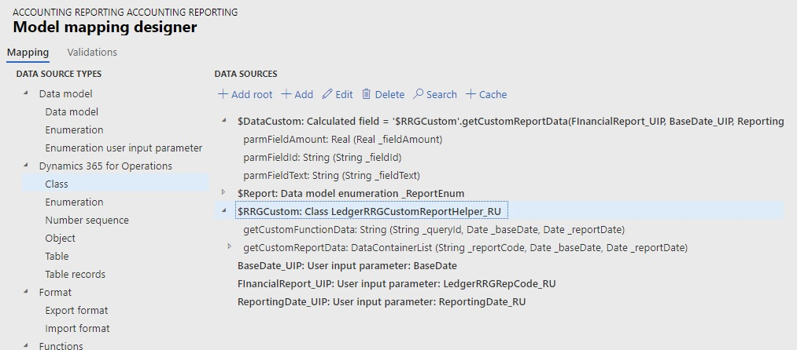
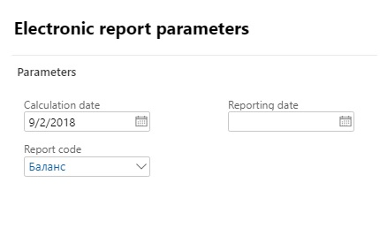

---
# required metadata

title: Financial reporting (Russia)
description: This topic provides information about financial reporting for Russia.
author: Anasyash
ms.date: 11/16/2018
ms.topic: article
ms.prod: 
ms.service: dynamics-ax-applications
ms.technology: 

# optional metadata

# ms.search.form: 
audience: Application User
# ms.devlang: 
ms.reviewer: kfend
# ms.search.scope: Core, Operations
# ms.tgt_pltfrm: 
# ms.custom: 
ms.search.region: Russia
# ms.search.industry: 
ms.author: anasyash
ms.search.validFrom: 2018-10-28
ms.dyn365.ops.version: 8.1

---

# Financial reporting (Russia)

[!include [banner](../includes/banner.md)]

You can configure financial reports, such as the balance sheet or any other report where the reported amounts are presented in cells. 

You should define the list of reports and reports cells. For each report cell, you should define the data collection rules, based on ledger transactions, budget transactions, and profit tax registers. 

In Electronic reporting (ER), you should configure the report output so that the ER configuration uses the data that is calculated for the configured financial report and generates the file output according to the format configuration (for example, Microsoft Excel or XML).

You should also configure electronic message processing so that one step lets an authorized user run the ER configuration for the financial report, generate the report, and store the report data that is generated.

## Set up financial reports

Complete the following tasks to set up the financial reports:

1. Set up report names.
2. Set up report cells.
3. Set up calculation rules for report cells.

### Set up report names
1. Go to **General ledger \> Financial reports setup \> Financial reports** to open the **Reports** page. The **Overview** tab shows a list of all the reports that are set up in the system.
2. Create a report, and enter a name and description for it.
3. Select the **General** tab, which shows the general parameters for report generation. 
4. In the **Currency** field, select **Base currency** if the data on the report should be presented in the company's default currency. If the data should be presented in the reporting currency, select **Reporting currency**. You can also specify the currency for each cell separately.
5. In the **Period** field, select the default period that transactions should be calculated for. Data on the report will be calculated for the selected period, based on the date that is specified when the report is run.
6. In the **Line type** field, select the default data source for the report. The following values are available.

    | Line type | Description |
    |-----------|-------------|
    | Transactions | The report shows data from posted transactions for ledger accounts. If you select this value, select a value in the **Transaction usage** field to define how reversing entries should be used for calculations. The available options are **All**, **Only reversing entry**, and **Without reversing entry**. |
    | Budget | The report shows data from budget entries for ledger accounts. If you select this value, select the default budget model in the **Budget model** field. |
    | Register | The report shows data from the calculated profit tax registers. |
    | Constant | The report shows the values of the defined constants for cells. |
    | Contractor | The report shows data from the active/passive balances of contractors. |
    | Dimension set balance | The report shows balances for the selected dimension set. If you select this value, select the default financial dimension set in the **Dimension set** field. |

7. In the **Factor** field, enter the value that the report data should be divided by. 

    For example, if the data on the report must be presented in thousands of rubles, enter **1,000**. If the data must be presented in full rubles, enter **1**.

8. Select the **Transaction type** tab, which shows the list of transaction types that will be considered in calculations. 
9. Create a line. In the **Transaction type** field, select the type of transaction that the report should include. Transactions from the corresponding module will be used to generate the report. Create a line for each type of transaction that you require.

    For example, if you select **Bank** as the transaction type, the report will include transactions that are generated from the **Bank management** module. If you don't create any lines, the filter won't be used. 

10. Select the **Posting layer** tab, which shows the list of posting layers that will be considered in calculations. If you don't create any lines, the filter won't be used.
11. Select the **Financial dimensions** tab, which shows the dimension filters, if the report must be generated only for specific values of a financial dimension and not for all values.
12. Create a line. In the **Reference** field, select the name of the dimension.
13. In the **From** and **To** fields, define the range of dimensions that should be considered in calculations. Create a line for each dimension range that you require. If you don't create any lines, the filter won't be used.

### Set up report cells

You can set up the cells of a report either manually or by copying them from another report. 

#### Copy financial reports settings

1. On the **Reports** page, select **Copy** to open the **Copy report settings into a new report** dialog box.
2. In the **Source report** section, in the **Company** field, select the company to copy. In the **Report code** field, select the report code to copy.
3. In the **Target report** section, in the **Report code** field, select the report code to copy the settings to, or enter a new report code. If settings are already specified for the target report, they will be overwritten.

#### Manually create report cells
1. On the **Reports** page, select **Setup** to open the **Requisites setup** page. The upper pane shows a list of report cells and their main parameters.

    

2. In the upper pane, create a line. In the **Code** field, enter a unique identifier for the report cell.

    You can set up any naming convention that you want for identifiers, but the name of every cell on the same report must be unique. The ER configuration that is configured for report output should filter the list of report values by cell codes in the binding between the report values and the format elements.

    > [!TIP]
    > For example, you can use a concatenation of XML tag names from the official electronic format of the report. 

3. Enter a description of the line.

The tabs in the upper pane, and the fields on each tab, are the same as the tabs and fields on the **Reports** page. Values that are entered for a report cell on the **Requisites setup** page supersede the values that are entered for the report on the **Reports** page.

### Set up calculation rules for report cells

Use the following procedure to create operations for report cells.

1. On the **Reports** page, select **Setup** to open the **Requisites setup** page.
2. In the upper pane, select the line for a report cell, or create a line. Then, in the lower pane, select **Add** to create a line.

    For each report cell, you can set up one or more lines that have parameters for calculating amounts. The lines are linked by mathematical operators.

    

3. In the **Operator** field, select the mathematical operator that should be applied to the cell value.

    > [!NOTE] 
    > The **Operator** field specifies the mathematical sign for the amount that is calculated for the cell. The mathematical sign is also used when you set up multiline operations. Typically, vouchers of the **Credit balance**, **Credit activity**, and **Turnover in correspondence credit** types should use a minus sign (-).

4. In the **Line type** field, select the data source that is used to calculate the selected line. By default, the value from the cell setup is used. However, you can change the value. The following line types are available.

    | Line type | Data source | Available type of operation |
    |-----------|-------------|-----------------------------|
    | Transactions | Ledger transactions | Balance, Credit balance, Debit balance, Turnover, Credit activity, Debit activity, Turnover in correspondence, Turnover in correspondence credit, Turnover in correspondence debit, Active balance (debit), and Passive balance (credit) |
    | Budget | Budget transactions | Balance, Credit balance, Debit balance, Turnover, Credit activity, and Debit activity |
    | Register | The value that is specified in the **Register field** field on the **Tax registers** tab |
    | Constant | The value that is specified in the **Constant value** field of Cell operations | |
    | Contractor | Ledger transactions that are related to contractors | Active balance (debit) and Passive balance (credit). The balance values are calculated for the analytical level (**Document**, **Agreement**, or **Contractor**) that is specified in the **Balance detail** field on the **General** tab. |
    | Dimension set balance | | |

5. If you selected **Transactions**, **Budget**, or **Contractor** in the **Line type** field, select the type of operation in the **Type of operation** field. The following values are available.

    <table>
    <thead>
    <tr>
    <th>Type of operation</th>
    <th>Calculation algorithm</th>
    </tr>
    </thead>
    <tbody>
    <tr>
    <td>Balance</td>
    <td>The transaction amount for the ledger account on the date</td>
    </tr>
    <tr>
    <td>Credit balance</td>
    <td>The credit transaction amount for the ledger account on the date</td>
    </tr>
    <tr>
    <td>Debit balance</td>
    <td>The debit transaction amount for the ledger account on the date</td>
    </tr>
    <tr>
    <td>Turnover</td>
    <td>The transaction amount for the ledger account for the period</td>
    </tr>
    <tr>
    <td>Credit activity</td>
    <td>The credit transaction amount for the ledger account for the period</td>
    </tr>
    <tr>
    <td>Debit activity</td>
    <td>The debit transaction amount for the ledger account for the period</td>
    </tr>
    <tr>
    <td>Turnover in correspondence (only for the <strong>Transactions</strong> line type)</td>
    <td>The transaction amount for the ledger account in correspondence with other ledger accounts for the period</td>
    </tr>
    <tr>
    <td>Turnover in correspondence credit (only for the <strong>Transactions</strong> line type)</td>
    <td>The credit transaction amount for the ledger account in correspondence with other ledger accounts for the period</td>
    </tr>
    <tr>
    <td>Turnover in correspondence debit (only for the <strong>Transactions</strong> line type)</td>
    <td>The debit transaction amount for the ledger account in correspondence with other ledger accounts for the period</td>
    </tr>
    <tr>
    <td>Active balance (debit) (only for the <strong>Transactions</strong> and <strong>Contractor</strong> line types)</td>
    <td>The calculation algorithm varies, depending on the line type:
    <ul>
    <li><strong>Transactions:</strong> First, balances for the ledger account are calculated across all combinations of financial dimensions. Second, debit balances for every dimension combination are summarized. The resulting value is the cell value.</li>
    <li><strong>Contractor:</strong> The active balance for the ledger account is calculated by customer, contract, or document.</li>
    </ul></td>
    </tr>
    <tr>
    <td>Passive balance (credit) (only for the <strong>Transactions</strong> and <strong>Contractor</strong> line types)</td>
    <td>The calculation algorithm varies, depending on the line type:
    <ul>
    <li><strong>Transactions:</strong> First, balances for ledger account are calculated across all combinations of financial dimensions. Second, credit balances for every dimension combination are summarized. The resulting value is the cell value.</li>
    <li><strong>Contractor:</strong> The passive balance for the ledger account is calculated by counteragent, contract, or document.</td>
    </tr>
    </tbody>
    </table>

6. If you selected **Balance**, **Credit balance**, **Debit balance**, **Active balance (debit)**, or **Passive balance (credit)** in the **Type of operation** field, select the balance type in the **Balance type** field: **Incoming** or **Outgoing**.
7. In the **Account/Interval** field, select **Account** to set up one general ledger (G/L) account for the operation. To set up a range of G/L accounts, select **Interval**.
8. Follow one of these steps, depending on the value that you selected in the **Account/Interval** field:

    - If you selected **Account**, specify the G/L account in the **Account** field.
    - If you selected **Interval**, select **Setup \> Account interval**. Create a line, and then, on the **Account interval** tab, in the **From** and **To** fields, select the first and last ledger account numbers that should be used in the calculation.

9. In the **Corr. Account/Interval** field, select **Account** to set up one G/L account for the operation. To set up a range of G/L accounts, select **Interval**.
10. Follow one of these steps, depending on the value that you selected in the **Corr. Account/Interval** field:

    - If you selected **Account**, specify the G/L account in the **Corr. account** field.
    - If you selected **Interval**, select **Setup \> Account interval**. Create a line, and then, on the **Offset interval** tab, in the **From** and **To** fields, select the first and last ledger account numbers that should be used in the calculation.

11. If you selected **Contractor** in the **Line type** field in step 4, on the **General** tab, in the **Balance detail** field, select the analytical level that the active or passive balance for the contractor should be calculated for: **Document**, **Agreement**, or **Contractor**.
12. If you selected **Register** in the **Line type** field, follow these steps:

    1. On the **Tax registers** tab, in the **Register code** field, select the Profit tax register code. Then, in the **Register field** field, select the name of a register field. The data from the selected register field will be considered in the calculation.
    2. Optional: In the **Account/Interval** field, select **Account** to set up the calculation of the tax register for one expense code. Then, in the **Account** field, select the expense code. Alternatively, to set up the calculation for a range of expense codes, select **Interval**. Then select **Setup \> Account interval**, and define the interval of expense codes.

13. Optional: The **General**, **Posting layer**, and **Financial dimensions** tabs have the same fields as the corresponding tabs in upper pane of the **Requisites setup** page and the **Reports** page. On each tab, set values for the operation lines. Values that are entered for an operation supersede the default values that are entered for the cell and/or the report.
14. After you've finished creating the operation lines, you can arrange them in the correct order. Select a line, and then select the **Up** or **Down** button to move it one position up or down.

## Configure ER to use the results of financial report calculations

For more information, see [Electronic reporting](../../dev-itpro/analytics/general-electronic-reporting.md). 

The following example shows how to configure ER to use the results of financial report calculations.

1. Create a new Data model ER configuration for Financial reports (review this page for more details about design of ER data models).
2. In ER model designer, create root item and name it Model.
3. Under Root item, create item of data type Record list and name it **Items**.
4. Create the following fields under **Items**:

   | Field name | Data type | Description |
   |-----------|-----------|-------------|
   | Code | String | This field gets information from the report cell code. |
   | ReportCode | String | This field gets the code of the financial report. |
   | Text | String | This field gets the value of the report cell if the calculated value is a value of the **String** type. |
   | Value | Real | This field gets the value of the report cell if the calculated value is a value of the **Real** type. |

    

5. Create a new ER model mapping configuration under the added ER model configuration. For more information, see [Define ER model mappings and select data sources for them]( ../../dev-itpro/analytics/tasks/er-define-model-mapping-select-data-sources-2016-11.md).

6.	Create Model mapping. In Model mapping designer do the following:

    1. Create the User input parameter for **Report code**:

        1. In the left pane, on the **Mapping** tab, under **Data source types**, select **General**, and then select the **User input parameter** line.
        2. In the **Data sources** pane on the right, select **Add root**. 
        3. In the **Name** field, enter **FinancialReport\_UIP** as the name of the User input parameter. In the **Operations data type name (EDT, enum)** field, select the **LedgerRRGRepCode\_RU** extended data type (EDT).

            

    2. Create the User input parameter for **Base date** in the same manner. However, enter **BaseDate\_UIP** in the **Name** field, and select the **BaseDate** EDT in the **Operations data type name (EDT, enum)** field.

        

    3. Create and set up the User input parameter for **Reporting date** (for example, use the **ReportingDate\_RU** EDT):

    4. Add the **LedgerRRGCustomReportHelper\_RU** class as a data source that is named **$RRGCustom**.

        

    5. Create a calculated field that is named **$DataCustom**, and that has the following expression:

        '$RRGCustom'.getCustomReportData(FinancialReport\_UIP, BaseDate\_UIP, ReportingDate\_UIP)

    > [!NOTE]
    > The **getCustomReportData** function of the **LedgerRRGCustomReportHelper\_RU** class has **Financial report name**, **Base date**, and **Reporting date** as input parameters. It returns a record list of all calculated values for all configured cells of the selected financial report, based on the base date and report date. 

    The record list that is returned as output contains the following fields on each record line: 

    - **ParmFieldId** – The code of the report cell.
    - **ParmFieldAmount** – The value of the calculated cell if it has a data type of **Real**.
    - **ParmFieldText** – The value of the calculated cell if it has a data type of **String**.

    6. Bind the data source to model items:

       1. Bind the **$DataCustom** calculated field to the **Items** model item.
       2. Bind the record list fields in the following way:

           - Items \> Code \<-\> ParmFieldId
           - Items \> Text \<-\> ParmFieldText
           - Items \> Value \<-\> ParmFieldAmount 
           - Items \> ReportCode \<-\> FinancialReport\_UIP

    

7. Set up the format of the report. For more derails on how to add a new format congfiguration, see [ER Create a format configuration]( ../../dev-itpro/analytics/tasks/er-format-configuration-2016-11.md). 

In the format configuration, filter the **Items** record list by a constant value of **Items.Code**. Bind the **Items.Text** or **Items.Value** fields of the filtered line to the respective format elements.

8. Run configured format from the **Electronic reporting** workspace to generate report. Set the following fields:

    - **Calculation date** – Specify the base date to identify the period for the financial report.
    - **Report code** – Select the code for the financial report.
    - **Reporting date** – Optionally specify the date that you're generating the report.

    

    > [!NOTE]
    > - If you're generating a corrective report for closed periods, and you set the **Reporting date** field, the calculation of cells on financial reports considers transactions of the base period and all later transactions, up to the reporting date, that correct the base period. (The reporting date in the posted transaction belongs to the base period.)
    > - If you're generating the report for a recent period, and you set the **Reporting date** field, the calculation of cells on financial reports considers transactions of the base (recent) period but excludes transactions that correct previous (closed) periods. (The reporting date in the posted transaction belongs to previous closed period.)

## Configure electronic messages to generate the financial report and store the results

For more information, see [Electronic messaging](../general-ledger/electronic-messaging.md). The following example shows how to configure electronic messages to run the ER configuration for financial reports.

1. On the **Message statuses** page, create message statuses that are applicable to the report (for example, **Created** and **Generated**).
2. On the **Message processing action** page, create the following actions:

    1. An action that is named **Create message**, and that has an action type of **Create message** and a result status of **Created**.
    2. An action that is named **Ready to generate**, and that has an action type of **Message level user processing** and a result status of **Ready to generate**.
    3. An action that is named **Generate report**, and that has an action type of **Electronic reporting export message**, and initial status of **Created**, and a result status of **Generated**. For this action, set the following additional values:

        - Set the **Show dialog** option to **Yes**.
        - In the **Format mapping** field, select the ER format that you created earlier. 
        - In the **File name** field, define the default name of the generated file.

    

4. On the **Electronic message processing** page, define the processing flow for the report.

    For example, define processing that consists of the three actions that you created earlier: Create message, Ready to generate, and Generate report.

5. On the **Electronic messages** page, select the processing that you created in the previous step.
6. Select **New** to create a message. 
7. In the **From date** and **To date** fields, specify the dates of the reporting period.
8. Update the status to **Ready to generate**.

    

9. Select **Generate report** to run the ER format for the financial report.
10. If you're prompted, enter user parameters in the dialog box.
11. Review the generated file in **Attachments**.
